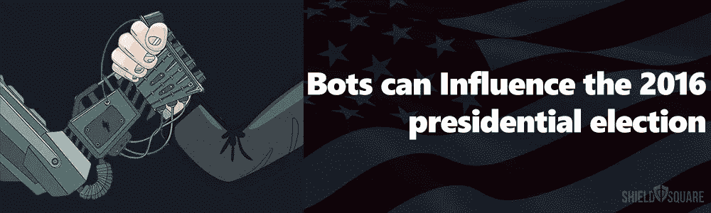
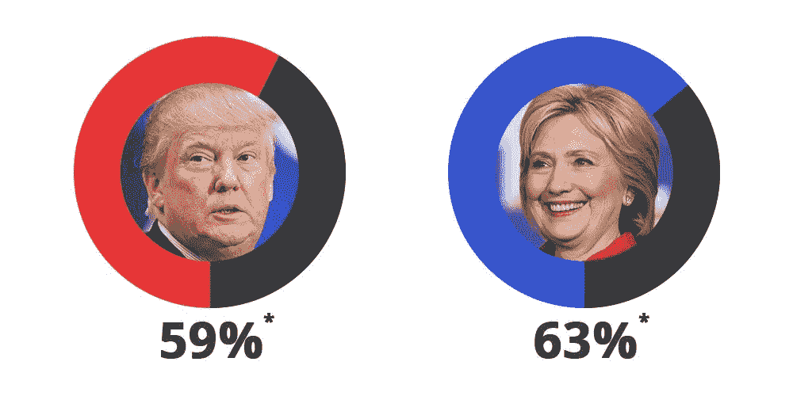

# 机器人如何影响 2016 年总统选举

> 原文：<https://medium.com/hackernoon/how-bots-can-influence-the-2016-presidential-election-1361df48b0b5>

选举投票在世界各地都有发生，人们选择他们最喜欢的候选人基于很多因素，这些因素来自研究。今年最受期待的选举是投票选举第 58 届美国总统，这可以归结为在两个候选人希拉里·克林顿和唐纳德·特朗普之间选择一个。两位候选人都在网上拥有大量粉丝，这与他们在社交媒体上的支持产生了共鸣。

这次选举与以往的选举相似，但这次社交媒体，尤其是机器人，将发挥巨大的作用。感谢社交媒体在过去几年里对我们生活的巨大影响。这一次，提名之争在线下和线上都同样激烈；网上是最令人担忧的。

什么是机器人，它们如何影响选举？
机器人几乎占据了 [50%的互联网流量](https://goo.gl/PJDcO2?utm_source=election&utm_medium=blog&utm_campaign=infographic)。因此，他们进入政界也就不足为奇了。机器人是由匿名人士执行的自动化计算机程序，用于创建虚假的社交媒体账户，并模仿真实用户。这种机器人只是帮助从数千个虚假的 Twitter 或脸书账户中推送信息，从而创造一种趋势。这些虚假用户存在于所有社交媒体平台上，他们的唯一目的是产生有偏见的趋势、不必要的可见性和用户参与度。这些虚假账户通过充斥社交媒体时间轴，帮助影响普通用户(尤其是那些“未决定”的用户)的决定。机器人的主要特征之一是通过网络世界的快速发展趋势保持主题的相关性。

这些帐户传播的信息或主题，即使是很短的时间，也能给他们带来尽可能多的用户参与。

机器人在英国退出欧盟的作用机器人已经在英国退出欧盟的辩论中发挥了作用。辩论双方创建的自动化社交媒体帐户创建了这些机器人，对公投投票产生了巨大影响。牛津大学的研究人员发现，机器人在辩论中扮演了战略性的角色。这些社交媒体机器人只是帮助传播“重复的”政治内容，以操纵公众的思维。社交媒体机器人的角色非常简单，他们多次转发或分享他们被编程的内容。英国退出欧盟最终投票前的民意调查被严重扭曲了。

# 那时是英国退出欧盟，现在是美国大选

*Data taken from TwitterAudit.com

根据 TwitterAudit 的数据，在 1090 万名粉丝中，*真正的唐纳德·川普*似乎只有 59%的真正活跃粉丝。而他的对手*希拉里*在推特上拥有 833 万粉丝中的 63%真正活跃的粉丝。这相当于两人在 twitter 上聚集了 700 多万虚假的、不活跃的粉丝。这些数字可能只是指示性的，但确实让我们了解了社交媒体机器人如何改变历史进程。这确实是一个危险的趋势！

> 这 700 多万虚假的、不活跃的 twitter 用户中有很大一部分可能来自机器人，这有助于将政治观点传递给数百万选民，特别是“未决者”**。**

**当然，这些假机器人也有不好的一面。你可以随时回去查看历史，审计追随者的真实性。但这是两党都愿意承担的风险，因为它已经成为大多数社交媒体巨头的常用工具。这有时会提供关于候选人的错误形象，降低他们在支持者中的受欢迎程度。自称政治黑客的安德烈斯·塞普尔韦达(Andrés Sepúlveda)展示了这一点，他坐在自己的牢房里，用 3 万个 twitter 机器人来传播自己的政治观点。近十年来，安德烈斯一直在拉丁美洲利用机器人传播虚假谣言，玩肮脏的政治。他是为数不多的公开谈论他的成就的黑客之一。**

> **机器人的来源可能仍不得而知，但有一点是肯定的，它们会留在这里。这些数以百万计的自动化机器人将每秒钟在全球范围内传播内容。**

**社交媒体机器人已经成为主流媒体的禁忌话题，因为每个人都知道它的存在，但没有人会声称这样做。联邦选举委员会几乎没有发布任何关于如何利用社交媒体进行竞选的咨询声明——嗯，甚至没有考虑过机器人。一旦任务完成，这些可以改变一个国家历史的机器人将摆脱他们的化身，并在社交媒体世界中扮演不同的角色。**

**那么，为什么普通用户会担心呢？众所周知，僵尸程序占互联网流量的 50%,很有可能每个用户在他们的在线生活中都遇到过一次僵尸程序——而他们并不知道这是一个僵尸程序！例如，就像这些 Twitter 机器人一样，有一些评论机器人会劫持流行的在线媒体网站，出现在用户和文章之间。根据 ShieldSquare 的数据，一个受欢迎的在线媒体网站收到的总流量的 30%来自垃圾评论。**

**十多年来，机器人一直在所有在线媒体中造成巨大破坏。它造成的金钱损失比我们知道的还要多。它们不仅影响你的思维方式；他们影响着电子商务门户网站、机票预订门户网站、在线出版物、社区论坛，以及[更多](https://www.shieldsquare.com/its-true-bots-can-influence-the-us-presidential-elections/)。**

************

> **[黑客中午](http://bit.ly/Hackernoon)是黑客如何开始他们的下午。我们是 [@AMI](http://bit.ly/atAMIatAMI) 家庭的一员。我们现在[接受投稿](http://bit.ly/hackernoonsubmission)并乐意[讨论广告&赞助](mailto:partners@amipublications.com)机会。**
> 
> **如果你喜欢这个故事，我们推荐你阅读我们的[最新科技故事](http://bit.ly/hackernoonlatestt)和[趋势科技故事](https://hackernoon.com/trending)。直到下一次，不要把世界的现实想当然！**

****