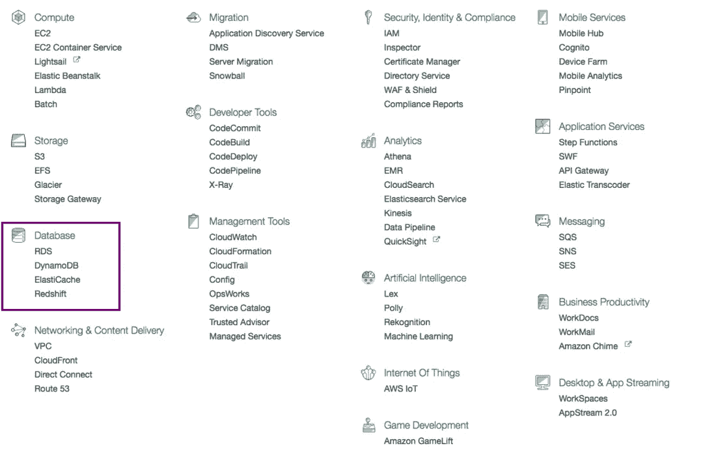

# 我的企业如何从 AWS Pt 4:数据库中受益

> 原文：<https://medium.com/hackernoon/how-can-aws-benefit-my-business-pt4-databases-2d11e9865de1>

在系列的第四部分*。*我们将学习数据库。下面是[第一部](https://hackernoon.com/how-can-my-business-benefit-from-aws-pt-1-214220b996ce)、[第二部](https://hackernoon.com/how-can-my-business-benefit-from-aws-pt-2-which-storage-service-to-use-7723e4bd5f16)和[第三部](https://hackernoon.com/amazon-connect-how-can-my-business-benefit-from-aws-pt-3-8f51f40115eb)。确保你关注了 Hackernoon 和我，这样你就不会错过这个系列的后面部分。

# 数据库ˌ资料库

假设您正在托管一个食品配送服务。它需要你维护你的用户，餐馆等数据。这样你就可以获取像用户点的食物，你注册的餐馆列表等信息。数据库有助于存储和查询这些数据。

自托管数据库将需要您雇用昂贵的数据库工程师。AWS 为您承担维护数据库的重任。你为你使用的东西付费。

# AWS RDS

AWS RDS(关系数据库服务)帮助您设置关系数据库，如 MySQL、MariaDB、Oracle、SQL Server、Postgre SQL 和 Amazon Aurora，只需点击几下鼠标。

关系数据库基于关系代数。它允许您链接不同表中的数据。如果您的应用程序需要您维护不同数据之间的复杂链接。坚持这个。

# AWS DynamoDB

这是一个非关系数据库。如果你有大量的数据，非关系数据库可以帮助你实现无缝扩展。它被 Lyft、Duolingo 等服务使用。

一些公司根据特定的需要同时使用关系数据库和非关系数据库。[下面是两者的对比](https://www.pluralsight.com/blog/software-development/relational-non-relational-databases)。

# AWS ElastiCache

假设您正在查询用户 x 的电子邮件 id，这个查询可能是重复的。因此，工程师们发明了缓存系统，一旦执行查询，结果就会存储在缓存中。下一次进行相同的查询时，将从缓存中提供信息。

与数据库相比，缓存设计用于以更低的成本更快地获取信息。这有助于提高应用程序的性能并降低成本。

AWS ElastiCache 允许您轻松部署缓存系统。这是 Airbnb、Adobe 等热门公司使用的方法

# **AWS 红移**

数据仓库是为分析而构建关系数据库。它有助于推动业务决策。自托管数据仓库既困难又昂贵。AWS Redshift 为您承担了托管数据仓库的重任。这也与流行的商业智能工具无缝集成。它被 Pinterest、诺基亚等公司使用

如果你对在云上制作应用感兴趣，可以在亚马逊上看看我的书 [*云是小菜一碟*](http://amzn.to/2n03pzO) *。*

*您也可以加入我的邮件列表* [*云计算故事*](http://eepurl.com/cHet9j) *。如果我写了关于云计算的新故事或书，我会用这个通知你。*

> [黑客中午](http://bit.ly/Hackernoon)是黑客如何开始他们的下午。我们是 AMI 家庭的一员。我们现在[接受投稿](http://bit.ly/hackernoonsubmission)并乐意[讨论广告&赞助](mailto:partners@amipublications.com)机会。
> 
> 如果你喜欢这个故事，我们推荐你阅读我们的[最新科技故事](http://bit.ly/hackernoonlatestt)和[趋势科技故事](https://hackernoon.com/trending)。直到下一次，不要把世界的现实想当然！

