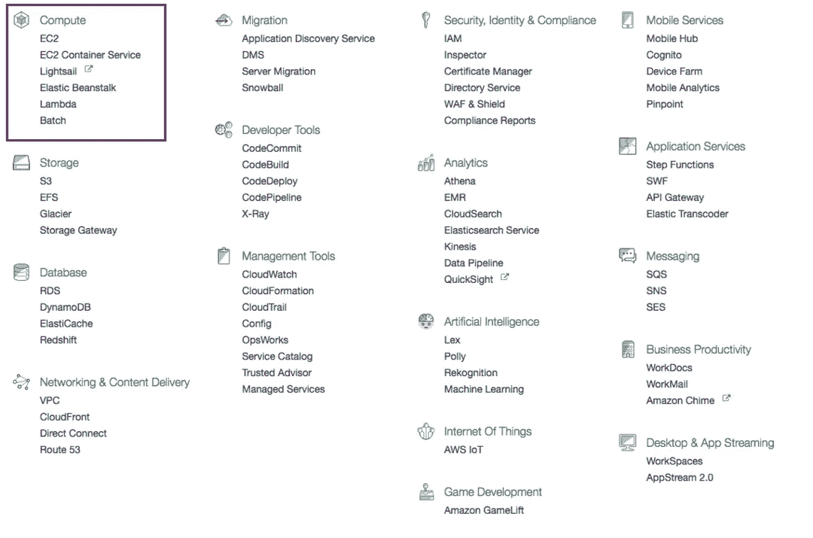

# 我的企业如何从 AWS Pt 1 中受益

> 原文：<https://medium.com/hackernoon/how-can-my-business-benefit-from-aws-pt-1-214220b996ce>

我花了几天时间在 Quora 上回答关于云计算的问题。这个问题引起了我的兴趣。我决定写下这个，因为它可以让很多人受益。由于 AWS 有很多工具，我决定分部分介绍它们。这是该系列的第一部分。这里是[第二部](https://hackernoon.com/how-can-my-business-benefit-from-aws-pt-2-which-storage-service-to-use-7723e4bd5f16#.buf9ysfcc)、[第三部](https://hackernoon.com/amazon-connect-how-can-my-business-benefit-from-aws-pt-3-8f51f40115eb)。

确保你跟着[哈克农](https://medium.com/u/4a8a924edf41?source=post_page-----214220b996ce--------------------------------)和我([费宾约翰詹姆士](https://medium.com/u/75a616711f4e?source=post_page-----214220b996ce--------------------------------))。如果您需要关于云计算的任何特定主题的帮助，您可以使用这个[表单](https://goo.gl/forms/Bpu232M2N2O5TVgC3)来提出请求。

如果你对在云上开发应用感兴趣，请在亚马逊上看看我的书[云是小菜一碟](http://amzn.to/2n03pzO)。

在这个系列的第一部分。我将介绍 AWS 的计算部分。*如果您有任何疑问或发现术语难以理解，请在此评论。我可以改进这个故事，这可以让很多人受益。*

# AWS EC2

如果您的服务需要让互联网上的客户可以访问，您需要将它托管在一台计算机或服务器上。以前，我们常常购买或租赁这些服务器。如果你的服务获得的流量低于预期，那么你将会有巨大的损失。如果流量激增，你需要一个耗时的过程来扩大流量。

有了 EC2 就不用担心这些问题了。在这里，您可以从您需要的实例开始，并根据流量对其进行配置。

AWS 允许您为自己的实例选择自己喜欢的操作系统(Linux)。您获得实例/计算机的完全所有权。你可以在里面安装你选择的软件。

您还可以使用这些实例来执行繁重进程。人们使用 AWS P2 实例来运行深度学习算法。因为他们有高性能的 NVIDIA K80 图形处理器。

# **AWS EC2 集装箱服务**

在 Ec2 中，你得到一个带有操作系统的计算实例。Linux 操作系统附带了很多工具。其中一些对于您的应用程序来说是不必要的。这也消耗资源。

因此我们制造了容器。容器可以被构建为只包含必要的库或工具来使您的服务工作。因此，这是轻量级和高效的。

AWS EC2 容器服务允许您在云上托管容器。他们还提供工具来扩展它。

# **AWS Lightsail**

AWS Lightsail 是 AWS Ec2 的简化版本。AWS EC2 对于初学者来说可能比较复杂。因为您将需要配置固态硬盘存储、DNS 管理、静态 IP 等。你还必须为带宽支付额外的费用。

在 Lightsail 中，这些是预配置的包。费用也是固定的。有为 wordpress，LAMP，MEAN 等预先配置的图像。因此，部署起来很容易。

# AWS 弹性豆茎

在 EC2 中，在您将应用程序部署到云上之前有很多步骤。您需要选择配置，设置自动缩放，安全组等。

使用 AWS Elastic Beanstalk 的开发者只需要上传代码(Java，[)。NET](https://aws.amazon.com/net/) ，PHP，Node.js，Python，Ruby，Go，Docker)。其他程序是自动化的。AWS 将选择 EC2 实例，设置负载平衡、自动伸缩等。

# 自动气象站λ

在 EC2 中，我们有一个服务器一直在运行。对于某些用例来说，这可能是低效的。

考虑到这一点，您已经设置了一个 EC2 服务器，它被配置为在上传图像时调整图像的大小。一天只有一张图片上传怎么办？您仍然为 EC2 实例的运行时间付费。相当低效的仪式？

AWS Lambda 就是为这些类型用例而构建的。在这里，您可以通过在 lambda 中配置触发器来减少服务器。在我们的例子中，触发器是图像上传。您可以在 AWS Lambda 中编写一个函数来处理上传的图像。所以你只在你的计算资源被使用时付费。

# **AWS 批次**

AWS Batch 用于高效运行批处理作业。考虑基因组测序。有许多程序需要一步一步地执行。每一步都依赖于之前的数据。每个步骤可能有不同的计算要求。

AWS Batch 自动负责供应计算需求并完成繁重的工作。因此，您可以将更多精力放在解决问题上，而不是担心如何高效地运行它。

为了计算价格，你可以使用这个[工具](https://calculator.s3.amazonaws.com/index.html)。

你也可以加入我的邮件列表[云计算故事](http://eepurl.com/cHet9j)。如果我写了关于云计算的新故事或书，我会用这个通知你。