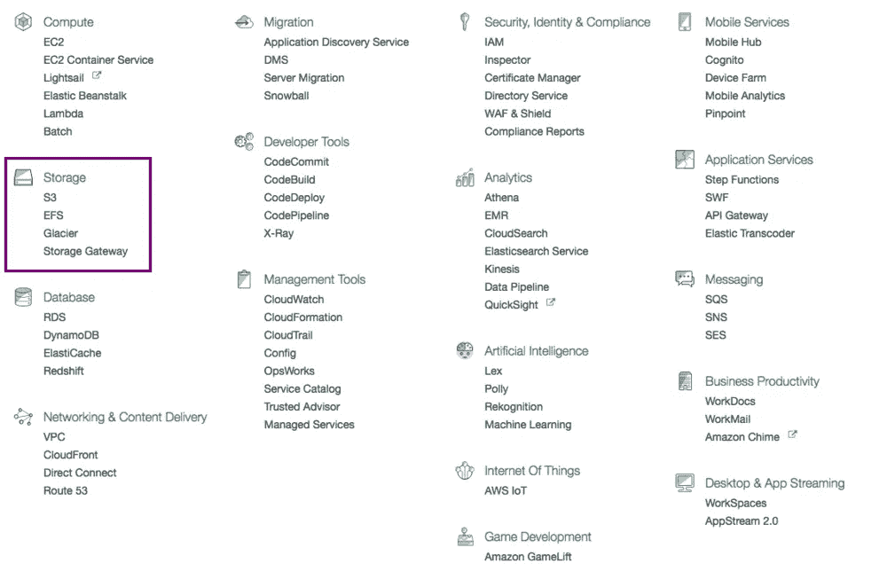

# 我的企业如何从 AWS Pt 2 中获益:使用哪种存储服务？

> 原文：<https://medium.com/hackernoon/how-can-my-business-benefit-from-aws-pt-2-which-storage-service-to-use-7723e4bd5f16>

这是[我的企业如何从 AWS Pt 1](https://hackernoon.com/how-can-my-business-benefit-from-aws-pt-1-214220b996ce#.b0qkso4ls) 中获益的延续。在本系列的第二部分中，我将介绍 AWS 的存储部分。*如果您有任何疑问或觉得术语难以理解，请在此评论。我可以改进这个故事，这可以让很多人受益。*

确保你跟着[哈克农](https://medium.com/u/4a8a924edf41?source=post_page-----7723e4bd5f16--------------------------------)和我([费宾约翰詹姆士](https://medium.com/u/75a616711f4e?source=post_page-----7723e4bd5f16--------------------------------))。如果您需要关于云计算的任何特定主题的帮助，您可以使用这个[表单](https://goo.gl/forms/Bpu232M2N2O5TVgC3)来提出请求。

如果你对在云上开发应用感兴趣，请在亚马逊上看看我的书[云是小菜一碟](http://amzn.to/2n03pzO)。

# AWS S3

AWS S3(亚马逊简单存储服务)允许您存储文件供公众访问。如果你有很多用户经常访问的文件，S3 非常适合。成千上万的读者访问这篇博客文章的图片就是一个例子。

# **AWS EFS**

AWS EFS 是 EC2 实例或虚拟机的存储。它在实际的文件系统上工作。这使得您的虚拟机能够非常快速地访问数据。对于内部访问，AWS S3 并不可取，因为它们基于 HTTP 协议，对于频繁访问来说非常慢。如果你是自己托管你的数据库，EFS 是一个很好的存储选择。

# AWS 冰川

AWS Glacier 允许您存储不常访问的数据。它是用来储存备份的。与 S3 相比，价格要低得多。请记住，如果您想要频繁访问，这不是一个好的选择。

# AWS 存储网关

当您的内部应用程序希望从云中访问数据时，AWS 存储网关是一个不错的选择。它使您能够以非常低的延迟访问数据。这是企业应用程序的一个很好的用例。

为了计算价格，您可以使用这个[工具](https://calculator.s3.amazonaws.com/index.html)。

你也可以加入我的邮件列表[云计算故事](http://eepurl.com/cHet9j)。如果我写了关于云计算的新故事或书，我会用这个通知你。

> [黑客中午](http://bit.ly/Hackernoon)是黑客如何开始他们的下午。我们是 [@AMI](http://bit.ly/atAMIatAMI) 家庭的一员。我们现在[接受投稿](http://bit.ly/hackernoonsubmission)，并乐意[讨论广告&赞助](mailto:partners@amipublications.com)机会。
> 
> 如果你喜欢这个故事，我们推荐你阅读我们的[最新科技故事](http://bit.ly/hackernoonlatestt)和[趋势科技故事](https://hackernoon.com/trending)。直到下一次，不要把世界的现实想当然！

