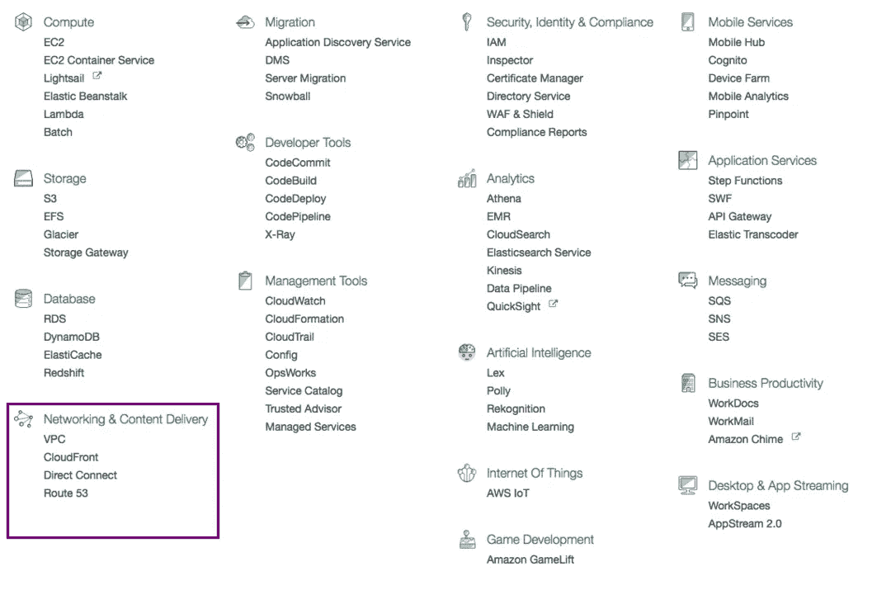

# 我的企业如何从 AWS Pt 5:网络和内容交付中受益

> 原文：<https://medium.com/hackernoon/how-can-my-business-benefit-from-aws-pt-5-networking-content-delivery-fbd24f332186>

在该系列的第五部分*。*我们将学习网络和内容交付。下面是[第一部](https://hackernoon.com/how-can-my-business-benefit-from-aws-pt-1-214220b996ce)、[第二部](https://hackernoon.com/how-can-my-business-benefit-from-aws-pt-2-which-storage-service-to-use-7723e4bd5f16)、[第三部](https://hackernoon.com/amazon-connect-how-can-my-business-benefit-from-aws-pt-3-8f51f40115eb)和[第四部](https://hackernoon.com/how-can-aws-benefit-my-business-pt4-databases-2d11e9865de1)。确保你关注了 Hackernoon 和我，这样你就不会错过这个系列的后半部分。

# 亚马逊虚拟私有云(VPC)

以医院为例，他们有公共场所，如接待处、洗手间、食堂等。然后是私人场所如手术室、实验室、ICU 等。只有授权的人才能进入这些私人场所。虚拟私有云是关于设置谁可以访问什么的网络规则。随着你的应用变得越来越复杂，你可以通过 VPC 增加额外的安全层。

假设我有一个为客户做销售预测的 web 应用程序。将有一个服务器处理你的应用程序的用户，通过他们登录，注册等。另一个用于运行机器学习算法进行预测。它们通过 API 相互通信。你不希望这个服务器对公众开放，因为它是一个安全威胁。它应该只能由您自己的服务器访问。你可以使用亚马逊 VPC 实现这一点。

一些公司有自己的数据。亚马逊的 VPC 还允许您在内部数据中心和您的亚马逊云服务之间建立安全链接。

# 亚马逊云锋

当用户访问您服务器上的网页时。您的服务器上的处理负载很小。如果用户离得很远，网站加载速度会变慢。内容传递网络解决了这个问题。内容交付网络(CDN)将您的网站内容放在世界各地。现在，当用户访问您的网站时，该用户将从附近的 CDN 获得服务。

这将最小化服务器的负载，并减少页面加载时间。这一点很重要，因为如果加载时间太长，大多数人会离开网站。Amazon CloudFront 扮演了 web 服务 CDN 的角色。

# 亚马逊直接连接

如前所述，将内部部署中心连接到 AWS 环境的一种方法是通过 VPC。然而，如果你想获得超过特定的带宽，我们有亚马逊直接连接。Amazon Direct Connect 通过租用线路将您的数据中心连接到 Amazon 环境。这有助于降低网络成本和增加带宽吞吐量。因此，您将能够获得一致的网络性能。

你需要选择一个离你所在地更近的咨询伙伴。[以下是 AWS Direct Connect 咨询合作伙伴的列表，根据地理位置列出](https://aws.amazon.com/directconnect/partners/)。

# 亚马逊 53 号公路

当你在浏览器中输入 www.google.com[时。这些请求被发送到一个目录或域名服务器(DNS ),在那里它从 google.com 转换成服务器的 ip 地址，比如 192.X.X.X](http://www.google.com)

Amazon Route 53 允许您智能地路由您的请求。您可以将较高或较低的流量重定向到特定的服务器。它会进行健康检查，这样如果你的一个服务器坏了，流量就不会流向它。根据用户的位置，它重定向到附近的服务器。因此用户体验到更少延迟。因此使你的应用程序更快。

*如果你对在云上制作应用感兴趣，可以在亚马逊上看看我的书* [*云是小菜一碟*](http://amzn.to/2n03pzO) *。*

*您也可以加入我的邮件列表* [*云计算故事*](http://eepurl.com/cHet9j) *。如果我写了关于云计算的新故事或书，我会用这个通知你。*

> 黑客中午是黑客如何开始他们的下午。我们是这个家庭的一员。我们现在[接受投稿](http://bit.ly/hackernoonsubmission)并乐意[讨论广告&赞助](mailto:partners@amipublications.com)机会。
> 
> 如果你喜欢这个故事，我们推荐你阅读我们的[最新科技故事](http://bit.ly/hackernoonlatestt)和[趋势科技故事](https://hackernoon.com/trending)。直到下一次，不要把世界的现实想当然！

