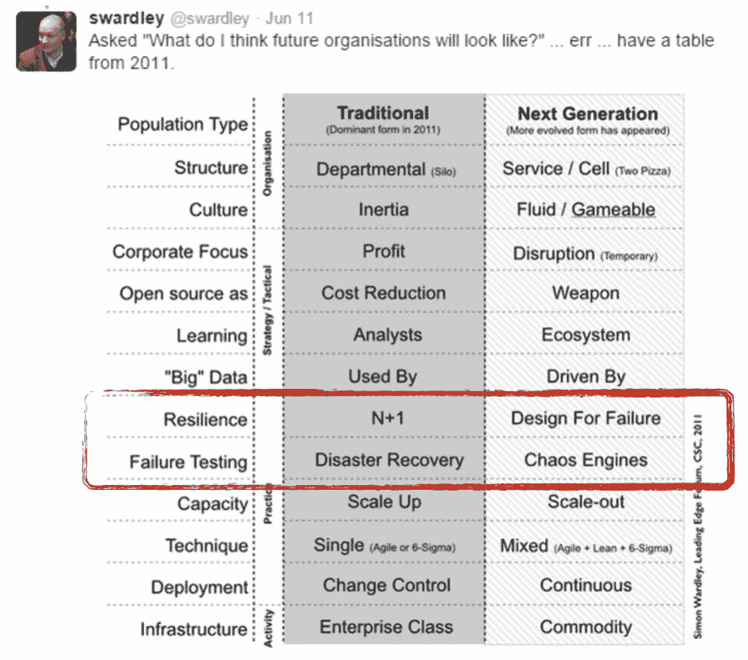
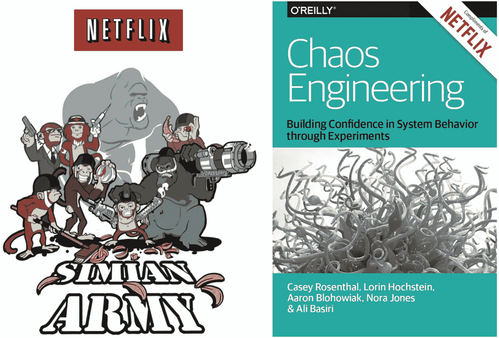
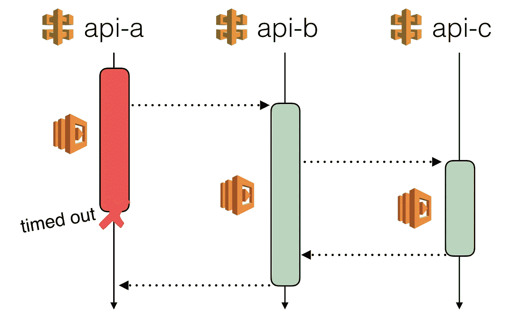
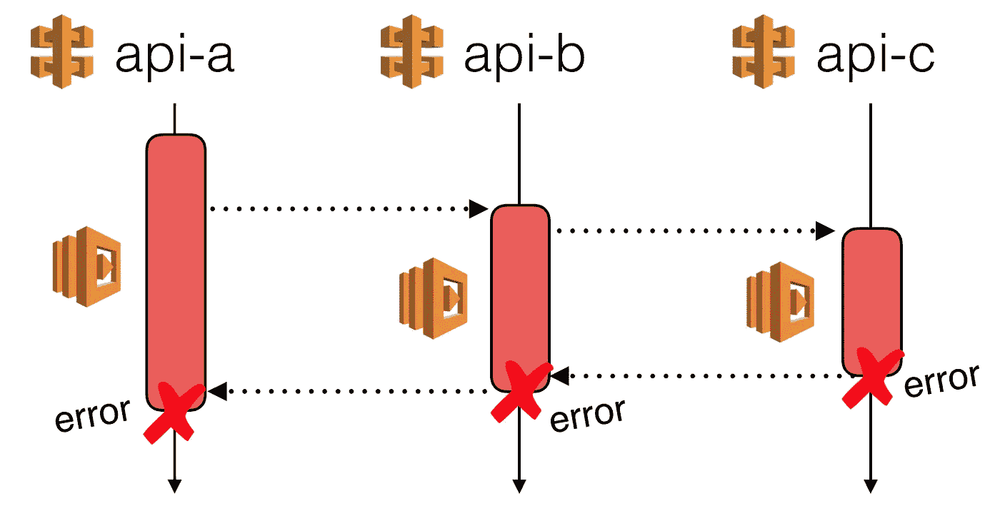
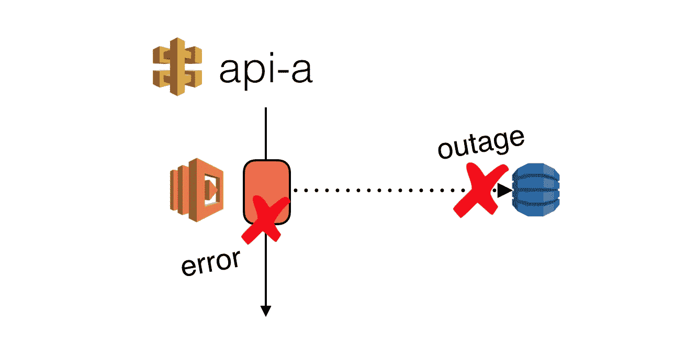

# 如何将混沌工程的原理应用于 AWS Lambda？

> 原文：<https://medium.com/hackernoon/how-can-we-apply-the-principles-of-chaos-engineering-to-aws-lambda-80f87e3237e2>

All the way back in 2011, Simon Wardley had identified Chaos Engines as a practice that will be employed by the next generation of tech companies, along with continuous deployment, being data-driven, and organised around small, autonomous teams (think microservices & inverse-conway’s law).

这是一个多部分系列的第一部分，探讨了如何将混沌工程的原理应用于围绕 Lambda 函数构建的无服务器架构。

*   第一部分:我们如何将混沌工程的原理应用于 Lambda？
*   第 2 部分:[为 API 应用延迟注入](https://hackernoon.com/chaos-engineering-and-aws-lambda-latency-injection-ddeb4ff8d983)
*   第 3 部分:处理延迟峰值和超时(将于 2017 年 11 月 21 日发布)
*   第 4 部分:为 Lambda 函数应用故障注入(来了？)

毫无疑问，网飞推广了混沌工程的*原理*。通过开源他们的一些工具——特别是[猿猴军](https://github.com/Netflix/SimianArmy)——他们也帮助其他人建立了对他们系统承受生产中动荡环境能力的信心。

最近似乎对混沌工程又有了新的兴趣。正如 Russ Miles 在最近的[帖子](/russmiles/chaos-engineering-why-the-label-matters-35ddbb974fa5)中指出的那样，也许许多公司终于明白了混沌工程不是关于“伤害生产”，而是通过 ***受控*** 实验来建立对系统弹性的更好理解和信心。

这一趋势得益于网飞发布的有价值的(且可免费获得的)信息，如[混沌工程](http://oreil.ly/2tZU1Sn)电子书和[principlesofchaos.org](http://principlesofchaos.org/)。

由 *Shoreditch Ops* 开发的 [chaos-lambda](https://github.com/shoreditch-ops/chaos-lambda) 等工具(开发[火炮](https://artillery.io/)负载测试工具的人)试图复制网飞的 [Chaos Monkey](https://github.com/Netflix/SimianArmy/wiki/Chaos-Monkey) ，但是从 lambda 函数内部执行，而不是从 EC2 实例内部执行——从而为您带来 Lambda 提供的成本节约和便利。

然而，我想问一个不同的问题:**如何将混沌工程的原理和一些当前的实践应用到由 Lambda 函数组成的无服务器架构中？**

当您的系统运行在 EC2 实例上时，自然地，您通过为最可能的故障模式——服务器崩溃(由于硬件和软件问题)进行设计来建立弹性。因此，一个验证系统弹性的受控实验将通过终止 EC2 实例，然后终止 AZs，然后终止整个区域来人为地重现故障场景。

然而，AWS Lambda 是一个更高层次的抽象，其故障模式与其 EC2 对应物不同。随着平台为您开箱即用地处理这些故障模式，专注于*“如果我们丢失这些 EC2 实例怎么办”*的假设不再适用。

我们需要问不同的问题，以便了解我们的无服务器架构中的弱点。

# 更多固有的混乱，而不是更少

> "**我们需要在系统范围的异常行为出现之前发现弱点**。系统弱点可能表现为:当服务不可用时，不适当的回退设置；由于超时调整不当而重试风暴；下游依赖关系接收过多流量时的中断；单点故障崩溃时的级联故障；等等。我们必须主动解决最重要的弱点，以免它们影响我们的客户生产。**我们需要一种方法来管理这些系统固有的混乱**，利用不断增加的灵活性和速度，并且**对我们的生产部署充满信心，尽管它们代表着复杂性。**”
> 
> — [混沌工程原理](http://principlesofchaos.org/)

在[建造并运行了一个非平凡的无服务器架构](https://hackernoon.com/yubls-road-to-serverless-part-1-overview-ca348370acde)之后，我对这个新世界中等待你的危险有了一些了解。

如果有什么不同的话，在这些围绕 Lambda 函数构建的系统中有更多固有的混乱和复杂性。

*   模块化(部署单元)从“服务”转移到“功能”，而且还有更多
*   围绕边界进行强化更加困难，因为您需要围绕每个功能进行强化，而不是封装一组相关功能的服务
*   有更多的中介服务(如 Kinesis、SNS、API Gateway 等)，每种服务都有自己的故障模式
*   总体上有更多的配置(超时、IAM 权限等。)，因此错误配置的机会更多

此外，由于我们放弃了对基础设施的更多控制，这意味着我们现在面临更多未知的故障模式**，而且当停机发生时，我们往往无能为力***。

**为了更好的可扩展性、可用性、成本效率和更多的便利性，我认为这是一个公平的交易* ***大多数情况下*** *。*

***平台为您做的一切——调度容器、扩展、轮询 Kinesis、重试失败的调用等。—有自己的失效模式。这些对我们来说通常不明显，因为它们是通常没有文档记录的实现细节，并且容易在没有通知的情况下改变。*

****例如，如果中断发生并阻止 Lambda 函数处理 Kinesis 事件，那么除了等待 AWS 修复问题，我们没有其他有意义的选择。由于碎片上的当前位置被抽象掉了，我们无法使用，我们甚至不能用运行在 EC2 上的 KCL 处理器来替换 Lambda 函数。*

# 将混沌应用于 AWS Lambda

一个好的锻炼制度会不断地将你推向极限，但实际上永远不会让你超过极限而造成伤害。如果有一项运动明显超出了你目前的能力，那么你肯定不会尝试，因为唯一可能的结果是让你自己受伤！

**在为您的无服务器架构设计受控实验时，应该应用相同的常识**。为了“了解”实验告诉我们的系统弹性，我们还需要决定监控哪些指标——最好使用客户端指标，因为最重要的指标是用户体验的服务质量。

我们知道有很多失效模式，并且可以针对这些模式进行设计，我们可以进行简单的实验来验证我们的设计。例如，由于无服务器架构(几乎总是)也是微服务架构，其许多固有的故障模式仍然适用:

*   超时调整不当，尤其是对于中间服务，这可能导致边缘服务也超时

Intermediate services should have more strict timeout settings compared to services at the edge.

*   缺少错误处理，这使得下游服务的异常能够逃脱

*   当下游服务不可用或经历中断时，缺少回退

在接下来的几篇文章中，我们将探讨如何将延迟和故障注入的实践应用到 Lambda 函数中，以便模拟这些故障模式并验证我们的设计。

# 进一步阅读:

*   [章节:混沌自动化平台](/netflix-techblog/chap-chaos-automation-platform-53e6d528371f)
*   [部署网飞 API](/netflix-techblog/deploying-the-netflix-api-79b6176cc3f0)
*   [网飞猿猴军](/netflix-techblog/the-netflix-simian-army-16e57fbab116)
*   [生产中的测试:是的，你可以(也应该)](https://opensource.com/article/17/8/testing-production)
*   [延迟问题设计](http://theburningmonk.com/2015/04/design-for-latency-issues/)
*   [1000 个演员，一只混沌猴…一切都好](https://erlangcentral.org/blog/presentations/1000-actors-one-chaos-monkey-and-everything-ok/)
*   【电子书】[混沌工程](http://www.oreilly.com/webops-perf/free/chaos-engineering.csp)
*   【书】[发布吧！](http://amzn.to/1pedVvt)
*   [【书】滑向失败](http://amzn.to/1CB0I6D)
*   [principlesofchaos.org](http://principlesofchaos.org/)

嗨，我叫**崔琰**。我是一个 [**AWS 无服务器英雄**](https://aws.amazon.com/developer/community/heroes/yan-cui/) 和 [**量产无服务器**](https://bit.ly/production-ready-serverless) 的作者。我已经在 AWS 中运行了近 10 年的大规模生产工作负载，我是一名架构师或首席工程师，涉足从银行、电子商务、体育流媒体到移动游戏等多个行业。我目前是一名专注于 AWS 和无服务器的独立顾问。

你可以通过[邮箱](mailto:theburningmonk.com)、 [Twitter](https://twitter.com/theburningmonk) 和 [LinkedIn](https://www.linkedin.com/in/theburningmonk/) 联系我。

查看我的新课程，[**AWS 步骤功能完整指南**](https://theburningmonk.thinkific.com/courses/complete-guide-to-aws-step-functions) 。

在本课程中，我们将介绍有效使用 AWS Step Functions 服务所需了解的一切。包括基本概念、HTTP 和事件触发器、活动、设计模式和最佳实践。

点击获取您的副本[。](https://theburningmonk.thinkific.com/courses/complete-guide-to-aws-step-functions)

来了解 AWS Lambda: CI/CD 的操作性**最佳实践**，本地测试&调试功能、日志记录、监控、分布式跟踪、canary 部署、配置管理、认证&授权、VPC、安全性、错误处理等等。

您还可以通过代码 **ytcui** 获得票面价格的 **40%** 。

点击获取您的副本[。](https://bit.ly/production-ready-serverless)