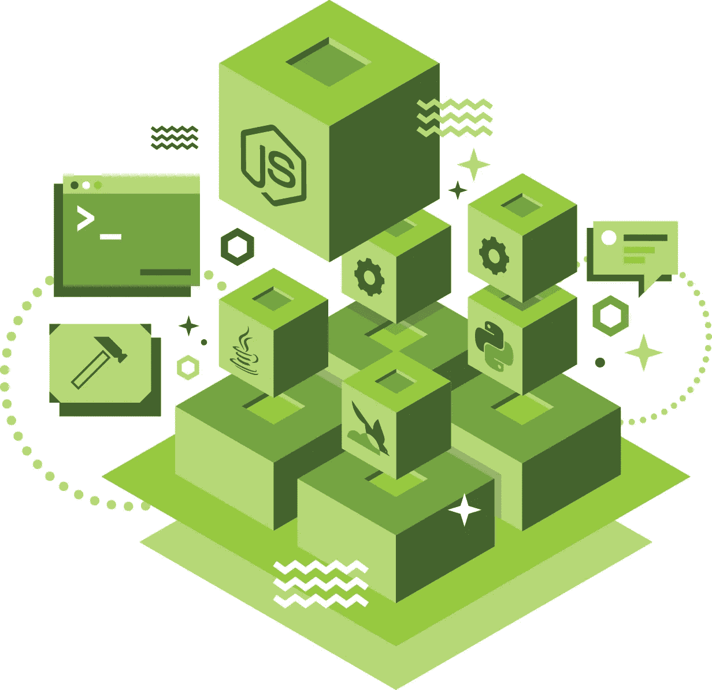

# 如何才能让更多的企业终端用户参与 Node.js？

> 原文：<https://medium.com/hackernoon/how-can-we-get-more-enterprise-end-users-engaged-in-node-js-f09a868da831>

一个开放的技术社区的强大程度取决于为其做出贡献的社区，Node.js 也不例外。虽然 Node.js 社区很强大[并且正在变得越来越强大](https://developer.ibm.com/code/2017/07/07/stronger-ever-node-js-charges-future/)，但是在反馈和贡献方面，总是有机会吸引更多的最终用户。

然而，对于任何开放的技术社区来说，这往往是说起来容易做起来难。开发人员本质上是忙碌的个体。在用 Node.js 构建创新的解决方案和创造一个更加用户友好的未来所需的贡献之间，越来越难以平衡。

在我们系列 [#NodeMinds](https://twitter.com/search?src=typd&q=%23NodeMinds) 博客文章的第二篇中，我们询问了一些#NodeMinds 专家，他们将如何鼓励最终用户提供更多反馈。以下是其中一些人不得不说的话:

“首先，参加 Node Interactive 和其他 Node.js 活动。他们是一个很好的方式来认识社区中的其他人，了解我们在做什么和我们要走的方向。第二，我鼓励所有用户参与 GitHub 并分享他们的想法。最终用户在解决现实世界的问题时有背景，他们的使用和体验可以深刻地帮助我们了解信息技术的使用方式。” **— Mark Hinkle，node . js Foundation(@**[**mrhinkle**](https://twitter.com/mrhinkle)**)**

社区委员会(CommComm)小组可以参与进来。用户调查是另一个参与的好地方。作为成员加入 Node.js 基金会，这样他们就可以对社区的方向和代表性进行投票。所有这些都是参与的好方法。当然，出来参加活动，聚会，教育，培训，认证。所有这一切将导致更高质量的产出，因为我们将有更好的合格人员。" **—托德·摩尔，IBM(@**[**TM Moore _ 1**](http://www.twitter.com/tmmoore_1)**)**

“我希望在 Node.js 基金会的社区委员会(“CommComm”)下成立一个企业用户组。CommComm 对我们来说是一个相对较新的章程。我们需要组织者和积极的贡献者来帮助解决最紧迫的需求，这样我们就可以对它们进行优先排序。此外，如果企业最终用户恰好在 Node.js Foundation 之外的公司工作，他们应该指示他们的领导来进行“谈话”。“在这个旅程中，我们需要合作伙伴和贡献者。你们都可以帮忙。” **—丹肖(@** [**丹肖**](https://twitter.com/dshaw) **)**

“我认为社区应该继续确保在新节点版本的测试程序中有用户反馈和测试，以便最终用户可以做质量保证并帮助任何回归。这似乎是开始并继续与最终用户积极互动的最佳方式。”— **韦德·奥尔森，埃森哲**

“一种方法是联系 NodeCore，让我们知道他们的优先事项是什么。在过去的几周里，来自各地公司的许多人主动联系我，让我直接知道他们认为 Node 未来应该优先考虑的事情。这种直接接触是非常重要的。公司不应该认为我们知道他们想要什么。” **—詹姆斯·斯内尔，nearForm (@** [**贾斯内尔**](https://twitter.com/jasnell) **)**

“我认为让更多企业最终用户参与进来的一个好方法是加入社区委员会，以获得更多用户反馈([参见此链接](https://github.com/nodejs/community-committee/issues/96/))。).我希望看到社区中有更多的领导者帮助推动这一进程。特别是，[此链接](https://github.com/nodejs/community-committee/issues/96#issuecomment-322506825)中概述的步骤是一个很好的起点，无论是基于你过去做类似事情的经验，还是仅仅分享好的想法。” **—麦可·道森，IBM(@**[**mhdawson 1**](https://twitter.com/mhdawson1)**)**

“Node.js 的领导者应该欣然接受来自 it 的企业计划。拥有来自企业方面的支持，并拥有使用 Node 构建的大型项目和应用程序，对 Node 本身来说是一个巨大的优势。Node 得到更广泛的使用和认可，并让企业用户为社区做出贡献，这是一个双赢的局面。我鼓励 Node 领导层继续大力支持这些企业计划，并鼓励他们做出更多贡献。” **—汤姆·雅各布斯，埃森哲**

“参与项目的核心是一项艰巨的任务，但是 bug 和特性不会自己写出来。社区中只有一小部分人能够参与到核心代码层面，但是对文档的贡献或者帮助充实 bug 报告或者特性请求都是有帮助的。” **—亚历克斯·波利特，蒂盖拉(@**[lxpollitt](https://twitter.com/lxpollitt)**)**

总而言之:用户反馈对 Node.js 的成功至关重要。这篇文章中引用的任何一个人都很乐意帮助你成为一名积极的 Node.js 贡献者。随着节点社区的发展，技术只会不断改进。

你对鼓励更多最终用户反馈有什么建议？让我们在这里知道你的想法，或者用标签# [NodeMinds](https://twitter.com/search?src=typd&q=%23NodeMinds) 在推特上发布你的想法。