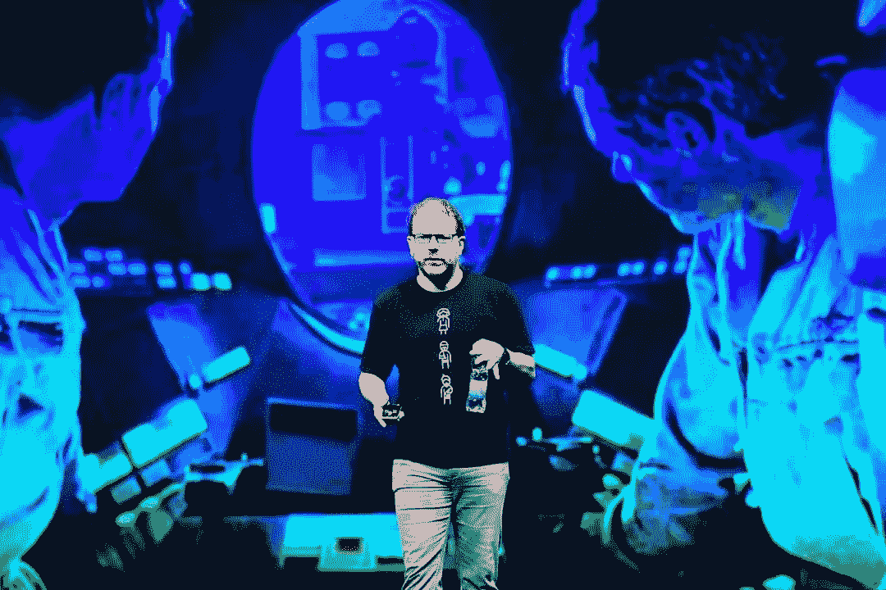
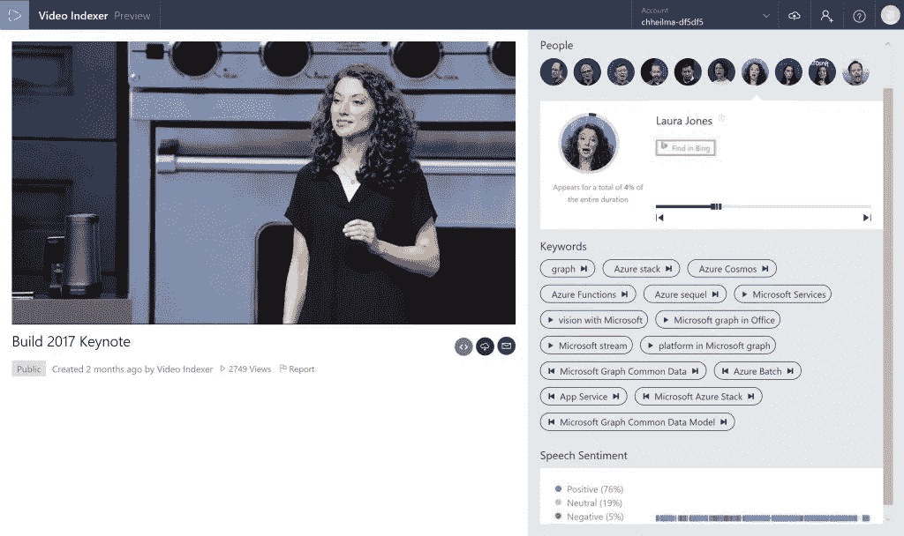

# 怎样才能让更多人看会议视频？

> 原文：<https://medium.com/hackernoon/how-can-we-make-more-people-watch-conference-videos-e2ebee3a1e67>

令人难以置信的是，我们在事件报道方面已经走了这么远。过去，我把自己的演讲录制成音频，因为没有多少会议提供视频录音(并且[在](http://developer-evangelism.com/record.php)[开发者福音手册](http://developer-evangelism.com/)中写道这是一个好主意)。这些天来，我发现自己不必这样做，因为大多数会议甚至聚会都会记录谈话内容。更快的上传速度和简单、免费的托管在 [YouTube](https://hackernoon.com/tagged/youtube) 和其他网站上使得这成为可能。

然而，录制和发布你的[会议](https://hackernoon.com/tagged/conference)视频既昂贵又工作量大。如果你没有从中赚到任何钱，那就是为你的活动做了一点广告，而且开销很大。这就是为什么看到一些伟大的会议视频的观看人数如此之低是一种耻辱。在与会议组织者交谈时，我听到一些低得惊人的数字。唯一能提振他们的似乎是通过专门的社交媒体推广来一个接一个地传递他们。这又是一次额外的努力。

为了了解什么会让人们观看更多的会议演讲，我在 Twitter 上做了一个快速调查:

以下是 344 张投票的快速结果:

*   29%的人选择了没有问答的短片
*   37%的人希望成绩单上有时间戳
*   22%的人希望离线观看视频
*   12%的人想要字幕。

我喜欢看会议演讲视频。我在网下看，在健身房里用 iPod 看，或者在飞机和火车上看。基本上，当我不能做其他事情的时候，它们是你消磨时间和学习的好方法。不过，有几件事需要考虑，让我觉得这很值得:

*   这个演讲需要有意义，才能在小屏幕上观看。使用 12px 字体的终端中的大量实时代码并不是这样。这并不是说这些会谈不好。他们只是不工作作为一个视频。
*   演讲需要离线进行(我使用 YouTube DL 下载 YouTube 视频，Vimeo 上的一些出版商提供下载，Channel 9 总是有视频可供下载)
*   谈话需要包含在它本身中——听到提及我应该知道的事情或发生在我没有参与的同一个事件中的小片段令人沮丧。更令人讨厌的是，在问答环节中，你等了很久才拿到麦克风，或者主持人回答问题，而我却不知道问题是什么。

在之前，我已经详细写了关于 [Q & A 部分视频的内容，我坚信删减标准 Q & A 会带来更多的观众和更快乐的主持人。首先，视频会更短，当它是 25 分钟而不是 45-50 分钟时，看起来更轻松。](https://christianheilmann.com/2015/07/22/i-dont-want-qa-in-conference-videos/)

在技术赛事中，我对其中一些烦恼没有意见。毕竟在活动上娱乐观众更重要。当主持人花时间和精力去看其他演讲并引用它们时，这是令人惊讶的。然而，考虑录音的质量和消费也有很多好处。

拥有会议谈话的录音是给社区的一份令人惊奇的礼物。没钱参加活动甚至没钱旅行的人仍然可以通过观看视频来了解最新信息和深入研究的话题。易于消费、短小精悍的视频是增加市场多样性的好方法。

> *《你在这里和在线观众对话》*

当我在一些 TEDx 活动上演讲时，这是演讲教练和组织者的建议。TED 是一个拥有高质量在线内容的知名品牌。参加 TED 的主要活动几乎是负担不起的。这使得这个建议有点奇怪，但他们在网上的成功表明他们有所作为。

TED 演讲比一般的会议演讲要短得多。他们更多的是表演而不是展示。它们有文字记录，可以下载。

现在，我们不能只在活动中进行这种谈话。但也许对录音进行一些编辑并把它们变成一种体验，而不是尽快交付的舞台上发生的事情的记录，是一个好计划。当然，这意味着额外的工作和开销。但是我想知道有多少已经可以自动化了。

除了投票结果之外，推特和[脸书](https://www.facebook.com/thechrisheilmann/posts/10155368417066977)上的评论也有一些好的地方。

> *扬声器上半身变小，幻灯片变多。或者下载幻灯片。此外，以 1.5 倍的速度调整自己声音的扬声器。*

对于那些花时间观看谈话以加快速度的人来说，这似乎很常见。这是一个有趣的概念。幻灯片和演示者之间的良好编辑是许多人的愿望。将幻灯片和视频一起发布应该不难，演示者应该考虑做更多的事情。

> *不在列表上，但是“编辑”加上几段关于演讲内容和为什么我应该或不应该看的内容。*

这是演示者要做的另一件简单的事情。我们总是被要求为演讲提供一个描述和标题，这个描述和标题应该能够激发人们的热情。提供第二个更具描述性的方法来配合视频使用并没有太大的开销。

> 对于英语发言人来说，大多数会议都没问题。但是对于非英语发言人来说，这是一个巨大的失败。阅读真的更容易尝试听和理解。有些人说话很快。所以我听不懂谈话。

这是一个常见的问题，也是演示者需要努力的技巧。被非母语人士理解是一个巨大的机会。因此，一些节奏和避免俚语总是一个好主意。

> *可以在平板电脑、智能手机和笔记本电脑上下载视频，这样我就可以在上下班时间观看了*

提供视频下载应该不会太难。如果你不打算卖掉它们，为什么不呢？

> *还有带章节标记/时间戳的离线可用性。我会投票给略读的抄本来获得金块。但是有时候一个好的演讲者是一个令人愉快的 50 分钟的经历。我宁愿看文字记录。我从来没有安静过。接下来是幻灯片链接，或者(更好的)隐藏字幕，如果它们更短，我可以静音播放，并在*后下载要点幻灯片

这当然是个大问题。很多人要求抄本，章节和时间标记。要么是因为可访问性的原因，要么只是因为浏览和跳转到对你来说重要的内容更容易。这需要时间和精力。

这里我们有一个第 22 条军规:如果没有很多人观看一个事件的记录，会议组织者和公司不想花费时间和精力。手动转录、编辑和字幕并不便宜。

好消息是，自动化转录在过去几年里有了长足的进步。由于需要在手机和家用电器上安装语音指令，许多公司致力于比过去更好地实现这一点。

YouTube 有免费的带编辑功能的自动字幕。大多数云提供商都提供视频洞察。

一个让我大吃一惊的服务是 VideoIndexer。

*(是的，这是我工作的公司提供的，但让我感到惊讶的是，这个产品在一个简单的界面中集成了许多机器学习 API。)*

使用 VideoIndexer，您不仅可以生成可编辑的带时间戳的抄本，还可以进行情感识别、视频内容的图像到文本转换、说话者识别和关键字提取。这样你就提供了一个界面，让人们可以跳到他们想去的地方，而不必浏览视频。我希望看到更多这样的提议，我相信已经有很多被大的电视公司和体育广播公司使用了。如果你知道任何好的，请在这里评论。

# 摘要

总的来说，我很感激有机会观看我不能参加的活动的演讲，我正在努力成为一个更好的网络公民，提供更好的描述，并更加意识到我所说的话如何可以在事后作为视频被消费。

评论中我最喜欢的一句话来自泰莎·梅罗:

> 和别人一起看会很有趣，这样我们就可以在视频中/视频后讨论内容。需要社会参与，让学习更有趣。

谈话视频是一个很好的机会，可以让你学到一些东西，并在办公室里和你的同事玩得开心。选择一个房间，安装一台与投影仪相连的机器，买一些小吃，观看演讲，然后讨论它如何应用到你的工作中。会议组织者花了很多精力来记录演讲，演讲者投入了很多来使演讲变得激动人心并富有教育意义。你可以免费从中受益。

*Permalink:*[*https://christianheilmann . com/2017/07/26/how-can-we-make-…on conference-videos/*](https://christianheilmann.com/2017/07/26/how-can-we-make-more-people-watch-conference-videos/)