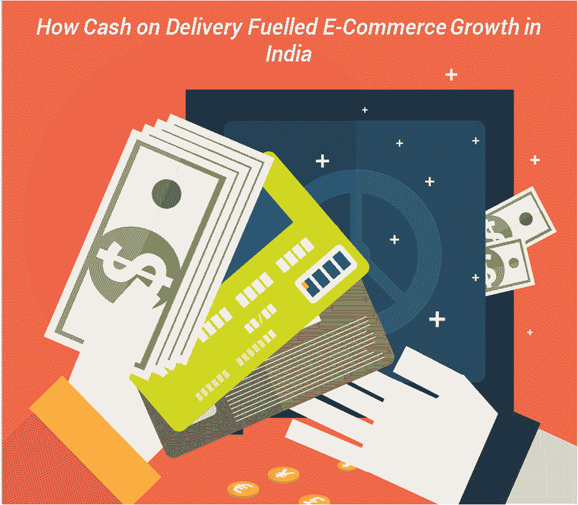
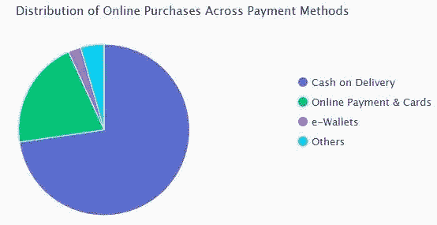

# 货到付款如何推动印度电子商务的发展

> 原文：<https://medium.com/hackernoon/how-cash-on-delivery-fuelled-e-commerce-growth-in-india-8ae66bea6cfe>

## 本文原载于 [OnlineSales.ai](https://onlinesales.ai/blog/how-cash-on-delivery-fuelled-ecommerce-growth-in-india/)

# 什么是货到付款？

据[维基百科](https://en.wikipedia.org/wiki/Cash_on_delivery)

> 货到付款(COD)是指通过邮购销售商品，即货到付款，而不是提前付款。

对消费者和零售商来说，货到付款(COD)有很多好处。

*   顾客不需要拥有信用卡来购物。
*   冲动购买可能会增加，因为在订购时付款尚未到期。
*   信任。你可以信任这家公司，因为你是在送货上门后付款的。

# 货到付款如何推动印度电子商务的发展

还记得在印度蓬勃发展的电子商务的出现，以及早期对网上支付的紧张吗？尽管在过去的几年里，在线支付有了显著的增长，但货到付款 [(COD)仍然是印度消费者最喜欢的支付方式。](https://onlinesales.ai/blog/current-trends-about-indian-e-commerce-industry/?utm_source=how-cash-on-delivery-fuelled-ecommerce-growth-india&utm_medium=blog&utm_campaign=internal-links)

根据尼尔森的全球互联商务调查( [*Business Insider*](http://www.businessinsider.com/cash-on-delivery-remains-the-preferred-method-of-payment-in-india-2016-6?IR=T) )显示，大约 83%的印度消费者更喜欢使用货到付款作为在线购物的支付方式。由于网上欺诈的风险，消费者仍然对使用信用卡犹豫不决。一份报告强调，消费者在 Flipkart 等在线网站上的大多数支付方式是货到付款，72%来自大城市，90%来自小城镇。

# 70%的买家更喜欢货到付款

虽然移动钱包和网上银行交易正在增加，但在进行网上购物时，[大多数买家仍然更喜欢货到付款模式](https://onlinesales.ai/blog/current-trends-about-indian-e-commerce-industry/)。与货到付款(CoD)相比，网上银行、信用卡、借记卡和电子钱包等支付方式仅占所有网上购物的 30%。

尽管较贫穷国家的互联网使用率较低，但电子商务部门的销售额已从 2010 年的 44 亿美元(20，020 亿卢比)增至 2014 年的 136 亿美元(83，096 亿卢比)，增长了两倍。根据印度工业联合会(CII)和咨询公司德勤最近的一份报告，到 2020 年，印度的网上零售市场预计将达到 1 万亿美元(66 万卢比)。

此外，在非货币化后，移动钱包缓慢但逐渐增加的受欢迎程度，可能是将货到付款转换为在线支付的一种替代方式。

COD 是最大的游戏规则改变者，这给了提供服务的人优势，这一事实没有任何意义。

Flipkart 于 2007 年推出，是继 2010 年推出 COD 服务的 Indiaplaza 之后的第一家电子商务公司。正是货到付款服务让 Flipkart 异常受欢迎，并让网上购物成为大众的一种时尚。

突然之间，每个人，从一个甚至没有银行账户的年轻大学生，到一个没有借记卡的小镇居民，都可以通过点击购物。

# 促成货到付款增长的因素:

*   便利
*   熟悉现金支付
*   较少的信用卡/借记卡用户
*   缺乏安全的支付网关
*   消费者对在线支付缺乏信任
*   害怕网络诈骗

无论是对承诺的焦虑，还是订购任何不急需用钱的东西的喜悦，COD 很快就接受了。然而，同样的服务正在逐渐侵蚀市场和供应商。

原因如下:

# 1.受限现金流

货到付款对买家来说很方便，但对零售商和商贩来说却极为不便。它阻碍了现金流，因为这类订单需要更长时间才能成交。如果没有退款/退货请求，钱到达卖家手中通常需要几个月的时间。这使得他们难以衡量或维持日常运营。

# 2.额外费用

[印度在线卖家文章](http://indianonlineseller.com/2015/11/cod-logistic-service-providers-for-your-ecommerce-business/)列出了快递公司递送货到付款订单的收费高于正常收费。在退货的情况下，由于市场/物流公司扣除快递费，成本甚至会进一步上升。

# 3.高回报

货到付款和[不问问题退货政策](http://indianonlineseller.com/2015/11/return-policies-of-marketplaces-breaking-sellers-back/)是一个致命的组合。人们轻率冲动地购买商品，然后毫无烦恼地退货。卖家相信货到付款的订单会带来高回报，买家会给[疯狂的理由](http://indianonlineseller.com/2015/12/no-genuine-reasons-for-product-returns-on-flipkart-seller-woes-spelt-out/)，而不是货到付款的订单。这就在卖家、物流公司和市场的口袋里制造了一个漏洞。

# 4.欺诈/盗窃

[送货员被殴打](http://indianonlineseller.com/2015/07/delivery-nightmares-or-rules-keeping-ecommerce-firms-away-from-noida-and-up/)在枪口下被抢劫，在运输过程中被偷窃以及伪造订单，我们都听说过。这种情况大多发生在货到付款订单中。这导致了什么？更多费用。

它加强了在线市场的第三方和内部物流[以增加他们的安全支出，并加强了高科技跟踪设备](http://indianonlineseller.com/2015/08/etailers-implement-stricter-checks-to-restrict-customer-order-thefts/)以减少这些欺诈和盗窃。例如，GoJavas 不得不将安全预算提高三倍来保护订单货物。

将持卡人逆转为专属 COD 用户。行业专家的主要抱怨是，零售商正在将持卡用户或潜在用户变成独家 COD 订户。

那些没有塑料货币的人选择用现金支付，这是有道理的。但是货到付款服务的到来对那些有卡的人进行网上支付是不利的。许多人感觉到印度正逐步转向预付费系统和数字支付，直到 Flipkart 和其他在线市场带着货到付款的方式涌入。

因此，从一个众所周知的服务来看，货到付款现在被视为一种预期的服务，这并不令人吃惊。它已经成为一种自然的支付选择，只是卖家和交易商目前没有能力退出。

# 减少现金交易的努力

印度政府和金融机构一直在尽最大努力减少现金交易，推动数字支付，以改善经济。从对电子支付提供税收激励到对简化数字支付过程的限制，政府正试图摆脱现金密集型经济。遏制现金交易的一招妙棋是最近取消卢比货币流通的举措。500 卢比。1000，因此[的 COD 订单下降了 30%。](http://www.dnaindia.com/money/report-demonetization-cash-on-delivery-orders-drop-by-30-2274159)

同样，电子商务公司已经并仍在尽自己的努力减少 COD。零售商和销售商已经实施(如果还没有实施，则应该实施)的一些步骤是:

*   交货时通过卡付款
*   改善支付网关并扩大选择
*   通过独家优惠鼓励数字钱包
*   为在线支付提供激励
*   即时退款机制设施
*   使用信用卡支付时，与银行合作获得特别的现金返还和折扣优惠
*   发起移动交易
*   对 COD 订单收取额外费用
*   对可接受的 COD 订单价值、数量和产品类型设置上限
*   改变退货政策，消除退货的荒谬理由
*   允许卖家决定付款和运输政策

# 现金仍将占主导地位

去货币化后，印度大多数电子商务公司都暂停了货到付款的选择。但他们也很快在宣布后的两周内重新引入了它。其中明确指出，对于像印度这样的国家，人们习惯于现金交易，摆脱 COD 并创造无现金经济似乎仍然是一个遥不可及的梦想。

相关职位

*   [你需要了解的印度电子商务行业的当前趋势](https://onlinesales.ai/blog/current-trends-about-indian-e-commerce-industry/)
*   [5 个惊人高效的电子商务购买漏斗助推器](https://onlinesales.ai/blog/5-amazingly-productive-e-commerce-purchase-funnel-boosters/)
*   [[信息图]印度服装行业的当前趋势](https://onlinesales.ai/blog/infographic-current-trends-indian-apparel-industry/)
*   [让谷歌购物更上一层楼:电子商务中的图片优化](https://onlinesales.ai/blog/google-shopping-ecommerce-image-optimization/)

## 本文原载于 [OnlineSales.ai](https://onlinesales.ai/blog/how-cash-on-delivery-fuelled-ecommerce-growth-in-india/)

**Authored by:** [**Paras Khushiramani**](mailto:paras.khushiramani@sokrati.com) **| Sr. Business Analyst**

> [黑客中午](http://bit.ly/Hackernoon)是黑客如何开始他们的下午。我们是 [@AMI](http://bit.ly/atAMIatAMI) 家庭的一员。我们现在[接受投稿](http://bit.ly/hackernoonsubmission)并乐意[讨论广告&赞助](mailto:partners@amipublications.com)机会。
> 
> 如果你喜欢这个故事，我们推荐你阅读我们的[最新科技故事](http://bit.ly/hackernoonlatestt)和[趋势科技故事](https://hackernoon.com/trending)。直到下一次，不要把世界的现实想当然！

