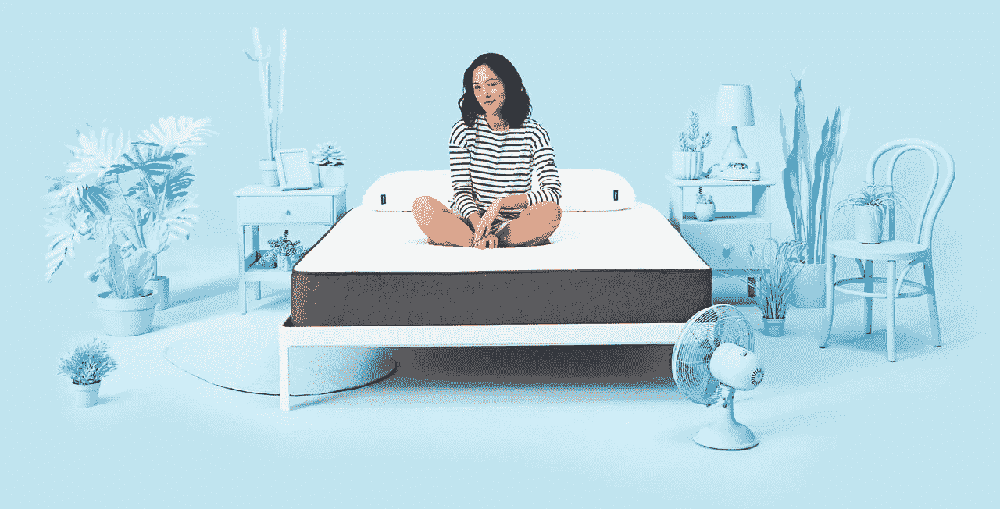
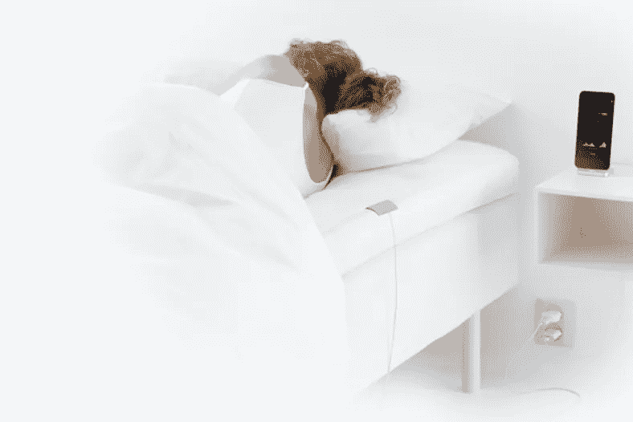
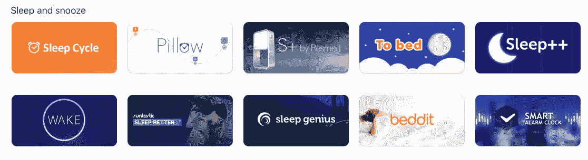

# 为什么对于创业公司来说用例应该优先于技术

> 原文：<https://medium.com/hackernoon/how-casper-shows-that-use-cases-should-come-before-technology-for-startups-107c9cabc4dc>

*Casper has done the impossible—make memory foam cool. Photo:* [*Casper*](https://casper.com/)

*由* [*约瑟夫·弗莱厄蒂*](https://twitter.com/josephflaherty) *，内容&社区*

在太空竞赛期间，美国国家航空航天局据说花费了数百万美元为宇航员开发了一种可以在零重力下工作的笔，而俄罗斯宇航员使用的是铅笔。[的故事被证明是一个城市传奇](https://www.scientificamerican.com/article/fact-or-fiction-nasa-spen/)，但它很好地提醒了我们，工程师有时过度依赖技术，而倾向于更简单的解决方案。这个教训同样适用于企业家。

The Zeo Sleep Coach tried to change the way people snooze through technology. Photo: Zeo.

例如，本·鲁宾在布朗大学的第三年创立了他的第一家公司，Z EO。杰欧是一款可穿戴设备，它可以追踪脑电波，并分享如何实现完美小睡的技巧。该公司走在了时代的前面，比 Fitbit 早 5 年起步，比风投从硬件沉睡中醒来早了近 10 年。杰欧从顶级健康科技投资者以及强生公司和百思买公司获得了 3200 万美元，并在公司最终关闭前享受了 9 年历史中的一些小胜利。

当被问及他是否认为杰欧会在几年后推出时更加成功，当时像 [Bolt](http://bolt.io/) 这样专注于硬件的孵化器正在帮助制造，市场已经为量化的自我应用做好了准备，本提出异议。

*Beddit is an elegant way to track sleep digitally. Photo:* [*Beddit*](https://www.beddit.com/)*.*

他引用了一家名为 [Beddit](https://www.beddit.com/) 的公司的例子，该公司安装在床垫上，而不是安装在流口水的做梦者身上，但基本上是另一个跟踪睡眠模式的小工具/应用组合。与杰欧不同，Beddit 在量化自我热潮的顶峰时期推出，并在被苹果以未披露的金额收购之前与 [Misfit](http://newatlas.com/misfit-beddit-sleep-system/32943/) 等公司建立了合作关系，这意味着它没有达到苹果的实质性门槛。

虽然适度的销售总比没有销售好，但本并不嫉妒贝迪特。他对他们对外形的改进印象深刻，但就最近与睡眠相关的创业成功而言，没有什么能与 Casper 相提并论。本的目标是创办一家公司，为寻求睡眠的失眠症患者提供服务，他的使命是改变人们的睡眠方式，而不仅仅是为他们节省一点时间、金钱和麻烦。但事实证明，在快速眼动睡眠和创业的交汇处，最大的金融机会不是经过临床测试的收集数据的设备，而是塞进纸板盒的多密度记忆泡沫。[事实证明，让床垫更实惠、更易获得、更有吸引力，比任何睡眠应用或可穿戴设备都更有利可图](https://twitter.com/CBinsights/status/824662927533871106)。

这是有意义的，当寻找失眠的解决方案时，什么是更好的解决方案；每晚戴头带上床，还是单纯升级睡眠面？这并不是说不可能有技术驱动的解决方案，也不是说金钱应该是衡量成功的唯一标准，但对于初创公司来说，重要的是[记住用例，不要盲目崇拜特定的解决方案](https://techcrunch.com/2015/11/28/the-platform-paradox/)。

*The App Store has hundreds of tools to help people sleep, but none have been nearly as successful as Casper. Photo: iTunes.*

尽管经历了几个不眠之夜，错过了 2013 年的床垫爆炸，本仍在努力帮助人们更有效地充电。如今，他以一家名为 [10%快乐](http://www.10percenthappier.com/mindfulness-meditation-the-basics/)的公司的形式瞄准了正念，该公司可能会将 Casper 的商业成功与杰欧的数据驱动设计结合起来。