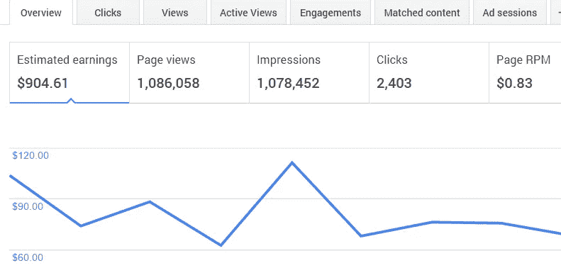
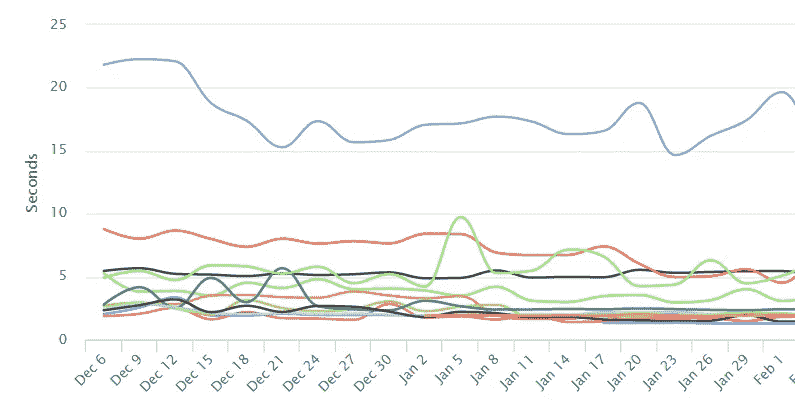
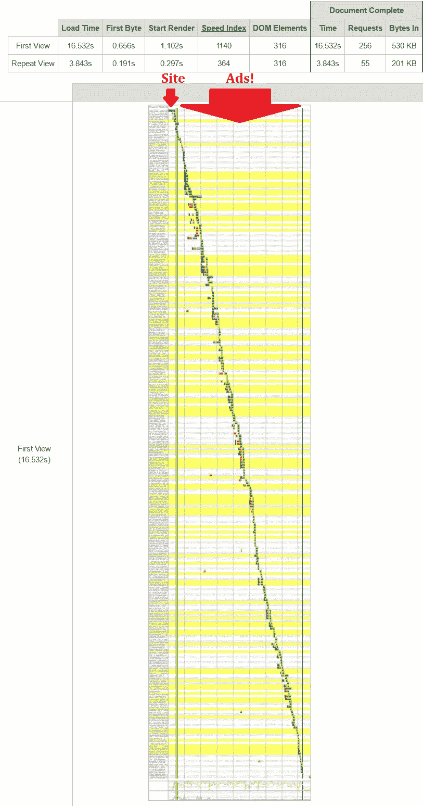
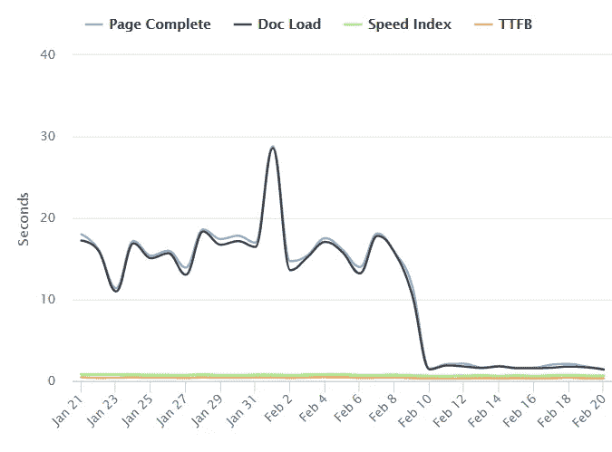
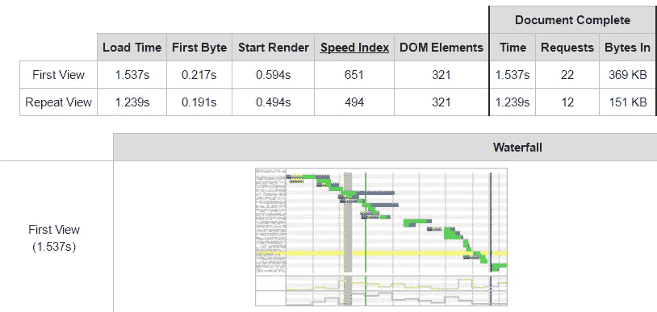
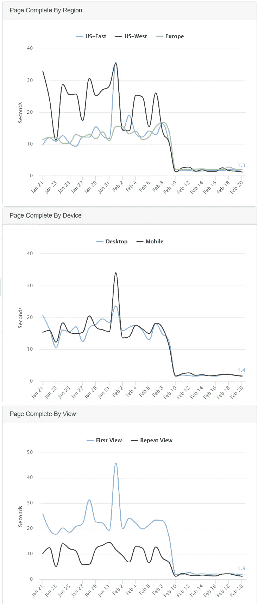

# 不断变化的广告网络如何让我的网站速度提高 8 倍

> 原文：<https://medium.com/hackernoon/how-changing-ad-networks-made-my-site-8x-faster-47ffc989ed72>

这是一个关于我如何做了一个简单(愚蠢)的选择来转换广告网络以增加几个百分点的广告收入的故事。然而它无知地将一个 **< 2 秒的加载时间变成了平均 15 秒。**再也不会。

跳到底部看 TLDR；

# 简单的网站

我为自己建立了各种各样的网站，然后放在网上，以防其他人喜欢。如果它引起了足够的兴趣，我会在上面打一些广告，希望它能帮助支付托管费用。

其中一个网站是一个简单的工具，可以帮助你找到一首歌的音乐基调。它自 2011 年以来一直存在，每天有大约 1000 名访客，每月带来不到 100 美元的广告收入**，在页面页脚处有一个谷歌广告。没什么可吹嘘的，但是嘿——付账单，然后更多。**

# 竞争广告网络

因此，当另一家广告网络向我保证他们会支付比 AdSense 更高的价格时，我想我不会有什么损失。他们给了我一个账户，给了我一个片段，我把它换了几天，看看它的表现如何。

他们是对的——统计数据显示，我比从[谷歌](https://hackernoon.com/tagged/google)赚的要多一点，而且广告似乎也没有更显眼。当我确认他们支付，我决定让他们全职工作。

与另一家广告公司做生意更让人放心，因为他们引起了我的注意。我可以和真实的人交谈(我从来没有听到过站长那边的声音)。他们想要我，在一个被简化为数字的世界里，这感觉很好。

# 几个月

事情持续了几个月，没有大的变化。网站嗡嗡作响。广告被投放。我得到报酬。太好了。

然而，当我看着我的总收入，并把它们与我在 AdSense 上的收入进行比较时，它似乎并没有高出多少。统计数据告诉我，相比 AdSense 的每分钟 0.83 美元，我的每分钟收入为 1.00 美元，这个数字应该能让我在月底多喝几杯啤酒。但是我的银行账户余额并没有显示出来。

(根据记录，我知道每分钟 1 美元的费率相当低。我知道我可以放置更多的广告，并把它们放在更突出的位置，以增加这一点，但我不想惹恼我的访客。这只是好玩的钱，对我来说不值得。

尽管收入总体上没有增长，但我决定继续持有，还有一个原因:保险。我听说过关于 AdSense 账户被关闭的恐怖故事，几乎没有任何解释，也没有真正的上诉能力。这种选择可能是一个很好的合作伙伴，在谷歌判定我有气味的情况下可以依靠。

所以我决定继续播放他们的广告。继续使用它们没有坏处，对吗？

**错了。**

# 站点速度工具

我的另一个项目是网站速度分析工具。它以不同的配置定期运行速度测试。在寻找测试我的新工具的网站时，我添加了所有我自己的网站。

我立刻发现了一个异常点:

Any of these sites stand out to you? Blue line, we’re looking at you!

上面的蓝线看起来很可怕！任何超过 5 秒的加载时间对我来说都是肮脏的。但是持续超过 15 秒？！**那只是酒囊饭袋。**

是的，如果你猜蓝线是我们到目前为止一直在讨论的网站，你是对的。

# 进一步调查

我查看了这些长页面加载时间的详细视图，不难发现罪魁祸首是什么:

Over 200 requests on ads alone!

我很震惊。不仅仅是没有广告的网站由 6 个资源组成，其余的都是广告——这是多么明显！你在生活中见过**这么多的广告像素吗？我需要洗个澡。**

我立即删除了广告代码，重新打开了 AdSense。看看有什么不同——你能猜出我是哪一天做的改动吗？

Reverting the new ad network’s snippet back to AdSense

下面是一个普通的页面加载现在的样子:

256 对 22 项请求。

16.5 秒与 1.5 秒的加载时间

530 对 368 KB——好吧，这个没有那么戏剧化，但对我来说，任何更轻的东西都更好。

请记住，这里还有另一个重要的指标:**速度指数。**这是对*感知页面负载*的一种衡量，主要衡量页面在视觉上的变化。这是通过每隔一段时间截取屏幕截图并将其与最终加载状态进行比较来实现的。例如，整个页面可能需要 5 秒来呈现，但如果在 2 秒时它在美学上没有太大变化(也许它只是在最后 3 秒加载了一些广告)，那么速度指数是 2000(该指标是无单位的，因为它实际上并不测量时间，但您可以将其视为 2000 毫秒)。在这种情况下，我们看到的速度指数是 1140 对 640。差点被砍成两半，但老实说，原作还不算太差。然而，有一个额外的 200+请求仍然只是让我畏缩。

我决定看看其他方面的表现。也许只是有一个特定的区域在拖累事情？或者，也许台式机的表现不如移动流量？

Checking out the different from different regions, devices, and views.

虽然有些领域在广告网络膨胀的情况下表现得比其他领域更好，但很明显，没有广告网络，每个场景都会变得更好。

# 广告网络回应

几天后，广告网络**的某人真的找到了我**，说他们注意到我们删除了代码，并询问他们是否能帮上什么忙。还记得我有多喜欢他们给我关注吗？这是另一个例子——他们实际上做得很巧妙，不觉得毛骨悚然。

我告诉他们我发现了什么，给他们看了一些图表，他们实际上提供了**‘优化我的代码片段’**以便它执行更少的请求。不知道为什么他们没有在第一时间给我一个优化的片段，但我给了他们一个机会来挽回自己，并重新安装了他们的像素。

不幸的是，这仍然不够接近。通过我的网站速度统计，我可以看到它在两个地区表现稍好(~ 10 秒)，但另一个地区表现更差(> 60 秒！).不，谢谢你。

**我已经恢复了站长身份。**

*注意——我故意不命名这个另类广告网络。他们是由好人组成的，也许对某些人来说有一个好的解决方案，但不是我。我不想这篇文章指责任何人，只是想让其他人意识到微小的变化对你的速度有很大的影响。也请注意，我没有任何方式隶属于谷歌或 AdSense。*

# 经验教训

如果你跳过这个 TLDR，你应该知道:

*   广告 CPM **增加一点点从长远来看可能不值得**。影响 SEO 和访问者参与度的网站速度是一个需要考虑的重要方面。
*   谁知道一个单独的 javascript 片段会比站点本身加载 20 倍的资源。谁知道周围有> 200 ad 像素？
*   虽然有 AdSense 的替代品，但它们仍然在广告客户供应、支付和速度方面占据主导地位。
*   不要脸的塞— **时刻注意自己的网速**(不要只检查一次！).看看我的速度度量工具，让你的网站得到定期监测:[速度度量](https://www.machmetrics.com/?src=medium)

> [黑客中午](http://bit.ly/Hackernoon)是黑客如何开始他们的下午。我们是阿妹家庭的一员。我们现在[接受投稿](http://bit.ly/hackernoonsubmission)并乐意[讨论广告&赞助](mailto:partners@amipublications.com)的机会。
> 
> 如果你喜欢这个故事，我们推荐你阅读我们的[最新科技故事](http://bit.ly/hackernoonlatestt)和[趋势科技故事](https://hackernoon.com/trending)。直到下一次，不要把世界的现实想当然！

