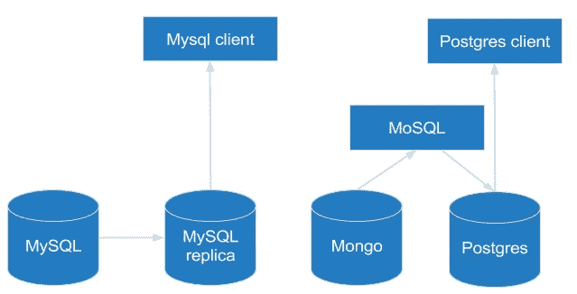
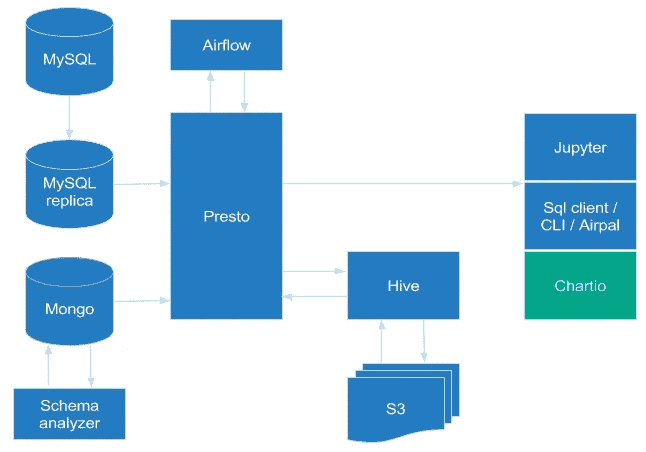
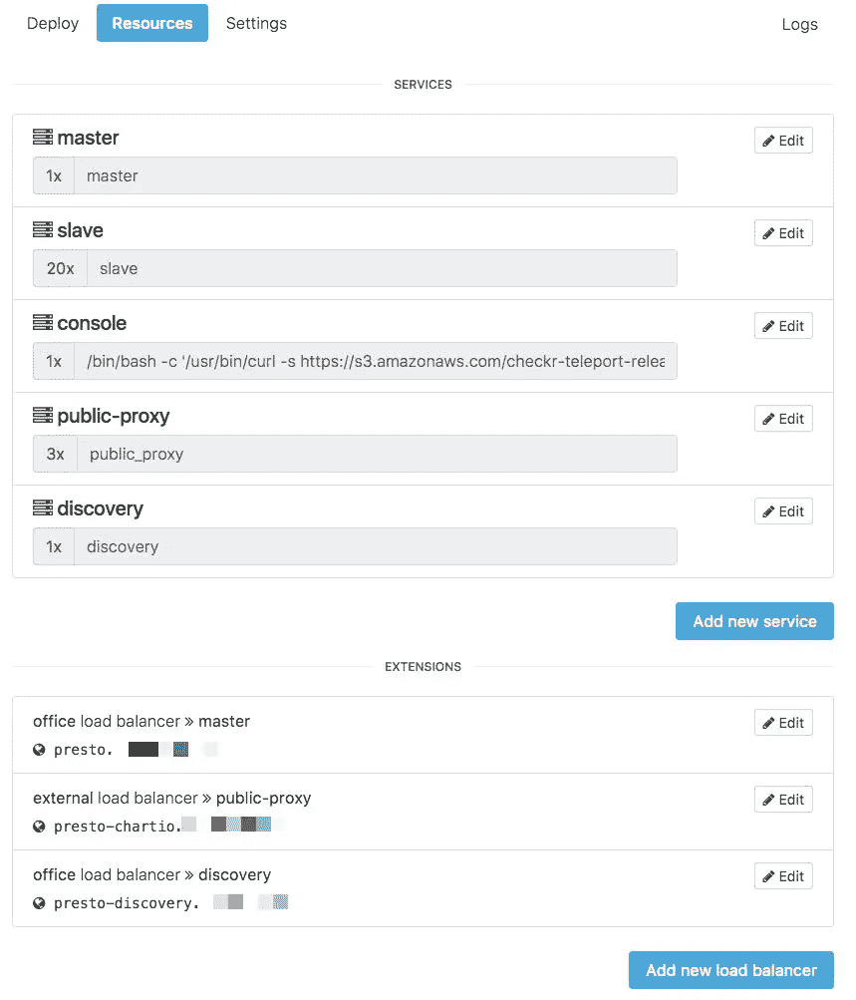
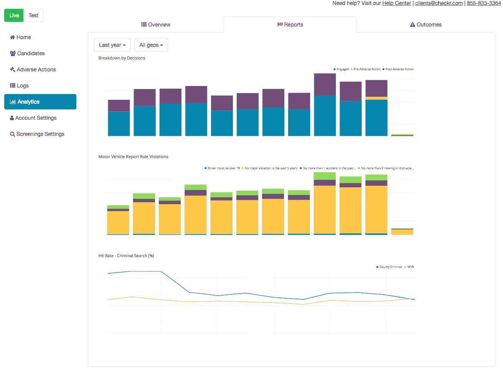
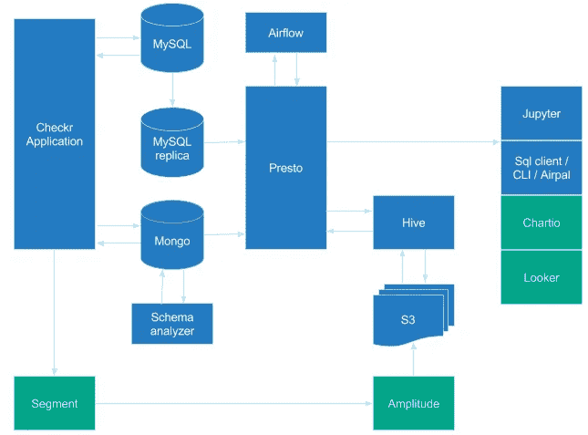

# 扩展技术堆栈:从 YC 到 1000 多万背景调查

> 原文：<https://medium.com/hackernoon/how-checkr-built-scalable-data-infrastructure-in-a-few-months-6b736b01bd23>

在迅速成为背景调查领域的卓越公司之一的过程中，[chekr](https://hackernoon.com/tagged/checkr)(YC S14)经历了稳定而惊人的增长。随着数量的增加，需要更好地了解运行背景检查的操作，进而需要可靠和可扩展的数据处理和存储。

因此，在 2017 年，我们开始大力推动数据基础设施的建设。这意味着什么取决于我们收到的内部和外部需求，我们确定如下:

## 1.提供面向客户的分析

许多企业客户非常关心背景调查的效率和准确性。由于这些客户中的许多人都在大量工作(有些人通过广泛使用 [Checkr API](https://docs.checkr.com/) ，像……
1)“我们的申请人的平均县记录周转时间是多少？”
2)“机动车举报不清最常见的原因是什么？”
3)“按类型划分的日常背景调查量是多少？”
…经常作为客户反馈出现。

## 2.指导产品决策

自 Checkr 成立之初，我们就幸运地找到了非常适合的产品/市场，这是一个非常适合我们的职位。例如，我们的[机动车记录检查](https://checkr.com/product/screenings/#driver-check)一直被认为设置简单，结果全面。然而，随着我们的申请人数量的增长，我们越来越迫切地需要监控申请人的行为，并轻松地做到这一点。对不同数据源的访问，无论是应用程序日志还是报表生命周期中的事件，都提供了一个构建系统运行状况和内部工作的更全面的画面的机会。

## 3.促进工程发展

在工程开发过程中，我们经常需要查询我们的生产数据来获取和验证记录。尽管如此，对我们的事务性存储进行查询在历史上一直很慢，而且会给我们的生产环境带来压力，并可能破坏其稳定性。

## 4.支持数据科学家和机器学习工程师

除了以上所述，展望未来，Checkr 和其他背景调查服务之间的一个关键区别是我们对自动化的热切关注，我们已经通过为名称匹配等任务建立定制的机器学习模型来部分实现这一点。减轻机器学习模型开发的负担——以及随之而来的下游运营负担——有助于减轻哪怕是最普通的任务，比如数据提取。

在这篇博文中，您将看到我们如何在短短几个月内建立稳定的数据基础设施来推动我们的增长。我们希望我们的见解能对面临类似大规模挑战的公司有所帮助。

一开始，我们实现了一些快速而肮脏的[工具](https://hackernoon.com/tagged/tools)来支持不频繁的数据查询。我们的解决方案绝对不是可扩展的，但它足以回答一些关键的业务问题。

在 Checkr，我们非常依赖 MySQL ( [亚马逊 RDS](https://aws.amazon.com/rds/) )和 MongoDB ( [Atlas](https://www.mongodb.com/cloud/atlas) )。我们使用 MySQL 存储易变的结构化数据，包括用户、报告和包，同时利用 MongoDB 存储较大或更静态的内容，如后处理的提供商结果或 webhook 日志。为了简单起见，我们不会详细讨论 Checkr 中一些不常用的存储。

Checkr data infrastructure at the end of 2016

为了满足查询生产数据的需求，我们创建了一个临时解决方案，如上图所示。对于我们的 MySQL 集群，我们使用复制，并允许客户端打开到副本集的直接连接。由于 MongoDB 是一个无模式的键值存储，我们通过 Stripe 在 [MoSQL](https://github.com/stripe/mosql) 之上构建了一个流服务，它跟踪 MongoDB 的操作日志，并将结果数据(由每个 Mongo 集合定义的模式映射)存储在 PostgreSQL 实例中。从那里，我们允许客户端打开到 PostgreSQL 实例的直接连接。这个简单的体系结构在特定的数据查询中为我们提供了很好的服务。然而，使用这种方法，有一些相当重要和关键的缺点:

*   跨店加盟从困难到不可能。由于一些数据驻留在 MySQL 中，而另一些数据驻留在 MongoDB 中，复杂的报表通常需要一个联邦查询，鉴于上述架构，这并不容易管理。
*   *MoSQL，mo '喜欢 mo '维护*。我们偶尔会遇到 MoSQL 稳定性问题，不得不启动进程来“赶上”和/或“重启”复制。如果上游集合中发生了任何变化，我们还需要更新流服务中定义的模式。因为 JSON 中有很多字段，所以用于分析的解析也很复杂。最后，随着 MongoDB 中嵌入式文档的广泛使用，看似简单的查询变得缓慢且难以编写。
*   毫不奇怪，构建复杂的逻辑来支持分析很快就失去了控制。

为了应对上述挑战，很明显，2017 年将是我们加倍投资数据基础设施的一年。

在几个月的时间里，我们建立了更强大、更稳定的数据基础设施。为了完成整个画面，我们需要:

*   联邦查询引擎
*   模式解决方案，可靠的数据存储
*   工作流引擎
*   数据分析工具

作为一家快速成长的初创公司，我们的工程资源有限，因此，在我们的设计决策中，我们通常倾向于采用已有的解决方案，无论是流行的 OSS 项目还是企业解决方案。作为微服务架构的早期采用者，它使这种过渡比最初预期的更容易。由于我们已经在简单快速地将新服务引入我们的生态系统方面进行了投资，我们可以灵活地熟练选择不同的组件，选择我们认为最适合每项工作的工具。

Checkr data infrastructure in mid 2017

对于数据基础架构的基础层，我们需要一个工具来将所有生产数据“缝合”在一起。解决方案可以是一个统一的数据库或一个能够访问各种生产数据源的联合查询引擎。鉴于我们最初需求的性质(即分析数据可能是潜在的)，我们同意首先采用传统的 ETL 方法，并专注于创建我们数据的稳定的批量快照。最后，我们选择了 [Presto](https://prestodb.io/) 作为我们的查询引擎，以提供对众多数据源的联邦访问，因为我们看到了几个优点:

*   Presto 非常快，更不用说在脸书、Airbnb、网飞等大规模使用了。鉴于我们的数据规模(数百千兆字节)，我们知道 Presto 可以处理我们在所有级别的使用。
*   Presto 不是一个数据库，这至少省去了我们维护另一个数据库的麻烦。
*   Presto 广泛支持不同的连接器，包括 MySQL、MongoDB 等等。
*   普雷斯托有一个著名的社区，并积极维护。

也就是说，我们确实遇到了一些连接器不兼容的问题。举个例子，有一次，我们需要为 MongoDB 连接器添加 SSL 支持。此后不久，对于 MySQL 连接器，我们发现必须引入将某些数据类型解析为 varchar 的能力。尽管我们遇到了一些问题，但是设置 Presto 非常简单，速度和可靠性远远超过了设置和运行我们的集群所面临的任何挑战。

其中一个主要原因是通过使用我们钟爱的部署工具 [Codeflow](https://github.com/checkr/codeflow) 。目前，我们的集群有 20 个节点，2 个 CPU 内核和 24G 内存，每个节点运行在 Kubernetes 的 [Docker 容器](https://www.docker.com/what-container)中。听起来很复杂，但是 Codeflow 使得所有这些都很容易定义和管理。

你可以从下面的[代码流](https://github.com/checkr/codeflow)中看到我们的 Presto 部署设置:

Presto deployment page on Codeflow

我们有意跳过了一些其他流行的数据基础设施解决方案，比如 Hadoop 或 Redshift。Hadoop 需要高水平的维护，由于我们目前并不关心 Pb 级的操作，它是不可行的。我们还选择了 Presto 而不是 Redshift，因为 a)我们认为它对于我们的用例来说是一个潜在的昂贵的解决方案，b)我们不想维护和更新我们的模式(在下一节中讨论)。

MongoDB 的伟大之处在于，它提供了一个无模式的解决方案来轻松存储不同的文档类型，同时还可以“开箱即用”地进行水平扩展，并且成本相对较低。尽管如此，它也为查询和执行数据分析带来了挑战，这两者都是数据仓库的障碍。由于存储模式是任何 ETL 过程的核心，为了成功提取数据，我们需要一个从 MongoDB 数据推断目标模式的过程。经过一些研究，我们最终实现了一个 MongoDB 模式分析器，构建在一个开源工具 [Variety](https://github.com/variety/variety) 之上。有了这个分析器，我们可以定期更新 PrestoDB 连接器使用的收集模式，几乎不需要维护成本。

有了一种将所有字段巧妙地映射到目标表模式的方法，我们就有了从 MongoDB 中提取数据的方法。然后，我们需要一种方法将数据加载到我们选择的数据仓库中。对于过程的这一部分，我们选择了 [Hive](https://cwiki.apache.org/confluence/display/Hive/Home) 和它的 metastore，部分原因是 Presto 本身支持它。鉴于 Hive 可以作为独立服务部署，无需任何 Hadoop 基础设施，使用 Hive connector，我们能够通过编写 Presto 查询从 MySQL 和 MongoDB 中高效地提取数据，并根据需要执行一些简单的数据转换，然后将处理后的数据输出到我们的数据仓库中。

Checkr 是一家基于云的公司，所以毫不奇怪，我们的许多数据都存储在云中，特别是在 AWS 上。因此，我们需要一种经济高效的方法来存储大块数据进行数据分析，而 [S3](http://s3.amazonaws.com/) 是显而易见的选择。虽然许多传统的数据仓库解决方案使用分布式文件系统，如 HDFS，我们的 Presto + Hive 方法与 S3 集成得特别好，因为

*   由于 Presto 在内存中处理所有数据操作，因此所需的磁盘“临时存储”是有限的。
*   因为我们为 Presto 集群配置了大量内存，所以由于大量数据被缓存，S3 的磁盘 IO 受到限制。

值得注意的是，这种方法也有局限性，因为 Presto 集群需要足够的内存来保存任何给定查询的所有数据。虽然有一些可行的优化方法——包括将数据分成单独的查询，但这些方法实现起来可能会很繁琐。通过在 S3 上保存数据，我们实现了高可靠性，并且能够以相对较低的成本保存多个快照。

有许多现有的调度引擎解决方案，包括[弹球](https://github.com/pinterest/pinball)和[路易吉](https://github.com/spotify/luigi)。我们决定选择[气流](http://pythonhosted.org/airflow/index.html)，因为它有一个活跃的社区，而且维护得很好。Airflow 附带了许多出色的功能，以下是我们特别喜欢的几个:

*   Presto 连接器。很容易设置连接到 Presto。由于我们已经用 Presto + Hive 整合了所有的数据存储，与 Presto 的连接意味着我们可以用 Airflow 查询任何数据。
*   易于创建操作符。Airflow 使用操作符来完成不同类型的任务，并且很容易编写自己的操作符。例如，我们实现了一个带有自定义条件检查和保留规则的 Presto 查询操作符。所有 presto 查询任务只需几行代码就可以重用该操作符。
*   监控和警报。借助 Airflow，您可以轻松地通过电子邮件、slack 或 pagerduty 创建工作流通知和警报。气流可以与您组织中现有的工程服务很好地集成。
*   气流也有 OAuth 支持。

我们将会有另一篇博文详细介绍我们如何在 Checkr 使用气流创建工作流，敬请关注！

有了所有的 ETL 部分，我们需要向数据科学家和分析师开放我们的数据集，这样我们就可以从中提取价值。

对于基本的查询需求，我们提供了对 SQL 客户机连接到 Presto 的支持。对于 Presto 没有内置的 OAuth 支持，所以我们必须创建自己的 LDAP 服务来启用 Presto 的身份验证。让认证 Presto 不仅是出于安全原因，也是为了监控组织内的使用和采用率。

对于更高级的数据用户，我们还创建了一个 [Jupyter](http://jupyter.org/) 笔记本服务。我们使用 S3 作为文件系统，使用开源的 [Jupyter S3 内容管理器](https://github.com/danielfrg/s3contents)。这使得在组织内共享分析变得更加容易，因为我们将所有笔记本电脑存储在同一个存储桶中。该插件还以被动的方式加载目录，因此即使所有文件都在 S3 上，笔记本文件浏览器的响应速度也相当快。我们还创建了代码回购同步工作流，以定期将 Github 回购加载到 S3。这使得笔记本更容易重用来自其他 repos 的逻辑。这些工作流程由气流控制，并按计划运行。有了 Jupyter，数据科学家可以通过他们的浏览器访问我们拥有的任何 repo 和任何数据集，这使它成为一个强大的分析工具。

正如前面提到的，构建这个基础设施的一个动机是为我们的客户提供分析。我们很幸运，身处一个有许多成熟分析提供商的世界。我们选择 [Chartio](https://chartio.com/) 作为我们的分析提供商，主要有以下原因:

*   易于设置。有拖放仪表板建筑。
*   良好的嵌入支持。自然适合我们面向客户的 web 应用程序。
*   能够为每个客户构建定制仪表板。
*   兼容 Presto。

简单的设置为我们节省了大量的开发时间。我们从客户那里得到了很多积极的反馈，并且能够快速迭代，因为我们的仪表板是高度可配置的。

值得一提的是，我们通过 Presto 直接支持面向客户的分析。这是一种非常规的方法，可能不是每个人都适用的解决方案。更传统的方法通常是使用 NoSQL 来预先计算可能的排列，以实现 O(1)查找，或者使用具有主动缓存和有限分段和过滤功能的关系数据库。我们可以直接使用 Presto，因为我们生成半预计算的数据集，并且我们在请求之前将大部分数据加载到内存中。我们确保支持分析的数据表只包含必要的列，由于目前我们的分析客户是雇主，我们不需要为数亿用户准备分析。

Checkr customer facing analytics

我们还致力于改进我们网站上的用户事件记录。除了使用 MongoDB 进行日志记录之外，我们还添加了更广泛的用户日志记录，将这些事件发送到[段](https://segment.com/)，与[振幅](https://amplitude.com/)等服务共享，以进行漏斗分析。在探索内部 BI 的同时，我们也连线了[的看客](https://looker.com/)等人。在这篇博客文章中，我们不会对这些整合进行过多的描述。

这就是 Checkr 截至目前的数据基础架构的全貌:

Full Checkr data infrastructure with external integrations

在过去的几个月里，Checkr 数据基础设施取得了长足的进步，我们已经开始看到我们的劳动带来的好处。现在，我们可以每天转储 S3 的生产数据，使用 Presto 进行快速查询，使用强大的分析工具，包括 Jupyter 和 Looker，以及应用漏斗分析。由于快速增长的开源社区和我们早期采用的微服务架构，我们能够在相对较短的时间内完成上面显示的所有主要组件。

此外，我们的开源部署框架 [Codeflow](https://github.com/checkr/codeflow) 大大加快了我们的开发进度(更多内容将在后面介绍！).

如果您也对在快速成长的初创公司构建数据基础设施感兴趣，请加入我们下一段旅程吧！我们在招人！

*鸣谢:Checkr 数据基础架构是与* [*库尔特·鲁佩尔*](https://www.linkedin.com/in/kurtruppel)*[*斯图尔特·帕克*](https://www.linkedin.com/in/hellojyp/?locale=en_US)*[*格雷斯·李*](https://www.linkedin.com/in/grace-lee-76b423106/)*[*凯文·伍兹*](https://www.linkedin.com/in/kevin-woods-bb314929/) *以及其他客户报告和资金团队合作构建的。*[*Kurt RUP pel*](https://www.linkedin.com/in/kurtruppel)和[*Michelle Berry*](https://www.linkedin.com/in/michelle-ariela-berry/)*对这篇文章进行了有价值的编辑。此外，公司的许多工程师和产品经理也提供了反馈。非常感谢所有参与这个项目的人！****

> **[最初发表于 Checkr 博客](/checkr/how-checkr-built-scalable-data-infrastructure-in-a-few-months-d8fe7b4fb5df)**

************

> **[黑客中午](http://bit.ly/Hackernoon)是黑客如何开始他们的下午。我们是 [@AMI](http://bit.ly/atAMIatAMI) 家庭的一员。我们现在[正在接受投稿](http://bit.ly/hackernoonsubmission)并乐意[讨论广告&赞助](mailto:partners@amipublications.com)机会。**
> 
> **如果你喜欢这个故事，我们推荐你阅读我们的[最新科技故事](http://bit.ly/hackernoonlatestt)和[趋势科技故事](https://hackernoon.com/trending)。直到下一次，不要把世界的现实想当然！**

****