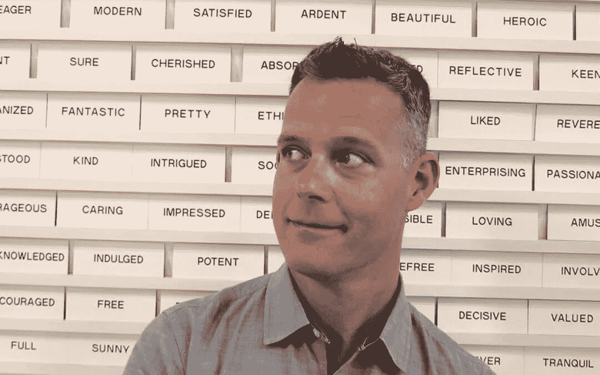

# 客户方的经验如何影响代理方的工作:与情感品牌创意总监的访谈

> 原文：<https://medium.com/hackernoon/how-client-side-experience-informs-agency-side-work-interview-with-emotive-brand-creative-director-b355318282da>

作为 Emotive Brand 的创意总监，斯科特将他的客户端体验运用到工作中。Skott 是创造有意义的解决方案以满足客户和顾客独特需求的专家，他提供了关于他在公司工作多年的想法，就像我们的许多客户告诉他的工作机构-sidetoday 一样。

# 是什么吸引你从事代理工作？

我总是试图把代理的方法带到我的客户体验中。我发现这种方法真正有效的地方是与品牌相关的项目。确定和定义一个组织背后的真正目的，然后在整个组织中开发和实施这些解决方案——这是我最有成就感的地方。我很高兴这是我现在的工作重点——帮助品牌更好地阐明是什么让它们与众不同。

# 你认为在内部创意团队工作对你目前的角色有什么帮助？

像 Emotive Brand 的许多客户一样，在技术品牌内部工作让我充分意识到这类组织面临的挑战。这些公司是由来自高绩效工程文化的聪明、坚定的人创建和推动的。他们有令人难以置信的远见，但通常，当他们试图向外界展示这种远见时，有些东西会坏掉。

阐明一个品牌的目的并不容易。你花了数年时间开发复杂的技术，解决棘手的问题，然后你把它推向市场，让它变得*简单*？对于陷入这种困境的创始人或领导者，我只能感同身受。这是一个矛盾，但最终“看看这有多难！”这个故事不会取悦客户或促进业务发展。

这就是为什么确保关键利益相关者——那些为他们的解决方案和产品付出劳动的人——在创意/想法过程中发挥作用如此重要。即使在早期阶段，这也是至关重要的。这必须是一个团队的努力。

# 在亲身经历了如今许多公司内部的挫折后，你认为一些代理机构遗漏了他们客户真正需要的是什么？

[最好的广告公司](https://clutch.co/agencies/branding/san-francisco)不只是帮你想出一个品牌战略或者给你一个视觉形象。他们实际上是在教育你，帮助你在品牌内部推销这种策略——从上到下。大多数代理机构会变得高度集中，担心向总是在桌边的人销售。但是，要想推广成功，还需要更多的人参与进来。对我来说，最突出的是那些在整个过程中帮助制定计划和销售计划的机构。

在客户端工作，你也会意识到内部改变是多么困难。你不能把没有宇航服的人扔进一个新的星球。你必须在旅途中带上它们。这就是拥有外部视角的价值所在。

# 你能多谈谈引入外部视角的价值吗？

公司内部经常发生的事情是，人们想出如何在公司内部把事情做好。“我知道如何让销售人员同意 x。我知道如何让产品同意 y。”过度关注内部，很容易忽略最重要的人:你的客户。听众不仅仅是你的部门主管或首席执行官，但是很容易陷入回音室，在那里这些人成为唯一重要的人。我相信，外部视角——基于合理策略的真正好的视角——可以粉碎这种类型的回音室。

# 你的内部经验是否让你与客户建立了更多的信任？

内部团队最大的好处是，没有人会像他们一样了解这个品牌，这一点即使是最好的广告公司也可能会忘记。这就是为什么你必须让他们成为这个过程的一部分。当一个内部团队感觉自己被命令而不是合作伙伴时，信任是不可能的。没有人开心。

尊重是关键。内部创意团队必须参与进来。也许他们已经试图解决机构正在试图解决的问题。也许没有人想到要问他们，他们正坐在一个伟大的想法。忽视他们是一个很大的错误。他们的才能、洞察力和知识是获得最佳解决方案不可或缺的。

# 这些天我们谈论了很多关于敏捷策略的话题。如今，敏捷性对客户的重要性是什么？

科技公司行动迅速。我们都知道。内部创意团队的行动速度甚至更快。这是一种去，去，去的心态。创意简报？求你了。就像发生过那样。在大多数情况下，你必须直接从想法到执行。在代理方工作，你有机会更深入地探索解决方案和方法。但是你也必须敏捷。公司相信你的能力，既能深入发展，又能快速行动，灵活应变，跟上业务发展的步伐。因此，我把对战略和研究的深入钻研与高绩效内部团队的疯狂速度结合起来，作为自己的经营原则。这就是今天客户所需要的。

Emotive Brand 是一家旧金山战略和设计机构。

*原载于 2017 年 6 月 15 日*[*【www.emotivebrand.com】*](https://www.emotivebrand.com/creative-director/)*。*

> [黑客中午](http://bit.ly/Hackernoon)是黑客如何开始他们的下午。我们是 [@AMI](http://bit.ly/atAMIatAMI) 家庭的一员。我们现在[接受投稿](http://bit.ly/hackernoonsubmission)，并乐意[讨论广告&赞助](mailto:partners@amipublications.com)机会。
> 
> 如果你喜欢这个故事，我们推荐你阅读我们的[最新科技故事](http://bit.ly/hackernoonlatestt)和[趋势科技故事](https://hackernoon.com/trending)。直到下一次，不要把世界的现实想当然！

