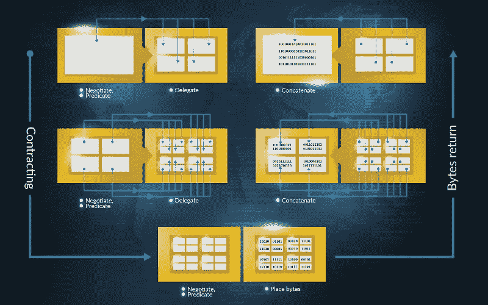
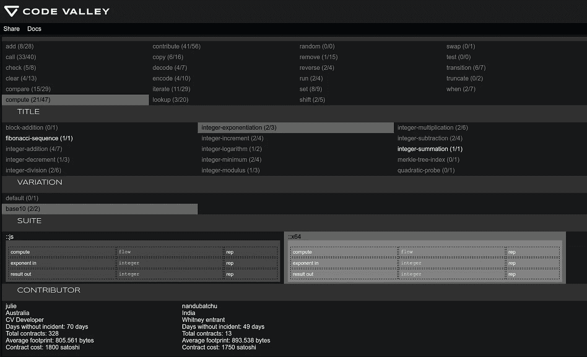
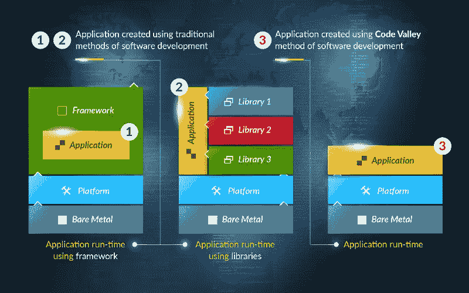

# 码谷如何取消技术债

> 原文：<https://medium.com/hackernoon/how-code-valley-cancels-technical-debt-da4bd28abe6f>

## 停止淹没在技术债务中，开始在比特币中游泳

[Code Valley](https://codevalley.com) 独特的生态系统——紧急编码，颠覆了关于软件创作的传统思维——在这个过程中，完全避开了每天困扰全球软件开发人员的大部分技术债务。

为了一窥紧急编码的潜力，请点击[这里](https://pilot.codevalley.com/)，或者如果你想更深入一点，请查看[的试点项目及其用户指南](https://marketplace.codevalley.com/use-it)。一些快速背景:Code Valley 是一个以比特币为燃料的生态系统，允许用户从浏览器 GUI 中构建软件元素和整个程序——在这个过程中，甚至在引擎盖下，都没有任何源代码。这些软件元素是分散的群体中的代理，准备好并等待构建程序。

当用户向生态系统支付比特币来构建他们的定制软件时，这些代理在幕后相互支付一小部分比特币，形成一个自发和临时的“蜂巢编译器”，输出所请求的二进制文件或其他可执行文件。用户现在已经有了想要的程序，开发人员都得到了报酬——每次在构建中使用他们的代理，每个开发人员都会得到报酬，这创造了真正的被动收入。我们称整个过程为“紧急编码”

Hive compiler forming

在一个新兴的编码未来，我们期待更少的握拳、诅咒和拔毛，以及更少的专门讲述当今程序员日常讽刺挫折的厚脸皮连环漫画。

开发者将如何从 Code Valley 生态系统提供的技术优势中受益？

“技术债务”是在(老实说:几乎所有的)软件项目中积累的东西，因为特性来了又去，错误隐藏了，各种开发人员喝了(又倒回)杯子里，范围膨胀了。这就是为什么“成熟软件”这个词会让程序员坐立不安，而不是放心。

与变通办法、绝望和逃避相反，Code Valley 用紧急编码的真正解决方案取消了技术债务，解放了开发人员，让他们专注于开发伟大的软件，而不是从一开始就修复应该正常工作的东西。

# 把复杂的狼人放到牧场去

每个开发者都喜欢一张白纸:一个充满可能性的世界！当您充实版本 1 时，代码库中的一切都变得整洁了。时间流逝；虫子突然出现；管理需要更多的功能。通过连续的版本维护代码库可能是一项艰巨的工作，即使有现代的源代码控制和一个伟大的团队。每当团队成员接触源代码时，另一组问题就有机会沿着抽象层向下蔓延，即使是最干净的代码库也是如此。

紧急编码让我们能够以完全独立的方式处理软件的每个元素。如果你想增加一个新的特性，你可以在顶层(应用层)设计它，通过定制的合同代理来满足他们各自的需求，并“编译”这些特性。所有抽象层都被封装到一个可扩展的系统中。由于没有代码库，因此意想不到的后果也少得多，Code Valley 巧妙地避开了软件复杂性陷阱。我们不需要再寻找银子弹了——狼人已经隐退到一个无害的小屋，再也不能打扰山谷中的居民了。

Emergent coding process

# 方桩，遇方孔

互操作性在网络上是一个巨大的挑战——在一般的软件中也是如此。除非它是定制的，以便在一些现有的系统或架构中工作，否则代码库是盲目的筒仓，就像巴别塔上的劳动者一样。曾经错过了编程语言或框架的特性，以至于中途转换，将发布日期推后了几个月？API 呢？许多项目花费了一半以上的时间来构建它们，以便它们可以相互交流。

Code Valley 永远不会有语言障碍，因为不兼容性在编译时已经明显消失了。任何东西都可以添加到任何项目中，因为每个项目都使用相同的设计系统，可以适应宇宙中的任何逻辑操作。当你需要给你的程序添加特性时，你很可能会找到已经可用的代理程序——*每一个设计从一开始就是可互操作的*。

Interface to the network

# 没人喜欢保养，所以不用麻烦了

QA 是一项艰巨的工作，尤其是对开发人员来说。公司雇佣不同的员工来做 bug 测试是有原因的:你对它应该如何工作知道得越少，你就越能客观地测试它。尽管如此，即使是专门的 QA 测试人员有时也会出错——随着代码库的增长，像错误修复和新特性这样的变化带来的连锁效应会成倍增加。这又是不必要的复杂性。

Code Valley 极大地简化了这一过程，最重要的是通过专业化。作为开发人员，您不仅不需要知道关于软件的一切，从而允许您专注于特定类型的软件元素，而且测试过程也变得更加透明。您在构建中使用的每一个代理都已经过单独测试——但是万一它不能正常工作，只需将其替换为满足相同需求的竞争对手之一，只不过更好。

Snapshot of Valley of agents

# 从运行时运行

依赖——构建软件的预制外部元素——可能会加快开发时间，但最终会造成严重破坏。当您的框架更新并且您需要那个 bugfix 或新特性时，您必须重新开始您的测试过程，因为这些变化会在您的整个项目中产生反响，级联到缺陷和漏洞中。即使你设法找到了一个永远保持静态的(无错误的)库，在其上构建你的程序本质上限制了你对特性范围的选择，把你束缚在一个特定的开发方法上，并且通过未使用的功能引入了膨胀。

Code Valley 有直接的*零*运行时依赖性——除了程序输出后要运行的操作系统(它最终也可以与紧急编码集成在一起)。

Application run-time

每一个涌现的二进制程序都是独立的，作为一个自包含的单元，只要你需要它，它就会发挥应有的作用。你也不会被一个笨重的代码库所束缚，这个代码库定义了你添加功能的可用选项:只需添加那些新代理，投入一点比特币，然后*构建*。

*结果是:如果你厌倦了从瀑布上跌落，被拥挤的人群压垮，在短跑中挣扎着喘口气，那就去看看紧急编码吧。*

在这里了解如何成为一名新兴的程序员，并开始试播[。](https://marketplace.codevalley.com/use-it/module0-step1)

> [黑客中午](http://bit.ly/Hackernoon)是黑客如何开始他们的下午。我们是 [@AMI](http://bit.ly/atAMIatAMI) 家庭的一员。我们现在[接受投稿](http://bit.ly/hackernoonsubmission)并乐意[讨论广告&赞助](mailto:partners@amipublications.com)机会。
> 
> 如果你喜欢这个故事，我们推荐你阅读我们的[最新科技故事](http://bit.ly/hackernoonlatestt)和[趋势科技故事](https://hackernoon.com/trending)。直到下一次，不要把世界的现实想当然！

