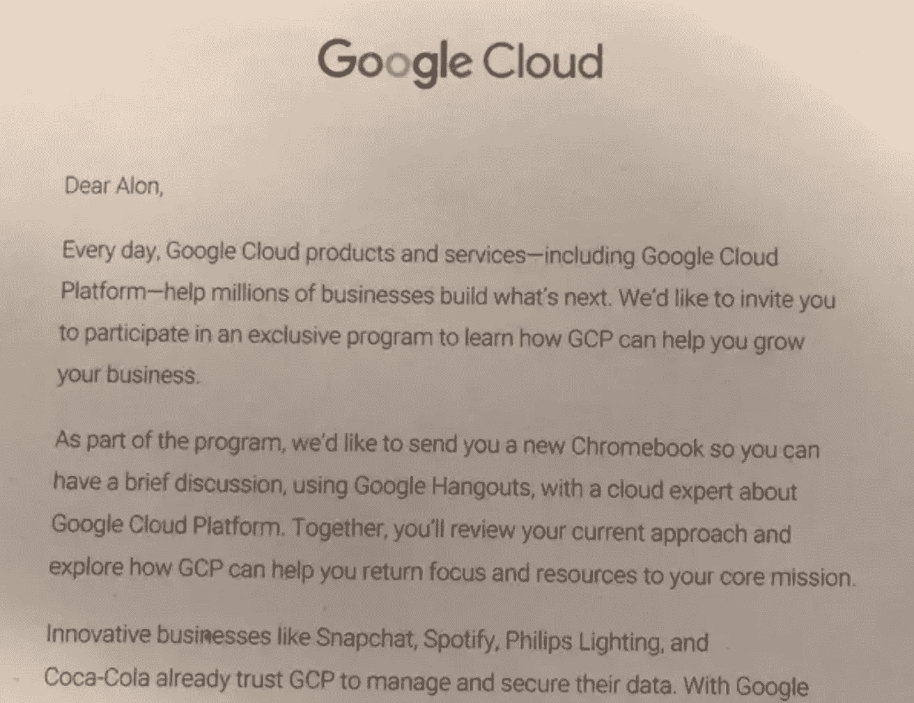

# 亚马逊和谷歌的竞争力如何？

> 原文：<https://medium.com/hackernoon/how-competitive-are-amazon-and-google-e8457acb46f4>

> 谷歌前集团产品经理阿龙·阿米特。[原载](https://www.quora.com/To-what-extent-are-Amazon-and-Google-competitors/answer/Alon-Amit)于 [Quora](http://quora.com?ref=hackernoon) 。

## **云服务**

亚马逊网络服务和谷歌云处于直接且相当激烈的竞争中。

我刚刚从谷歌获得了一个免费的 Chromebook，因为我同意与他们的云代表讨论转换问题(老实说，我们并不是一年来没有权衡转换的利弊，但是嘿，一个免费的 Chromebook)。

为了解释这项业务有多么重要，考虑一下亚马逊在 2017 年第三季度从 AWS 获得了 45 亿美元的收入[【1】](https://www.quora.com/To-what-extent-are-Amazon-and-Google-competitors/answer/Alon-Amit#nSgjm)，这是其总收入的重要但很小的 10%部分。然而，这 45 亿美元也产生了超过 100 亿美元 1B 的营业收入，而不是整个营业利润的三分之一。利润率显然比亚马逊的其他业务高得多。

谷歌在这个领域仍然是一个较小的参与者，但他们正在大力投资。它发展得很快，而且正合他们的胃口。

## **搜索广告**

谷歌显然在网络搜索市场占据主导地位，而亚马逊在这个领域并不是任何直接的竞争对手。然而，当人们搜索一个新的剃须刀或割草机或洗发水或诸如此类的东西时，他们可以在谷歌上搜索——或者他们可以直接在亚马逊上搜索。

无论哪种情况，品牌和制造商都希望他们的*产品出现在高处，这要么是自然发生的(因为搜索引擎认为你的页面是最相关的页面之一)，要么是因为你同意为点击付费并显示你的广告，标记为广告(再次取决于引擎的决定，这次是广告)。*

在复杂性和灵活性方面，亚马逊当然落后于 AdWords，但它们有一个非常好的优势:广告点击可能会导致一个页面，然后直接导致亚马逊上的销售，亚马逊可以记录并归因于广告。谷歌不得不更加努力地获取点击之后发生了什么的信息，但往往根本做不到。

许多品牌，包括一些非常大的品牌，越来越多地使用亚马逊搜索营销，其中一些营销费用可能会以牺牲更传统的搜索引擎营销为代价。

## **智能家居**

Amazon Echo 和 Google Home 正在直接竞争在你家里回应你的声音的特权。这是一个相当新的市场[【3】](https://www.quora.com/To-what-extent-are-Amazon-and-Google-competitors/answer/Alon-Amit#VnJwk)，但两家公司显然都非常重视它。预计今年美国约有 6000 万人每月至少使用一次这样的设备。

## **购物和送货**

亚马逊对购物和送货上门的专注无需介绍。在美国的一些地区，谷歌快递可以为你在好市多、塔吉特或沃尔玛购物，并送货上门。我个人的印象是，这对谷歌来说不是一项可行的长期业务，但我可能错了。无论如何，这显然是竞争。

## **订阅视频点播**

2016 年，免费了十多年的 YouTube 进入了付费、无广告、原创内容的领域，YouTube Red[【5】](https://www.quora.com/To-what-extent-are-Amazon-and-Google-competitors/answer/Alon-Amit#SfmlP)。每月 12.99 美元，你就可以从 YouTube 上获得免费音乐、离线视频和原创作品。

作为支持广告收入的免费产品，YouTube 一直非常成功。红色版本更具雏形，与标准 YouTube 的广告收入相比，其收入仍然非常少，时间会证明它是否会增长以及增长速度有多快。

亚马逊这边的竞争对手是亚马逊 Prime Video[【6】](https://www.quora.com/To-what-extent-are-Amazon-and-Google-competitors/answer/Alon-Amit#luRfQ)，它搭载了广受欢迎的亚马逊 Prime 订阅。这两家公司显然都在与网飞和 Hulu 进行直接竞争，而这正是这两家公司的主要业务。TechCrunch 今年早些时候报道了一些关于市场份额的数据:网飞领先，YouTube 紧随其后，然后是亚马逊。

最后，我想起了我在 2004 年左右读过的一些东西(抱歉，我想不起在哪里了)。这是对比尔·盖茨的采访，当时他仍是世界领先的高科技公司微软的总裁。他被问及谷歌作为竞争对手的情况。

盖茨没有像级别较低的领导人那样对他们不屑一顾，而是回应说谷歌是一个明确而直接的竞争对手，甚至是一个威胁——不是因为他们做搜索，而是因为他们是一家软件公司。盖茨发现了谷歌在软件工程师中的突出地位，并正确地认识到他们对他自己的公司构成了威胁，该公司领导了软件世界几十年。他的担心是正确的。

公司之间的竞争不仅仅局限于特定的产品。他们在整体领导力、知名度、品牌价值和招聘方面展开竞争。在所有这些方面，亚马逊和谷歌(以及脸书和苹果)目前都处于直接竞争之中。

> 脚注
> 
> [亚马逊云收入飙升 42%，超过分析师预期](https://www.cnbc.com/2017/10/26/aws-earnings-and-revenue-q3-2017.html)
> 
> 新数据显示亚马逊正在蚕食谷歌的地盘，而且只会变得更糟
> 
> [【3】](https://www.quora.com/To-what-extent-are-Amazon-and-Google-competitors/answer/Alon-Amit#cite-VnJwk)[亚马逊 Echo 在谷歌主页上遥遥领先——而且这种领先还在增长](https://qz.com/1093475/smart-home-market-share-amazon-echo-amzn-has-a-huge-lead-on-google-home-googl/)
> 
> [【4】](https://www.quora.com/To-what-extent-are-Amazon-and-Google-competitors/answer/Alon-Amit#cite-kbBIH)[谷歌快递—维基百科](https://en.m.wikipedia.org/wiki/Google_Express)
> 
> [【5】](https://www.quora.com/To-what-extent-are-Amazon-and-Google-competitors/answer/Alon-Amit#cite-SfmlP)[YouTube 红——YouTube](http://www.youtube.com/red)
> 
> [【6】](https://www.quora.com/To-what-extent-are-Amazon-and-Google-competitors/answer/Alon-Amit#cite-luRfQ)[亚马逊网站:Prime 视频:亚马逊视频](https://www.amazon.com/Prime-Video/b?node=2676882011)
> 
> [网飞拥有 75%的美国流媒体服务观众，但 YouTube 正在迎头赶上](https://techcrunch.com/2017/04/10/netflix-reaches-75-of-u-s-streaming-service-viewers-but-youtube-is-catching-up/)

## 由谷歌前集团产品经理 Alon Amit 撰写。[最初发布于](https://www.quora.com/To-what-extent-are-Amazon-and-Google-competitors/answer/Alon-Amit) [Quora](http://quora.com?ref=hackernoon) 上的。

## 更多来自 Quora[的趋势科技答案，请访问](https://medium.com/u/3853f85f7d5e?source=post_page-----e8457acb46f4--------------------------------)[HackerNoon.com/Quora](https://hackernoon.com/quora/home)。