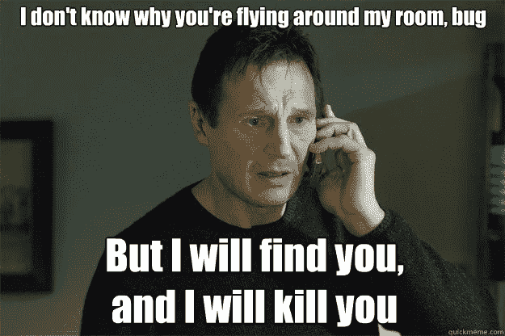
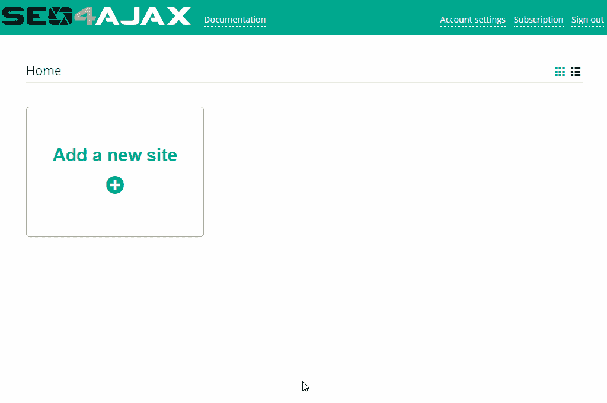

# 您对{{ site.url }}网站没有 JS 错误有多大把握？

> 原文：<https://medium.com/hackernoon/how-confident-are-you-that-site-url-website-has-no-js-errors-5e2115ab753a>

如今，网站越来越依赖 JavaScript 来实现完整的功能。JavaScript 错误会极大地影响最终用户体验。在这些错误影响到您的最终用户之前，检测并修复它们是非常重要的。绝大多数的[工具](https://hackernoon.com/tagged/tools)，如果不是全部的话，都有助于通过真实的用户监控来发现 JavaScript 错误。这种工具并不是灵丹妙药。例如，由于广告拦截器或代理等扩展，它们可能会触发大量的误报。此外，这些服务打破了“永远不要相信客户”的规则。

通过在受控和安全的环境中爬行和检测 JavaScript 错误， [SEO4Ajax](https://www.seo4ajax.com/) 提供了一个可靠的替代方案。事实上，它是唯一一个能够抓取基于 JavaScript 的网站并通过使用最新的 Chrome 浏览器产生这种错误的 SaaS。

很简单，没什么需要安装的！在 SEO4Ajax 上注册并抓取您的站点，然后只需查看 SEO 报告来识别有 JavaScript 错误的页面。

Demo showing the JS errors report

像任何其他 SEO 工具一样，SEO4ajax 也会报告断开的链接、重复、字数少或缺少 hreflang 标签的页面。请随时联系我们获得免费试用，并开始检测您的 JavaScript 错误！

SEO4Ajax 团队
[https://www.seo4ajax.com](https://www.seo4ajax.com)

> [黑客中午](http://bit.ly/Hackernoon)是黑客如何开始他们的下午。我们是这个家庭的一员。我们现在[接受投稿](http://bit.ly/hackernoonsubmission)并乐意[讨论广告&赞助](mailto:partners@amipublications.com)机会。
> 
> 如果你喜欢这个故事，我们推荐你阅读我们的[最新科技故事](http://bit.ly/hackernoonlatestt)和[趋势科技故事](https://hackernoon.com/trending)。直到下一次，不要把世界的现实想当然！

