# 在一个个性化的世界中:cookies 如何使您的性能测试更加可靠

> 原文：<https://medium.com/hackernoon/how-cookies-make-your-performance-tests-more-reliable-57accc9a8327>

“预热”您的测试工具，获得更好的性能测试。下面是我们如何用 WebPageTest 实现的。


Did I manage to find a photo of both a computer, a graph and some cookies? You bet I did. (Where? [At Pexels](https://www.pexels.com/photo/beverage-black-coffee-business-chart-33972/))

*我在 Ekstra Bladet Udvikling/Development 的部分工作是监控丹麦最大、最繁忙的网站之一的网站性能。*

*当你测试和衡量一个网站的性能时，重要的是你的工具看起来尽可能真实的用户体验。利用我们目前在 Ekstra Bladet 开发中使用的性能工具，这是可能的，但是需要做一些小改动。阅读这是如何可能的，你可以做些什么来开始。*

# 🕐挑战

性能是影响用户体验的一个重要因素。如果你有一个网站(比如 ekstrabladet.dk)包含大量的**广告**，这些广告都会对技术性能产生影响，那么这一点尤其正确。

回到 2016 年 7 月，我用业绩总结了我们的工作，并在媒体 here 上发表了 [*【你的广告业绩就是你的业绩】*](/@larskjensen/your-ads-performance-is-your-performance-bcf7f3657a9f) 。在这里，我写了我们的表现在多大程度上受到我们无法控制的技术的影响。

除此之外，广告技术也发生了很多变化，ekstrabladet.dk 也不例外。广告客户越来越喜欢接触他们希望能接受他们信息的用户。他们通过使用一系列承诺提供帮助的技术合作伙伴来做到这一点，他们试图根据用户的 cookies 等来匹配内容。

当从广告商到用户的价值链中发生了如此多的事情时，似乎奇怪的是**的表现仍然被广泛地通过将一堆 URL 扔进一个工具**来衡量，该工具然后访问并衡量它们——然后向我们展示结果。许多广告(以及将它们与用户匹配的技术)依赖于 cookie，而“冷浏览器”像性能工具中的那些没有 cookie。

因此，如果你能**“预热”测试浏览器，从而使它对网站上的各种技术和广告更有吸引力，这将是非常好的，但只有在有目标时才会出现。**

# 🕑这个概念

不久前，我读了一篇文章(很遗憾，尽管我尝试了很多次，还是找不到它……否则我会链接到它),其中一个性能工具背后的公司提出了一个解决方案。他们让他们的工具**访问一系列 URL 地址，然后才访问实际性能测试发生的 URL**。

这样做的好处是，测试浏览器建立了一个 cookie 配置文件(从它访问过的地方),这突然让各种个性化技术变得更有趣。

在文章中，该公司讲述了新的测量方法如何显示一个网站实际上比他们想象的更慢**。这意味着，对于真实用户来说，加载网站所花的时间比很多人在测试性能时信任的冷测试浏览器要长。**

# 🕒工具

我决定用 ekstrabladet.dk 进行同样的实验。从某种意义上说，我们用于性能测试的工具已经可以做到这一点。

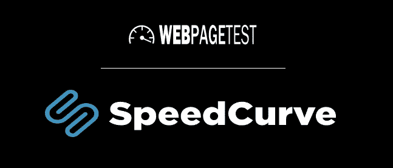

WebPageTest is (part of) the beating heart in SpeedCurve.

我们**使用**[**speed curve**](https://speedcurve.com/')**进行持续的性能测试**，而我们使用[**web page test**](https://www.webpagetest.org/')**进行我们的“临时”(不时)测试**。SpeedCurve 是建立在 WebPageTest 之上的，所以实际上我们只使用了一个工具。我在 WebPageTest 中使用的**脚本类型**(稍后我将回到这一点)在我们拥有的企业版 SpeedCurve 中得到支持。万岁。

根据 SpeedCurve 的 Steve Souders 的推荐，我决定在一些手动的 WebPageTest 测试中对其进行测试。我想在本文中与你分享的就是这些测试的结果。

# 🕓设置

## 🕔找到网址

第一步是获取一些我可以让 WebPageTest 访问的好的 URL 来预热测试浏览器。我和销售/后勤/AdOps 团队的一些同事聊过，他们给了我**以下地址，他们认为这些地址可能会很有趣**:

*   [http://superbrugsen.dk/tilbudsavis/](http://superbrugsen.dk/tilbudsavis/)
*   [https://www.alka.dk/bilforsikring](https://www.alka.dk/bilforsikring)
*   [http://www.nykredit.dk/dit-liv/bolig/ny-bolig](http://www.nykredit.dk/dit-liv/bolig/ny-bolig)
*   [https://danskespil.dk/oddset?intcmp=top_menu_oddset_brand](https://danskespil.dk/oddset?intcmp=top_menu_oddset_brand)
*   [http://www . circlek . DK/DK _ DK/pg 1334082175653/privat/extra club . html](http://www.circlek.dk/dk_DK/pg1334082175653/privat/extraClub.html)

这里我们使用的是有限元 URL。可能是因为我要求的是“一把”——所以数字 5 在这个上下文中没有意义。

## 🕕写剧本

现在我们希望 WebPageTest 在访问我们想要测量的 ekstrabladet.dk 上的文章之前访问这些 URL。这里我们使用内置于 WebPageTest 中的脚本接口**。**

幸运的是[脚本是 WebPageTest 文档的一部分](https://sites.google.com/a/webpagetest.org/docs/using-webpagetest/scripting)，所以很容易上手。

在文档页面上，您可以找到以下示例:

```
logData    0

// put any urls you want to navigate
navigate    www.aol.com
navigate    news.aol.com

logData    1

// this step will get recorded
navigate    news.aol.com/world
```

WebPageTest 脚本的工作方式是发出各种命令(在本例中为“navigate”和“logData”)以及一个或多个参数(在本例中为 0/1 或 URL)。这些 to 必须是由制表符分隔的**。记住这一点很重要。**

上面的例子从访问“www.aol.com”开始，然后转到“news.aol.com”。但是因为测试浏览器被指示不保存性能测试的任何数据(“logData”被设置为 0)，所以可以说它不做任何笔记。

但是，当它导航到“news.aol.com/world”时，它会这样做，因为“logData”被设置为 1。其实挺符合逻辑的。

在这种情况下，它可以用来衡量我所说的“缓存成功”。也就是说，当用户以前使用相同的资源(图片、CSS、JS 文件等)访问过另一个页面时，这个页面加载起来有多容易/多快。).**这也可以通过访问同一个 URL 两次**并仅保存上次访问的性能测试来衡量。

我们可以使用这个函数来实现我们想要的目标。不是因为我们想衡量缓存的优势(这五个广告商网站可能不与 ekstrabladet.dk 共享资源)，而是因为**页面上加载的数据/信息隐藏在浏览器缓存中，并作为 cookie**。

如果我们想要编写一个脚本来访问这五个 URL，然后在 ekstrabladet.dk 的 frontpage 上进行性能测试，它看起来会像这样:

```
logData 0
navigate http://superbrugsen.dk/tilbudsavis/
navigate https://www.alka.dk/bilforsikring
navigate http://www.nykredit.dk/dit-liv/bolig/ny-bolig
navigate https://danskespil.dk/oddset?intcmp=top_menu_oddset_brand
navigate http://www.circlek.dk/dk_DK/pg1334082175653/privat/extraClub.html
logData 1
navigate http://ekstrabladet.dk
```

如果你需要脚本的复制粘贴版本，我已经把它上传为一个. txt 文件😉

## 🕖定义您的测量范围

对于这些测试，我选择关注**文章**的性能。到目前为止，我们的许多表现工作都集中在首页，但我们目前正在我们的网站上推出一种新的文章设计——我们工作方式的一部分是**“移动优先”**，所以看看文章的移动版是有意义的。因此，我让 WebPageTest 模拟 iPhone 6。

我选择使用位于爱尔兰的 WebPageTest 服务器。还有一些离丹麦很近的，比如德国——但是我已经在爱尔兰用了很长时间了，所以为了比较起见，我还是坚持用那个。

请注意，当你从另一个国家或遥远的地方测试/测量性能时，你**不应该过于依赖实际值**。9 秒的加载时间不一定是 9 秒，因为爱尔兰的一些测试是这样说的。另一方面，**你信任可比的测量/测试**。就像，如果你在你的网站上偶然发现了一些东西，加载时间从 10 到 5 仍然减少了一半，当然，只要之前/之后的测试是在相同的位置以相同的方式进行的。类似的测试正是我们想要做的。

我决定在我们的娱乐版(“闪电侠！”)，因为它是具有新闻设计和附带功能的部分之一。

我测试了 10 篇文章。发布和测试的时间都分散在几天内:

1.  [*Ingen skilsmissekommentarer fra Aqua-Lene*](http://ekstrabladet.dk/flash/dkkendte/ingen-skilsmissekommentarer-fra-aqua-lene/6690431)
2.  [*Dansk grandprixvinder er blevet gift*](http://ekstrabladet.dk/flash/dkkendte/dansk-grandprixvinder-er-blevet-gift/6696197)
3.  [*线包:Derfor flyttede jeg hjemmefra*](http://ekstrabladet.dk/flash/dkkendte/line-baun-derfor-flyttede-jeg-hjemmefra/6696409)
4.  [](http://ekstrabladet.dk/flash/kongelige/danskekongelige/dronningen-om-sin-barndom-en-saetning-foragtede-jeg/6698598)

6.  *[*在脸书战斗之后:—杰格·福勒·米格·索姆恩·贝斯基德*](http://ekstrabladet.dk/flash/dkkendte/efter-facebook-fight-jeg-foeler-mig-som-en-beskidt-luder/6704016)*
7.  *[](http://ekstrabladet.dk/flash/udlandkendte/her-er-verdens-bedst-betalte-kendis/6704970)*
8.  **[**](http://ekstrabladet.dk/flash/dkkendte/smukke-helenas-hund-passer-paa-missen/6705222)**
9.  ***[](http://ekstrabladet.dk/flash/dkkendte/aerlig-line-baun-om-sit-livs-kiks-jeg-ville-da-oenske-jeg-aldrig-havde-sagt-det/6705508)***
10.  ***[*rlig Mascha Vang:s Dan p virker terror en MIG*](http://ekstrabladet.dk/flash/dkkendte/aerlig-mascha-vang-saadan-paavirker-terroren-mig/6705231)***

## **🕗记住一般的网页测试技巧**

**当您在包含第三方内容/技术的网站上使用 WebPageTest 时，将所有内容纳入测试负载中是非常重要的。**一些技术提供商会隐藏广告，例如，如果他们可以看到这是一个测试浏览器**，以便浪费宝贵的广告显示在机器上。因此，检查“高级设置”中的“高级”中的“保留原始用户代理字符串”设置非常重要:**

**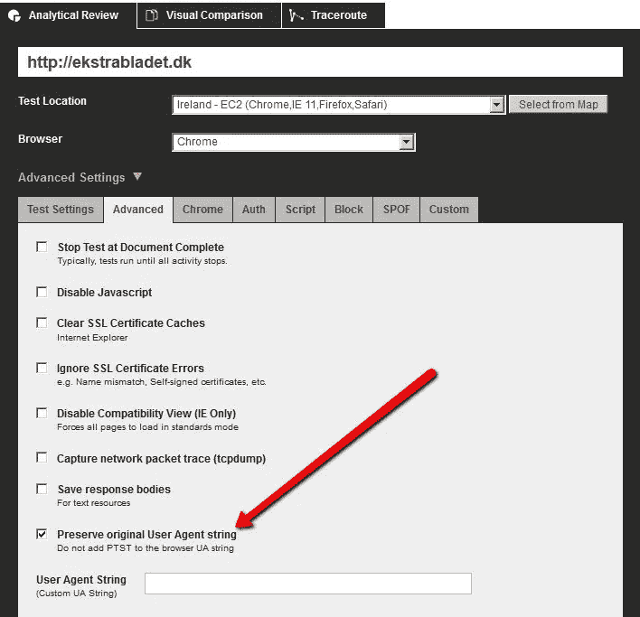**

**‘PTST’ is the WebPageTest test browser’s way of identifying itself as a test browser. This can cause some issues so I always check this box ↑**

**你还应该在 YouTube 上观看[***【Velocity 2014—web page test Power Users—Part 1】***](https://www.youtube.com/watch?v=6UeRMMI_IzI)*。这是谷歌 Chrome 团队的 Patrick Meenan 在 2014 年性能会议“Velocity”上所做报告的第一部分。***

***除此之外，他建议你**运行奇数次**，因为网页测试通过选择中间的一次来挑选最好的一次。他还强调你已经运行了不止一次，因为第一次运行会预热 DNS 缓存、服务器、数据库等。***

***我选择在测试中运行五次。除此之外，我将每个测试运行 10 次(意味着总共运行 50 次),然后收集到一个电子表格中，求出平均值。***

# ***🕘结果呢***

***如果我们没有相同的数据来看，一切都会变得有点抽象。因此，我把我的电子表格上传到了谷歌文档，这样你就可以看看了。在那里你还可以找到我用过的所有网页测试的链接。***

***这些测试/测量没有秘密可言。大家可以用 WebPageTest 来衡量 ekstrabladet.dk 文章的表现。我只是复制了结果(并转换了数字格式)，计算了平均值，并在有和没有五个 URL 的测试中进行了比较。就是这样。***

***→ [你可以在这里看到电子表格](https://docs.google.com/spreadsheets/d/13TLpPhZCEbvJQOQkgyry26b92C3aGic3QjtPMo2e2z0/edit?usp=sharing)***

***当然，最有趣的是比较，所以它们在这里。原谅我只是从 Excel 中粘贴截图——我只是不想花半天时间将数据粘贴到 HTML 表格中(注意:“Ny”在丹麦语中是“New”的意思):***

***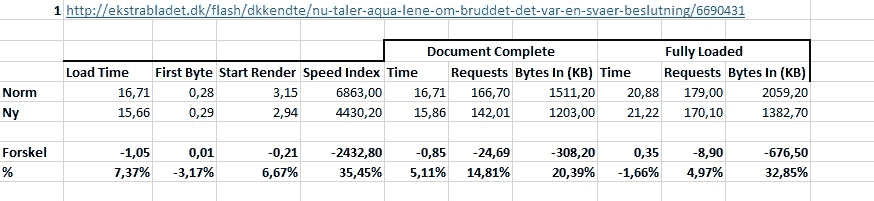******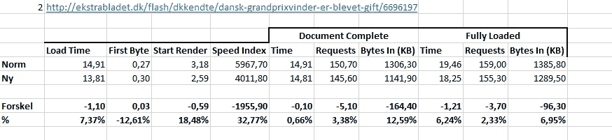************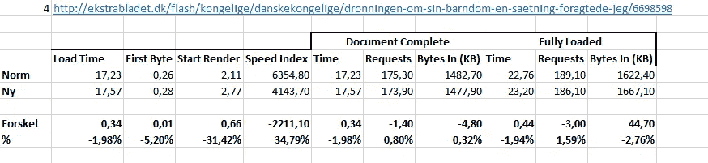******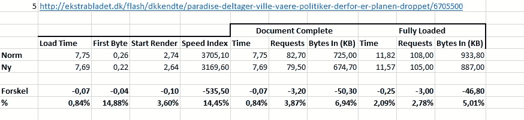******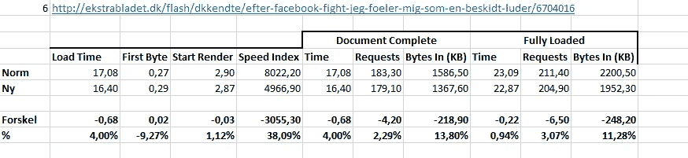******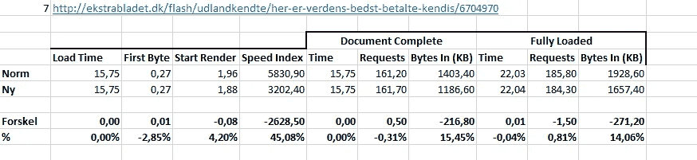******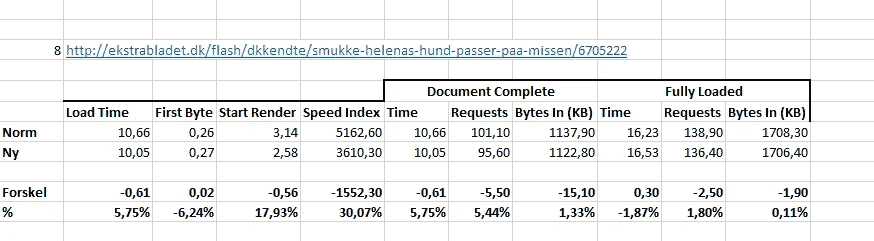******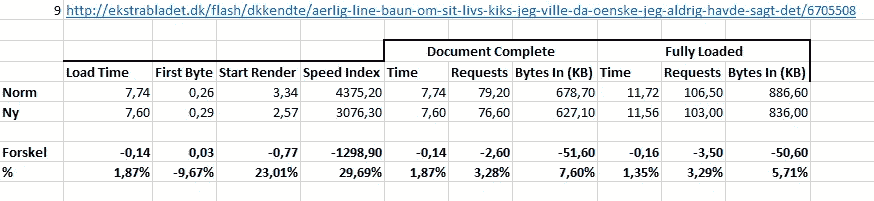******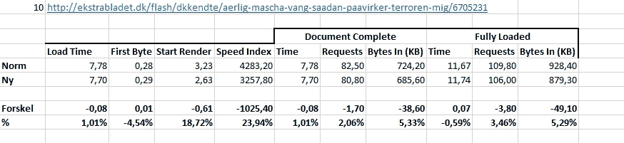***

***快速浏览一下数字**速度指数值就是动作所在的位置**。速度指数是(除了[被记录](https://sites.google.com/a/webpagetest.org/docs/using-webpagetest/metrics/speed-index') ) **第一个视口准备好**有多快的一个表达。换句话说，这是一种试图衡量**感知表现**——或者至少是大部分感知表现的尝试。***

***为了对结果有一个更全面的印象，我们可以看看平均增长百分比。请注意，这实际上是不可行的，因为文章之间可能会有很大的差异(毕竟只有 10 篇文章)，但它可以提供一个更广阔的视角，也许有助于确定某些趋势:***

***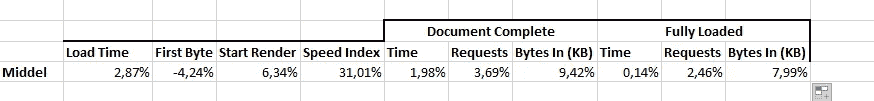***

***This clearly shows that especially Speed Index is improved by including the five URLs.***

***这里我们可以看到速度指数增加了 30 %,这是非常显著的。***

***这张图(可能获得“世界最丑图”提名)说明了速度指数的下降；这些物品按颜色配对:***

***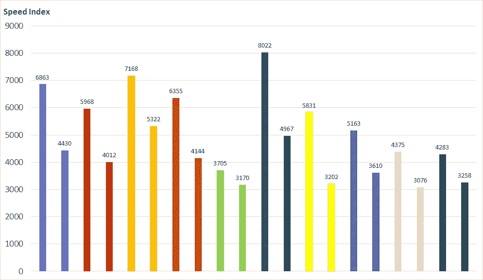***

***Speed Index for the 10 different articles, with and without the new URLs in the test tool.***

# ***🕙结论***

***尽管其他值实际上没有受到影响**，但是当测试工具(WebPageTest)在访问 ekstrabladet.dk 文章之前已经访问了五个 URL 并构建了一个 cookie 配置文件(诚然相当糟糕)时，第一个视图/视口看起来确实要快得多。*****

***因此，这对于 ekstrabladet.dk 的用户体验来说并不意味着什么，就像我们不需要在这个发现之后改变我们网站上的任何东西一样。***

***然而它仍然很重要。**这表明我们的网站可能比我们的工具显示的**对我们的用户表现得更好(至少在速度指数方面)**；因为带有 cookies 配置文件的测试浏览器更类似于真实用户。*****

***因此，我们需要考虑改变性能测试和测量的设置；我一会儿会回到这个话题。***

***同时，有趣的是，文章的加载时间只有很小的变化。**对于用户来说，文章本身并没有加载得更快**(或者，老实说，测试浏览器)，但是第一个视窗准备得要快得多。这可能表明一些元素/请求正在以另一种顺序获取，因此页面上的顶部元素首先被加载——从性能角度来看，这很有意义。***

***我也发现有趣的是，我们看到的**与我所期待的**完全相反。我以为我们会和我再也找不到的文章中的人有同样的发现；对于真实用户来说，我们的网站实际上比测试工具慢。***

***相反，我们看到，当我们开始模仿真实的浏览器行为时，至少速度指标得到了提高。这是个好消息(尽管对于其他或者更多的 URL 来说可能是相反的情况)——但是我怎么会这样呢？***

# ***🕚为什么(也许)——以及未来***

***这些测试(即使有大量的运行)没有揭示为什么测试中的文章在测试浏览器配备了 cookies 的情况下具有更好的感知性能。***

***我与我们 BackOffice/AdOps 团队的一位同事分享了一个理论，即**对于各种技术来说，配置文件正变得越来越“有吸引力”**。毕竟，许多广告都试图通过使用像 cookies 这样的东西来获得正确的用户，所以结论就在我们面前。***

***现在我们需要挖掘它，并找出这是一个二元状态(其中最大的区别在于“cookie”/“无 cookie”)还是一个渐进的事情，如果我们有 25 个 URL 而不是 5 个，我们可能会看到更好的性能。***

***当然，这可能是 WebPageTest 中的一个小故障。由于某种原因，当测试浏览器在本文之前访问过其他站点时，它在加载第一个视窗时会变得更快。我不这么认为——但在这种情况下，它不会改变事实，即我们用来衡量和测试性能的工具存在某些不确定性。***

***通过这 10 篇文章，我们看到了速度指数的下降。**下一次可能会有所不同** —例如，我刚刚做了一个控制测试，来自同一部分的另一篇文章；这里速度指数下降了大约 20 %,而加载时间下降了超过 10%。***

*****那么，现在会发生什么？首先，我们需要做更多的测试。*****

***正如我上面提到的，我们需要在性能测试之前找出被访问的 URL 数量是否有差异。这不是我们可以在网站上使用的东西——但是我们可以用它来构建更好的性能测试和测量。***

***当用户体验像现在这样动态的时候，我们的性能测试尽可能地接近真实的浏览器访问是非常重要的。***

***我也想做测试，广告(和类似的第三方技术)被排除在外。我的论点是，速度指数的差异将会消失——但这需要通过测试来证实/排除。***

*****当我们找到可能的最佳设置时，我们需要更改 SpeedCurve** 中的设置，我们用它来进行持续的性能测试。在这里，我们将面临一个有趣的讨论:**我们是否也应该改变我们测试其他用于基准测试的网站的方式**？如果是，会是相同的 X 个网址吗？还是其他网址更适合其他网站？***

***在这里，我们还需要决定这个设置是否需要**维护**，从而我们不时地添加/编辑列表中的 URL。***

*****如果你从事一个有广告或其他个性化技术的网站**的工作，我会推荐你做类似的事情。与你的组织中的其他人讨论在你的测试中使用哪些 URL 是有意思的。***

***很可能你会发现，没有什么不同——但那时你就会知道。记住要保持测试的活力，重复测试，这样你就能在正确的基础上做出决定。***

# ***🕛什么是真实的？***

***毫无疑问，性能测试是一个非常…活跃的领域，在这里你永远不能确定你实际上是在测量用户正在体验什么。***

***正如墨菲斯在《黑客帝国》中告诉尼奥的:***

> ***什么是真实的？你如何定义真实？***

***这些测试强调了其他人已经多次提出的一个观点；个性化使我们每个人都体验到了自己的万维网。***

***这使得我们无法定义什么是“真正的”用户体验——这意味着像我们这样的网站的性能将永远是尽可能多的用户对网站体验的一般表达。***

***[**这篇文章最初发布在我们的 Ekstra Bladet 开发博客上→**](http://ebudvikling.dk/blog/2017/06/15/performance-cookies-giver-dig-mere-trovaerdige-maalinger/)***

***[](http://bit.ly/HackernoonFB)******[](https://goo.gl/k7XYbx)******[](https://goo.gl/4ofytp)***

> ***[黑客中午](http://bit.ly/Hackernoon)是黑客如何开始他们的下午。我们是 [@AMI](http://bit.ly/atAMIatAMI) 家庭的一员。我们现在[接受投稿](http://bit.ly/hackernoonsubmission)并乐意[讨论广告&赞助](mailto:partners@amipublications.com)机会。***
> 
> ***如果你喜欢这个故事，我们推荐你阅读我们的[最新科技故事](http://bit.ly/hackernoonlatestt)和[趋势科技故事](https://hackernoon.com/trending)。直到下一次，不要把世界的现实想当然！***

******