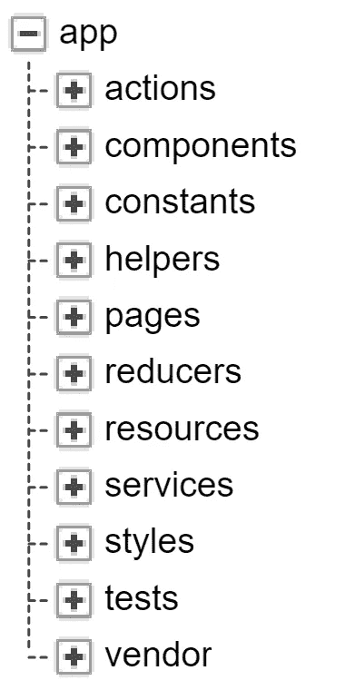

# create-react-redux-app-structure 如何帮助你更快地启动项目

> 原文：<https://medium.com/hackernoon/how-create-react-redux-app-structure-helps-you-to-start-a-project-faster-cf564c64689c>

> [参见 GitHub 上的代码](https://github.com/shystruk/create-react-redux-app-structure)。[了解更多关于 npmjs.com 的信息](https://www.npmjs.com/package/create-react-redux-app-structure)

我更喜欢从头开始创建一个项目，这有助于你学习，调查和理解你想要添加的工具是如何工作的。新工具越来越频繁地出现，开始一个新项目并不容易，也不太快。比如我认定 React+Redux 非常符合我的需求，于是基于它开始了应用。我想用 ES6，async/await 等等。要运行所有这些东西，我需要配置 Wepback，Babel，还有 Gulp/Grunt 会有帮助。所以，要让这一切运转起来需要很长时间。这就是为什么，我决定准备和分享应用程序结构，以便通过构建配置更快地启动项目。

# 我们在这里能找到什么？

## 计算机网络服务器

服务器运行在 [Express](http://expressjs.com/) 框架上。要启动服务器，从根文件夹运行`node index.js`。

文件被分离到文件夹中，所以如果你不需要节点服务器，只需删除`index.js`文件和`server`文件夹。

由于我们正在运行服务器，我们需要交付静态文件。html，。css，。js，图像。因此，我们监听根文件夹`./`并为我们现有的两条路由发送`index.html`。

## 反应+还原

查看文件夹结构。

Created with help of [https://creately.com](https://creately.com)

*   [**动作**](https://redux.js.org/docs/basics/Actions.html)——是将数据从应用程序发送到商店的有效信息负载
*   **组件**-**-**文件夹中有**哑**文件夹，其中存储有[哑或表象的](/@dan_abramov/smart-and-dumb-components-7ca2f9a7c7d0)组件和[智能或容器](/@dan_abramov/smart-and-dumb-components-7ca2f9a7c7d0)组件
*   **页面** -基于路线的页面
*   [**reducer**](https://redux.js.org/docs/basics/Reducers.html)**-**指定应用程序的状态如何变化来响应****
*   ****[**资源**](https://hashnode.com/post/5-best-libraries-for-making-ajax-calls-in-react-cis8x5f7k0jl7th53z68s41k1)-**-**每个组件的 HTTP 请求文件****
*   ******服务**-**-**可重用的全局服务，例如警报、通知服务****

****要了解更多的细节，你可以跳到任何一个文件夹并检查里面的文件。****

****在 **pages** 文件夹中，您可以找到`App.jsx`文件。它将所有页面和 connect() React Redux store 与 [withRouter](https://reacttraining.com/web/api/withRouter) 高阶组件连接起来。****

## ****商店****

****商店创建在`app/store.js`文件中。你可能会看到，在生产过程中，我们没有添加 redux-logger 到中间件。****

# ****构建配置****

## ****剧本****

****看看`package.json`的剧本。****

****您可能会看到三种构建类型**开发、生产、暂存。**开发构建我们同时运行 Webpack 和 Gulp，因为它们互不依赖。****

## ****网络包****

****对于生产和阶段构建，我们需要缩小文件并将流程环境设置为`production`，因此，我们使用 **webpack-merge******

## ****加拿大****

****如果你想支持静态文件(js，css，图像，字体)的 CDN，欢迎你。在`config.json`文件 **assetHost** URL 中指定要使用 CDN 的构建的值。构建完成后，您可能会在根 index.html 文件中看到前缀 assetHost URL。css 图像/字体。****

****大口替换静态文件:****

****内部的咕哝图像和字体:****

****你可以下载[库](https://github.com/shystruk/create-react-redux-app-structure)或者通过 npm `npm i create-react-redux-app-structure`安装并按照说明进行操作。有关更多信息，请查看 v4 中的新特性。****

**** [## v4 使用构建配置创建 React + Redux 应用程序结构。有什么新鲜事？

### 如果你错过了第一部分，到这里来弄清楚什么是创建-反应-还原-应用-结构😎

codeburst.io](https://codeburst.io/v4-create-react-redux-app-structure-with-build-configurations-whats-new-523bdec328c6) 

希望它能帮助你更快更容易地开始你的项目。

我很想得到你的帮助。如果你有一个如何改进的想法，改变应用程序结构，请提交一个拉请求或创建一个问题。

**感谢您的阅读。欢迎建议、评论、想法:)**

**如果你喜欢这个，就鼓掌吧，跟我上** [**中**](/@shystruk) **，** [**推特**](https://twitter.com/shystrukk) **，**[**github**](https://github.com/shystruk)**跟你的朋友们分享一下** ✌️****