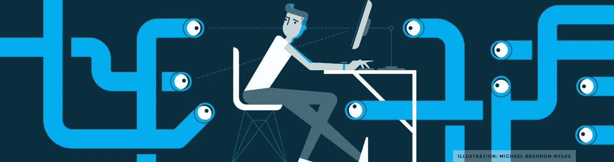

# 加密如何从根本上改变消费者数据和隐私——会议电话，11 月 27 日

> 原文：<https://medium.com/hackernoon/how-crypto-is-poised-to-radically-change-consumer-data-privacy-conference-call-november-27th-ae0e2311640b>

要在 Slideshare 上查看或下载《木桶的甲板》，[点击此处](https://goo.gl/eBQRyS)

要在 Slideshare 上查看或下载 Datum 的资料，[点击此处](https://docs.google.com/presentation/d/1-ZWe0JiZlEY1kCdO8scQBu-FTT4hvXP3A0moko4MItM/edit?ts=5a1c346e#slide=id.p)

要在 Slideshare 上查看或下载 Reward.com 的资料，[请点击此处](https://goo.gl/VprmoV)

自从互联网出现以来，消费者一直在以越来越快的速度产生数据。从我们在亚马逊和其他地方购买的东西，到我们搜索的东西，到我们在哪里/我们的位置，到我们的医疗记录。这些关于我们的数据已经被汇总、重新包装和出售，而这种方式很少有人欣赏。它被卖给了广告商，这样他们就可以在[face book](https://hackernoon.com/tagged/facebook)上向我们展示假新闻，它也被卖给了尼日利亚王子，这样他们就可以向我们要一点钱，这样我们就可以帮助他们摆脱困境，并获得丰厚的回报。它被储存在无限多的地方，被黑客攻击和窃取的地方比我们所知道的还要多(wtf 优步，Equifax，雅虎，Target ……)。).事实证明，我们的社会安全号码绝对不安全。事实上，你的社会保险号被盗是你死后极少数更有可能发生的事情之一。

随着[区块链](https://hackernoon.com/tagged/blockchain)和其他分布式账本(例如 DAGS[他们是一个东西](https://goo.gl/CPAVTi))的兴起，我们正处于消费者如何收回对其数据的控制权、如何使用数据以及将数据卖给谁的早期阶段。在本次电话会议上，我们将听取几位思想领袖讲述我们是如何走到今天这一步的，以及如何找到一种更安全、更周到的方法，让消费者能够控制和分发自己的数据。了解我们，分散的消费者，是否真的会从使用我们的数据来赚钱和控制我们的中央公司和政府那里获得对我们数据的控制。

在四位小组成员完成他们的正式评论后，我们将有足够的时间留给观众提问。

*点击* [*此处*](https://goo.gl/dggfQ3) *报名参加 GoToWebinar* 的电话

我们尊敬的演讲者包括:

[**罗杰·海恩尼**](https://www.linkedin.com/in/roger-haenni/)**——**[**Datum**](http://www.datum.org/)**的首席执行官，这是一个**网络，它依靠 DAT 令牌智能合约来提供安全的数据交易，同时尊重数据所有者制定的条款。在 Datum 之前，Roger 在大数据系统领域拥有超过 15 年的经验，包括作为 StockX、SwissInvest、PCP.ch 和 Kosi 的联合创始人。

[**保罗·马宏**](https://www.linkedin.com/in/paul-mahone-a33222121/)**——**[**BitBoost**](http://bitboost.net/)**、**的联合创始人和 UI 首席开发者，负责监管 Block，这是一个建立在以太坊区块链上的完全去中心化的电子商务市场。Paul 是一名居住在瑞士的意大利/美国程序员。自 1992 年以来，Paul's 一直涉足各种电子市场。20 世纪 90 年代，Paul 担任了第一家在纳斯达克上市的纳米技术公司 Molecular Robotics 的董事。

**Jonathan Meiri——**[**桶**](https://www.superfly.com/) **协议、**内置隐私、安全和合规措施的区块链创始人兼首席执行官。Jonathan 和 Barrel 团队正在为数据“精炼厂”建立一个协议。一个可以交换大量数据集的地方，而不用担心数据的隐私或合规性。在 Barrel 之前，他为易贝和 PayPal 工作，在以色列 Elie 计算部门 Mamram 工作，最近担任越智志帆乐队洞察的创始人兼首席执行官。

**琳达·布彻——rewardstoken . io**的联合创始人& CMO，这是一款去中心化的加密货币忠诚度应用(dapp)，用于增加消费者参与度、降低成本、增强安全性并为消费者提供更好的服务。Butcher 之前创办了一家成功的咨询公司，推动人力资源技术领域的收购和战略合作。Butcher 在多个行业的产品营销方面的丰富经验使她能够跨越多个行业，包括医疗保健、制药、质量管理技术、人力资源技术、忠诚度和零售。

*点击* [*此处*](https://goo.gl/dggfQ3) *在 GoToWebinar* 注册呼叫

*如果你从这篇文章中获得了至少* 0.00000001 比特币*的价值，或者欣赏了该视频，请点击* ***并“拍”下*** *。*