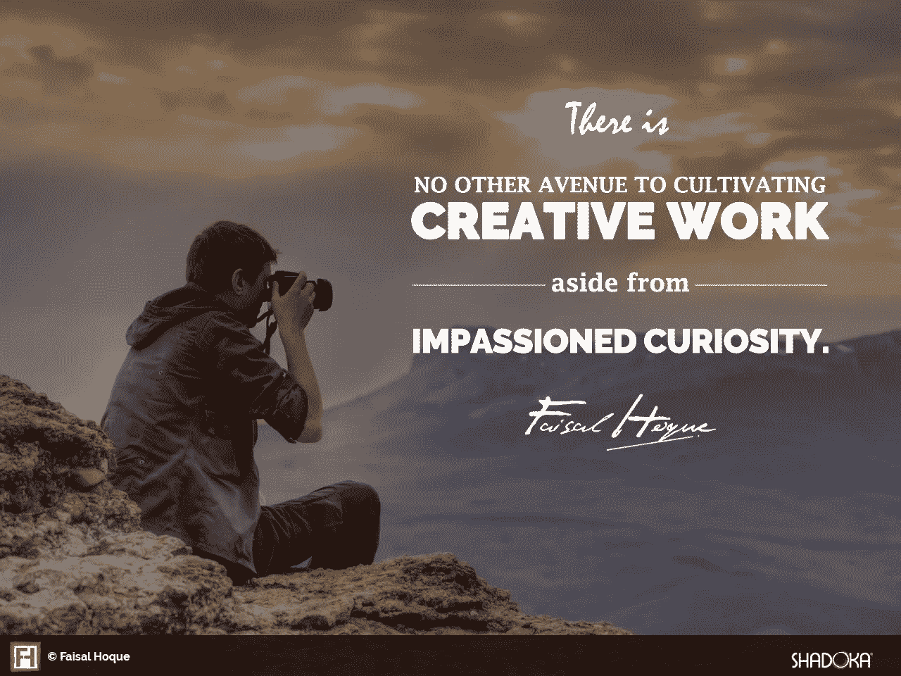
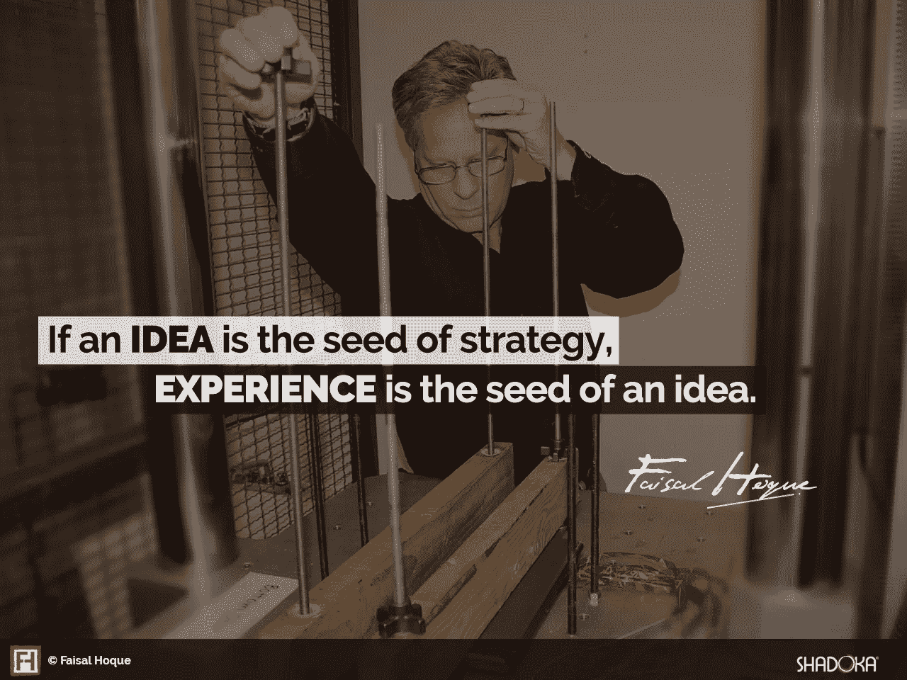
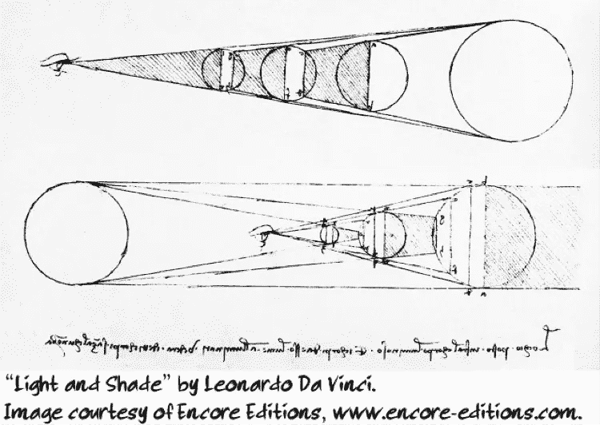
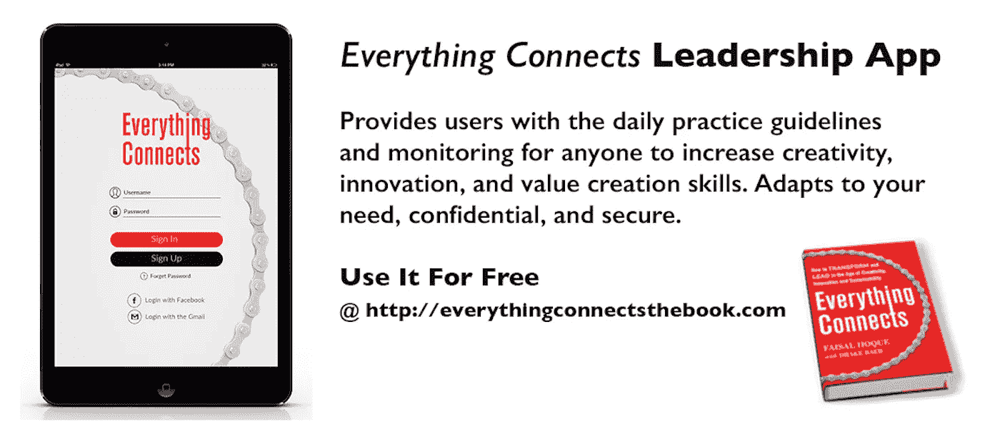

# 好奇心如何培养创造力

> 原文：<https://medium.com/hackernoon/how-curiosity-cultivates-creativity-65b71c1c2b4d>

## 莱昂纳多·达·芬奇的生活告诉我们，观察周围的世界可以带来创造性的突破。

如果说想法是战略的种子，那么经验就是想法的种子。但是体验上能有质的区别吗？是的，研究表明，随着年龄的增长，时间似乎会加快，这是因为这个世界不像你年轻时那么新奇了。你对一个情境越熟悉——或者你感觉到你正处于一个情境之中——你就会越快地经历它。

这是一个关于不同经历的论点——创造力的预测者——但也是一个关于正念的[论点。](http://www.fastcompany.com/3007542/buddha-had-it-right-relax-mind-and-productivity-will-follow)

这是一个关注你的经历，或者对这个世界保持好奇的问题。我们越少沉浸在自己的思考中，就越能关注这个世界。

正如爱因斯坦的名言所说，除了强烈的好奇心，他没有任何特殊的天赋，这意味着除了强烈的好奇心之外，没有其他培养创造性工作的途径。谢天谢地，我们有这种生活方式的模型，莱昂纳多·达芬奇是其中最重要的一个。

达芬奇生活在一个有史以来最伟大的发现和创作杰作的时代。正如“文艺复兴”一词所暗示的，在宗教、公共和私人财富的支持下，人们对艺术和自然世界的兴趣开始复苏。但那个时代与我们的时代也没有太大的不同:达芬奇为了创作，会找到公爵、王子和教皇形式的“保护者”——这与今天企业家寻求资金的方式没有太大的不同，无论是从风险资本家还是从银行。更深刻地说，那个时代看到了与今天的企业家和领导者相同的需求层次——在财务上生存，创造财富，最后，对他们的世界产生影响。

达芬奇在成为雕塑家、工程师、解剖学家和画家之前是一名画家，他在体验和欣赏自然世界方面接受了长期的训练——这也是他表现的力量。他的核心技能和最大的热情是观察。这种热情贯穿了他的所有作品:如果你仔细看他的笔记本，你会发现水的运动草图，证明他一生专注于水力学，这些图纸成为人体工作的基础研究，以及他在佛罗伦萨、罗马和米兰遇到的丑陋和美丽的人的肖像。他说，很多人看，但很少有人看——而正念的看是直接经验的基础，它本身是直接知识的基础。

正如他曾经写道:

> “我在乡间漫游，寻找我不明白的事情的答案。为什么贝壳会和海洋中常见的珊瑚、植物和海藻的痕迹一起出现在山顶。为什么打雷持续的时间比引起它的时间长，为什么闪电一出现就能被肉眼看到，而打雷需要时间才能传播。被石头击中的地方周围的各种水圈是如何形成的，以及为什么一只鸟会在空中支撑自己。这些问题和其他奇怪的现象让我一生都在思考。”

他对 ***观察*** 的强调如此之大，以至于他会重新构思我们感知的方式。正如他笔记本的封面所示，他仔细观察了视觉本身:他对光线照射到眼睛上的方式的理解与柏拉图传统中流传下来并被他的同时代人持有的流行光学理论相抵触。旧的观点认为眼睛是向世界发送一束视觉，而达芬奇认为眼睛是接收光线的东西，如图所示。

**这就是好奇心和观察力的力量:在审视之下，即使是最受尊敬的公认智慧也会让步。**

***版权所有 2016 费萨尔·霍克。保留所有权利。***

我是一名[企业家和作者](http://faisalhoque.com/speaking/)。SHADOKA 等公司创始人。Shadoka 让抱负成为领导、创新和变革的动力。Shadoka 的加速器和解决方案汇集了管理框架、数字平台和思想领导力，以实现创新、转型、创业、增长和社会影响。

《“ [*《万物互联——如何在创意、创新和可持续发展的时代进行变革和领导》*](http://www.amazon.com/Everything-Connects-Creativity-Innovation-Sustainability/dp/0071830758/ref=sr_1_1?ie=UTF8&qid=1376488798&sr=8-1&keywords=everything+connects%2Bfaisal+hoque) 》(麦格劳·希尔)和《 [*《生存并茁壮成长:弹性企业家、创新者和领导者的 27 种实践*](http://survivetothrive.pub/) 》(励志出版社)的作者。在推特上关注我。*免费使用* [*万物互联*](http://app.everythingconnectsthebook.com/login.php) *领导力 app 和* [*生存茁壮*](http://app.survivetothrive.pub/login.php) *弹性 app。*

