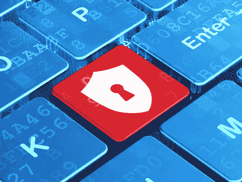

# 2017 年网络保险将如何发展？

> 原文：<https://medium.com/hackernoon/how-cyber-insurance-will-develop-in-2017-86e81756f91d>

2016 年绝对是网络保险[涌现](https://www.infosecurity-magazine.com/news/cyber-insurance-adoption-soared-50/)的一年。随着大规模攻击和大规模数据泄露事件在这一年中一再发生，我们再次意识到，为您的[网络安全](https://hackernoon.com/tagged/cybersecurity)防御分配巨大的努力和资源并不能保证您不会遭遇事故。

高管和[安全专业人士逐渐接受，他们的组织何时会受到网络攻击不是一个是否会发生的问题，而是一个问题。有了这种认识，](https://hackernoon.com/tagged/security)[许多企业认识到](http://searchsecurity.techtarget.com/feature/The-role-of-cybersecurity-insurance-in-the-enterprise)网络保险是多层网络安全防御方法中的一个重要工具，并宣称它是其风险缓解战略的重要组成部分。

[https://d2aijf0p2rhda8.cloudfront.net/NEWS07_130319884_AR_-1_0.jpg](https://d2aijf0p2rhda8.cloudfront.net/NEWS07_130319884_AR_-1_0.jpg)

以下是我个人对 2017 年网络保险市场发展的一些预测:

1.  **越来越多的安全厂商将提供保险担保。2016 年标志着网络安全行业的一条新道路，因为很少有新兴创业公司开始为每个组织提供高达 100 万美元的网络保险，这些保险将被他们的防御解决方案完全覆盖(例如 [SentinelOne](https://www.infosecurity-magazine.com/blogs/sentinelone-financially-guarantees/) 和 [Cymmetria](http://blog.cymmetria.com/cymmetrias-warranty-explained) )。我预计这种趋势将在 2017 年加剧，成熟的供应商将逐渐跟进，提供一系列保护和保险。**
2.  开始提供网络安全服务的保险公司数量大幅增加。随着网络保险的兴起以及许多新的保险公司进入市场(目前大约有 [70 家保险公司](http://cybersecurity.oxfordjournals.org/content/early/2016/08/08/cybsec.tyw001)提供独立的网络保险产品)，在评估风险并提供漏洞前和漏洞后服务(如监控、事件响应、取证等)方面，出现了一场争夺最佳网络安全人才的竞赛。在这种氛围下，保险公司将向客户承认他们可以从网络保险和相关安全服务中获得的收入，并将(并且已经这样做了)[通过积极的招聘和并购来扩大他们拥有网络安全专业人员和工具的团队](http://www.chicagotribune.com/bluesky/originals/ct-aon-acquires-cybersecurity-firm-stroz-friedberg-bsi-20161011-story.html)。
3.  **网络勒索保险将成为需求量最大的网络保险产品。**勒索软件在各个地区、行业和各种规模的企业中呈爆炸式增长。继 [Krebs on Security](https://krebsonsecurity.com/2016/09/krebsonsecurity-hit-with-record-ddos/) 和 [Dyn](http://dyn.com/blog/dyn-analysis-summary-of-friday-october-21-attack/) 遭受大规模 DDoS 攻击之后，物联网世界开启了一个没有负载平衡器能够缓解的 DDoS 攻击新世界。我预计网络勒索将成为组织和个人的最大问题，并将超过数据泄露成为主要威胁。
4.  **先进的风险评估工具的采用将会增加。**对工具的需求很高，这些工具将允许保险公司进行准确、可扩展和可承受的风险评估[，这将简化](https://www.ft.com/content/1cfd5d28-c26f-11e6-81c2-f57d90f6741a)整个基于问卷调查的风险量化方法，这是当今的普遍做法。
5.  **新的** [**法规将出台**](https://www.federalregister.gov/documents/2016/12/27/2016-31244/guidance-concerning-stand-alone-cyber-liability-insurance-policies-under-the-terrorism-risk) **并将支持网络保险市场的扩张。正如去年 9 月发布的针对大型金融机构的新 [NY 提案](http://www.dfs.ny.gov/legal/regulations/proposed/rp500t.pdf)所建议的那样，很有可能会有更多的美国州出台法规，支持对第三方供应商进行定期内部风险评估，并对组织实施安全政策。**
6.  **网络保险在中小企业中的渗透率将成为行业的驱动力。**随着中小型企业对网络攻击的认识不断提高，他们意识到网络保险是一种重要的安全工具，特别是由于他们有限的网络安全资源。我预计会有更高比例的中小企业购买网络保险，导致市场总规模的增长，因为目前的估计依赖于这些细分市场的低采用率。
7.  **很少有保险公司会推出个人网络保险。**随着勒索软件成为任何操作系统和任何设备的威胁，[预计](http://www.darkreading.com/attacks-breaches/ransomware-has-evolved-and-its-name-is-doxware/a/d-id/1327767)它也将逐渐成为个人的一个严重问题，携手将导致网络保险公司提供个人网络保险。

随着网络保险市场的不断发展，保险公司、经纪人、企业和个人都将从中受益。增长将主要在美国市场持续，尽管它很可能在全球范围内扩张，特别是在欧盟，因为 GDPR 将开始生效。

无论你属于 IT 安全生态系统的哪一部分，你都应该探索网络保险能给你带来的好处——收入、金融对冲和网络安心。

这篇文章最初发表在[信息安全杂志](https://www.infosecurity-magazine.com/opinions/cyber-insurance)上。

> [黑客中午](http://bit.ly/Hackernoon)是黑客如何开始他们的下午。我们是 [@AMI](http://bit.ly/atAMIatAMI) 家庭的一员。我们现在[接受投稿](http://bit.ly/hackernoonsubmission)，并乐意[讨论广告&赞助](mailto:partners@amipublications.com)机会。
> 
> 如果你喜欢这个故事，我们推荐你阅读我们的[最新科技故事](http://bit.ly/hackernoonlatestt)和[趋势科技故事](https://hackernoon.com/trending)。直到下一次，不要把世界的现实想当然！

