# 数据如何迫使我实现目标

> 原文：<https://medium.com/hackernoon/how-data-forced-me-to-achieve-my-goals-52df76064903>

*&它如何帮助你实现你的目标*

我们都想成功。我们想取得好成绩。我们想变得富有。我们想要有意义的关系。我们所有人都想象着这些梦想的实现。我们想象有一个好身材，想象在成千上万的人面前唱歌，或者想象有一份健康的薪水。

梦想和抱负是伟大的，但问题是我们关注的是结果。我们关注技能和能力的结果，而不是投入其中的工作。我们痴迷于那 1%的人。剩下的 99%，也就是实现我们目标的努力，不是我们梦想的，也不是我们努力的地方。99%很重要。这是通往我们目标的道路。它带我们去我们想去的地方。见鬼，这占了 99%。如果我们专注于过程，结果就会随之而来。然而，99%是困难的。做困难的事情需要纪律，在没有直接利益的情况下坚持做下去需要毅力。我的目标是让这变得更容易。

## 每日跟踪

我开始这个方法是通过在一个简单的 excel 表格上记录我的新年决心。如果没有 excel，可以使用其他任何电子表格/绘图软件； [Google sheets](http://gsuite.google.com) 是免费的，而且运行良好。我开始追踪四项我想成为生活一部分的活动。这些是冥想、练习钢琴、阅读和俯卧撑。这四个习惯会迫使我提高自己，并且与我的新年决心不谋而合。于是我开始了。每天，我都会打开我的 excel 表格，输入我当天的成绩。这个数据是在第四天之后，就在我的新年决心正式开始之前。

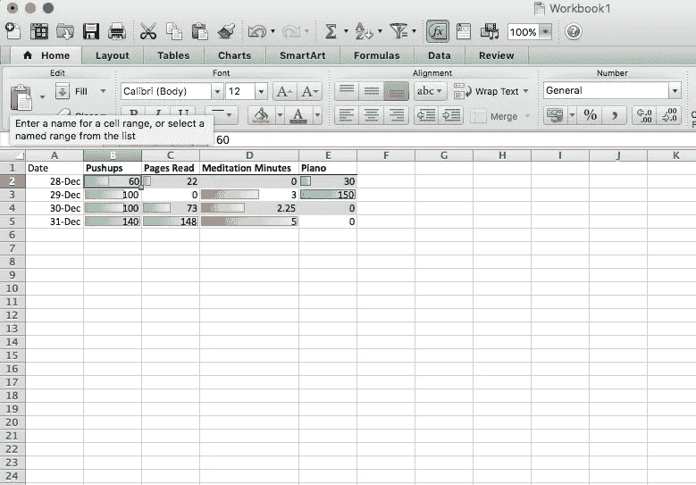

The first four days.

一旦启动。xlsx 文件已经改变了我的行为。在那之前，我从未努力在一天内做完 50 多个俯卧撑，我从未冥想过，练习钢琴和阅读是一件不寻常的事情。虽然 5 分钟的冥想不是一个戏剧性的成就，但它是有意义的。正如孔子所说，“只要你不停下来，你走得多慢都没关系。”这个 excel 表格让它变得简单多了。每次我再做二十个俯卧撑或结束冥想，我就能在那天输入更高的数字。在我实现新年决心的道路上，每迈出一小步，都会得到一份微小但意义重大的多巴胺回报。

已经确信这个简单的跟踪机制的力量，我决定做两个调整。首先，我增加了更多我想在生活中最重要的方面。

在线效率:衡量我在电脑上的时间效率的客观指标。使用应用程序 [rescuetime](http://www.rescuetime.com) 我会用我的效率百分比除以花在分散注意力的网站上的总时间来计算在线效率得分。
**作业/工作:**做作业或做导游的时间。
[**Habitica**](http://www.habitica.com/)**:**一个在线待办事项/游戏来练习习惯。1 分表示我完成了 100%的日常任务。简单的事情，比如洗澡、刷牙、戴牙套，还有其他的。

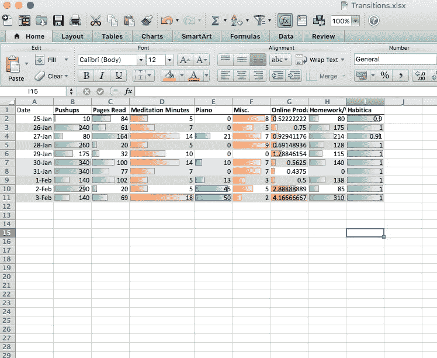

A selection of my productivity in January.

最后，我添加了我的效率表的核心部分。生产率等级。使用一个相对简单的等式，我设法把所有这些分数都考虑进去，从而得出一天的总体生产力水平。对于每个单元格:

> ((给定的单元格/单元格的列平均值)x(特征重要性的权重))……[对所有列进行此操作并求和] /(所有单元格的总权重/5)

在实际的 excel 文档中，生产率评级如下所示

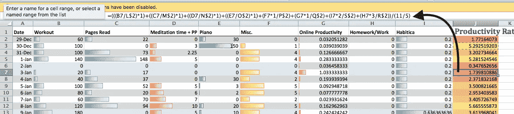

As you can see, every aspect has a weight(importance) of 1 except for homework and habitica. The averages (The Cells L2 through R2) are stored in a separate cell.

整个系统的魔力就在于这个数字。等式的性质使得生产率等级真正特殊。首先，这很容易理解。生产力得分上的 5 分完全是平均水平，所有其他数字都是以此为基础的。十分表示你的工作效率是平时的两倍，2.5 分意味着你的工作效率只有平时的一半。此外，由于公式是基于平均值的，它自动调整到一个很好的难度。如果你的得分稳定在 5 分以上，系统会让你越来越难得分，进一步挑战你自己。另一方面，如果你变得更忙，获得高分是一个挑战，系统会自动开始让它变得更容易，给你放松。生产力评定系统会随着您输入的每一项数据而变化。例如，这张图表显示了在过去的一年中，50 个俯卧撑、20 页纸、5 分钟的冥想、10 分钟的钢琴、2 个杂七杂八的分数、0.5 的在线生产力、100 分钟的家庭作业和我一半的待办事项的价值。

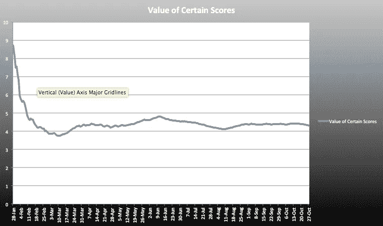

显而易见的是，当我开始连续获得高分时，获得高分变得越来越困难。过了一小段时间，系统确定了一个很好的合适的评级系统，只有基于习惯变化的微小波动。随着时间的推移，主观的、易变的评级系统会变成一个更加客观、稳定的系统。

尽管整个生产力系统最终只有微小的波动，但是各个方面的价值却有很大的不同。这很重要。为了确保你让所有方面成为你生活的一部分，这些方面的价值会改变。当你开始忽视某个方面时，那个方面的价值就会增加，给你更大的动力去完成那个特定的目标。这张图代表了冥想 5 分钟的价值。

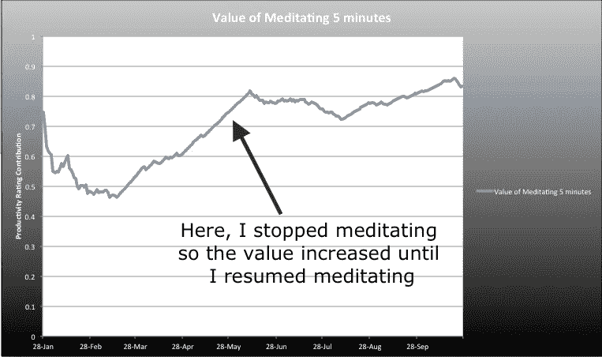

相反，当我今年开始的时候，我在网上的效率很低，所以网上效率的价值很高。然而，随着我的进步，在线工作的重要性降低了，因为它不算是一项成就。

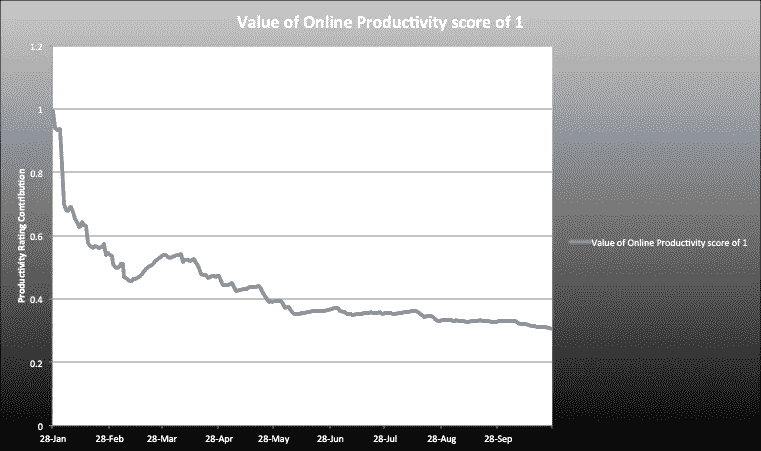

Value of being productive online decreases as I continue to improve upon it.

这就是效率表如此特别的原因。他们适应了。它不是一个迫使你与他人竞争的客观标准，而是一条永远可以到达的终点线，尽管它足够遥远，却是一个值得关注的目标。虽然这个公式相对简单，但它能够动态地改变各个方面的价值，以确保你将每个方面都建立为生活的一部分。

# 为什么有效

效率表是一个很好的实验，但更重要的是，它们起作用了。每天输入一系列数字的过程迫使我记住我的目标。我不断地意识到自己是在向目标靠近还是在倒退。不断的提醒灌输了强大的习惯。虽然动力可以让你起步，但习惯会让你坚持下去。这些习惯改变了我的生活。我已经成为一个更坚强的人。我变成了一个更有音乐天赋的人。我已经成为一个更博学的人。我已经成为一个更好的人。我见证的过去一年的增长在很大程度上归功于这些床单。这个简单的 excel 文档从根本上改变了我。

如果没有这种持续的提醒，我可能会很好地跟踪我的目标。我可能会同样彻底地完成我的作业，即使没有因为花费我的时间而得到奖励。如果没有生产力评级，我可能会在实现目标的过程中保持纪律性。

有可能，但可能性不大。

显然我无法显示跟踪目标前后的统计数据，因为之前没有统计数据。然而，在我开始跟踪我日常生活的某些方面后，我所重视的那些方面有了巨大的提升。

在数据上。

如果 excel 表格本身对我的生产率没有实际影响，你可能会认为我的生产率分数有点像二项式或 t 分布。这将意味着我所做的一切都是正常地度过我的一天，并且无动于衷地记录我的进展。然而，事实并非如此。

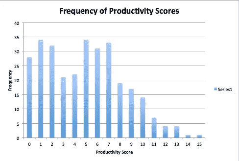

Graph represents what my productivity rating was when I earned it that day.

这是因为数据在我的控制之下。如果我目前处于 3 或 4 级，我可以冥想 10 分钟，读更多的书，或者去健身房把自己推到 5 级。图表证明了这一点。有两个分组。第一组，在 0 到 2 的范围内，构成了相当大的一部分数据。在很大程度上，这些日子发生在我不去想效率表的时候，只是像平常一样过我的一天。这是最接近没有效率表我会怎么做的。位于这两个山区之间的是一个三到五年的山谷。它们很少发生，因为 3/4 范围内的生产率分数足够高，很少偶然发生。然而，如果我认识到床单，我可能会更加努力地工作，使其成为第二组。第二组是我认识这张表的日子，并在某种程度上试图得到一个像样的分数。

这就是特别酷的地方。如果你认为第一组(从 0 到 3)展示了我没有床单时的作品，第二组(从 5 开始)展示了我有床单时的作品，那么你可以推断出很有见地的东西。生产率评定的工作方式非常简单。10 分是 5 分的两倍，8 分是 2 分的四倍。由此，我们可以看出，当我意识到我的效率表时，我的效率是原来的三倍或五倍。

幸运的是，当我开始使用这些表时，我武断地决定，如果我那天打开这些表，我应该得到至少 1 分的杂项分数。这对于展示简单 excel 文档的强大功能变得至关重要。

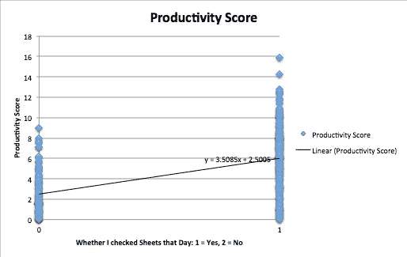

The left set of values represent days where I entered my aspects the day after.

公平地说，杂项变量不仅跟踪我是否查看了表。因此，虽然左边的所有数字肯定是我没有看我的表的日子，但右边可能有一些日子我也没有检查表，但在第二天输入了其他杂项点。也就是说，我很少在第二天给自己打杂牌，你必须相信我。虽然很难从如此简单的图表中推断出一吨，但双方的差异仍然显而易见。相关性是显而易见的。如果我在某一天检查了我的工作表，我的工作效率会高出 3.5 分。更具体地说，3.5 分的生产力等级相当于 940 个俯卧撑、22 分钟冥想或 3.5 小时做作业。这种差异是显著的。如果你不相信的话，下面的图表展示了我当天检查工作表时的效率得分，与我不检查工作表的大部分时间相比。这两个图还展示了前面提到的两个分组。

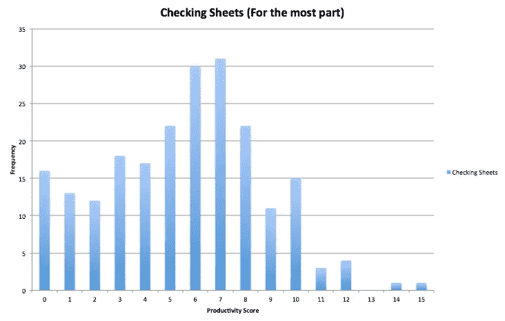

Represents almost exclusively the days I checked sheets

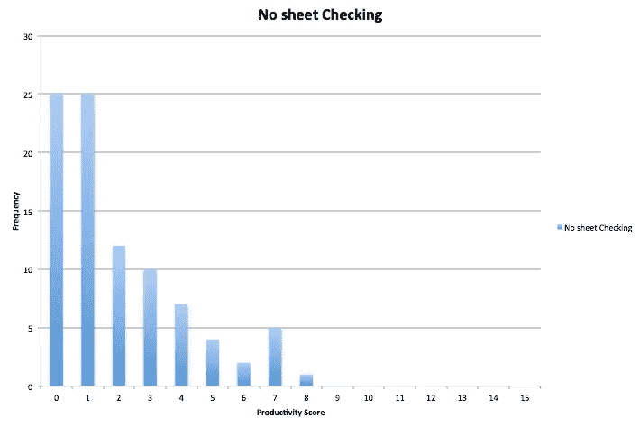

Represents the productivity on the days I did not check my sheets

如果你真的喜欢图表，看看这个。

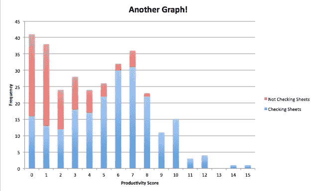

All these graphs are simply data about collecting data…

这些床单的特别之处在于它们是我创造的。它们只是一组反映我一天做了什么的数字。当我的生产率评分超过 10 分时，我实际上没有得到任何奖励。我不收一笔钱；我没有收到祝贺，也没有得到赞扬。没有人知道，除了我。但是，这些武断的数据强烈地影响了我的行动。正如甘地所说，“你的行为成为你的习惯，你的习惯成为你的价值观，你的价值观成为你的命运。”

感谢阅读！我的另一篇关于数据分析的文章可以在[这里](/@duncangans/what-is-willpower-f02b89c6948f#.ikk08p50a)找到。

如果你对创建自己的表格感兴趣，我已经创建了一个易于使用的系统，包括十几个模块来做你自己的生产力分析。请给我发一封电子邮件到 dgans@bowdoin.edu，我会很乐意发送文件。

如果你有任何问题，请发电子邮件到 dgans@bowdoin.edu 找我

谢谢，

邓肯

> [黑客中午](http://bit.ly/Hackernoon)是黑客如何开始他们的下午。我们是 [@AMI](http://bit.ly/atAMIatAMI) 家庭的一员。我们现在[接受投稿](http://bit.ly/hackernoonsubmission)并乐意[讨论广告&赞助](mailto:partners@amipublications.com)机会。
> 
> 如果你喜欢这个故事，我们推荐你阅读我们的[最新科技故事](http://bit.ly/hackernoonlatestt)和[趋势科技故事](https://hackernoon.com/trending)。直到下一次，不要把世界的现实想当然！

