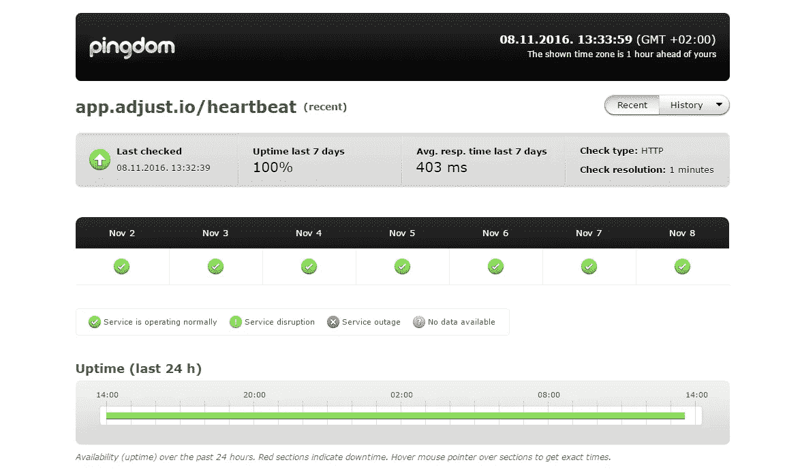

# Datapath.io 如何通过 Anycast 最大化调整可用性

> 原文：<https://medium.com/hackernoon/how-datapath-io-maximizes-availability-for-adjust-with-anycast-5d669af93bf9>

# 案例研究总结

Datapath.io Anycast 是移动 app 跟踪平台调整的最佳解决方案。Datapath.io 在法兰克福和阿姆斯特丹的 adjust 数据中心之间部署了 Anycast。通过以下方式实现最高可用性:

*   不到 10 秒的故障转移场景
*   平均正常运行时间增加
*   可扩展性和灵活性最大化
*   没有会话丢失

# 关于调整

[调整](https://www.adjust.com/)是商业智能平台移动应用营销人员的最爱。它将广告来源的属性与高级应用内分析和商店统计相结合，提供无与伦比的营销洞察力。

# 挑战

Adjust 有两个数据中心，第一个在法兰克福，第二个在阿姆斯特丹。

该公司寻找一种方法来最大限度地提高可用性和正常运行时间，因为这是该服务最重要的方面之一:

“我们进行移动应用程序跟踪，并向客户承诺实时更新仪表盘。我们有一个不断传入的数据流，使用 DNS 解决方案，如果一个数据中心发生故障，我们将无法在一个小时甚至更长时间内完全故障切换到另一个数据中心。这对我们和我们的客户来说是完全不能接受的。对我们来说，最重要的部分是正常运行时间，”IT Operations adjust 主管 Robert Abraham。

# Datapath.io 解决方案有何帮助

Adjust 决定采用 Datapath.io 的 Anycast 解决方案，它可以用于故障转移和负载平衡。在 Anycast adjust 之前，我们比较了其他可能的解决方案，但是没有一个是合适的，原因如下:

“我们评估了几种解决方案。其中一个是通过 DNS。我们不想用它，因为它非常慢，由于 TTLs。我们很快选择了 Datapath.io 任播解决方案，因为 BGP 租用时间非常短。只有几秒钟。我们需要确保尽可能高的正常运行时间，以保证我们为客户提供的服务质量，”IT Operations adjust 主管 Robert Abraham 说道。

通过[*【http://stats.pingdom.com/pfh5avphbc07/670153】*](http://stats.pingdom.com/pfh5avphbc07/670153)*调整正常运行时间统计*

# 结果呢

Datapath.io Anycast 增加了 adjust 服务的可用性，并保护他们的系统不会出现故障。这种 DNS 故障转移架构将故障转移时间**减少到不到 10 秒**。

“我们的目标可用性应该尽可能高。通常我们都是 99.99% 找**。有了 Datapath.io Anycast，平均正常运行时间增加了，这有助于我们实现目标，”—IT 运营调整主管 Robert Abraham。**

任播为通过负载平衡进行调整提供了许多可能性。Adjust 可以安排维护，根据隐私要求将德国流量直接路由到德国数据中心，并在数据中心之间引导流量。未来，adjust 计划扩展到其第三个数据中心。在这种情况下，任播解决方案也将是有价值和有用的。

> [黑客中午](http://bit.ly/Hackernoon)是黑客如何开始他们的下午。我们是 [@AMI](http://bit.ly/atAMIatAMI) 家庭的一员。我们现在[接受投稿](http://bit.ly/hackernoonsubmission)，并乐意[讨论广告&赞助](mailto:partners@amipublications.com)机会。
> 
> 如果你喜欢这个故事，我们推荐你阅读我们的[最新科技故事](http://bit.ly/hackernoonlatestt)和[趋势科技故事](https://hackernoon.com/trending)。直到下一次，不要把世界的现实想当然！

