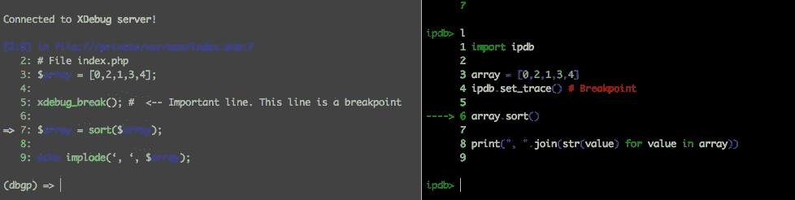
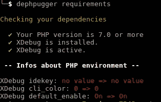
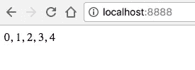
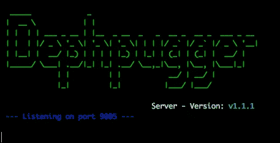
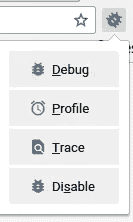
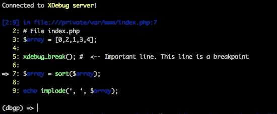
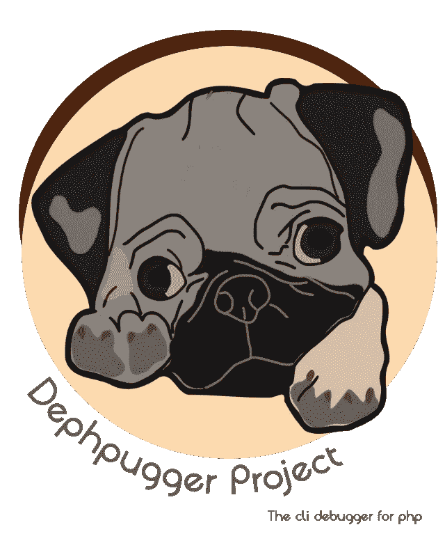

# 如何用 Dephpugger 调试 PHP 应用程序

> 原文：<https://medium.com/hackernoon/how-debug-php-applications-with-dephpugger-98cc234d917c>

**dep pugger**是一个使用任何 web 框架或 php CLI 代码调试你的 [php](https://hackernoon.com/tagged/php) 应用程序的工具。你可以在终端中看到，而不需要安装一个 IDE 来使用。非常简单和有用。参见下面的示例:

[https://www.youtube.com/embed/TUTqby-LbuQ](https://www.youtube.com/embed/TUTqby-LbuQ?ecver=2)

Dephpugger demonstration

# 为什么？

在其他语言(如 Python 和 Ruby)中，在终端中启动 web 服务器并开始开发应用程序代码是非常正常的。在 PHP 中，很多人安装 NGINX 或者 Apache 来运行**本地开发**中的一个应用。但是，在 PHP 5.4 之后，您可以用一个简单的命令启动 **web 服务器**。

```
$ php -S localhost:8080 # Open http://localhost:8080
```

我更喜欢这种模式，因为我只需要安装 PHP。

如果你是一个 Python 开发者，想要在一个断点中启动一个 [debug](https://hackernoon.com/tagged/debug) 来检查你的代码，你可以使用 lib IPDB，在同一个服务器中你会看到代码停止，在终端中会出现代码行。

在 ruby 语言中非常类似，你可以安装 lib Byebug 并开始使用。断点只是写“byebug”并刷新你的页面。

但是，如果你是 PHP 开发人员，你必须先安装 xDebug，选择一个 IDE 或编辑器，搜索教程`how integrate <my editor> with xDebug`。如果要更改 IDE，必须重新配置新的 IDE。这真的很糟糕，因为许多开发人员无法安装，更喜欢使用`var_dump($variable); die()`(或`print_r($variable);exit;`来查看每个请求中的变量值。

现在，您可以通过简单的安装在终端中运行服务器和调试器。



Dephpugger (left) **vs** IPDB (right)

# 属国

调试器使用 PHP 中的一些库来运行调试器。

*   PHP 7.0 或更高版本(未在旧版本中测试)
*   [XDebug](http://dephpugger.com/Installation/XDebug.html)
*   [作曲家](http://dephpugger.com/Installation/Composer.html)
*   你的浏览器插件(如果你想调试一个网络应用程序)

要调试 web 应用程序，您必须在浏览器中安装一个插件。这里有 [Chrome](https://chrome.google.com/webstore/detail/xdebug-helper/eadndfjplgieldjbigjakmdgkmoaaaoc) 、 [Firefox](https://addons.mozilla.org/pt-br/firefox/addon/the-easiest-xdebug/) 、 [Safari](https://github.com/benmatselby/xdebug-toggler) 和 [Opera](https://addons.opera.com/addons/extensions/details/xdebug-launcher/?display=en) 的插件区。

# 除磷装置

要安装 dephpugger 库，您必须首先使用 composer。您可以在全局模式或本地模式下安装(在项目内部，不推荐)。

在本教程中，我们将在全局模式下安装。首先，您需要在终端中运行:

```
composer global require “tacnoman/dephpugger”:”dev-master”
```

这个命令将在路径 *$HOME/中安装 dephpugger。作曲者/供应商*。在供应商目录中存在一个包含 dephpugger 的文件夹 bin。我们需要将这个目录添加到环境变量$PATH 中。

打开文件~/。bash_profile 并添加以下内容:

```
export PATH=$PATH:$HOME/.composer/vendor/bin
```

现在，运行:

```
$ source ~/.bash_profile
```

现在您可以运行命令`dephpugger`。

# 要使用的配置

您可以运行命令`dephpugger requirements`来查看是否一切正常。您将看到类似这样的内容:



Dephpugger requirements command

# 使用

如果一切正常，为您的项目创建一个目录。

```
$ mkdir /path/to/the/project
$ cd /path/to/the/project
```

不，创建一个名为 index.php 的文件。

```
<?php
# File index.php
$array = [0,2,1,3,4];xdebug_break(); #  <-- Important line. This line is a breakpoint$array = sort($array);echo implode(‘, ‘, $array);
```

将终端放在文件夹中，运行 dephpugger 服务器。

```
$ dephpugger server
```



Dephpugger server example

现在，打开一个新标签页(在终端中)并运行代码:

```
$ dephpugger debug
```

您将在终端中看到这个。



Dephpugger debug

再次打开您的 http://localhost:8888。代码不会在断点处停止，因为你需要激活浏览器的插件。在本教程中，我将展示如何在 Chrome 中使用。



Chrome plugin to xDebug

首先，点击调试，你需要看到一个绿色的调试，如下图所示。


Chrome plugin enabled

现在，用 http://localhost:8888 刷新页面，看看神奇之处。在这个终端标签中，你会看到这个。



Debug in dephpugger lib stopped in a breakpoint

现在代码中有了一个断点。函数 xdebug _ break()；是停止代码的断点。现在，您可以导航并研究代码来查找 bug。相当于 IPDB 的 Python 和 Byebug 的 Ruby。

## 命令列表:

*   n ->在代码中运行一个步骤
*   s ->在代码中运行一个步骤
*   设置 <cmd>: <value>->运行时更改 verboseMode 或 lineOffset</value></cmd>
*   c ->继续脚本，直到找到另一个断点或完成代码
*   l ->显示脚本中的下一行
*   lp ->显示脚本中的前几行
*   helph ->显示帮助说明
*   $variable ->从变量中获取值
*   $variable = 33 ->设置变量
*   my_function() ->调用函数
*   q ->退出调试器

你可以在[这个链接](https://github.com/tacnoman/dephpugger)中看到这个列表一直在更新。

# 配置您的项目

现在您可以使用 Dephpugger 来调试您的应用程序，但是 Dephpugger 非常灵活，并且非常容易配置。有可能，用一个简单的文件，改变默认的 web 服务器内置端口，改变公共路径，文件运行…

在根项目文件夹中，您必须创建一个名为`.dephpugger.yml`的文件。这是参数。

```
--- 
debugger: 
  host: localhost # Host to debugger
  port: 9005 # Port to debugger
  lineOffset: 6 # How many lines will show in each breakpoint
  path: ./public/ # default: null - Folder to root path
  file: index.php # default: null - File to root path
  verboseMode: false # default: false - Only to dephpugger devs
  historyFile: ~/.dephpugger_history # File with history commands
server:
  host: localhost # Host to your application
  port: 8000 # Port to run your application
```

在官网可以看到，基本配置为 [Laravel](http://dephpugger.com/Configuration/Laravel_Framework.html) 、 [Lumen](http://dephpugger.com/Configuration/Lumen_Framework.html) 、 [ZF2](http://dephpugger.com/Configuration/Zend_Framework_2.html) (Zend Framework 2)、 [Symfony](http://dephpugger.com/Configuration/Symfony.html) 、 [Slim Framework](http://dephpugger.com/Configuration/Slim_Framework.html) 、 [Silex](http://dephpugger.com/Configuration/Silex_Framework.html) 和 [Yii2](http://dephpugger.com/Configuration/Yii2_Framework.html) 。

# Dephpugger CLI 命令

要调试 CLI 命令，您可以在一个终端中打开调试器，在另一个终端中使用以下命令:

```
$ dephpugger cli /path/to/cliFile.php
```

这个命令将使用 Dephpugger 调试运行您的命令。

# 再见！

这是所有的乡亲。你可以在我们的[官网](http://dephpugger.com/)或者我们在 github 的[回购中看到更多细节。跟着我们！](https://github.com/tacnoman/dephpugger)

塔克曼。



Dephpugger logo

[](http://bit.ly/HackernoonFB)[](https://goo.gl/k7XYbx)[](https://goo.gl/4ofytp)

> [黑客中午](http://bit.ly/Hackernoon)是黑客如何开始他们的下午。我们是 [@AMI](http://bit.ly/atAMIatAMI) 家庭的一员。我们现在[接受投稿](http://bit.ly/hackernoonsubmission)并乐意[讨论广告&赞助](mailto:partners@amipublications.com)机会。
> 
> 如果你喜欢这个故事，我们推荐你阅读我们的[最新科技故事](http://bit.ly/hackernoonlatestt)和[趋势科技故事](https://hackernoon.com/trending)。直到下一次，不要把世界的现实想当然！

