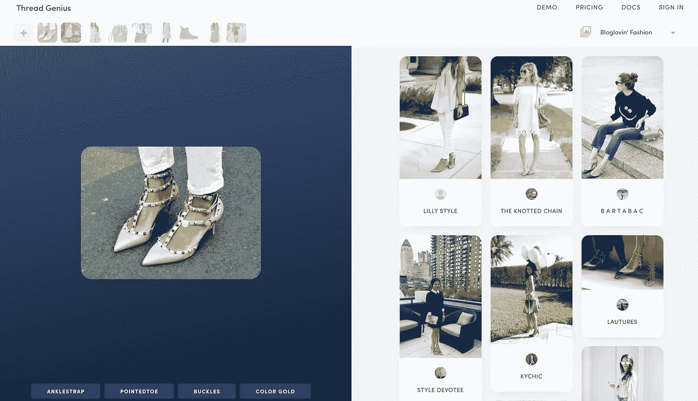

# 深度学习如何让时尚更智能

> 原文：<https://medium.com/hackernoon/how-deep-learning-is-making-fashion-smarter-b1d66eb664ad>

今天的时尚界充斥着广告、视频和图像。在我们的手机上轻敲几下，我们就可以立即进入维多利亚的秘密时装秀的后台，或者瞥一眼 Zac Posen 的最新时装系列。长期以来，杂志编辑一直是时尚潮流的引领者，最近时尚博主和 Instagram 的影响者也加入了这场争论。但是，大门正在向不仅仅是在线人物敞开——深度学习可能至少会设定一些未来的趋势。

当我的好朋友[艾哈迈德·卡马尔](https://www.linkedin.com/in/atqamar/)向我介绍 [Thread Genius](https://threadgenius.co/) (现已被苏富比收购)时，我惊喜地发现，深度学习技术已经进入了我一直感兴趣的时尚和艺术领域。众所周知，时尚趋势是不可预测的；过去十年被认为过时的东西可能会突然成为今年最热门的潮流。神经网络如何与来自时尚和艺术世界的这种不可预测的动态数据进行交互？深度学习和神经网络会对时尚和艺术行业产生什么影响？深度学习和神经网络到底是什么？本周早些时候，我有幸与我的朋友 Ahmed 进行了一次小型采访/Q & A，他是一位经验丰富的[机器学习](https://hackernoon.com/tagged/machine-learning)和深度学习工程师，以了解更多关于深度学习如何改变当今的时尚界。这是我从我们的谈话中得到的，我希望你会觉得这篇文章有些知识性，是一篇有趣的文章:)

# **像我 5 岁一样给我解释一下:什么是人工神经网络？**

作为神经网络技术的初级读本，我建议阅读康德纳斯科技博客发表的这篇文章的前几段:[https://technology . condenast . com/story/a-neural-network-primer](https://technology.condenast.com/story/a-neural-network-primer)

传统上，数据分析与数字、图形、图表和简单的数学模型一起工作。然而，当涉及到图像、语言和文本等非结构化数据时，传统的数据分析可能会变得具有挑战性。例如，Spotify 拥有大量关于播放列表和收听行为的数据，而这些数据并不是直接的数字。这就是神经网络的用武之地——它们允许我们在非结构化数据集上建立模型。在过去，这是手工制作的。例如，如果你想教一个计算机程序区分猫和汽车，你可能会寻找圆形物体，如车轮，汽车车身的直线和猫的模糊线。有时这种方法有效，但是很容易出错，而且只有一半的时间有效。手写检测是另一个很好的例子——当你看到人类书写而不是机器输入的文本时，OCR 就会崩溃。总的来说，这是一个非常复杂的过程，结果并不理想。

神经网络是[通用函数逼近器](https://en.wikipedia.org/wiki/Universal_approximation_theorem)T2。因为神经网络可以逼近任何函数，所以输入和输出可以是非结构化的。现代神经网络像人类一样工作，特别是在特征提取方面:看着手头的任务，并试图定义该任务特有的特定特征。神经网络被**训练**。

# **神经网络是如何训练的？比如神奇宝贝？**

首先，您需要由许多样本和标签组成的训练数据(无监督学习的情况除外)。通常，每个概念至少需要 1000 个样本，这实际上是对神经网络的限制和进入的障碍，因为高质量的数据通常是昂贵的，并且很难大量获得(一个很好的例子可能是从血液样本中检测癌症)。一旦你有了训练数据，你可以向模型展示一辆汽车的图像和它的标签，然后模型将调整它的参数，以便它更接近于做出正确的预测，利用一种叫做[随机梯度下降](https://en.wikipedia.org/wiki/Stochastic_gradient_descent)的技术。每次向模型显示图像时，模型都会略微调整其参数。当模型看到大约 100 次的所有数据点时，训练完成(假设你用 10，000 幅图像训练模型，那么模型应该看到这 10，000 幅图像各 100 次)。每个时间被称为一个纪元。在这个过程的最后，模型将会充分调整它的旋钮，它可能会正确地分类所有的训练示例，这时你就为测试阶段做好了准备。您可以在该模型以前从未见过的全新样本上测试该模型，以检查其准确性。

# **好，现在我知道它是什么了，告诉我它在现实生活中的应用。**

从广义上讲，你可以在任何处理图像的领域看到深度学习的应用，比如室内设计、时尚、美术和摄影。医学领域也有多种形式的图像——x 光、核磁共振成像、超声波、血液样本，教机器做出诊断是一个令人兴奋的想法。理想情况下，机器能够做出比人类医生更准确的诊断，因为它们不受人类局限性的限制。他们更少偏见，能够从大量数据中学习。同样的事情也适用于艺术领域——艺术史学家通常专注于不同类型的媒体或流派，但机器可以覆盖更广泛的数据(查看这个令人敬畏的 Thread Genius art [演示](https://art.threadgenius.co/))。另一个很好的应用可能是卫星图像识别——对于研究人口密度或森林砍伐的研究人员来说，他们不再需要人类劳动来浏览卫星图像并手动做出标记；对冲基金经理可以使用视觉搜索来预测商品价格(例如通过卫星图像查看停车场利用率来预测 Chipotle 的业务表现)机器的优势是规模，而这些只是图像上的应用。对于音频，能够理解音乐流派，语音转文本(自然语言处理，只是现在人们正在使用深度学习来提高准确性)也是很好的例子。

# **太神奇了！时尚呢？**

[Thread Genius 建立的](https://threadgenius.co/demo)是一个神经网络，可以检测大约 1000 种时尚概念，如颜色、产品细节、装饰和图案等。对于给定的图像，TG 的神经网络可以精确定位不同产品在图像中的位置。最后，TG 有视觉搜索的功能，你可以用一张图片进行查询，找到其他有相似之处的图片。事实上，这实际上不同于反向图像搜索——RIS 通常比较原始像素，对概念没有理解。如果你输入 Kanye West 穿外套的图片，结果可能是 Kanye 的其他图片，而 Thread Genius 可以给你 Kanye 穿的外套。神经网络理解外套由什么组成的概念，并具有找到相似图像的能力，即使外套是脏的或横着/向后的。神经网络有一个**概念性的理解**。

下面是一些应用示例:1)零售商希望在缺货时为客户提供类似的产品；2)想要提供产品 UGC 照片的营销人员。(如产品列表中的 Instagram/Pinterest 照片；Asos.com 上的#asseenonme)。事实上，当顾客看到 UGC 照片时，购买产品的可能性会增加 3 倍。这被称为情境化产品——例如，让 Instagram 可以购物。同样的道理是了解用户的审美偏好以改善广告——想象一下 Nordstrom 允许你用 Instagram 账户登录，这样它就可以更好地了解你的时尚风格，建立视觉品味档案，并在此基础上为你提供定制的产品推荐。

# **TL；博士:**

深度学习和神经网络通过提供强大的高质量视觉搜索引擎，使时尚变得更加智能。这些技术非常有利于零售商、营销人员和时尚潮流引领者更好地了解他们的受众，并直接提高销售额。对于客户和用户来说，深度学习可以通过向我们展示数百万张其他人如何穿着的图像来帮助我们找出如何穿着某些衣服。可能性和机会是无穷的，我非常期待看到它在未来的发展。

点击这里查看 Thread Genius 和他们令人敬畏的产品[。](https://threadgenius.co/)

* *更新:Thread Genius 现被世界著名的艺术品交易商公司——苏富比收购。恭喜[艾哈迈德·卡马尔](https://medium.com/u/74ee0905879d?source=post_page-----b1d66eb664ad--------------------------------)和[安德鲁·萨姆](https://medium.com/u/c54aeb9b6127?source=post_page-----b1d66eb664ad--------------------------------)！[https://TechCrunch . com/2018/01/25/Sotheby-acquisites-thread-genius-to-build-its-image-recognition-and-recommendation-tech/](https://techcrunch.com/2018/01/25/sothebys-acquires-thread-genius-to-build-its-image-recognition-and-recommendation-tech/)

媒体上的线程天才:[https://techburst.io/@ThreadGenius](https://techburst.io/@ThreadGenius)