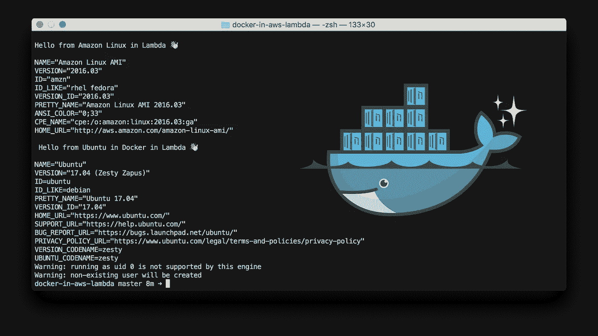
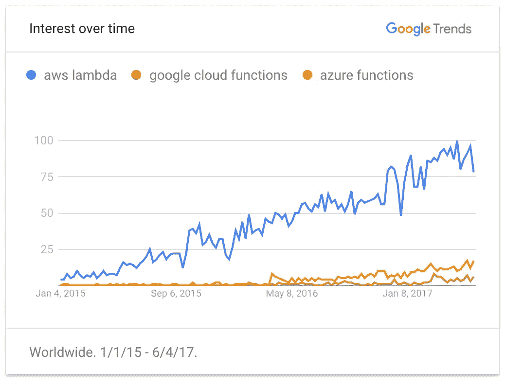
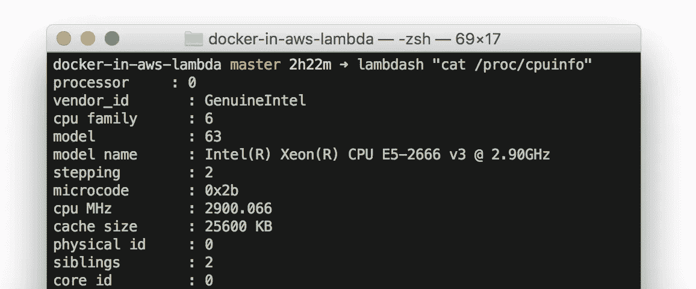
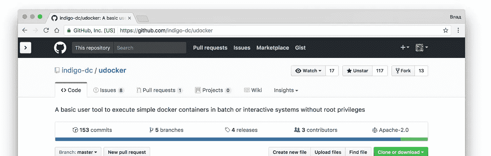
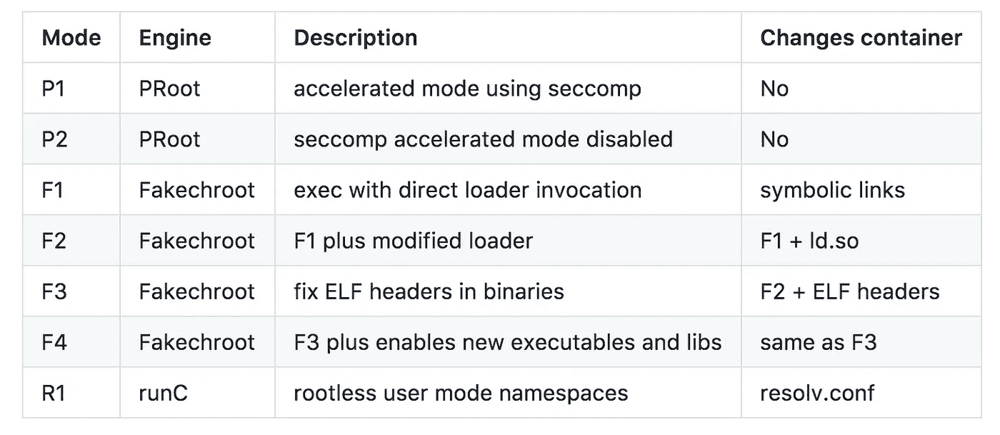

# 我是如何“黑掉”AWS Lambda 来运行 Docker 容器的

> 原文：<https://medium.com/hackernoon/how-did-i-hack-aws-lambda-to-run-docker-containers-7184dc47c09b>



> **2012 年 12 月更新:** Lambda 现在原生支持 Docker 容器！
> https://AWS . Amazon . com/blogs/AWS/new-for-AWS-lambda-container-image-support/

Lambda 为什么不开箱出货 Docker？是因为安全考虑吗？何必呢，我们自己来！

Lambda 是无服务器市场的先锋。看下面的图表:

[](https://goo.gl/0Bk7vM)

🤔 What happened on Jan 8th?

我知道，这只是搜索活动。但是你可以看到 2015 年提前了多少。

垄断对最终用户没有好处。没有竞争=发展停滞。一年后，Azure 推出了功能绑定和逻辑应用。Google 展示了更简单的依赖管理和漂亮的仪表板。

最近我发现了 [Apache OpenWhisk](http://openwhisk.org/) 。这是运行您自己的无服务器平台的开源替代方案。不像其他任何东西，它可以运行你提供的 Docker 图像的功能。

# Docker for Serverless？有什么意义？

你可能会问，*“为什么要复杂化？为什么是 Docker？无服务器是简单的功能。”*。当然，但事实是事情并不总是那么简单。

## **不再有** `**zip**`

整个世界都转向了容器，现在 AWS 告诉你把所有代码和依赖项打包到一个 zip 文件中。后退一步。\_(ツ)_/

使用 Docker，您可以像多年来使用微服务一样构建功能。

## **任意二进制**

曾经想在你的函数中使用 [bcrypt](https://github.com/kelektiv/node.bcrypt.js) 、 [phantom.js](https://github.com/svdgraaf/serverless-screenshot) 、 [ffmpeg](https://github.com/binoculars/aws-lambda-ffmpeg) 或任何其他二进制文件吗？使用特定版本的 Amazon Linux 启动 EC2 实例，编译二进制文件，将所有内容压缩到 50MB 以下，就可以开始了！

小提示:如果二进制太大，可以在运行时下载到`/tmp`。网络速度是惊人的，但要小心冷启动开销。

有了 Docker，你可以把它扔进 Dockerfile，让奇迹发生。

## 用任何语言写作

至于 2017 年 6 月官方支持的有:Node.js，Python，Java (Groovy，Scala)，C#。

非正式的: [Go](http://apex.run/) ， [Closure](https://aws.amazon.com/blogs/compute/clojure/) ， [PHP](https://aws.amazon.com/blogs/compute/scripting-languages-for-aws-lambda-running-php-ruby-and-go/) ， [Ruby](https://aws.amazon.com/blogs/compute/scripting-languages-for-aws-lambda-running-php-ruby-and-go/) ， [Haskell](https://github.com/abailly/aws-lambda-haskell) ， [Swift](/@gigq/using-swift-in-aws-lambda-6e2a67a27e03) ， [F#](http://lukemerrett.com/fsharp-on-aws-lambda/) 等等一些。

使用非官方语言很麻烦，类似于编译二进制文件。

有了 Docker，就像`FROM brainfuck:latest`一样简单。

## 没有供应商锁定

这是一个普通的 docker 图像，里面有您的代码。当然，有一些自定义逻辑依赖于 FaaS API，但我已经感觉好多了。

有了 Docker，无论你在哪里都没关系。

# 有多难？

好了，理论到此为止。我希望你能分享我的兴奋。

首先，我需要知道 Lambda 运行在什么样的环境中。我想四处看看，试试看有没有可能在那里运行 docker 守护进程。

在我的实验中，我使用了埃里克·哈蒙德的一个叫做 [lambdash](https://github.com/alestic/lambdash) 的便利工具。

[](https://github.com/alestic/lambdash)

Did you know Eric is [officially](https://goo.gl/7EkNeK) AWS Community Hero?

您可以在那里运行任何命令。说真的，看看这个。

于是我开始玩荒谬的命令 a-la `sudo apt-get install docker`之类的。不出所料。

然后我试着从[静态二进制](https://docs.docker.com/engine/installation/binaries/)安装 Docker。下载和解包都很顺利，除非我试着启动它。Docker 需要 root 权限来启动一个守护进程😓。当然，在 Lambda 这样有限的环境中，它是不可用的。

那么限制多少呢？

*   128 到 1536 MB 内存(以及相应数量的 CPU)
*   0.1 秒至 300 秒的执行时间
*   `/tmp`下 512 MB 可写磁盘空间
*   250 MB 的已部署代码和依赖项(但 50 MB 已压缩)
*   没有 ROOT 访问权限

## 没有须藤。还有可能运行 Docker 吗？

我的大脑回答说“不”，但我的心告诉我“去研究吧，VLAD”。

所以我做了调查。有哪些选择？

*   使用[坞站](https://github.com/iopipe/dockaless)。这个库包装 Docker Remote API，在 Lambda 之外生成任意 Docker 容器
*   忘记这个愚蠢的想法

第一个选项不是真正的“无服务器”。它需要一些真正的服务器运行。所以我打算选择第二档，除非有一天我发现了[乌多克](https://github.com/indigo-dc/udocker)。

[](https://github.com/indigo-dc/udocker)

Only 117 stars on GitHub. This gem deserves more!

> 没有 root 权限执行 docker 容器。

这太疯狂了。

针说，这个项目结束了我的成功。这些聪明的家伙发现你可以打开 docker 镜像并在一个仿真环境中执行它。干得好。

# 直奔主题

你可以在 [GitHub](https://goo.gl/LsiJJZ) 上找到所有代码。但在一些免责声明之前:

1.  *udocker* 默认使用 *PRoot* 作为执行引擎。它在 Lambda 中不起作用。
2.  幸运的是，有一个[开发分支](https://github.com/indigo-dc/udocker/tree/udocker-fr)，允许你从 3 个可用的执行引擎中选择一个。
3.  Lambda 有 512 MB 的磁盘空间。没有巨大的码头图片。
4.  每次 Lambda 冷启动都需要下载 udocker 和 docker 镜像(大概每 4 个小时， [proof](https://www.iopipe.com/2016/09/understanding-aws-lambda-coldstarts/) )。这可能需要几秒钟。

## 装置

在 Lambda 中，唯一允许你写的地方是`/tmp`。但是默认情况下，udocker 会尝试写入 homedir。我需要改变它的想法。

```
*export* HOME=/tmp
*export* UDOCKER_DIR=/tmp
*export* UDOCKER_BIN=/tmp
*export* UDOCKER_LIB=/tmp
*export* UDOCKER_CONTAINERS=/tmp
```

瞧。你家现在在/tmp。想做什么就做什么。

接下来，我们来下载 udocker python 脚本。

```
$ *cd* /tmp
$ *curl* https://raw.githubusercontent.com/indigo-dc/udocker/udocker-fr/udocker.py > udocker
$ *python* udocker version
```

如果一切顺利，您将看到如下内容:

```
Info: creating repo: /tmp
Info: installing from tarball 1.1.0-RC2
Info: downloading: https://owncloud.indigo-datacl...
**udocker 1.1.0-RC2**
```

我只显示我运行了什么代码。你选择*如何*运行它。为了简单起见，我使用了`lambdash`。您可能希望从您为函数编写的 Node.js/Java/Python 代码中生成一个脚本。

## 设置和运行 Ubuntu

这会将图像从 Docker Hub 下载到您的/tmp。

```
$ *python* udocker pull ubuntu:17.04
```

下一步很重要。您需要创建一个容器并设置执行引擎模式。由于 PRoot 在 Lambda 中不工作( [bug](https://bugs.launchpad.net/ubuntu/+source/linux/+bug/1202161) ，我尝试了第二个选项。



Plenty of options to choose, not sure what all they mean. Help me, linux experts.

```
$ *python* udocker create --name=ubuntu ubuntu:17.04
$ *python* udocker setup --execmode=F1 ubuntu
```

最后，屏住呼吸跑起来。

```
$ *python* udocker run --nosysdirs ubuntu cat /etc/lsb-releaseDISTRIB_ID=Ubuntu
DISTRIB_RELEASE=17.04
DISTRIB_CODENAME=zesty
**DISTRIB_DESCRIPTION="Ubuntu 17.04"**
```

仅此而已。这是一个小的概念证明。但是你明白了。去尝试一下图片，然后在下面的评论中告诉我你的想法。

# 这不是个好主意。但是建造它很有趣

真是让人头疼。每 4 小时下载一次带有 docker 镜像的 udocker。牺牲启动时间。堵塞你的/tmp 高达 100%等等。(不再是了，阅读下面的 UPD)。

但是如果你有一个特定的用例，这是可能的。谁知道呢，也许这篇文章会促进 AWS 对本地 Docker 的支持(#awswishlist 我在看着你)。

我相信这将激励社区建立下一个疯狂的想法。就像这些人激励我一样:

[](/clog/ssh-ing-into-your-aws-lambda-functions-c940cebf7646) [## SSH 到您的 AWS Lambda 函数中

### 无服务器有服务器的最终证明？

medium.com](/clog/ssh-ing-into-your-aws-lambda-functions-c940cebf7646) [](/@marco.luethy/running-headless-chrome-on-aws-lambda-fa82ad33a9eb) [## 如何让无头 Chrome 在 AWS Lambda 上运行

### 让 Chrome(阅读:Chrome)从编译到在 AWS Lambda 上部署“无服务器”运行的冒险。

medium.com](/@marco.luethy/running-headless-chrome-on-aws-lambda-fa82ad33a9eb) 

*附言，感谢您的阅读。点击💚如果您想要更多，请订阅；)*

**P.P.S. UPD:在这篇文章发表前一个月，**[german moltó](https://medium.com/u/e2bc97b56a68?source=post_page-----7184dc47c09b--------------------------------)已经开发了一个框架来实现在 Lambda 运行 Docker 的类似想法！

满足**SCAR**——无服务器容器感知架构！

[](https://github.com/grycap/scar) [## 鹰帽/伤疤

### scar -无服务器容器感知架构(例如 AWS Lambda 中的 Docker 容器)

github.com](https://github.com/grycap/scar) [](http://bit.ly/HackernoonFB)[](https://goo.gl/k7XYbx)[](https://goo.gl/4ofytp)

> [黑客中午](http://bit.ly/Hackernoon)是黑客们开始他们下午的方式。我们是 [@AMI](http://bit.ly/atAMIatAMI) 家族的一员。我们现在[接受提交](http://bit.ly/hackernoonsubmission)并很高兴[讨论广告&赞助](mailto:partners@amipublications.com)机会。
> 
> 如果您喜欢这个故事，我们建议您阅读我们的[最新科技故事](http://bit.ly/hackernoonlatestt)和[趋势科技故事](https://hackernoon.com/trending)。直到下一次，不要把世界的现实视为理所当然！

