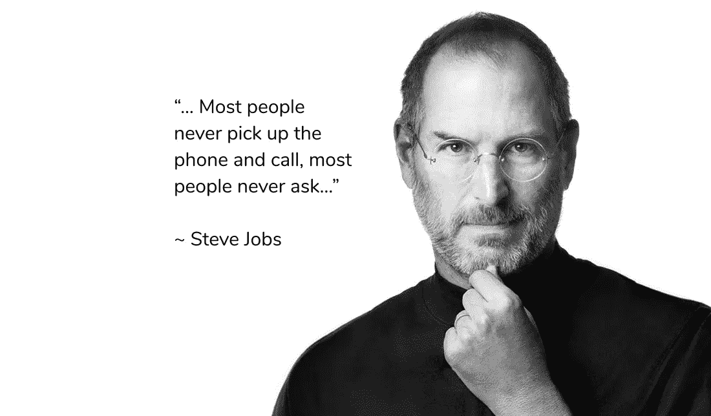

# 史蒂夫·乔布斯是如何得到他的第一份工作的？提示:他问。

> 原文：<https://medium.com/hackernoon/how-did-steve-jobs-get-his-first-job-hint-he-asked-841d364c264f>

史蒂夫[乔布斯](https://hackernoon.com/tagged/jobs)是如何得到他的第一份工作的？高中三年级学生史黛西是如何在推特上获得[面试](https://hackernoon.com/tagged/interview)，击败 99%的求职者的？

他们参加招聘会了吗？他们有世界上最好的简历吗？去最好的学校？认识“合适的”人？号码

他们拿起电话(在史蒂夫·乔布斯的例子中——不夸张地说)问道。就是这样。这篇文章强调了*提问*的重要性，这实际上是获得工作/实习机会的有效策略，尤其是当你很难脱颖而出的时候。

现实是，世界上最好的工作不会在招聘会上公布或提供。招聘经理并不像大多数人想象的那样关心你的 GPA，你上过什么学校，或者你在编译器上得了多少分。经常 GPA，学校等。只是用来在大量申请者中进行筛选，与实际工作的要求关系不大。你往往只是需要一种脱颖而出的方式。

给许多雇主留下深刻印象的，甚至是那些发布招聘信息的雇主，是工作的努力和创造力。那不需要很高的 GPA 或者名牌学校。

例如，这是一封高中三年级学生发给迪克·科斯特罗(时任 twitter 首席执行官)的求职邮件。这位高三学生在谷歌上找到了首席执行官的电子邮件地址。这封邮件引起了她的注意，并给了她一次面试机会。这比 99%的求职者通过公司网站申请工作获得的信息还要多。

> 你好，科斯特洛先生，
> 
> 我叫史黛西。我知道你的时间很宝贵。我只写三个要点:
> 
> 从 7 年级开始编程。
> 
> 有 Java/Android 的工作经验。如果有时间，看看我的网站。
> 
> 今年夏天，我想作为一名高中生在 Twitter 实习。怎么会？
> 
> 谢谢，史黛西

想想看，如果有人给你发了一封体贴的电子邮件，要求了解你的公司，并有可能在那里工作，你会拒绝他们吗？我敢打赌，大多数人都会给那个人一个机会，甚至比在网上申请公司网站要多得多。我知道我会的。

再者，你有什么损失呢？如果公司不回应，那又怎样？你不会有什么损失——反正你现在也不在公司工作了:)

在下一篇[文章](http://www.blog.beehyve.io/2017/10/21/how-to-write-a-cold-email-to-land-your-next-internship/)中，我们将向你展示如何联系，一些写什么的邮件模板，以及一些其他有效的策略。

查看 [www.beehyve.io](http://www.beehyve.io) 获取更多有用的提示、简历评论和一对一帮助——全部免费！

顺便说一句，以下是 Twitter 首席执行官迪克·科斯特罗的回应:

> 史黛西，
> 
> 我喜欢人们开门见山！
> 
> 今年夏天，我们确实有面向 java/android 手机开发者的空缺。[twitter 招聘人员]复制到这里，她负责我们的实习生项目。
> 
> [twitter 招聘人员]，你能跟进 Stacy 并得到他的简历等。为我们今年夏天的过程做准备？
> 
> 谢谢史黛西。

史蒂夫·乔布斯也是这样得到他的第一份工作的——打电话给创始人惠普。

*   *因匿名而更改姓名
*   *原帖[此处](http://www.blog.beehyve.io/2017/10/16/how-did-steve-jobs-get-his-first-job-hint-he-picked-up-the-phone/)