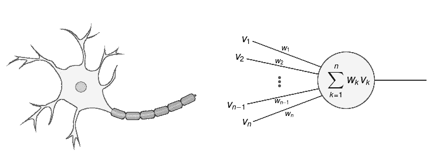
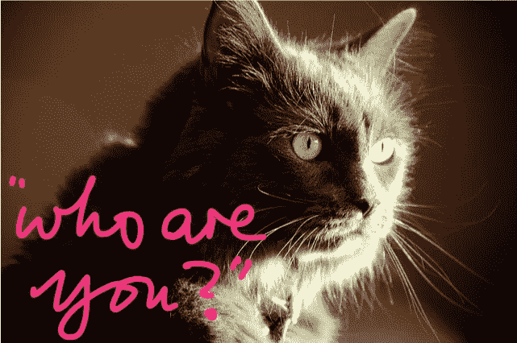
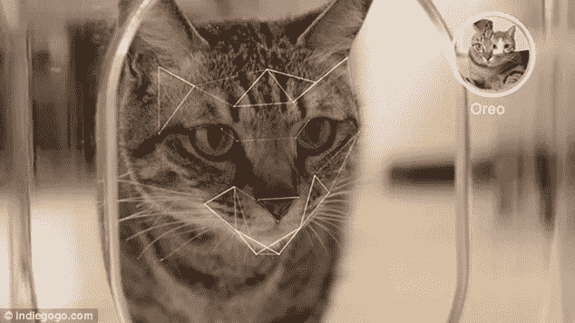
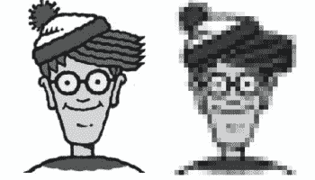

# 人工神经网络如何识别图像

> 原文：<https://medium.com/hackernoon/how-do-artificial-neural-network-recognize-images-c3699af0f553>

安是一幅粗略的数学漫画，描述了生物[、神经](https://hackernoon.com/tagged/biological)、T2 网络是如何工作的。在生物大脑中，我们有称为神经元的单个细胞，每个神经元看着其他神经元看着它的邻居要说的话，然后决定它想说什么。在人工神经网络中，我们有很少的数学函数，我们把它们放在一些有组织的结构中，然后我们说好吧！你们都是一起来学习做这个任务的。

有很多神经网络真的很擅长去识别，你知道这是一只猫，这是一只狗，这是一只青蛙，这是一只老鼠等等。这些神经网络在多个层中工作，因此这种机器学习也称为深度学习。底层的神经元做一些微小的工作，比如看一张图片并对其进行一些计算，它不太具体地理解，但神经元所理解的是，我正在发出一个信号，这个信号对发出信号的人有用，发出信号的人，发出信号的人，发出信号的人等等。他们能够展开这种非常高维的结，并把它拉开，这样就更容易把表面上紧密相连的不同东西和之前纠缠在一起的东西分开。但是我们在顶部放了两个神经元，这些神经元看到了目前为止的全貌。他们基本上是专家，能做出最后的决定，弄清楚我下面的所有层说了这些话，所以我知道这是一只猫，或者至少我 92%确定这是一只猫，所以它基本上是一只猫。

如下图所示，我们可以说右图中 92%的可能性是一个男人。

但这需要很长时间来学习，当它在学习的早期，你给它看一张汽车的照片，下一次你给它看一张汽车的照片，它只有一点点可能说这是一辆汽车。即使那是它看到的最后一样东西，它也进不去。当你对一个孩子说，那是一个文件柜，然后一秒钟后你说那是什么？他不会说“鞋子”吧？他肯定会说这是一个文件柜。

> [黑客中午](http://bit.ly/Hackernoon)是黑客如何开始他们的下午。我们是 [@AMI](http://bit.ly/atAMIatAMI) 家庭的一员。我们现在[接受投稿](http://bit.ly/hackernoonsubmission)并乐意[讨论广告&赞助](mailto:partners@amipublications.com)机会。
> 
> 如果你喜欢这个故事，我们推荐你阅读我们的[最新科技故事](http://bit.ly/hackernoonlatestt)和[趋势科技故事](https://hackernoon.com/trending)。直到下一次，不要把世界的现实想当然！

