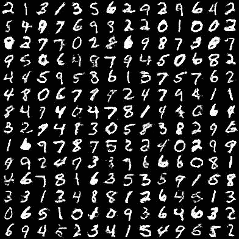
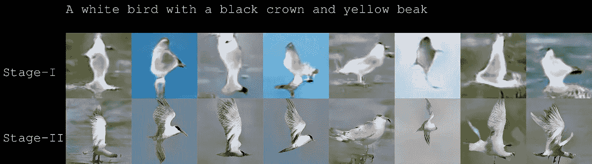
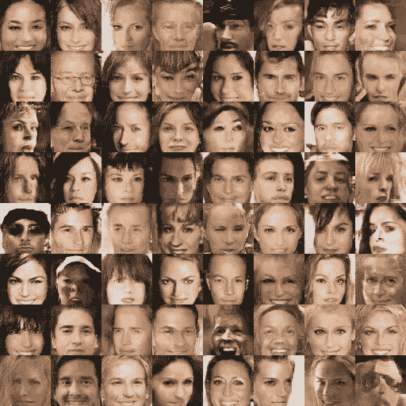
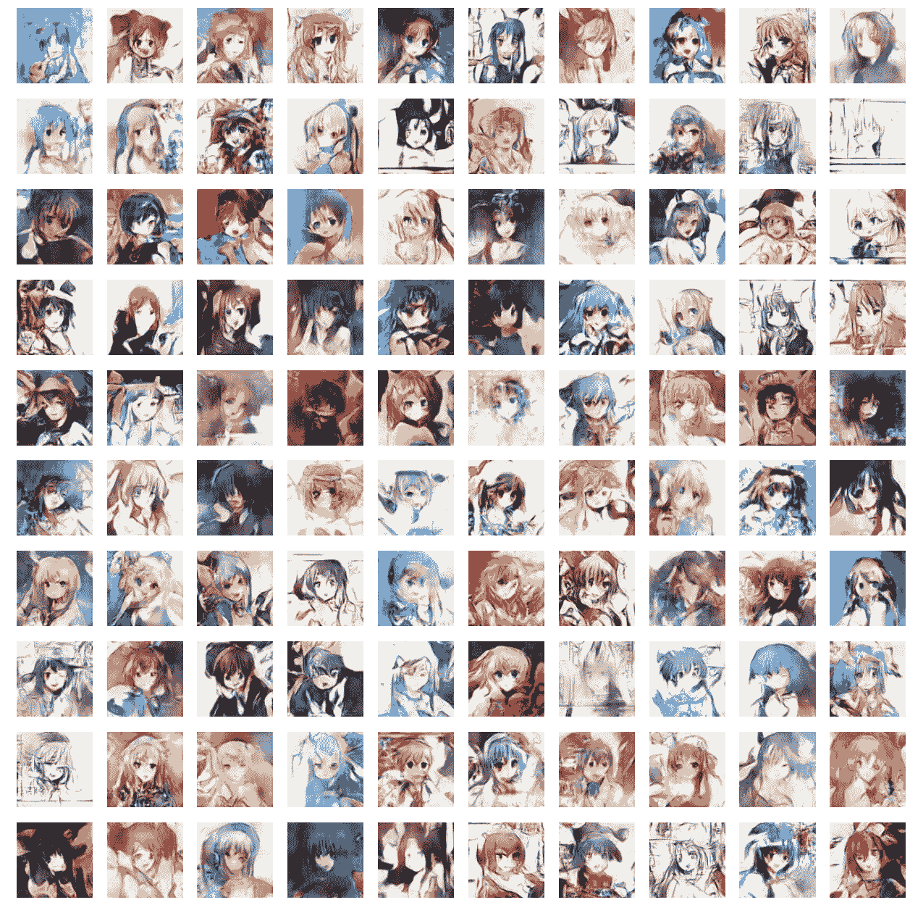
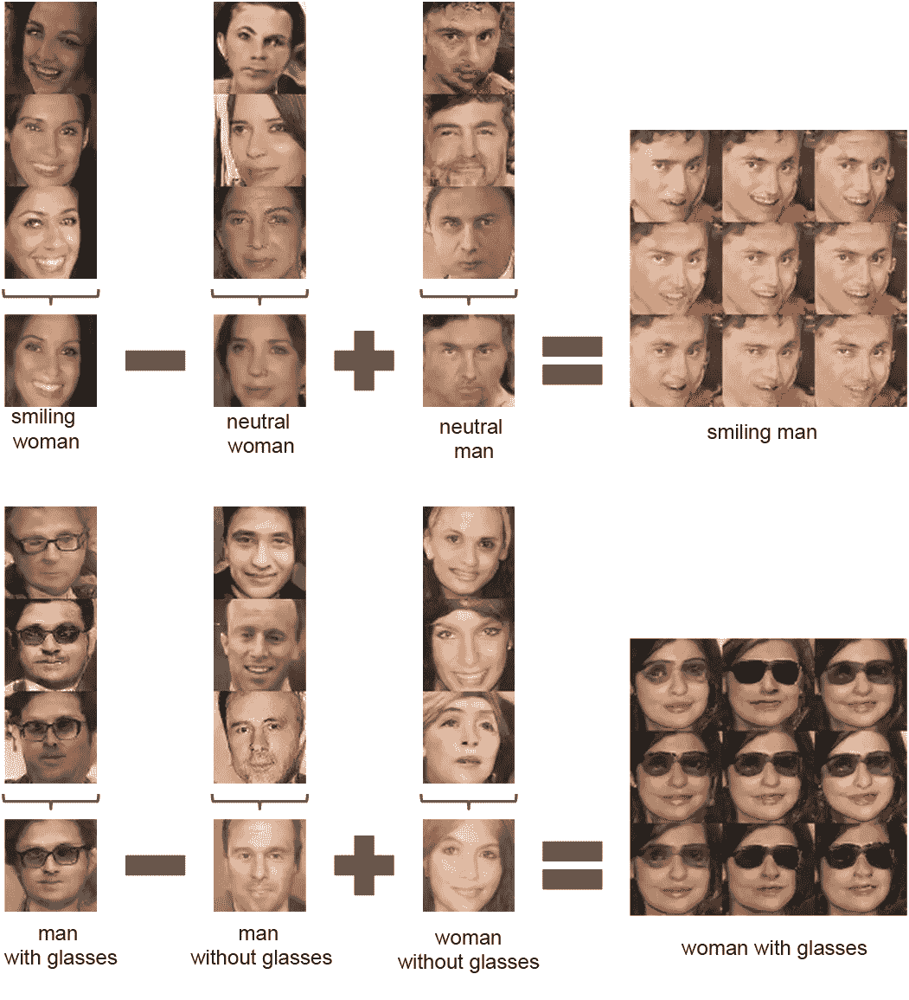
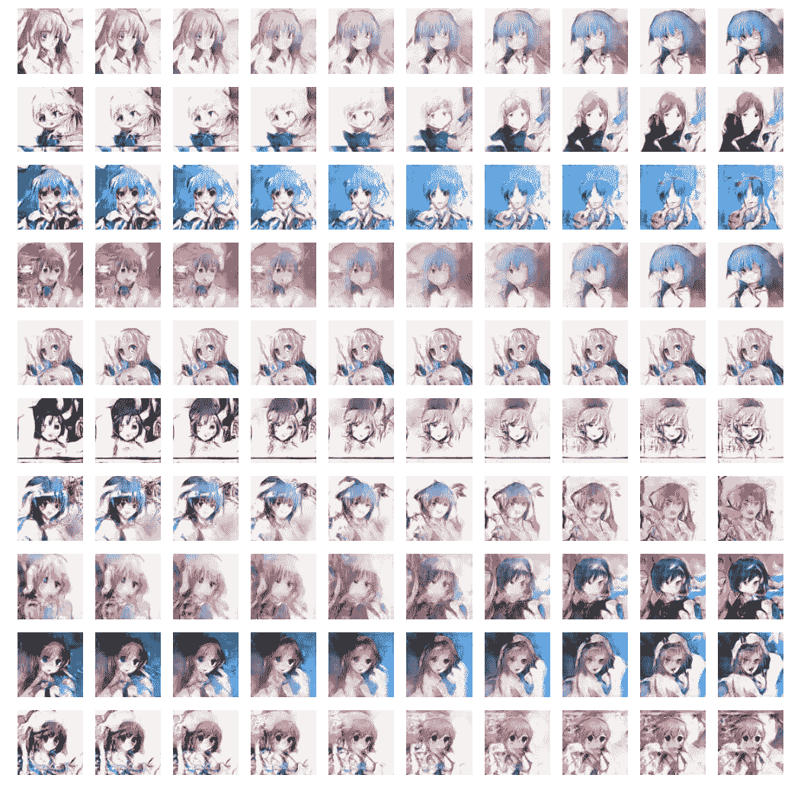
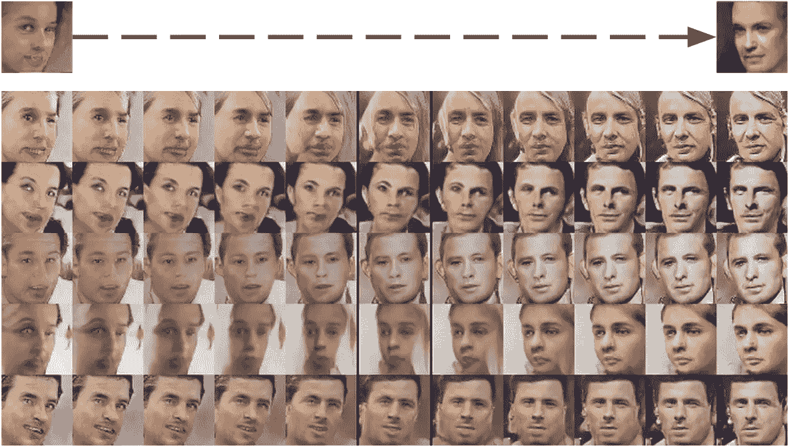

# GANs 是如何直观地工作的？

> 原文：<https://medium.com/hackernoon/how-do-gans-intuitively-work-2dda07f247a1>

[**GANs**](https://arxiv.org/pdf/1406.2661v1.pdf) **或** [**生成式对抗网络**](https://en.wikipedia.org/wiki/Generative_adversarial_networks) 是一种神经网络，由两个相互竞争的独立深度神经网络组成:生成器**和鉴别器**构成。****

他们的目标是生成与训练集中的一些数据点神奇地相似的[数据](https://hackernoon.com/tagged/data)点。

甘是一个非常强大的想法。甚至 Yann LeCun(深度学习之父之一)也说这是过去 20 年里机器学习最酷的想法。

目前，人们使用 GAN 来产生各种东西。它可以生成逼真的图像、3D 模型、视频等等。

为什么我们希望机器产生数据？

这对机器的智能化至关重要。如果它能产生，它就会明白。

> "我不能创造的东西，我不明白。"—理查德·费曼

# 它可以产生的事物的例子

[Generating digit images similar to MNIST dataset](https://github.com/yihui-he/GAN-MNIST) that even HUMANS cannot distinguish from the real images.

Generating bird images from text caption: [StackGAN](https://github.com/hanzhanggit/StackGAN)

Generating faces using [DCGAN](https://github.com/carpedm20/DCGAN-tensorflow)

Generating Anime characters using [DCGAN](https://github.com/mattya/chainer-DCGAN)

Predicting future frames from a still image

Generating 3D-models

除了生成事物之外，你还可以对抽象概念进行算术运算，比如从脸上摘下眼镜！

Arithmetic on faces: [DCGAN_code](https://github.com/Newmu/dcgan_code#arithmetic-on-faces)

插值呢？

给定两个图像，让它生成中间的图像。

你可以做更多的事情。

令人印象深刻，不是吗？

# 甘思想

举个例子，让我们假设我们希望我们的 GAN 生成看起来像训练集中的人脸的图像，像 [CelebA 数据集](http://mmlab.ie.cuhk.edu.hk/projects/CelebA.html)。

我们的生成器的架构可能看起来像这样:

A [DCGAN](https://github.com/carpedm20/DCGAN-tensorflow) generator, input is a random normal vector “Code” that passes through de-convolution stacks and output an image. (Exercise: Try to explain why the code vector is randomized every-time during training, give your thought as a response is appreciated)

鉴别器:

The discriminator takes an image as input, passes through convolution stacks and output a probability (sigmoid value) telling whether or not the image is real.

我们的整个 GAN 架构将是这样的:

GAN architecture

“生成器将试图生成假图像，骗过鉴别者，让他们以为这些图像是真的。当输入图像时，鉴别器将尽可能地区分真实图像和生成的图像。”

它们一起变得更强，直到鉴别器不能再区分真实和生成的图像。它最多只能以 50%的准确率预测真假。这不比抛硬币猜更有用。鉴别器的这种不准确性的发生是因为生成器生成了非常真实的面部图像，看起来它们实际上是真实的。因此，通常认为它无法区分它们。当这种情况发生时，受过最多教育的猜测和没受过教育的随机猜测一样有用。

来自官方[甘论文](https://arxiv.org/pdf/1406.2661v1.pdf):

> 生成模型可以被认为类似于一队伪造者，试图生产假币并在不被发现的情况下使用，而辨别模型类似于警察，试图检测假币。这个游戏中的竞争驱使两个团队改进他们的方法，直到伪造品与真品无法区分。

在理想的最佳状态下，生成器将知道如何生成逼真的人脸图像，鉴别器将知道人脸是由什么组成的。

## 最佳生成器

直觉上，我之前在生成器中展示的**代码**向量将代表抽象的东西。例如，如果**代码**向量有 100 个维度，**可能会有一个维度自动表示“脸部年龄”或“性别”。**

它为什么会学习这种表示法？因为知道人们的年龄和性别有助于你更恰当地画出他们的脸！

## 最佳鉴别器

当给定一幅图像时，鉴别者必须寻找面部的组成部分，以便能够正确地进行区分。

直觉上，鉴别器的一些隐藏神经元在看到眼睛、嘴巴、头发等东西时会兴奋起来。这些特性对以后的分类等其他用途很有帮助！

# 如何训练

我们训练生成器和鉴别器，使它们一起变得更强，并避免通过轮流使一个[网络](https://hackernoon.com/tagged/network)明显强于另一个。

## 为什么要轮流一起训练这两个网络，而不是分别训练它们呢？

如果一个网络太强，另一个就跟不上了，你就会剩下两个愚蠢的网络。一个电视网会认为它很聪明，却不知道它在和一个愚蠢的对手竞争。认为聪明的人很可能会过度适应愚蠢的人。

# 训练鉴别器

只需给它一个来自训练集的图像和另一个由生成器生成的图像。如果它得到一个生成的图像，它应该输出 0。如果它得到一个真实的图像，它应该输出 1。

技术材料:交叉熵损失优化器就可以了。小菜一碟！

# 培训发电机

当给定其生成的图像时，生成器必须尝试使鉴别器输出 1(实数)。

这是一个有趣的部分。

假设生成器生成了一幅图像，并且鉴别器认为该图像有 0.40 的概率是真实图像，那么生成器应该如何调整其生成的图像以将该概率增加到比如说 0.41？

答案是:

为了训练生成器，鉴别器必须告诉生成器如何调整生成的图像，使其更加真实。

**生成者必须向鉴别者征求建议！**

直觉上，鉴别器告诉**每个像素**要调整多少，以使图像更真实一点。

*从技术上讲，你可以通过反向传播鉴别器输出相对于生成图像的梯度来做到这一点。这样，你会得到和图像形状相同的梯度张量。*

*如果你给生成的图像加上这些渐变，会让图像更真实(在鉴别者眼里)。*

*但我们不只是要给图像添加这些渐变。*

*相反，我们将把这些图像梯度进一步反向传播到构成生成器的所有权重中，以便生成器学习如何生成这个新图像。*

> 让我再重复一遍，要创作出好的作品，你必须向老师展示你的作品并接受反馈！
> 
> 如果鉴别者不帮助生成者，那将是残酷的，因为这里的生成者正在做更艰难的工作。它会产生东西！

发电机就是这样被训练的。

你继续像这样轮流训练它们，直到你达到平衡。

# 用简单(也许)的英语表达直觉

如果你感到困惑，这里是作为两个网络试图在**早期哑状态**中学习的对话的直觉:

> g:我有一张脸的图像，与你过去见过的所有脸的图像相比，它够逼真吗？
> 
> d:非常逼真，但看起来也像是人工生成的。(真实图像的概率为 0.4)我不太确定，但我猜你给我的可能是生成的图像。
> 
> g:没错！这是我生成的图像。我如何调整它看起来更真实？
> 
> 让我想一想。(实际上是在头脑中反向传播)我认为你应该把眼睛添加到你的图像中。人脸图像中通常有眼睛。
> 
> (从技术上来说:我认为你应该将像素号 0 增加 1，将像素号 1 减少 5，…，将像素号 4095 增加 8)
> 
> g:收到。(将这些梯度反向传播到所有权重)
> 
> d:(秘密地调整它自己的权重，以便降低这个生成的图像的 0.4 概率。这确保了 D 看到这个图像更假，D 被愚弄的机会将更低。)

## 沉默

以上是一段哑巴对话。他们两个都是哑巴。鉴别者甚至不确定人脸是否应该有眼睛。甚至说生成的没有眼睛的图像看起来很逼真！(一个聪明的鉴别者当然应该对那个图像说不，因为人脸图像当然应该有眼睛在里面！)

经过一段时间的训练后，他们会变得更聪明，直到他们达到他们真正聪明的最佳状态。

这是两个网络在**最佳智能状态**下试图学习的对话的直觉:

> g:我有一张脸的图像，与你过去见过的所有脸的图像相比，它够逼真吗？
> 
> d:真的很现实。(对于真实图像产生 0.8 的置信概率)但是我不知道这是真实的还是生成的图像。因为很明显，你非常擅长生成真实的图像。但如果要我预测的话，你给了我一个真实的形象。
> 
> g:这是我生成的图像。我知道这已经很现实了，但我还想要更多。我如何调整它看起来更真实？
> 
> 让我想一想。(实际上是在大脑中反向传播)我认为你的面部图像具有我认为你应该具有的所有成分。对我来说真的很现实。你的形象当然有眼睛、嘴巴、耳朵、头发和一张年轻男孩的脸。我不认为我有任何建议。但是如果你真的想要什么，去把那个小男孩的胡子拔掉。
> 
> (从技术上来说:我认为你应该将像素号 0 增加 6，将像素号 1 减少 7，…，将像素号 4095 增加 2)
> 
> g:收到。(将这些梯度反向传播到所有权重)
> 
> d:(秘密地调整它自己的权重，以便降低这个生成的图像的 0.8 概率。这减少了 D 下次被这张图片愚弄的机会。)

## 聪明

在它们聪明之后，生成器会生成逼真的图像。鉴别者再也无法分辨这些巧妙生成的图像。

他们都理解胡子、眼睛、嘴巴、头发、年轻的面孔等概念，无需人类的任何监督。

你已经达到了一种平衡。

如果你继续教生成器让图像更真实，你可能会过度适应鉴别者的想法，就像认为一个男孩应该没有胡子一样。这是鉴别器发展出来的一种想法，但它可能是不正确的。就像老师的意见，不要太相信。如果你坚持训练，你将一无所获。

# 结论

这两个网络不是互相争斗，它们必须合作以实现它们的共同目标。鉴别器必须通过在整个训练过程中对生成的数据给出调整建议来教导生成器。同时随着时间的推移，它也学会成为一个更好的老师。

他们一起变得更强大，并有希望达到平衡。

# 奖金

如果你想直接向 GAN 发明者学习，请观看 Ian Goodfellow 的视频:

*事实证明，敌对网络并不那么敌对。他们其实很配合。*

PS。如果你想了解更多关于机器学习的知识，[我有一个专门的清单。](https://github.com/off99555/machine-learning-curriculum)

> [黑客中午](http://bit.ly/Hackernoon)是黑客如何开始他们的下午。我们是 [@AMI](http://bit.ly/atAMIatAMI) 家庭的一员。我们现在[接受投稿](http://bit.ly/hackernoonsubmission)，并乐意[讨论广告&赞助](mailto:partners@amipublications.com)机会。
> 
> 如果你喜欢这个故事，我们推荐你阅读我们的[最新科技故事](http://bit.ly/hackernoonlatestt)和[趋势科技故事](https://hackernoon.com/trending)。直到下一次，不要把世界的现实想当然！

