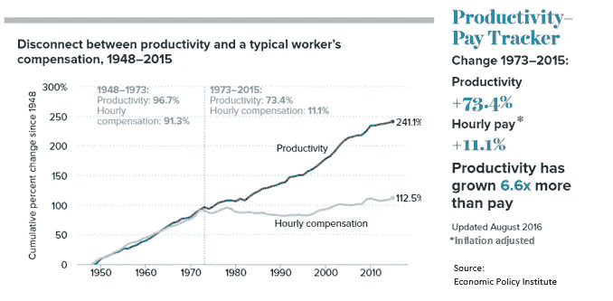

# 我们如何解决偷工作的机器人？我们没有。

> 原文：<https://medium.com/hackernoon/how-do-we-fix-job-stealing-robots-we-dont-cac51ff54fd7>

## 随着无人驾驶汽车车队本月上路，司机们会怎么样？一些科技公司的首席执行官声称，新的工作将很容易出现，但专家们描绘了一幅人类劳动力大幅减少的未来图景。

## 自动化始于道路

毫无疑问，2016 年对于汽车科技来说是非常火热的一年。汽车制造商福特本周收购了战车公司，这再次表明大型汽车制造商正认真进入拼车服务领域。今年的其他并购活动，如通用汽车收购 [Cruise](https://www.crunchbase.com/organization/cruise#/entity) 或沃尔沃[与优步](http://www.bloomberg.com/news/features/2016-08-18/uber-s-first-self-driving-fleet-arrives-in-pittsburgh-this-month-is06r7on)的合作，都坚定地指向大型汽车公司肯定也开始为未来自动驾驶汽车队的盈利开辟道路。

八月， [CB Insights](https://www.cbinsights.com/blog/auto-corporates-investment-ma-timeline/) 发布了汽车技术并购活动的时间表。它现在已经很快过时了。

这些最近的能源发展，以及埃隆·马斯克的[总体规划双](https://www.tesla.com/blog/master-plan-part-deux)，让一件事情变得清晰；向自动驾驶汽车的过渡迟早会成为现实。

## 科技公司首席执行官对失业的回答

因此，关于司机失业的辩论是一个紧迫的问题。如今，世界运输业的劳动力约占总人口的 1%;全球 7000 万人，美国约 360 万人。这是否意味着美国 300 多万人将很快失业？

优步首席执行官特拉维斯·卡兰尼克最近[表示](http://www.businessinsider.com/uber-ceo-travis-kalanick-self-driving-cars-wont-destroy-driver-jobs-2016-8)司机不应该担心，因为全新的子行业和工作岗位将从这场即将到来的技术革命中涌现。

类似的经典例子，LinkedIn 的雷德·霍夫曼[青睐的](http://www.mckinsey.com/global-themes/employment-and-growth/automation-jobs-and-the-future-of-work)，是关于美国食品生产行业的故事。这里，曾经受雇于该行业的 40%的人口毫无问题地重新安置到新的行业，因为这 40%的人口在过去几年里已经下降到只有 2%。正如理论所说:一个地方的收入损失会在另一个地方创造新的收入。

## 为什么我们不能用过去来预测这次

然而这一次不同了。我们不再处理铁路取代马匹，或纺织厂取代工匠的体力工作。机器不再局限于单一的任务，而是现在能够自己做决策，根据麻省理工学院和牛津大学的首席研究员[的说法，这改变了一切。](https://www.technologyreview.com/s/538401/who-will-own-the-robots/)

第一次，下一个技术浪潮可能不是工作的净创造者，而是一个[净破坏者](http://www.pewinternet.org/2014/08/06/future-of-jobs/)。即将到来的向自动驾驶汽车的过渡只是机器接管人类工作的第一波浪潮。世界经济论坛预测，到 2020 年，由于自动化，全球许多行业将净损失 500 万个工作岗位。

我们的后代将越来越多地因为智能机器的数字思维而失业。但是，嘿，那很好。作为一个乐观主义者，我更愿意相信我们可以生活富足，每个人都有更多的繁荣和空闲时间，这一切都是通过技术实现的。酷吧？

然而，在我们达到这一美好的未来平衡之前，我们面前还有一些严峻的挑战需要解决。你可能已经猜到，主要原因是结构性失业和巨大的贫富差距。

## 社会阶级斗争——哇，升级很快

和往常一样，首先流失的是低技能的中产阶级工作。专家认为，技术发展的速度将越来越快于新的就业机会的创造和失业劳动力重新安置的速度。这意味着失业率不会下降，中产阶级将是第一个经济恶化的群体。

这一点从生产率和典型的工人报酬之间日益扩大的差距中显而易见。自亚里士多德以来，一个强大的中产阶级纳税并消费他们的收入，被广泛认为是一个可持续社会的关键经济因素。被摧毁的中产阶级将对全球经济和政治稳定产生巨大影响。由于自动化，不稳定性甚至可能达到极端水平，如骚乱和社会阶级斗争。

## 领导者真正应该做什么？

我真的很受特拉维斯·卡兰尼克的远见和执行力的鼓舞。优步比任何其他公司(也许除了 T2 奥托 T3)都更能驾驭不可避免的技术发展浪潮。但作为这一场景中的核心人物，声称自动化和机器学习导致的失业将会自我修复只是令人失望的不准确。

解决问题的第一步是承认问题的存在。来自世界各地的领导人，无论是企业界还是政界，都必须承认我们面临的挑战。一个可以解决的挑战。但前提是我们都承认这一点，并共同努力，为不可避免地冲击我们的失业浪潮做好准备。

## 没有工作的世界

那么，有什么解决办法呢？世界经济论坛[在今年的达沃斯年会上讨论了这个问题，并发表了题为“就业的未来”的报告。该报告建议将重新培训、更好的劳动力培训和工作轮换作为一些解决方案。](https://www.weforum.org/events/world-economic-forum-annual-meeting-2016/sessions/a-world-without-work/)

人力资源和劳动力战略不仅要考虑组织的最佳结果，还要在全球就业动态中发挥重要作用。突然之间，企业社会责任(CSR)将逐渐获得一个全新的定义。

世界各地的研究人员和经济学家提出的另一个更具破坏性的选择是 T2 基本收入概念。追溯到 17 世纪，这个想法一直由马丁·路德·金和米尔顿·弗里德曼等人提出。左右两边都有支持者和反对者，基本收入实验到目前为止显示出了巨大的成果。

然而，实践往往与理论相去甚远，也远非完美。基本收入实验仍然仅仅是实验。只有企业和政治领袖共同努力，负责任地解决如何适应就业机会减少的新世界秩序，我们才能找到切实可行的最佳解决方案，在通往富裕的道路上架起一座桥梁。正如奢侈品行业和私募股权行业的亿万富翁约翰·鲁珀特最近在[所说的那样](https://www.youtube.com/watch?v=-MvyTHPueKI)“我们将迎来一场巨大的社会变革，习惯它并做好准备”。

你怎么想呢?偷工作的机器人会是我们的末日吗？不要用评论来抑制。感谢您的阅读。

> [黑客中午](http://bit.ly/Hackernoon)是黑客如何开始他们的下午。我们是 [@AMI](http://bit.ly/atAMIatAMI) 家庭的一员。我们现在[接受投稿](http://bit.ly/hackernoonsubmission)并乐意[讨论广告&赞助](mailto:partners@amipublications.com)机会。
> 
> 如果你喜欢这个故事，我们推荐你阅读我们的[最新科技故事](http://bit.ly/hackernoonlatestt)和[趋势科技故事](https://hackernoon.com/trending)。直到下一次，不要把世界的现实想当然！

