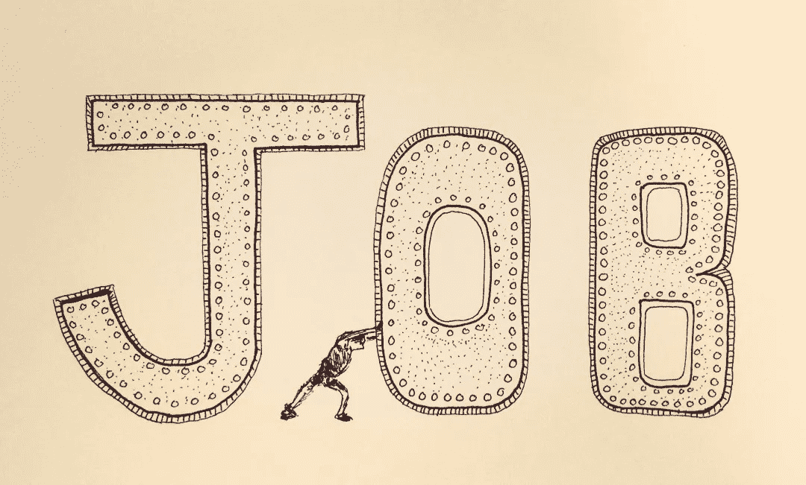

# 我们如何走得更快？

> 原文：<https://medium.com/hackernoon/how-do-we-go-faster-ed51207952a8>

我发现自己经常回答这个问题。在此分享回应…

## 1.首先，承认你可能需要集中注意力，放慢速度。它最终会帮助你走得更快。

## 2.第二，你必须重新定义你对更快的看法。我们关心的速度是学习的频率，交付实际价值(成果)的频率，以及对环境变化做出反应的速度。

## 一些想法…

# 让心理安全成为所有级别的先决条件

1.  艾米·c·埃德蒙森的研究工作，[项目](https://rework.withgoogle.com/guides/understanding-team-effectiveness/steps/introduction/)(谷歌)
2.  做[关键对话](https://www.amazon.com/Crucial-Conversations-Talking-Stakes-Second/dp/1469266822)训练
3.  领导者示范(并鼓励)大胆谈论具有挑战性的话题
4.  阻止经理和领导者囤积信息和反馈
5.  解决组织各部分之间一些非常明显的信任问题

# 开始敏捷教练实践

1.  雇佣[敏捷教练](http://www.agile-ux.com/2010/03/30/the-scrummaster-is-not-an-agile-coach/)(不是 scrum 大师，不是项目经理)
2.  确保教练不偏不倚，不与某个部门有关联。理想情况下，他们应该被拉进团队。不推
3.  开展大规模(组织范围内)的促进持续改进活动( [k 蓝染](https://en.wikipedia.org/wiki/Kaizen))
4.  让公正的主持人进行回顾
5.  为更大的计划进行跨团队回顾
6.  为经理、高级经理、领导者等提供一对一辅导。
7.  停止浪费的、无附加值的实践(例如故事点估算)

# 结构/系统

1.  产品和工程之间更紧密的集成
2.  阐明工程前线、中线经理的角色
3.  要么解决依赖性问题，要么让“产品”/孤岛完全自治
4.  建立团队弹性，使大多数团队能够自我管理
5.  减少局部优化的区域。根除“王国建设”，尤其是在一线经理/董事中
6.  明确地调用所有共享服务(支持、运营、基础设施等方面)。).积极挑战规模经济假设
7.  鼓励更积极的旋转、再训练和群聚练习
8.  整体扁平化组织。信息丢失率可能太高
9.  打破运营和工程之间的结构孤岛

# 可视化工作、管理 WIP、优化流程效率

1.  走慢点。不要那么忙。更有纪律性。更加专注
2.  要求产品和工程部门的每个人阅读唐纳德·赖纳森的 [*产品开发流程*的原则](https://www.amazon.com/dp/B007TKU0O0/ref=dp-kindle-redirect?_encoding=UTF8&btkr=1)
3.  提供以精益原则为重点的培训计划
4.  采用带有积极 WIP 约束的项目和组合级看板
5.  鼓励团队降低利用率和 WIP 限制(集中和闲置)
6.  想象*所有的*工作，包括维护、分类和生产支持
7.  通过阻塞依赖团队来解决依赖性(不过度利用，不多任务)
8.  基于苹果的优先级-苹果的延迟成本
9.  关注流程效率、快速学习、低利用率和小批量
10.  跟踪交付时间、周期时间，并将工作分类
11.  到处都是瓶颈。流畅地将资源/焦点转移到瓶颈
12.  通过季度评审转向持续计划(不是季度计划)
13.  转向更持续的价值交付(通过 scrumfall 和大项目批次)
14.  对于跨团队工作，让所有一线 IC 参与常规的站立、评审