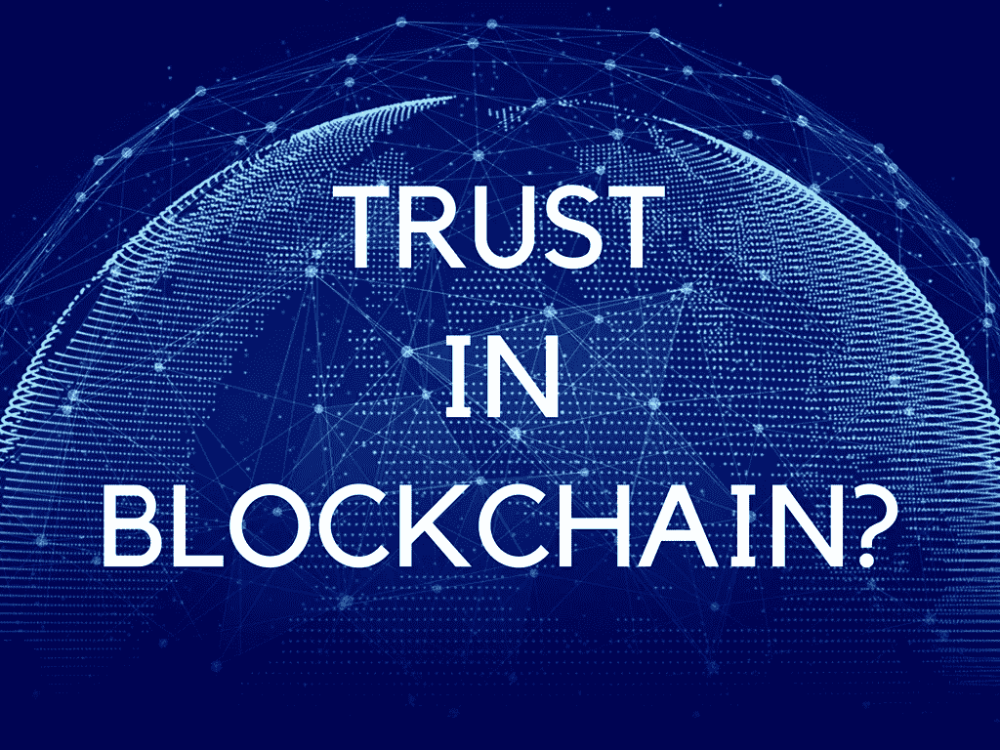

# 我们如何在一个不信任的系统中建立信任？

> 原文：<https://medium.com/hackernoon/how-do-we-put-trust-in-a-trustless-system-a2b66f0f81fd>

## 没有信任，人们可能不会接受区块链！

这个会很快很短。忽略错别字！

[区块链](https://hackernoon.com/tagged/blockchain)一直在粉碎和重新定义每一个以其方式到来的行业。从商业和金融到社交媒体平台，如&Twitter，我们可以在每一个传统行业看到这种情况。然而，只有 1700 万人(世界人口的一小部分)拥有区块链钱包是有原因的。(截至 2017 年 9 月)

嗯，原因很简单:**信任**

嗯，货币作为一个系统首先是由社会发展起来的，然后我们选择了这些被称为银行的权力中心，它们充当组织交易和管理我们的货币的代理人/中间人。我们实际上做的是，我们把我们非常重视的信任放在他们身上。但是，在过去的几个世纪里，这些中间人/代理人成为了最终的主人，我们别无选择，只能信任他们。你知道历史。

这些银行成为了我们经济的最终主人，通过一种被称为“政府法律”的伪范式来实施它们的所有行为。

我们一句话也没说。因为我们太懒了。现在，我们已经到了不相信任何由自己人创造的东西的阶段。但是，我们盲目地相信政府提出的任何愚蠢的计划。看，诺贝尔奖得主约瑟夫·斯蒂格利茨是怎么说的，

最糟糕的是，他可能是对的。

因为你知道吗？人们需要一张面孔，一个他们可以信任的组织。这似乎是等式中所缺少的。

以下是我在某处听到的，“世界永远不会因为普通心理学而变得完全去中心化。我们将会有一个系统，它将会是集中和分散系统总和的平方根。这是人们乐于看到的。”

(*如果有人知道是谁说的，就在这里或者推特上给这个该死的家伙贴上标签。*)

区块链社区需要一个松散的运营机构，由所有利益相关者组成，以分散化的治理模式运营，人们可以仰望并说，如果我搞砸了，这些人会帮我。

我希望区块链社区中的有影响力的人，如胡安·贝内、[维塔利克·布特林](https://medium.com/u/587a00dbce51?source=post_page-----a2b66f0f81fd--------------------------------)、[纳瓦·拉维坎特](https://medium.com/u/67f5049293c7?source=post_page-----a2b66f0f81fd--------------------------------)、[尼克·萨博](https://twitter.com/NickSzabo4)，成为数百万仍受这些伪政府制定的伪法律约束的人的代言人。

因为，这不是几十年的事。

> 我们今天用这项技术做的事情将决定未来几个世纪世界会发生什么。区块链仍处于襁褓之中。

## 喜欢吗？讨厌吗？在下面评论你的观点。此外，试着给我 50 次掌声，并在这里和那里分享这个作品。😄

## **在**[**Twitter**](http://twitter.com/ankitkr0)**，** [**脸书**](http://facebook.com/ankitkumar133) **或**[**LinkedIn**](https://www.linkedin.com/in/ankit-kumar-170581bb/)**上与我连线如果你想讨论想法。**