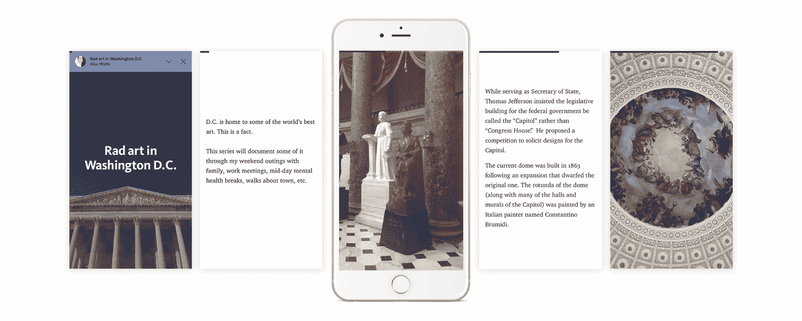

# 你觉得 Medium 的系列怎么样？

> 原文：<https://medium.com/hackernoon/how-do-you-like-mediums-series-8d4c960f4433>

来自媒体的评论、笔记和建议。

我们是在鼓掌还是不鼓掌？

我个人在鼓掌！我是 Medium 的忠实粉丝，几乎是个瘾君子！而且我已经[在](/@andreas212nyc/omg-i-love-️️-️️-️️this-b51d1f2e68cd#.h4ok8q23x)[凯蒂朱](https://medium.com/u/e69f0c6dab7a?source=post_page-----8d4c960f4433--------------------------------)的帖子上评论了，传播了我对公司前几天推出的新产品*系列*的喜爱。

Photo credits: [katie zhu](https://medium.com/u/e69f0c6dab7a?source=post_page-----8d4c960f4433--------------------------------)

当然，作为每一个新发布的产品，它都将受到大量的审查——特别是来自媒体社区的审查，他们喜欢产品的现状，并且经常会慢慢适应变化。像我一样，许多媒体迷上了媒体——以一种好的方式！—享受它提供的简单、优雅、网络化的故事讲述方式。

如何不认同[成型新闻](https://medium.com/u/f74e198d521c?source=post_page-----8d4c960f4433--------------------------------)写道:“致媒，我们爱你的平台！我们都认为每个人都可以表达自己，这很棒。”

 [## 我们将如何在 Medium 上使用“系列”功能…

### 就在昨天，我们告诉了你们我们的成型新闻计划，以及我们将如何使用社交媒体与你们互动…

medium.com](/@formednewsmedia/how-we-are-going-to-use-the-series-feature-here-on-medium-45ad319636ba) 

在某种程度上，媒体也在两极分化，一些用户似乎远离平台或对其持批评态度，因为这些变化和最近 Ev Williams 和管理层重新关注的努力。

例如，Stephan Jaeckel 写道:“这似乎与创办一份出版物并为其添加新的稿件没有太大区别。因此，我怀疑它根本不会改变游戏规则。ANDROID 用户也被排除在这个功能之外:-(. "

贾斯汀·考克斯说:“我已经使用 Medium 大约三年了，正如我最近所说的，我不会去任何地方。”🍩在一个关于*系列*的发布会上。

> “系列”是 Medium 进军系列故事的一次尝试。这对小说界来说意义重大。

 [## 媒介讲故事的未来

### 我已经使用 Medium 大约三年了，正如我最近所说的，我不会去任何地方。在那个时代中…

writingcooperative.com](https://writingcooperative.com/the-future-of-storytelling-on-medium-52cfe78821b1) 

他补充道:“虽然这是 Medium 在一段时间内做出的最酷的变革之一，但最大的特点是用户可以*订阅*到*系列*。这意味着*系列*将被*更新*。当一个作家点击出版，故事并没有结束。每次*系列*更新时，关注者都会收到通知。"

事实上，2 月早些时候，[达科塔·谢恩](https://medium.com/u/11df7f829bc1?source=post_page-----8d4c960f4433--------------------------------)在*提前峰会上写了关于 Ev 的声明:“*在接下来的几个月里，Medium 将发布它迄今为止最大的功能之一:订阅模式。”

 [## 哇，这是正式的-订阅模式即将成为媒体…

### 在最高级会议上，Ev Williams 发表了一项重大声明。在接下来的几个月里，Medium 将发布一个…

medium.com](/the-mission/wow-its-official-the-subscription-model-is-coming-to-medium-134bc0846f6e) 

这种订阅模式将如何推出还有待观察，但似乎*系列*是 Medium 试图采用的新模式的一部分，以带来收入。

达科塔说:“有了这种新的讲故事形式，除了大品牌和出版商之外，更多有影响力的人(希望)会被吸引到媒体上来。”。"不管这些人去哪里，钱很快就会跟来."

 [## WTF 是 Medium 新的“系列”特性，对我们来说意味着什么？

### 我相信我们都想知道，WTF 是我们在中型移动应用程序上看到的新系列功能吗？我知道我是。

medium.com](/the-mission/wtf-is-mediums-new-series-feature-and-what-does-it-mean-for-us-7a267fc5bebb) 

许多人都同意的一件事是*系列*受 Snapchat 启发的功能。

但正如史蒂夫·科尔所说，这是“一件好事”。

 [## 中等“系列”👏🏽👏👏🏿👏🏾

### 真实故事的 Snapchat，以及为什么这是一件好事

medium.com](/@stevencole/medium-series-67f25705688e) 

“乍一看，这就像是 Snapchat 的另一个版本，”亚当·朱拉斯说。“但是在检查了 Medium 上的几个系列之后，特别是像梅林达·盖茨的系列这样内容更严肃的系列，感觉就不一样了。”

 [## 故事，地位，系列等以 S 开头的词

### 几天前，我写了一篇关于 Snapchat、Instagram 和 WhatsApp 的新故事的文章，以一个…

medium.com](/@jurasadam/medium-series-are-the-new-stories-e57547adeaaa) 

有趣的是 Abhishek Chakraborty 写道:

> 千禧一代和青少年以注意力持续时间短而闻名。他们似乎喜欢不需要太多认知或思考的事情。例如，你可以通过 Snapchat 点击一张图片，然后在上面画一些东西，轻松表达你的创造力。或者直接上普通的 Instagram，放一些照片滤镜。这就是你……用最少的努力得到的惊人的结果。即时满足。享乐主义的极致！
> 
> 媒介曾经是不同的。媒体需要很多关注。写自己的故事，甚至看别人的故事，都是需要一定努力的。处理和理解文本需要一些时间，然后保留知识以获得满足感或满足感。当我有另一个平台可以让我如此轻松地获得这种乐趣时，那为什么要在这里浪费这么多的精力呢，对吗？我为什么不在 Snapchat 消失之前去读一些它们的故事呢？
> 
> Medium 在烧钱和解雇员工，所以他们需要一些功能来利用互联网上注意力不足的公民，他们是公司估值的主要来源。于是 ***系列*** ！

 [## Medium 如何努力成为文本的 Snapchat

### 我们已经有故事了。所以现在我们建立了一个系列。打败它！

blog.prototypr.io](https://blog.prototypr.io/how-medium-is-trying-to-be-the-snapchat-for-text-c1b389539e74) 

许多媒体用户现在正在试用*系列*。

下面是我第一次尝试*系列*:

 [## 媒体上的数字外交

### 观看媒体上的数字外交系列。连续剧是一种新型的沉浸式、情节式的故事形式。

medium.com](/series/digital-diplomacy-on-medium-da7d2bde1bf8) 

埃利奥特·尼科尔斯说:“我感兴趣的是用系列形式来讲述一部正在进行的小说，或者一部以小片段形式播放的小说。”。

 [## 我正在尝试我的第一个系列

### 我对这个系列在媒体上的发展很感兴趣。你不需要我来解释新的移动专用…

medium.com](/@elliot.nichols.writer/im-trying-out-my-first-series-92bfad7be165) 

Herrin 评论道:“它的伟大之处在于让人们现在就开始出版，而不是等到一切都完美了。”

 [## 这太棒了。

medium.com](/@Herrin/this-is-awesome-64850cbfbe4b) 

在使用了*系列*之后， [Sebastián GdeLyL](https://medium.com/u/47efe8cf1d68?source=post_page-----8d4c960f4433--------------------------------) 发表了一些笔记，从如何分享新故事到将它们链接到媒体简介。

 [## 关于系列的快速注释

### 亲爱的 Medium 和你的朋友@ Medium，

medium.com](/@SebastianGonzalezdeLeon/dear-medium-6e36e5d7605c) 

其他一些用户，比如 Zac Chapepa 等着使用它，并且正在反思这个工具。他写道:

> -这是一个很酷的功能。
> 
> -我可能会经常使用它，也许会自己创建一个。
> 
> -很有趣，但我要读多少？
> 
> -如果我喜欢这个系列胜过我订阅的故事，会发生什么？
> 
> -出版物死了吗？

 [## 在新系列中…

### ___ _

medium.com](/@mycallforzac/on-board-the-new-series-37747fecdf7b) 

同样，[迈克尔·科恩](https://medium.com/u/4473d9a48870?source=post_page-----8d4c960f4433--------------------------------)发表了一些关于这个系列的想法和建议。

 [## 关于新平台的五个想法:

### @Medium 看起来致力于此。如果你想在你的应用程序的左上角隐藏一个…

medium.com](/@michaeldavidcohen/five-thoughts-on-the-new-platform-6a45bbe097f7) 

“*系列*适合中型吗？，[问坦纳·布罗斯](https://medium.com/u/d1386aaf3d85?source=post_page-----8d4c960f4433--------------------------------)。“是提升还是降级？."

 [## “系列”对中等好吗？

### 所有伟大的歌曲、电影、书籍和故事都有什么共同点？

medium.com](/@Tannerbrodess/is-series-good-for-medium-b669af473257) 

精神食粮！

> [黑客中午](http://bit.ly/Hackernoon)是黑客如何开始他们的下午。我们是 [@AMI](http://bit.ly/atAMIatAMI) 家庭的一员。我们现在[接受投稿](http://bit.ly/hackernoonsubmission)并乐意[讨论广告&赞助](mailto:partners@amipublications.com)机会。
> 
> 如果你喜欢这个故事，我们推荐你阅读我们的[最新科技故事](http://bit.ly/hackernoonlatestt)和[趋势科技故事](https://hackernoon.com/trending)。直到下一次，不要把世界的现实想当然！

