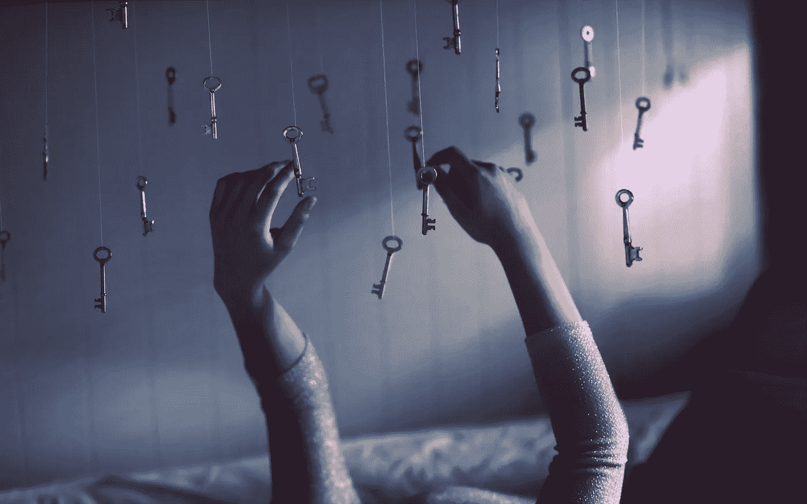
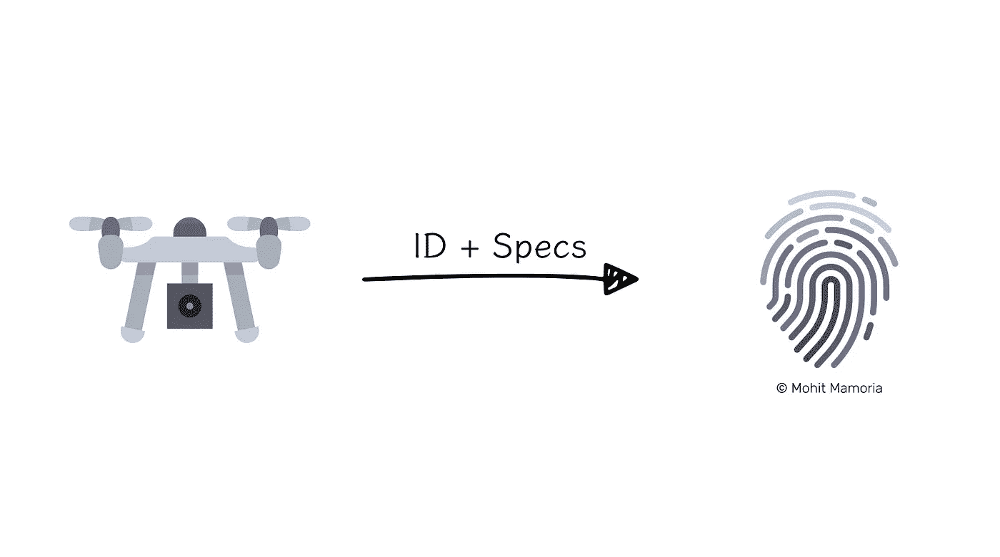
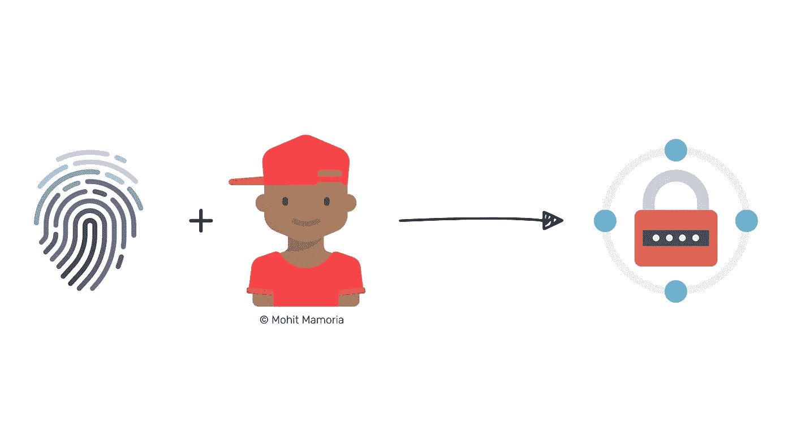

# 你如何证明你拥有某样东西？

> 原文：<https://medium.com/hackernoon/how-do-you-prove-you-own-something-794e0a4c334f>

## 区块链的想法

## 提示:纸质收据是不够的。

[http://www.wallpaperup.com/85312/key_keys_hands_mood_bokeh.html](http://www.wallpaperup.com/85312/key_keys_hands_mood_bokeh.html)

上周，我跟着一个朋友去参加一个聚会。很有趣，但是我把夹克忘在那里了。不管是谁捡到的，如果他有办法确认它的主人，我可能还会带着我的夹克。

几个月前，我打折买了一副奢侈的眼镜。这是一笔很好的交易。几天后，眼镜变成了一块刮擦磁铁。我意识到我被卖给了假眼镜。如果在购买的时候，我有办法验证眼镜的真实性，我就救了自己。

> 顺便说一下，我是每周时事通讯 [**Unmade**](https://unmade.email) 的策展人，它将一个来自未来的想法(就像这个)发送到你们的收件箱。

# 谁记录所有权？

> "微笑的被抢劫者从小偷那里偷了东西."——威廉·莎士比亚

想象你的车被偷了；你会怎么做？你应该去警察局登记你的投诉。如果你的车被别人发现了，警察会通过你所在国家的汽车登记处核实你的车的所有权，并把小偷送上法庭。这很正常。

如果有人捕捉到你的无人机怎么办？你如何证明你拥有它？有权威机构记录你买了无人机吗？不，你最好的选择是店主给你的纸质收据。他们会证明你对无人机的所有权吗？号码

纸质收据不是唯一的；小偷也可以伪造一个，声称他拥有无人机。现在，没有简单的方法来证明你拥有你所拥有的。即使有办法，也是一个漫长、缓慢而乏味的过程。

> 你拥有某物是因为别人相信你拥有它。小偷没有。

我想知道有没有更好的。任何记录谁拥有什么的东西都是简单、快速和可靠的。

# 你被骗了吗？

> "我的假植物死了，因为我没有假装给它们浇水."—米奇·赫德伯格

**据《经济学人》报道，**“据估计，全球每年售出的假货总值高达 1.8 万亿美元。”

这不仅会导致品牌的业务损失，还会让消费者对这些品牌失去信任。

我想象这样一个世界，当有人出去买一些必须是真实的才有价值的东西时，购物者可以简单地拿出他们的手机，键入一些数字，并验证店主是否试图欺骗他们。

我想知道是不是这个世界上所有值钱的东西都可以被分配一个号码和所有权。

# 通用所有权分类账

> "所有普遍的道德原则都是空想."—萨德侯爵

如果你在一年前和我讨论这个关于拥有一个通用所有权分类账的想法，我会当着你的面笑到脸色发青。这个问题的严重程度简直令人难以置信！

不再是了。

当我们认为一家公司必须保存这些记录时，问题的症结就在于此。有数以千计，如果不是数以百万计，不同的事情可以登记在这样一个分类账，每一个都是独一无二的。

我们现在有了这个闪亮的新工具——区块链。

> 如果你不明白区块链是如何运作的，这里有[简明英语的终极指南来理解它](https://hackernoon.com/wtf-is-the-blockchain-1da89ba19348)。

区块链使得以简单、快速和可靠的方式存储此类记录变得高效。让我们看看它是如何工作的。

# 账本是如何运作的？

**如果你还没有读过《区块链终极指南》**,那就把它想象成一个由成千上万的同行维护的数据库，而不是一个公司。

公共区块链建立在两个基本属性上——

1.  一旦记录下来，未经授权的个人就无法修改
2.  任何人都可以阅读区块链上的信息，从而使它变得透明

> 想想区块链的一项记录，就像一只被困在琥珀中的苍蝇。你可以从外面看到它，但它不能移动。

**每一笔值得记录的资产**都需要有指纹。指纹将来源于其定义特征。例如，一架无人机的指纹将来自其识别号和规格。指纹在整个区块链必须是唯一的。因为假冒会破坏品牌的价值，他们可能想在区块链上记录他们制造的资产的指纹。

指纹不能在没有主人的情况下被记录。一开始，所有权将属于品牌本身。在整个供应链中，当资产易手时，当前所有者可以将所有权转给新所有者。

这样，当商品到达消费者手中时，他(她)可以通过查询区块链来快速验证它确实是真品。对购物者来说，所有权的完整轨迹将是可见的。一旦满意，消费者就购买该商品，因此，店主将所有权转让给他/她。

如果物品丢失或被盗，区块链上的记录仍然会反映原买家是其所有者。这条信息有助于法律判断物品属于谁。

我买这副眼镜时，只被骗了 60 美元。如果有人卖假保健品或假药怎么办？

> 虽然这种药物可能只需 100 美元，但健康是无价的。

—

***关于作者***

莫希特·马莫里亚是每周时事通讯的策展人，[***un made***](https://unmade.email)*，它将一个来自未来的想法(就像这个)发送到你的收件箱。*

*这是* [*一个未制作的版本*](https://unmade.email/editions/who-owns-this) *，改作一篇博文。*

## 如果你喜欢这个故事，请💚推荐分享帮别人找！欢迎在下方留言评论！