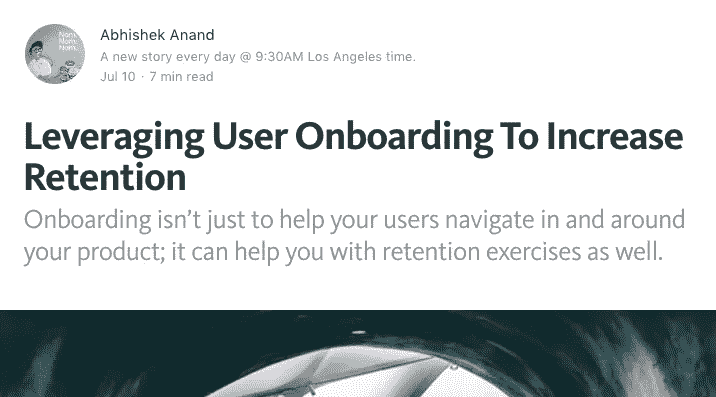
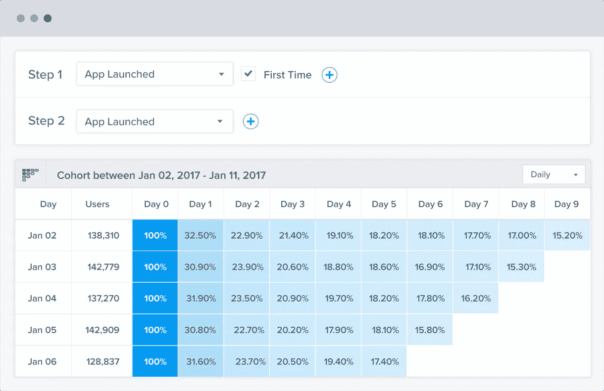
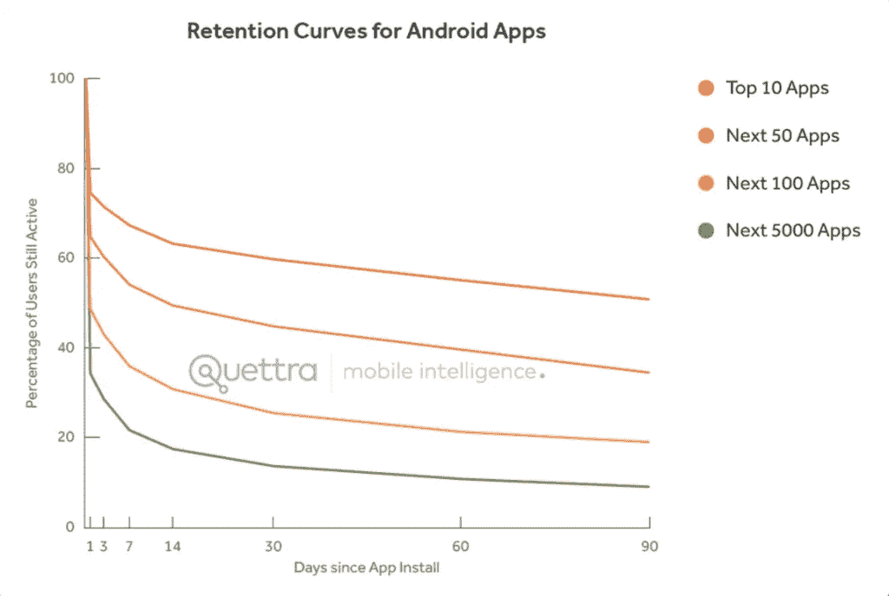
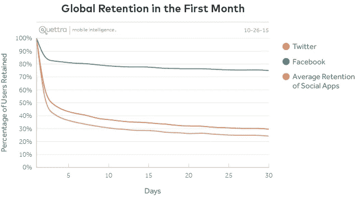
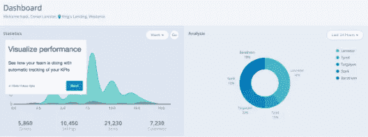

# 先说用户留存。

> 原文：<https://medium.com/hackernoon/how-do-you-retain-your-consumers-users-7bd8c83d3ac5>

## 而且……每个市场人员都很熟悉的头痛欲裂。


How do you make sure your consumers stay tethered to your service? ([src](https://unsplash.com/search/anchor?photo=08b4awIHtBA))

> 用户入门系列的第 1 部分。在这里阅读第二部分。

[](https://medium.com/@abyshake/leveraging-user-onboarding-to-increase-retention-3ba2b201c2d5)

> 在我的上一次业务中，我参加过的每一次风险投资会议中，真正令人头脑发热的一件事是我谈到了这样一个事实，即大约 20%的消费者在任何一个日历月中从我们这里订购了 4 次或更多。

重复行为/交易、客户保持率、流失率——有许多方法来看待这些数据，但它们都有相同的作用。作为健康企业强有力指标的力量。因此，毫不奇怪，当企业和风投看到客户保持率下降时，会感到不知所措和沮丧。更大的问题是，你似乎没有把手指放在杠杆上，帮助你堵住这个正在慢慢耗尽你的业务的漏洞。

# 我们犯的最大错误

说到留住消费者，我们通常开始这个过程有点太晚了，这是最大的错误。我们试图留住那些已经和我们交易过至少一次(*也许更多*)的消费者，但是他们已经错过了时间。我们忽略的事实是，我们已经失去了很大一部分观众

> 用户→付费消费者

显然，尽可能多的留住付费用户是个好主意，但是我们失去的那些潜在的付费用户怎么办？为什么我们对他们的损失不屑一顾，称之为“*做生意的成本*”，或者只是用“*它发生了*”来打发它？为什么我们不努力留住他们？他们没有交易并不意味着他们不会，不是吗？



> 这张图是我从 [Clevertap 的网站](https://clevertap.com/user-retention-cohorts/)上复制的。当然，这是一个虚拟数据，只是为了说明他们的产品是做什么的，但这些数据是根据真实世界的参与度数字通常如何表现出来的来制定和填充的。你会注意到，在第一周结束时，该应用程序已经失去了超过 80%的新用户的回忆。这实质上意味着，这些用户中的大部分已经永远失去了，这反过来继续推高他们的平均。CAC(客户获取成本)—在此阶段已经飙升了 5 倍。
> 
> 这可不是什么美好的场景，对吧？

# 起作用的力量

当你试图经营一家初创公司时，有多个因素需要考虑。第一个严峻的现实是，你会失去大量的初始访问者和注册用户；这是无法逃避的。不管你的产品有多好，你的登录页面有多吸引人，你的营销活动有多有效，总会有人突然出现在登录页面上，只是为了看看你。他们中的一些人甚至会注册你的服务，但你永远无法将他们 100%转化为交易消费者。为什么？因为意图、附加值、可用性——它们并不在同一水平上。

接受这个事实，把它抛在脑后。

你能做的最好的事情就是在每一步提高百分比。只要有转换数，就提高几个点。

# 什么会影响客户流失？

影响客户流失的因素有很多——你的产品提供了什么，整体 UX 有多好，你的 TG 对你的服务的普遍看法是什么。有很多因素可以影响感知的流失率，但有一个因素我们忽略了，那就是我们在消费者/用户注册后如何对待他们。因此，入职流程。

## 今天，我们将忽略影响降低流失率的所有其他因素，只关注入职及其对降低流失率的影响。

> 为什么？当然，其他指标和因素也很重要和关键。但是 onboarding 经常被忽略，而其他因素被谈论得死去活来——即使 onboarding 实际上是你的用户与你的产品的第一次交互，因此起着相当关键的作用。

据说第一印象是最后的印象是有原因的。许多消费者会根据你在给人第一印象时是否展现出最好的一面来判断你。好吧，也许不是最好的开始，但是你是否给了他们一个再次回到你身边的理由。这就是入职很重要的原因。

# 保留。错综复杂

留住用户不是一项简单的任务，而是一项持续的工作。无论你的初创公司属于哪个业务领域，你的留存矩阵都应该能够将你的*消费者——留存战略*阶段分为三个简单的阶段:

*   阶段 1 —以短期保留为目标
*   阶段 2 —建立基本的使用模式
*   第三阶段——建立一个热爱你的产品并以此为生的基础

Sign up to receive insightful stories I come across every week. I curate, so that you don’t have to. :-)

在不同的阶段，你有不同的目标。在第一阶段，你的主要目标是让你的用户在注册后使用你的产品`**at least once more**`(*，然后，也许更多次*)。在第 2 阶段，您需要更多的用法，这样您就可以建立和识别某种使用模式，帮助您识别不同的锚点。*(确定各种定位点在这个阶段对你来说至关重要，因为这将帮助你根据 1 或 2 个宏参数将你的用户群分成几个不同的部分)*

到了阶段 3，你应该已经确定了几个月后最有可能出现的用户，以及是什么在为他们工作。这是将帮助您在第 1 阶段和第 2 阶段改进策略的用户群，最终这是唯一重要的用户群。这是您旨在尽可能扩展的存储桶。

# 那么，入职如何减少流失呢？

看看我们谈到的三个留人阶段。众所周知，第 3 阶段是您希望您的用户到达的地方，但我们在每次过渡期间都会失去用户— *从第 1 阶段过渡到第 2 阶段的用户流失比例最高。*做好新用户的入职工作，您在第 2 阶段有更大的工作量，有更多的数据要查看、理解，有更多的方法来优化使用→ **在从第 2 阶段过渡到第 3 阶段的过程中，减少百分比损失的机会更大**。

只要看看 Android 应用的保留曲线，你就会发现我们之前看的 Clevertap 数据并不是不准确的。



绿色曲线(*next 5000 apps*)——你可能会在第一周就失去 80%的新用户。第 30 天后，图表开始变平。这给了我们一个很好的前 30 天来观察和做出改变，以确保图表开始变得更好。

# 你总是会失去新用户。每个人都这样

这就是各地的营销人员如何证明新用户(*和经常获得的*)流失的合理性。但是这并不完全准确。

不要相信我。看一张对比图。



一个普通的社交应用在前两周会流失 65%-70%的新用户，而脸书的流失仅超过 20%。他们通过优秀用户的加入做到了这一点。从图表中很明显，不是吗？在最初的三四天里，一个普通的应用失去了一半以上的用户，而脸书却能留住 80%以上的用户。

> 好的开始是成功的一半。
> 
> ——亚里士多德

当然，你可能无法效仿 facebook 的成功故事；他们已经为这项任务，仅仅是这项任务，投入了数年的时间。但是你可以朝着正确的方向开始。在最初的几个星期里，你能带来的每 5%的改善，都会在图表开始变平的后期转化为实质性的改善。

# 明天的故事



我们明天将继续讨论用户入职及其对减少流失的影响。我们会看看具体的行动，为什么他们有意义，以及他们对你的客户流失的潜在影响。

# [关注我](/@abyshake)了解我的最新故事。

# 今天到此为止；明天见。


```
I am Abhishek. I am here... there.... Everywhere...[**Medium**](/@abyshake) **|** [**Twitter**](http://twitter.com/@abyshake) **|** [**Facebook**](http://facebook.com/abyshake) **|** [**Quora**](http://bit.ly/abyshake) **|** [**LinkedIn**](http://in.linkedin.com/in/abyshake) **|** [**E-mail**](mailto:mail@abyshake.com)
```

# 如果你觉得这很有帮助，点击❤下面的心形按钮，它可以帮助其他人看到这个故事。