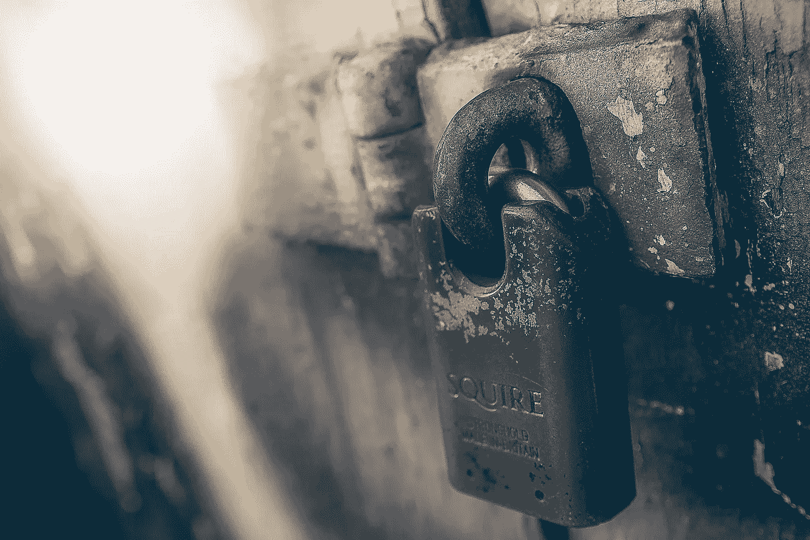
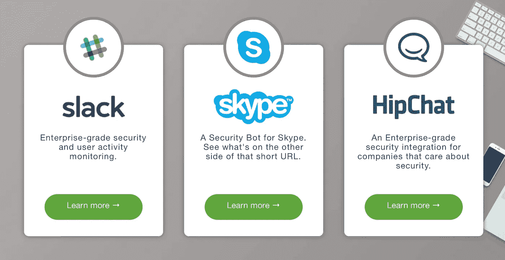

# 你如何阻止 ICO 抢劫？有了机器学习和很多常识

> 原文：<https://medium.com/hackernoon/how-do-you-stop-ico-heists-with-machine-learning-and-a-lot-of-common-sense-6d5c20825e56>

aul Walsh 是 MetaCert 的创始人，这家公司一开始试图阻止假新闻，但突然发现它的软件能够确保代币销售的安全。通过确保任何出现在 Slack 聊天室的链接都是真实的。至少对一些 ico 来说，这保证了价值数百万美元的代币的安全。让我们看看他是怎么做的。

*简森-巴顿:跟我说说梅塔塞特。它是做什么的？*

Paul: MetaCert 是一家安全公司，保护各种规模的公司和社区在使用 Slack 和 HipChat 等消息服务时免受恶意链接的攻击。我们有针对 Messenger 和 Skype 等其他平台的安全产品，但我们现在专注于帮助保护加密货币社区免受 Slack 内部的网络钓鱼攻击，因为这是令牌发行公司、ico 及其投资者目前面临的头号问题。

JB:如今，安全漏洞似乎无处不在。消费者该如何保护自己？组织应该有哪些不同的做法？

p:当涉及到漏洞时，人通常是最薄弱的环节。消费者需要时刻保持警惕。我有三条建议，如果遵循这些建议，许多消费者会更加安全。

首先，千万不要使用 SMS 作为二级/备用密码，即 2FA(双因素认证器)。坏人很容易给你的手机提供商打电话，把短信转到他们的手机上。他们甚至不需要侵入你的 gmail 账户——他们只需将密码发送到你的，不，他们的手机上，就可以重置密码。相反，使用移动应用程序作为第二层身份验证，这要安全得多。

如果你喜欢投资加密货币，并收到一条关于 ICO 或 Token 折扣的消息，这条消息对时间很敏感，听起来好得令人难以置信，那就是真的。直接联系公司，问他们是不是真的。加密公司不会有让你在几分钟甚至几小时内行动的时间敏感交易。所以不要放松警惕——这是非常聪明的人被愚弄的方式。

我的第三个建议是——当访问需要登录的网站时，特别是当他们要求信用卡或加密钱包密钥时，最好在地址栏中键入网站域名，而不是搜索它。然后将它加入书签。在谷歌或必应中搜索一家公司的名字，很可能会出现真正的网站以及模仿的内容——除非你有一双训练有素的眼睛，否则几乎不可能知道其中的区别。

坏人现在使用 SSL 证书，所以他们的网站在浏览器工具栏上放了一把挂锁。任何人都可以这样做，因为 SSL 证书是免费的，它们不需要任何公司验证。这个挂锁并不表示这个网站是真实的。所以，不要依赖挂锁。如果工具栏中有绿色的公司名称，那就称为扩展验证证书，可以信任。

组织需要在安全性上投资。他们需要考虑员工可能会使用自己的移动设备的新时代。这意味着他们没有连接到其组织的基于云的安全性，并且他们不太可能使用安全的 VPN。这使得他们的设备和他们作为一个人，容易受到网络攻击。当使用 Slack 或 HipChat 时，组织需要安装 MetaCert，因为它嵌入在服务的结构中，所以不管一个人使用什么设备或连接到什么网络。对于其他应用相关的安全产品，我推荐 Lookout 和基于云的 Okta。

银行需要停止向消费者发送电子邮件，要求他们点击链接，以便在浏览器中打开安全信息。这是我职业生涯中见过的最愚蠢的事情——大多数银行都这么做，却没有帮助教育消费者关于钓鱼链接的陷阱。

谁应该使用这种安全措施？

p:在 2017 年已经被加密罪犯窃取的 2.25 亿美元中，有 1.15 亿美元是通过网络钓鱼窃取的。这使得网络钓鱼成为加密货币领域的头号问题。几乎所有的加密社区都建立在 Slack 内部。因此，这使得 slack 成为网络钓鱼诈骗的头号攻击媒介。MetaCert 是唯一一家针对这一特定问题设计产品的公司。我们目前的重点是帮助加密公司和他们的投资者更安全，减少他们陷入骗局的风险。

Token launches 和 ico 是我们的理想客户，他们在 slacksecurity.metacert.com[的](http://slacksecurity.metacert.com/)安装我们的软件只需不到 7 秒钟

当然，其他关心安全性的公司也应该为 Slack 和 HipChat 安装我们的集成——特别是如果他们需要考虑法规遵从性的话。

*JB:反网络钓鱼对电子商务、交易和 ICO 代币销售有多重要？*

p:至关重要！密码世界充满了第一次投资者。这是区块链技术的主要好处之一——它分散了下一个大事件中的权力和投资机会。这些人大多是不老练的投资者，所以一旦他们被网络钓鱼诈骗弄得焦头烂额，他们就不太可能投资未来。或者在最好的情况下，他们会推迟投资，并可能告诉家人和朋友他们的损失。

通过让更多的人免受网络钓鱼欺诈，我们可能会看到更多的钱投资于新令牌的发行和 ICO，因此，更多的加密货币普遍流通。他们也将更有可能在未来买卖密码。因此，帮助解决这个问题符合每个人的最佳利益。

*JB:他们可以采取什么措施来防止被自己的员工钓鱼，他们的消费者应该采取什么措施来防止被钓鱼？*

和我之前描述的一样。不管是社区成员还是员工。但这肯定是一个相关的问题，因为大多数公司更关心内部威胁，而不是外部黑客。现在，随着信息在 Slack 等协作工具中更加自由地流动，安装安全产品以确保它们不会共享或泄露敏感信息非常重要。例如，Slack 最近宣布，公司将能够与其他公司共享频道。这是一个尚未解决的巨大安全威胁——除了 MetaCert 将通过现有功能默认解决这一问题。

*简森-巴顿:你认为 ICOs 最大的安全问题是什么？应该如何解决这个问题？*

p:钓鱼。根据硬币分析有超过 30，000 名受害者。你不会像大黑客那样经常在媒体上听到他们的消息。黑客之所以受到关注，是因为它发生的频率较低，但数量较大。但正如我所说，网络钓鱼是一种威胁。随着越来越多的令牌发布、ico 和政府关于监管的评论，加密世界越来越受到媒体的关注，越来越多的网络罪犯将被这种新型骗局所吸引。没有像 MetaCert 这样的软件，几乎不可能停下来，他们知道这一点。我看到网络钓鱼呈指数增长，不仅仅是与新的加密货币和解决方案的数量成比例。

*简森-巴顿:人们根本没有注意到的一件事是什么，你希望他们注意到？我们都错过了什么？*

p:事实是他们在不该注意的时候注意到了浏览器中的挂锁。停下来。除非它的地址栏中有公司名称，在域名之前，忽略它。毫无意义。它可以是一个假冒的网站。