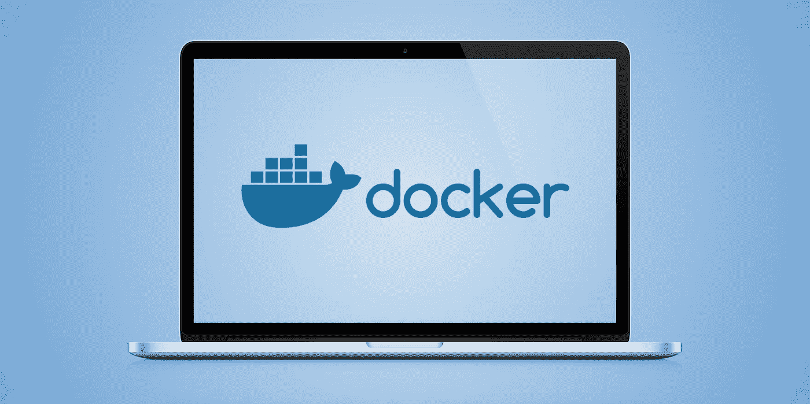

# Docker 如何改变我的工作流程

> 原文：<https://medium.com/hackernoon/how-docker-changed-my-workflow-b953b79b73ff>

# **前言**

这篇文章主要针对那些使用 Linux 作为工作操作系统的开发人员。其他人会发现这篇文章很有启发性，可能会引发关于如何在其他操作系统上实现相同功能的讨论。

# **故事开始**

当您同时处理不同的项目时，您的环境中充斥着不同的工具。这些工具安装其他工具，创建目录(隐藏，而不仅仅是)。经过一段时间的使用后，它们会在硬盘上缓存一些东西来占用你的空间。你试图找出缓存或其他人工制品在哪里，并删除它们。你这样做是在浪费时间。你压力很大。您只想安装工具，并在完成后简单地从系统中删除它们。

是的，对于 macOS 有`brew`。使用 Linux 的开发者都知道`apt`、`yum`等。但是，即使这些应用程序有`remove`命令/钩子，它们也不会从你的系统中删除所有东西。

# **想法和解决方案**

那么，该怎么办呢？什么可以隔离这些工具，使它们只在我需要时可用，并在我完成时删除它们？

我首先想到的是——[Docker](https://hackernoon.com/tagged/docker)。Docker 可以解决这个问题。从那天起，Docker 改变了我白天使用工具的方式。让我们探索一下，你如何能够*几乎*完全将你的环境分类。这可能适用于您的开发、测试或两种环境。

# 例子

例如，你被惩罚为下一个伟大的[区块链](https://hackernoon.com/tagged/blockchain)项目使用节点堆栈。应该安装的基本设备有:

*   结节
*   npm
*   纱线(因为我们既酷又现代)

对我来说，在我的本地系统上安装所有这些东西并不是最好的选择。怎么办？

谢谢，我们有码头工人。我建议的解决方案如下。

让我们来对付`yarn`。创建文件`/usr/local/bin/yarn`。该文件将如下所示:

如您所见，这是 docker 容器周围的 bash 包装器。您可以像往常一样在终端中使用它`yarn`运行所有您喜欢的命令。但是有安全干净的环境！多酷啊。

# 结论

更多的例子，请查看 https://github.com/skibish/dockerized 仓库。欢迎拉请求和码头化的想法。

祝你好运！