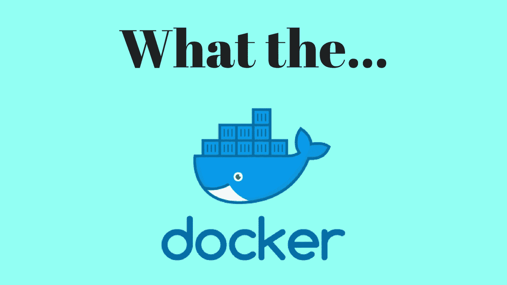

# Docker 如何将我的部署时间从 1.5 小时缩短到 5 分钟

> 原文：<https://medium.com/hackernoon/how-docker-cut-down-my-deployment-time-from-1-5-hours-to-5-minutes-35e4f9701504>

什么样的项目应该使用 Docker 这样的容器系统？* *快讯* * **全部！**

What the Docker?

我最近发布了一个全新的聊天应用， [Kiven Aa](https://kivenaa.com) 并将其源代码推向生产，这是一件轻而易举的事情，不像我的老系统，如[花粉聊天](https://pollenchat.com)，我必须在将新代码推向生产的前几天鼓起足够的勇气并下定决心。

在现代后端中，有太多的移动块和块需要处理，以至于您需要一个完整的文档，为如何正确部署和解决已部署应用程序的所有问题提供指导。

但后来发现，在我忙着给花粉聊天写代码、部署代码的时候，业界已经找到了我部署问题的解决方案。部署是最关键的领域，我认为像 Docker 这样的容器系统确实产生了影响。

你会问，什么是容器系统？

> 容器基本上将运行应用程序所需的设置和库捆绑在一个独立的包中，这样这个包就可以在 docker server 可以运行的任何环境中运行。

因此，Docker 可以让你的整个应用基础设施成为一个即插即用的系统。让我给你一个如何工作的鸟瞰图。

1.  编写应用程序，让它成为基于 Node.js 的应用程序。
2.  您的代码已经准备好部署了，还有其他依赖项，如数据库服务器、缓存服务器等。
3.  您在本地开发系统上安装 Docker
4.  你写一个 *Dockerfile* ，它基本上是一个指定你的容器的配置的文件，也就是说，你的源代码保存在哪个目录(在容器里面)，它需要从互联网上安装什么其他的软件，它需要做什么其他的配置，使所有的东西在容器里面一起工作，就像你的本地系统一样
5.  您使用 docker build 命令构建容器，该命令读取您的*docker 文件*并构建您的容器，这是一个自给自足的独立盒子，足以运行您的应用程序。
6.  现在，您的容器可以放在安装了 Docker server 的服务器上了。
7.  就这样，您的容器现在可以接受请求并发送响应了！就像你当地的开发环境一样。

这就是你在生产中使用容器部署应用的方式。下一次你要改变你的应用程序时，你所要做的就是重新构建容器，然后按下按钮，你就万事俱备了。

有 [docker-machine](https://docs.docker.com/machine/) 来帮你管理服务器。你甚至不需要配置和登录服务器来部署你的容器， *docker-machine* 为你处理所有的事情。它可以自行配置自动气象站和数字海洋云服务器。既然 docker-machine 支持我，我真的不需要登录我的生产服务器。事实上。我已经很久没有登录我的生产云服务器了，甚至忘记了我的登录凭证。*好的，我确实记得我的登录凭证，但是你知道我对这项技术有多兴奋，对吗？*

# 我认为社区需要更多地了解这样一种奇妙的技术。我正计划制作一个关于 Docker 的实践视频课程和博客帖子。当我准备好材料的时候，跟随我成为你们网络中的第一个，去了解它。

我想我已经成功地在 Docker 上把你卖了。如果你需要任何帮助来设置你的项目，请随时联系我，在这个帖子上留言或者使用我的社交媒体账号。

如果你喜欢这篇文章，请把它推荐给你的社交网络，并关注我的更多类似文章。如果你喜欢开发数字化的东西，你也应该订阅我的 YouTube 频道。

## [脸书](https://www.facebook.com/raynstudios) | [推特](https://twitter.com/rajat1saxena) | [YouTube](https://www.youtube.com/channel/UCUmQhjjF9bsIaVDJUHSIIKw)

直到下一次…