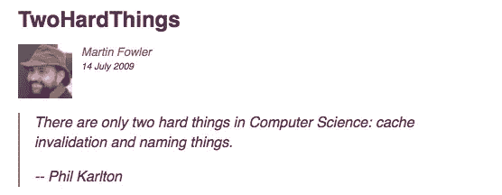
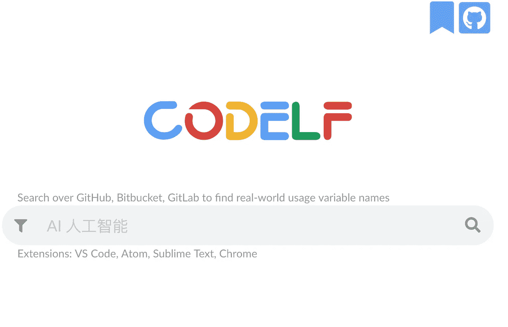
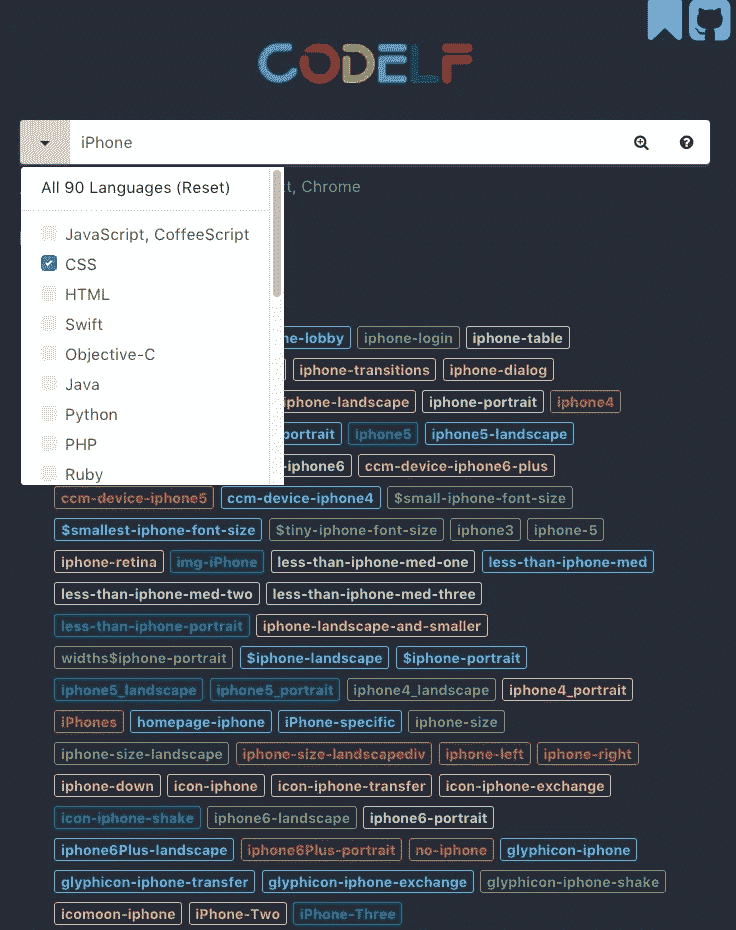
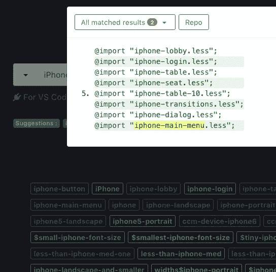
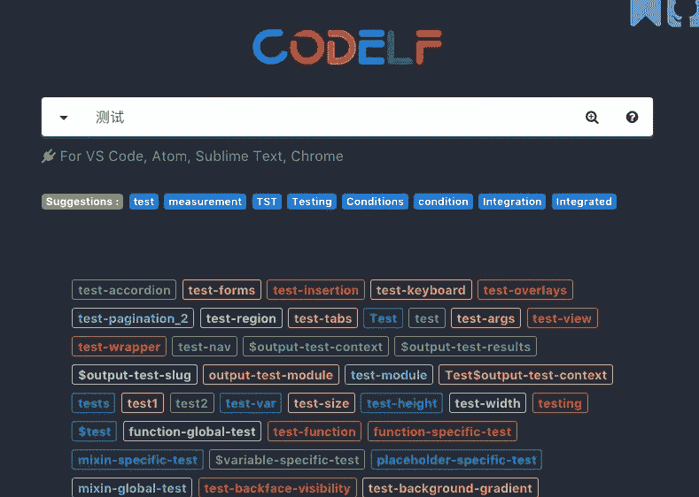
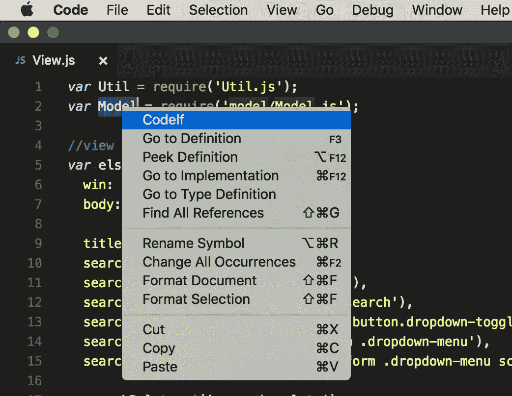
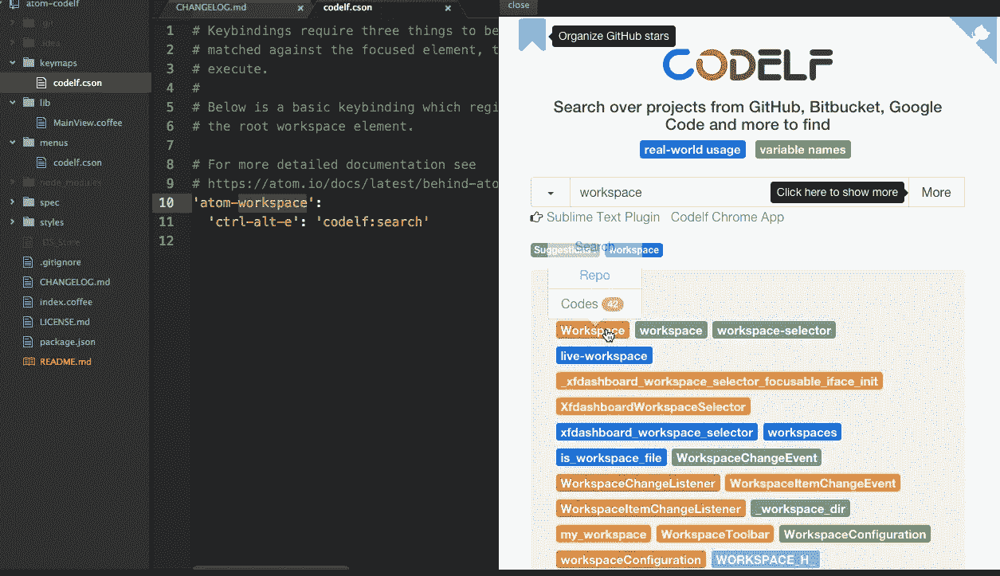

# Codelf 如何帮助你更好的命名函数/变量？

> 原文：<https://medium.com/hackernoon/how-does-codelf-helps-you-to-name-function-variable-better-3f56de2ceb48>

你对函数/变量名有疑问吗？你当然知道。你写了多久的代码并不重要。给事物命名很难。尤其是对于开发者来说。

普利赫·卡尔顿(Plih Karlton)说，“计算机科学只有两个硬东西:缓存失效和事物命名。”

 [## 两件硬东西

### 计算机科学中只有两件难事:缓存失效和事物命名——菲尔·卡尔顿(奖金…

martinfowler.com](https://martinfowler.com/bliki/TwoHardThings.html) 

> “结果是基于开发者在 Quora 上提供的 4500 张投票和一个更老的 Ubuntu 论坛帖子。给事物命名获得的票数(差不多)和接下来的 8 个最难的任务加起来一样多。哇！”

 [## 如果你没有一本好的辞典，就不要从事编程

### 上周，我写了一篇关于程序员必须完成的最艰难任务的文章。它主要基于最近的一次讨论…

www.itworld.com](https://www.itworld.com/article/2833265/cloud-computing/don-t-go-into-programming-if-you-don-t-have-a-good-thesaurus.html) 

越来越多的开发者有了共同的问题，他们不断在 Reddit 上发表评论。

信不信由你，有一个名为 Codelf 的搜索引擎，当你遇到函数/变量命名的问题时，它可以帮你节省时间。这是第一个试图为开发者解决最困难问题的工具。由[提供动力的引擎搜索代码](https://searchcode.com/)。

 [## CODELF

### 最佳 GitHub 明星，仓库标记者和组织者。从 Github、Bitbucket、Google Code 搜索项目…

unbug.github.io](https://unbug.github.io/codelf/) 

它是开源的，很受欢迎，在 GitHub 上获得了超过 5k+颗星。

 [## unbug/codelf

### 最佳 GitHub 明星，仓库标记者和组织者。从 Github、Bitbucket、Google Code 搜索项目…

github.com](https://github.com/unbug/codelf) 

它就像任何其他搜索引擎一样，你给它一个关键字，它会给你结果，不同的是它只给你现实世界中使用的变量名。它搜索 GitHub、Bitbucket、GitLab 中的项目来找到它们。

你甚至可以选择你最喜欢的语言。您也可以查看源代码，它会突出显示变量名的使用位置。

最好玩的部分是，你不需要用英语关键字搜索，用你的母语搜索，Codelf 会把它翻译成英语然后搜索结果。

Codelf 对每个开发者真的很好，有 VSCode，Atom，Sublime Text，Chrome app 的插件。

Fro VSCode

For Atom

Code + Elf = Codelf。意味着在你编码的时候有一个精灵并排。是不是太可爱了？