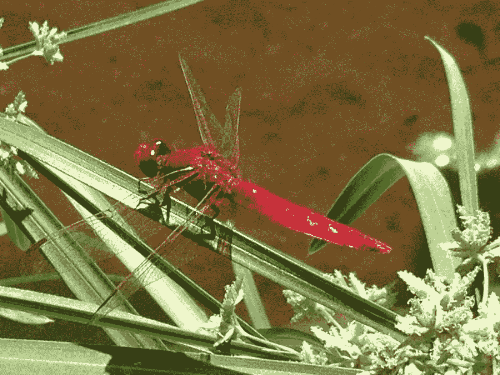
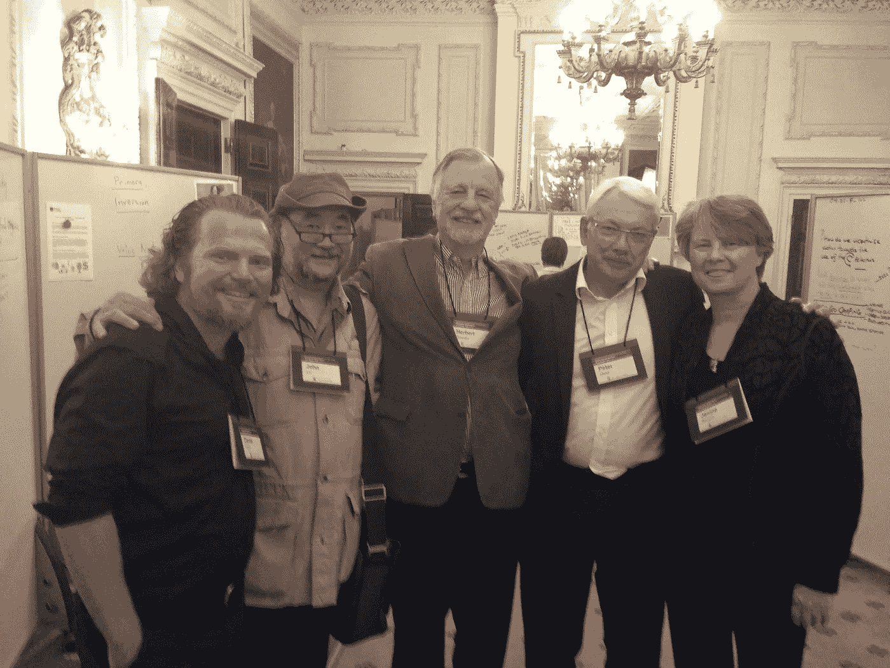
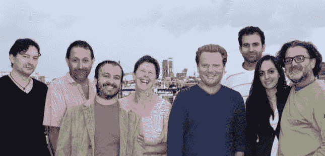

# 生命如何创造有利于生命的条件？

> 原文：<https://medium.com/hackernoon/how-does-life-create-conditions-conducive-to-life-713ae8d3535>

The molecular disassembles of life’s regeneration as a planetary process. (Image: Pixabay)

> 要注意，这是我们永无止境的正当工作。
> 
> —玛丽·奥利弗

大约 20 年前，科学作家和博物学家 Janine Benyus 给生物启发的设计和创新起了一个新名字:仿生。从那时起，她的作品将这一悠久的传统传达给了少数专注于生态学和生物学的设计师、工程师、材料科学家、化学家、生物学家和生态学家圈子之外的主流观众。她幽默而迷人的讲故事风格，以及她精心挑选的自然启发的可持续创新的例子，不断点燃企业领导人、清洁技术投资者、研究人员和技术人员的心灵和思想。

Male Scarlet Dragonfly (*Crocothemis erythraea) — photo Daniel C. Wahl*

基于仿生学的设计和技术有种直觉上正确的感觉。Janine Benyus 将再生文化的核心经验带到了点子上:**“生命创造有利于生命的条件”。**

在“[*——受自然启发的创新*](https://biomimicry.net/product/janine-book/)*’*”(Benyus，2002 年)中，她汇集了一系列鼓舞人心的例子和发明家的故事，预示着人类设计满足其需求的方法过程中的一个新时代。这个新时代与向大自然学习的古老传统产生了共鸣。书中提到的技术专家和科学家利用了生态设计、仿生工程和自然设计的先驱们的长期遗产。

This photo was taken at the kick-off meeting of the Commonwealth Secretariat & Cloudburst Foundation initiative to drive the implementation of ‘[Regenerative Development to Reverse Climate Change](http://thecommonwealth.org/sites/default/files/inline/WorkshopRegenerativeDevelopmentReverseClimateChange.pdf)’. From right to left: Janine Benyus, Peter Head, Herbert Girardet, John Dennis Liu, and Daniel Christian Wahl.

《生物仿生学》*的出版很可能被视为我们物种重新觉醒的又一个分水岭，人类需要重新整合人类事务与自然的生命维持周期，正如雷切尔·卡森的*寂静的春天*或*增长的极限*的出版标志着我们在理解对地球的生态影响方面的巨大飞跃。*

Janine Benyus 和她的团队已经将自然灵感的设计带到了世界各地的学校和大学。他们启发了国家创新战略，并与许多成功的企业领导人合作，其中包括 HOK、Nike、Patagonia、Seventh Generation、Natura、General Electric 和 NASA 等公司。

仿生革命正在全球蔓延。大学、R&D 实验室和专业网络正在响应号召，遵循生命的基本原则，为我们最紧迫的人类问题创造解决方案。正如她所说，我们正在重新学习将自然视为指导者、衡量标准和效仿的榜样。“仿生协会”成立于 1998 年，随后于 2005 年成立了非营利性的“[仿生研究所](https://biomimicry.org)”。仿生公会最终转型为[仿生 3.8](http://biomimicry.net/about/) 。

最近，在欧洲和国际上成立了许多新的基于网络的咨询小组，它们在生物和生态启发的创新方面拥有丰富的经验，其中有[共生小组](http://www.symbiosisgroup.com/#!who-we-are/cj36)、[仿生 NL](http://www.biomimicrynl.org/team.html) 、[仿生 Europa](http://www.biomimicry.eu/nos-actions/expertise-et-rd/) 、[仿生 Iberia](http://biomimicryiberia.com) 和[仿生创造性创新(BCI)](http://businessinspiredbynature.com/bci-people/) 和[仿生瑞士](http://biomimicryswitzerland.org/leadership-team/)。所有这些都在创建欧洲仿生联盟的过程中。在南非、拉丁美洲和亚洲也有仿生网络。

此外，还有一些平行的网络和企业专注于生物启发的技术创新(没有明确的目标是增加可持续性)。他们倾向于将他们的实践称为仿生学、仿生学和生物启发的创新，而不是使用仿生学这个词。

它们都将生物启发的技术创新与对可持续发展的坚定承诺相结合，在某些情况下，包括生物和生态启发的业务转型。其中有德国 [BioKon Network](http://www.biokon.de/en/network/goals/) 、 [Biokon International](http://www.biokon-international.com/network/aims/) 和[瑞典仿生学 3000](http://www.biokon-international.com/network/aims/) 。这些网络和企业不是在竞争，而是在合作，以满足全球企业和组织对生物灵感设计、技术和商业战略的快速增长的需求。

2012 年，为科勒工作的 R&D 专家特里萨·米勒德(Theresa Millard)召集了一群来自伊比利亚半岛各地的富有灵感的生物仿生学专家——设计师、建筑师、工程师、生物学家和技术专家——在西班牙和葡萄牙推广这种方法。2013 年初，我们共同创立了'[仿生伊比利亚公司](http://biomimicryiberia.com)'。

无论是个人还是集体，我们现在都开始与企业、大学和公共机构进行一系列合作，以建设能力和应用仿生创新。像我们在欧洲的同事和合作者一样，我们见证了对这一新兴领域的浓厚兴趣。受生物和生态启发的创新、设计和技术为再生经济和文化提供了切实可行的途径。

The founding team of Biomimicry Iberia Association in 2012

以下是 R&D 团队在追求创造生物创新时可以问自己的一些问题。这个问题列表是基于 Janine Benyus 和她的同事在 Biomimicry 3.8 收集和开发的进化列表“生命的原则”。

# **人生的问题**

## **我们如何发展和改造我们的技术和流程，从而为我们的物种和整个生命带来长远的未来？**

***迄今为止，哪些长期生存策略奏效了，我们如何复制它们？***

我们如何才能确保对未知事物和新见解保持开放的态度？

***如果我们把现有的信息和能力重新洗牌，用新的眼光去看待，是否能产生新的见解？***

## 我们如何确保保持并提高我们适应不断变化的环境的能力，并改变不再有用的东西？

我们以何种方式融入并保护多样性？

***哪些战略有助于保持系统的完整性，同时确保持续的自我更新和变革性创新？***

***我们如何通过在系统中设计冗余、变异和分散的重要功能来优化弹性？***

## **我们如何确保我们的解决方案适合当地情况，并能响应变化？**

***我们是否充分利用了循环过程，并充分利用了再生资源循环的系统性优势？***

***我们是否正在以可再生的方式创造使用现成(本地)材料和能源的解决方案？***

***我们应该注意哪些系统性反馈循环，并/或将其设计到解决方案中？***

为了创造更好的解决方案，我们可以培养和培育哪些合作和共生关系？

## **我们如何确保只使用对生命友好的化学物质？**

***我们使用的所有产品是否都可以分解成良性的组件，而不需要在这个过程中花费过多的时间跨度或大量的精力？***

***我们可以组合哪些最佳的组成元素来创建所需的解决方案？***

***我们是否在确保使用水溶性、无毒的化学物质？***

## **我们如何确保在使用最少量的本地资源的同时，创造高水平的材料和能源效率？**

***我们可以采用哪些低能耗流程来创造解决方案？***

***我们如何将多功能设计到解决方案中？***

***创建解决方案时使用的所有材料都是可回收的吗(最好是在当地和地区范围内)？***

***所提出的解决方案是以什么方式拟合表格来发挥作用的？***

## 我们如何将发展与[质量]增长相结合，并注意[数量]增长的局限性？

***有没有办法把自组织设计出来，并反馈到提出的方案中？***

我们是否确定要自下而上地构建？

***模块化和嵌套式组件的组合能否提高生产效率并提供灵活性和适应能力？***

**(以上问题基于《生物仿生 3.8》2014 版** [**生命的法则**](https://biomimicry.net/the-buzz/resources/designlens-lifes-principles/) **，并已改编成问题。)**

这些问题可以启发'[仿生思维](/@designforsustainability/how-can-we-learn-to-better-design-as-nature-f453bb3ecbc4)'，在多学科设计团队中，他们可以开启由生物和生态形式、过程和系统激发的创新。仿生创新的鼓舞人心的例子每年都在增加。它包括基于鸟类和鱼类的最佳形状改进火车、飞机、汽车和船只的能源使用和空气/流体动力学，以及受珊瑚礁或光合作用启发的二氧化碳隔离方法；从受贻贝启发的强力无毒胶水到受鲨鱼皮启发的油漆和表面，保持医院无菌，或减少货船的燃料消耗。

生态系统层面的仿生学正在教导我们如何将不同的技术过程编织成模拟自然生态系统中营养级联的工业生态系统，从而建立在一个生命原则上:一个过程的废物是另一个过程的食物。我们将在工业生态学和循环经济的章节中重新审视这一观点。

…(继续以产品设计、建筑、规划、工业生态学、循环经济等领域的 bimimicry 为例。)

**【这是节选自** [**设计再生文化**](http://www.triarchypress.net/designing-regenerative-cultures.html) **的一个分章节，三联书店出版，2016。这一节选略有改动，增加了一些更多的链接，三个图像，和两个段落被编辑出来，以创建印刷书籍。】**

## 更多关于仿生的信息:

[采访《合子季刊》](/@designforsustainability/interview-on-bio-inspired-design-with-daniel-christian-wahl-zygote-quarterly-issue-17-2016-c24f0ff5f88b)

[受生物启发的产品设计](/@designforsustainability/biologically-inspired-product-design-1161497707c)

> [黑客中午](http://bit.ly/Hackernoon)是黑客如何开始他们的下午。我们是 [@AMI](http://bit.ly/atAMIatAMI) 家庭的一员。我们现在[接受投稿](http://bit.ly/hackernoonsubmission)，并乐意[讨论广告&赞助](mailto:partners@amipublications.com)机会。
> 
> 如果你喜欢这个故事，我们推荐你阅读我们的[最新科技故事](http://bit.ly/hackernoonlatestt)和[趋势科技故事](https://hackernoon.com/trending)。直到下一次，不要把世界的现实想当然！

