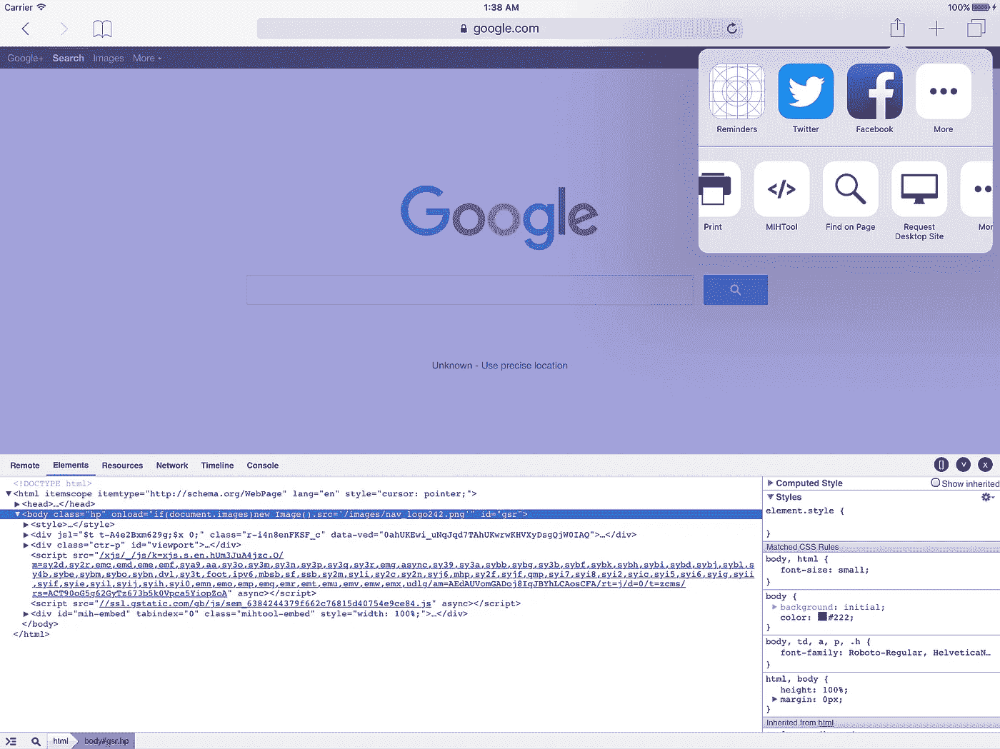
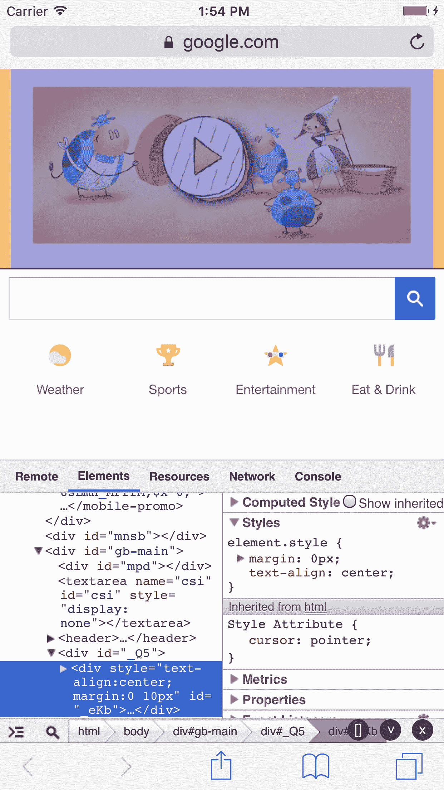
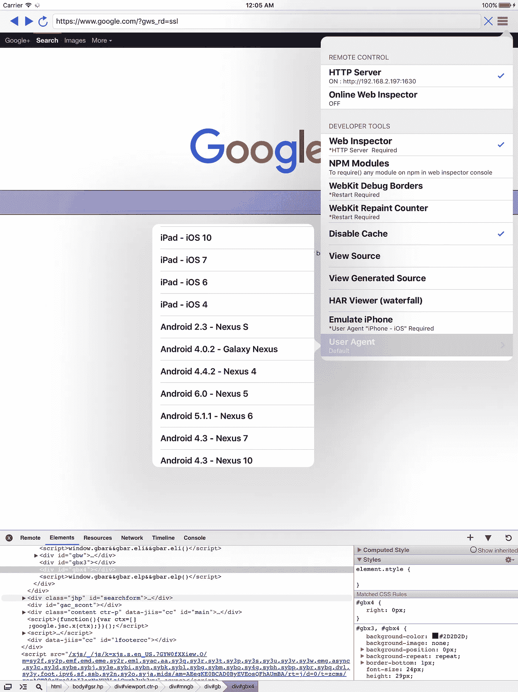
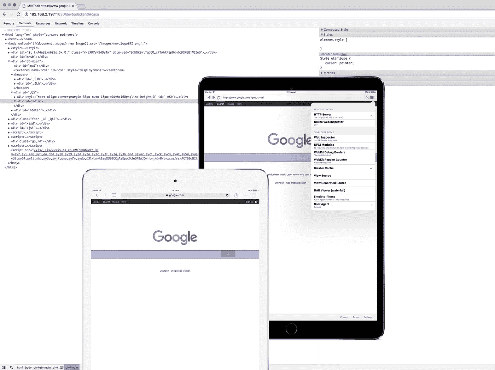
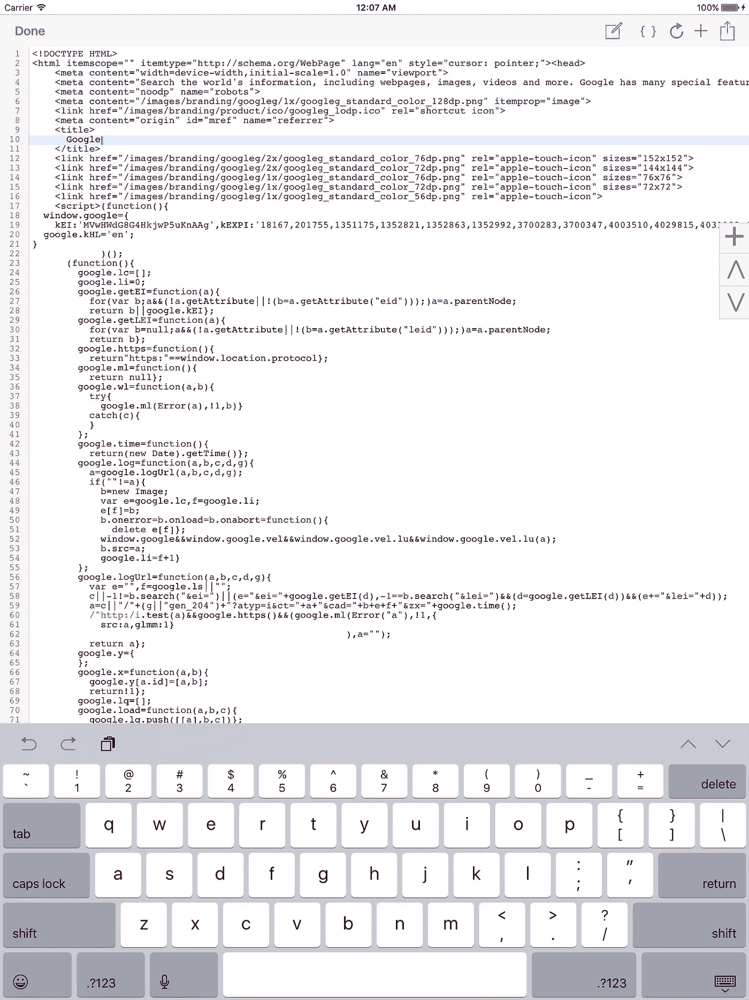
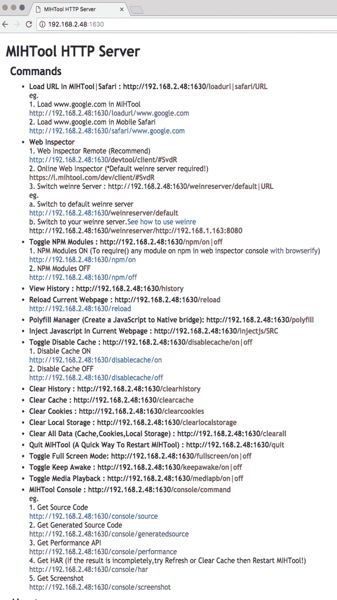
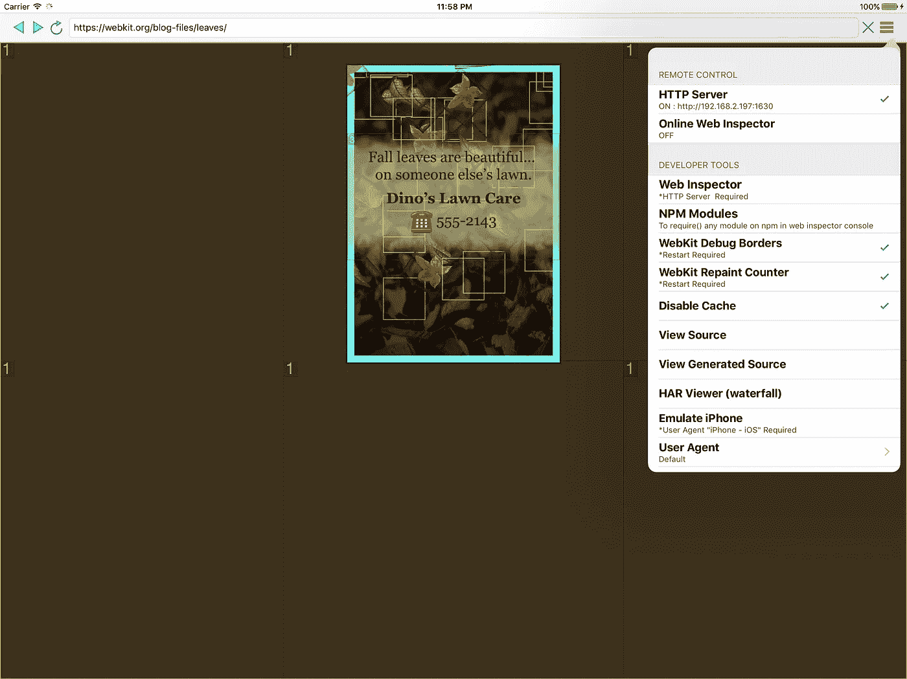
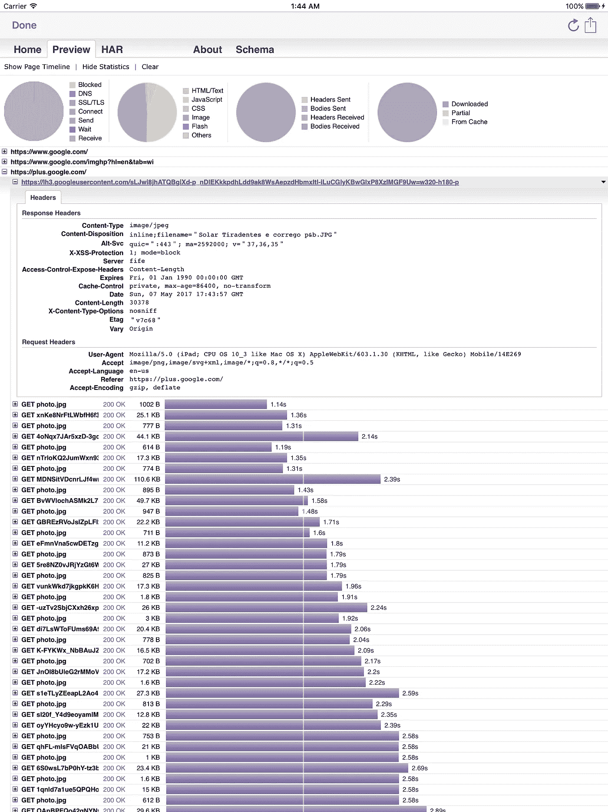
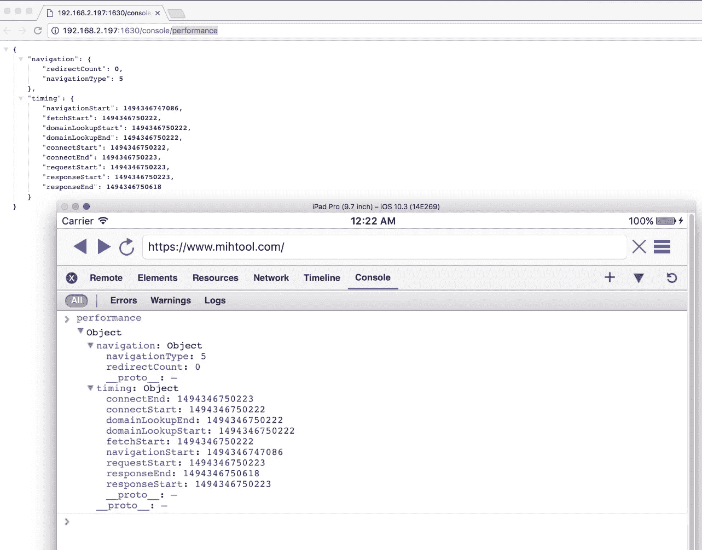
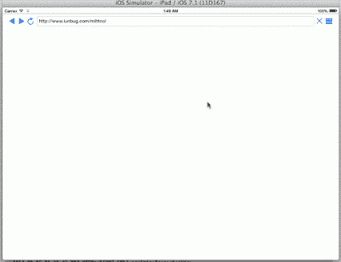

# 在 iOS 上调试网页时，MIHTool 如何节省您的时间

> 原文：<https://medium.com/hackernoon/how-does-mihtool-saves-your-time-when-debug-webpages-on-ios-a6f22cfb9f20>

 [## iOS 网络调试器专业版

### MIHTool 帮助前端工程师在 iPad 和 iPhone 上调试和优化他们的网页

www.mihtool.com](https://www.mihtool.com/) 

# 开发移动网络的现代工作流程— Google I/O 2013

# 移动网络星期四:开发工具

1.  Safari 的操作扩展，带来远程 Web 检查器以在 Safari 中调试您的网页。一个内嵌的网页检查器，是一个真正的 Chrome 风格的 iPad Safari 开发工具。了解更多信息…

MIHToo Action Extension for Safari 是第一个为 iPad Safari 带来真正 Chrome 一样的内嵌 DevTool 的应用程序。现在，你可以直接在 iPad 上用 iOS Safari 和 Safari View Controller 检查你的网页，而不用台式电脑。您也可以远程 Web 检查器来调试 Safari 和 Safari 视图控制器中的网页。要打开 MIHToo 操作扩展，只需点击 Safari 的共享按钮并选择 MIHTool，第一次，您可能需要在更多列表中启用它。
就像 Chrome DevTools 一样，有元素，有资源，有网络，有时间轴，有控制台面板。它完全针对触摸屏进行了优化。你可以最大化和最小化。
注意:如果你在网络或时间线面板中看不到任何日志，确保记录圈切换器是红色的。

2.内嵌网页检查器(像 Chrome DevTool 或 FireBug):带有元素、资源、网络、时间轴、控制台面板。了解更多信息…

在线网页检查器是 iPad 独有的功能。这样你就可以不用台式电脑直接在 iPad 上浏览网页了。
就像 Chrome DevTools 一样，有元素，有资源，有网络，有时间轴，有控制台面板。它完全针对触摸屏进行了优化。你可以最大化，最小化，放大和缩小。
注意:如果你在网络或时间线面板中看不到任何日志，确保记录圈切换器是红色的。
请查看这个[视频](http://mihtool.com/#slide-8)看看效果如何。
Web inspector 基于 [weinre](http://people.apache.org/~pmuellr/weinre-docs/latest/) ，bug 报告请查看 [weinre google group](https://groups.google.com/forum/?fromgroups#!forum/weinre) 。

3.Web inspector remote(weinre):远程调试和优化您电脑上的移动网页(window、mac、linux 和 chrome)。了解更多信息…

Web inspector remote 使您可以使用同一本地网络中的任何远程电脑(window、mac、linux 或另一台 iPad)来检查您的网页。
就像 Chrome DevTools 一样，有元素，有资源，有网络，有时间轴，有控制台面板。
注意:如果您在网络或时间线面板中看不到任何日志，请确保记录圈切换器为红色。
网页检查员是基于[温勒](http://people.apache.org/~pmuellr/weinre-docs/latest/)，漏洞报告请检查[温勒谷歌组](https://groups.google.com/forum/?fromgroups#!forum/weinre)。

4.在线网络检查员。了解更多信息…

在线网页检查员只是作为网页检查员远程工作。但是它允许你用任何在线的远程计算机检查你的网页，即使它们不在同一个本地网络中。
有时，您的设备在本地网络中，但可能无法相互访问，因此 web inspector remote 对您不起作用，但如果您的设备可以访问外部网络，online web inspector 就可以正常工作。

5.HTML 编辑器:查看带有语法高亮和格式化的网页源代码；编辑源代码或创建一个新的网页并预览结果。了解更多信息…

HTML 编辑器是 iPad 独有的功能。这使得你可以在 iPad 上查看和编辑任何带有语法高亮显示的网页源代码。当然，你可以用 HTML 编辑器创建一个新的网页并查看结果，你也可以格式化源代码或者只是与你的朋友分享。
它完全针对触摸屏进行了优化。你可以远程控制导出当前网页的源代码。

6.远程控制(带 HTTP 服务器):Remote to，加载 MIHTool|Safari|Chrome 中的 URL 在当前网页中注入 Javascript 清除网站数据；获取 HAR 数据；获取源代码；获取截图…了解更多…

打开 MIHTool 的 HTTP 服务器，您会看到一个类似于[**HTTP://192 . 168 . 1 . 101:1630**的 HTTP 链接，这个](http://192.168.1.101:1630,this)链接允许您能够从同一本地网络中的任何远程计算机(window、mac、linux 或另一台 iPad)远程控制 MIHTool。
从远程计算机打开 HTTP 链接，您会看到许多命令可供您使用。
MIHTool 的几乎每个功能都可以用它的命令进行远程控制，比如在 MIHTool|Safari|Chrome 中加载 URLWeb 检查器；在当前网页中注入 Javascript 查看历史；清除网站数据；获取 HAR 数据；获取源代码；获取截图，等等。所有的远程命令都像 REST 一样，所以你可以写一些自动运行的脚本来自动测试你的网页。这是非常方便的，你可以用一台电脑同时控制多台设备。

7.显示 WebKit 调试边框(合成渲染层)。了解更多信息…

显示 Webkit 调试边框(合成渲染层)和显示 WebKit 重画计数器(绘制矩形)是一种优化 web 应用程序并使其性能达到 60FPS 的方法。
要了解如何优化网络应用，请查看

*   [邱建自由](http://jankfree.org/)
*   [优化 iOS 上 UIWebViews 和网站的网页内容](https://developer.apple.com/videos/wwdc/2012/?id=601)
*   [Chrome 中的加速渲染](http://www.html5rocks.com/en/tutorials/speed/layers/)
*   [好奇的 web 性能](https://www.igvita.com/slides/2012/web-performance-for-the-curious/)

8.显示 Webkit 重画计数器(绘制矩形)。了解更多信息…

9.效仿 iPhone。了解更多信息…

模拟 iPhone 是 iPad 独有的功能。这使得您可以在没有 iPhone 的情况下查看您的网页在 iPhone 上的外观。

10.用户代理切换器。了解更多信息…

用户代理切换器是 iPad 独有的功能。这使得您可以切换其他平台的浏览器用户代理，如 android、pc 和 mac。

11.更多开发者小书签:Firebug，YSlow，JS 控制台，PageSpeed，GTmetrix…

12.评估地址栏中的 JavaScript。

13.全屏模式(摇动设备以切换全屏模式)。

14.禁用缓存。

15.清除历史记录、清除缓存、清除 cookies、清除本地存储。

16.保持清醒(默认开启)。

17.HAR 观察报。(另见 [logproxy](https://github.com/unbug/logproxy) )了解更多…

使用 HAR 浏览器，您可以查看您的网页网络流量瀑布，并导出 HAR 数据进行更高级的研究。
HAR 浏览器仅适用于 iPad，对于 iPhone，您可以使用遥控器导出 HAR 数据，并在[在线 HAR 浏览器](http://www.softwareishard.com/har/viewer/)中查看(确保“处理前验证数据？”未选中该框。)

18.性能 API。了解更多信息…

[性能 API](https://developer.mozilla.org/en-US/docs/Web/API/Performance)
的实现性能接口表示给定页面的时间相关性能信息。

19.Polyfill Manager(模拟 javaScript API 与 Objective-C 通信，[演示](http://youtu.be/uL2feHKevRE))了解更多…

您可以为混合应用程序构建网页，并且您的网页需要与原生应用程序通信。您可以使用 Polyfill Manager 来模拟原生应用程序的 API，因此您可以在原生应用程序完成之前调试您的网页，即使原生应用程序尚未安装在您的设备上。请检查这个[视频](http://mihtool.com/#slide-8)，看看它是如何工作的。

20.npm 模块(需要()网络检查器控制台[中 NPM 上的任何模块，带浏览器验证](https://gist.github.com/mathisonian/c325dbe02ea4d6880c4e))了解更多…

web inspector 控制台[中的 require()任何模块带有 browserify](https://gist.github.com/mathisonian/c325dbe02ea4d6880c4e)
浏览器没有定义 require 方法，但是 Node.js 定义了。使用 Browserify，您可以编写使用 require 的代码，就像在 Node 中使用它一样。
该功能使 MIHTool 更加强大，让您更容易调试和优化您的网页。

# 字体端大师对 MIHTool 的评价:

*   MIHTool 是一款出色的工具，可以帮助你在 iOS 上调试网站。— @pbakaus(谷歌)。
*   MIHTool 将改变你的生活:一个完整的在线网页检查器。— @addyosmani(谷歌)。
*   MIHTool:一个智能强大的 iOS WebView 调试工具。——‏@保罗 _ 爱尔兰(谷歌)。
*   MIHTool:iPad 和 iPhone 上调试网站的好工具。—‏@smashingmag(smashing magazine)。

# 关于 MIHTool 的文章:

*   [Paul Bakaus](https://twitter.com/pbakaus) (谷歌的开放网络开发倡导者): [MIHTool，iOS 网络调试器](http://paulbakaus.com/tutorials/performance/mihtool-the-ios-web-debugger/)
*   谷歌开发者:[移动网络周四:开发工具](https://www.youtube.com/watch?v=jXqrgtm-yF8)
*   谷歌 I/O 2013 : [开发移动网络的现代工作流程](https://developers.google.com/events/io/sessions/324558168)(作者[马特·冈特](http://gauntface.co.uk/))，[幻灯片](http://io13mobileworkflow.appspot.com/#17)
*   东京前沿:[移动网络开发工作流程](https://speakerdeck.com/addyosmani/mobile-web-development-workflow)(作者[艾迪·奥斯马尼](http://addyosmani.com/)
*   扬·波尔泽:[Jak na to—vzdálenéladníwebu na iPadu pomocíMIHTool](http://www.maxiorel.cz/jak-na-vzdalene-ladeni-webu-na-ipadu-pomoci-mihtool)
*   tribo do C . I . podcast:[mih tool:FAA OS SEUS application ativos WEB PARA IOS acontecter](http://tribodoci.net/artigos/mihtool-faca-os-seus-aplicativos-web-para-ios-acontecer/)
*   皮特:皮特里弗斯博物馆的内部声音
*   优香: [MIHTool: iOS 网络调试器](http://jucke.com/webdev/mihtool-ios-web-debugger/)
*   unbug : [与大家分享 MIHTool 的开发心得](http://www.iunbug.com/archives/2013/03/17/767.html)
*   InfoQ : [iOS Web 开发调试工具 MIHTool 作者访谈](http://www.infoq.com/cn/news/2013/03/mihtool-interview)

# 嵌入式 web 检查器

# Polyfill 管理器(模拟 javaScript 到 Objective-C 通信的 API)

> [黑客中午](http://bit.ly/Hackernoon)是黑客如何开始他们的下午。我们是 [@AMI](http://bit.ly/atAMIatAMI) 家庭的一员。我们现在[接受投稿](http://bit.ly/hackernoonsubmission)并乐意[讨论广告&赞助](mailto:partners@amipublications.com)机会。
> 
> 如果你喜欢这个故事，我们推荐你阅读我们的[最新科技故事](http://bit.ly/hackernoonlatestt)和[趋势科技故事](https://hackernoon.com/trending)。直到下一次，不要把世界的现实想当然！

