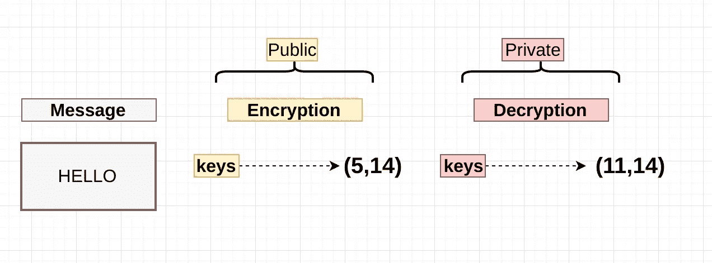
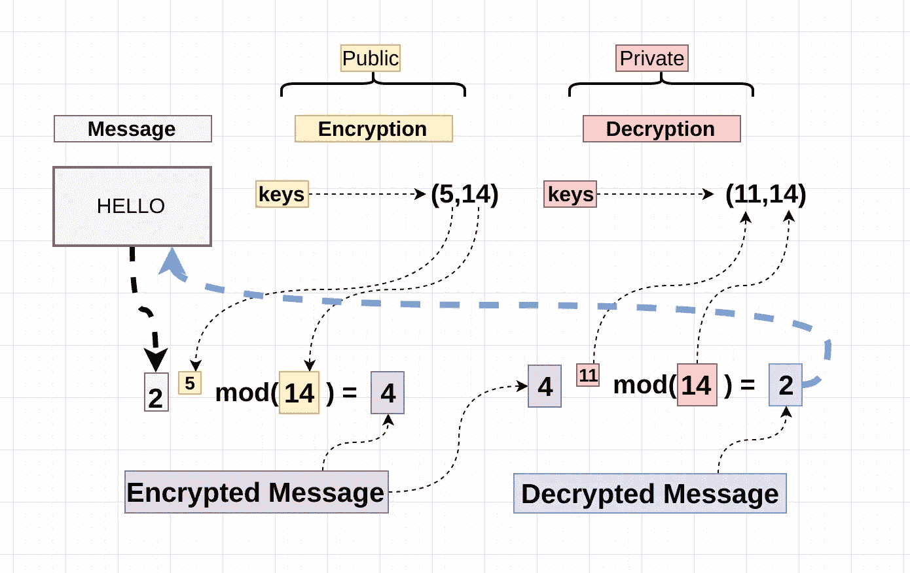
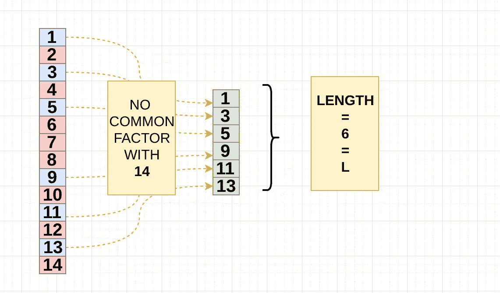
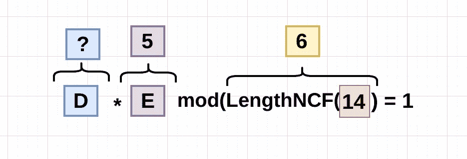
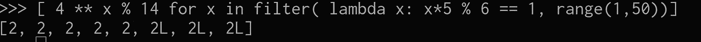

# RSA 是如何工作的？

> 原文：<https://medium.com/hackernoon/how-does-rsa-work-f44918df914b>

嘿，伙计们，我想写一点关于 RSA 密码系统的东西。

**RSA** 是一个**非对称**系统，这意味着一个密钥对将被生成(我们将看到多快)，一个**公钥**和一个**私钥**，显然你保持你的私钥安全并传递公钥。

该算法于 70 年代由 Ron **R** ivest、Adi **S** hamir 和 Leonard **A** dleman(即 RSA)发布，它实现了类似 Diffie 的陷门函数。

**RSA** 相当慢，所以它几乎不用于加密数据，更多的时候它用于加密和传递对称密钥，这实际上可以以比**更快的**速度处理加密。

## 它是如何工作的？

和在 D-H 中一样，我将使用相当小的数，但请记住，大多数基于 **mod(p)** 的算法的真实值是在使用巨大的素数时产生的。

第一部分我将展示活板门功能是如何工作的，然后我将解释为什么它会工作，就这么简单。



Essentials

我们得到了一个消息(“HELLO”)，我们选择了两个元组，每个元组有两个数字(我稍后会解释这是如何产生的)。很明显，我们不能对字符串执行算术运算，所以消息必须被转换成某种形式，所以让我们使用某种转换算法将" HELLO "转换成" **2** "

***通常，在生产中，会使用许多不同的技术对信息进行编码，还会使用填充***

好极了，我们已经得到了我们需要的一切，让我们通过理论上将为我们加密的函数来运行消息:



mini rsa

这就是 RSA 算法的基础，以及捕获函数的布局。

有趣的是我们如何得到这些数字，以及(5，14)与(11，14)的关系，我认为这是有趣的部分，让我们开始:

**解密/加密对的细节:**

1.  挑选两个质数，我将挑选 **2** 和 **7，**让我们称它们为 p 和 q

```
**P** = 2 and **Q** = 7
```

2.将 **P** 和 **Q** 相乘，这就是模数

```
**N** = P * Q = **14**
```

3.列出 **1** 和**14**之间的列表，去掉共同因素；



现在有一个简单的方法来得到这个，那就是:

```
( **Q** - 1 ) * ( **P** - 1) = **L**(7 - 1 ) * ( 2 -1 ) = **6**
```

太好了让我们保存这个数字，让我们称它为" **L** "

4.现在我们开始挑选加密密钥，在示例中是( **5，14** )，我们知道 **14** 是模数。

对于加密密钥，有几个规则:

*   它必须在 **1** 和**1**之间

```
[2,3,4,5]
```

*   与 **L** (6)互质，与**模数** (14)，答案是 **5，**没有其他可能。

所以我们得出了为什么选择( **5，14** )的结论

5.解密部分，在我们选择的例子中( **11，14** )，同样 14 是模数，但是 11 从何而来呢？？，从现在开始让我们称它为 **D，**让我们找出为什么 **D** 是 11:

d 必须遵循一条规则，那就是:



因此，解密器(11)乘以加密器(5)的模数，具有模数(14)的非公因数的长度必须等于 1。

```
**D** * **E** % **LNCF**(N) = **1**
11 * 5 % 6 = 1
```

所以我们知道，如果我们乘以 D * E，E 是 5，D 需要是 5 的公因数，所以:


所以我做了一个从 1 到 50 的数字列表，并过滤了乘以 E 和用 LNCF(N)对 T21(N)进行模乘(T22)后等于 1 的数字，所以让我们看看这些数字是否能解密消息:)，记住加密的消息是“ **4** ”，解密的消息是“ **2** ”，所以函数应该是这样的:

```
4 ** D % 14 = 2 <---Decrypted message
```

所以让我们做一点列表理解，看看这个规则是否有效:



太好了！它成功了，你看如何将函数应用到所有遵循规则的解密密钥(**D*****E**%**LNCF**(N)=**1)，**成功解密了消息。

我希望这不会变得太复杂，它确实感觉有点复杂，但我试图让它尽可能简单。

[](http://bit.ly/HackernoonFB)[](https://goo.gl/k7XYbx)[](https://goo.gl/4ofytp)

> [黑客中午](http://bit.ly/Hackernoon)是黑客如何开始他们的下午。我们是 [@AMI](http://bit.ly/atAMIatAMI) 家庭的一员。我们现在[接受投稿](http://bit.ly/hackernoonsubmission)并乐意[讨论广告&赞助](mailto:partners@amipublications.com)机会。
> 
> 如果你喜欢这个故事，我们推荐你阅读我们的[最新科技故事](http://bit.ly/hackernoonlatestt)和[趋势科技故事](https://hackernoon.com/trending)。直到下一次，不要把世界的现实想当然！

