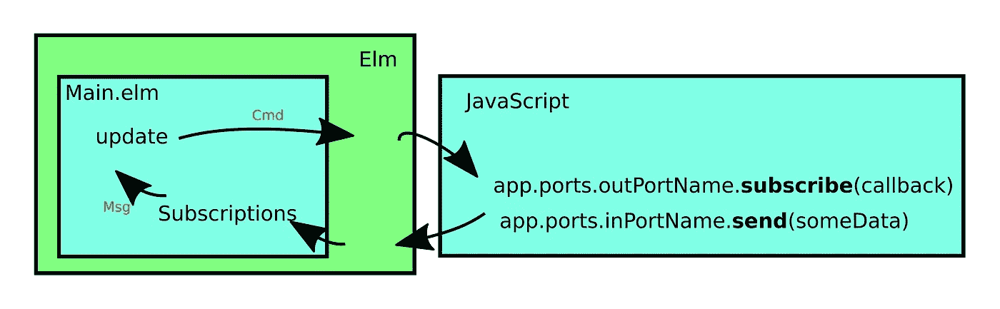

# Elm 端口如何工作，附图片(仅一张)

> 原文：<https://medium.com/hackernoon/how-elm-ports-work-with-a-picture-just-one-25144ba43cdd>

[Elm](https://hackernoon.com/tagged/elm) ports 是与 [JavaScript](https://hackernoon.com/tagged/javascript) 交互的主要方式之一。然而，我觉得我需要告诉你，如果你可以逃脱，你应该只使用旗帜。标志传递一些初始值给 Elm，这无疑是最简单的方法。然而，如果你想要更多的来回通信端口的方式。

# 高级概述

首先，这是图片:



端口基本上是发布-订阅模式(也称为观察者模式)。**端口是 Elm 和 JavaScript** 之间的连接管道。

每个端口只有一个方向。不是 Elm ->JavaScript 就是 JavaScript -> Elm。所以自然地，如果你想要双向交流，你只需要做两个。

# **制作端口**

## 一些设置

如果你打算继续做下去，请遵循这些步骤(或者也许[只要看看代码](https://github.com/justgage/complete-elm-port-example))

**步骤 1:** 用完整的`Html.program`建立一个`Main.elm`文件

第二步:一个`.js`文件，暂时可以为空

**第三步:**一个`index.html`文件，包括`elm.js`(编译的 elm 文件)和`whatever.js`文件，后者包含你想要交互的代码。

## 从 Elm 到 JavaScript

在模块的开头加上一个`port`来注释模块

1.  创建一个到 JavaScript*的端口*，其类型签名如下**

```
*port **toJs** : String -> Cmd msg*
```

*这将*创建一个名为`toJs`的函数*，该函数创建`Cmd` s(命令)。如果你记得你可以在`update`函数中返回`Cmd`作为元组的第二部分！就这么办吧。*

```
*update msg model =
    case msg of SendToJs str ->
            ( model, **toJs** *str* )*
```

*这将神奇地把`*str*`发送到 JavaScript 的土地！只对订阅它的人开放。要订阅它，您需要:*

```
*var node = document.getElementById('view');
var app = Elm.Main.embed(node);// receive something from Elm
**app.ports.toJs.subscribe**(function (*str*) {
  console.log("got from Elm:", *str*);
});*
```

## *从 JavaScript 到 Elm*

*在 JS 土地上你 ***通过端口上的`send`方法发送*** 的东西。像这样:*

```
*var node = document.getElementById('view');
var app = Elm.Main.embed(node);
app.ports.**toElm.send**("undefined is not a function");*
```

*自然 JS 说是习惯用语。*

*所以我们定义了一个新的端口:*

```
*port toElm : (String -> msg) -> Sub msg*
```

*这就创建了一个函数，*接受一个函数*，这个函数可以将 JS 发送的字符串转换成一个`Msg`(也可以是两者兼容的任何值)这个函数返回一个`Sub`而不是一个`Cmd`，所以我们需要在 Elm 中为**订阅**:*

```
*subscriptions : Model -> Sub Msg
subscriptions model =
    toElm UpdateStr*
```

*基本上这是说:*

> **每当 JS 通过* `*toElm*` *端口向我发送东西时，就向* `*update*` *函数发送* `*UpdateStr*` *消息。**

*我们可以像处理 update 函数中的其他函数一样处理这个`Msg`:*

```
*update msg model =
    case msg of
        UpdateStr str ->
            ( { model | message = str }, Cmd.none )*
```

*基本上我只是把 JS 给我的字符串存储到我的模型的一部分。*

# ***🚨警告:运行时异常提前！**🚨*****

*虽然我使用了`String`来保持简单，但这是**危险的**。*

*如果 JavaScript(以其无限的智慧)决定发送一个不是字符串的东西(比如 null、undefined、NaN、rubber duck、a function 等等)。)然后 **Elm 将抛出一个运行时异常并停止它的运行循环**。*

*这意味着 Elm 将不能接受任何输入或以任何方式响应。*死了。**

*使你的 elm 代码*再次防弹的方法*改为将端口的类型改为`Value`。这意味着你必须写一个 Json。它的解码器。这样，如果 JS 决定给你发送一个错误的值，它只会返回一个`Err` 而不是抛出一个异常。*

*请参见此处的[差异](https://github.com/justgage/complete-elm-port-example/commit/b7bdec196e20b441fd524546dc07ae51b464a3f8)*

```
*import Json.Encode exposing (Value)
import Json.Decode as Decode-- Farther down in the file.... --port toElm : (**Value** -> msg) -> Sub msg-- SUBSCRIPTIONSsubscriptions : Model -> Sub Msg
subscriptions model =
    toElm (**decodeValue**)decodeValue : Value -> Msg
decodeValue x =
    let
        result =
            **Decode.decodeValue Decode.string x**
    in
        case result of
            Ok string ->
                UpdateStr string Err _ -> 
                UpdateStr "Silly JavaScript, you can't kill me!"*
```

# *就是这样！*

*图片又来了:*

**

*这里有一个工作回购的链接:[https://github.com/justgage/complete-elm-port-example](https://github.com/justgage/complete-elm-port-example)*

*[](http://bit.ly/HackernoonFB)**[](https://goo.gl/k7XYbx)**[](https://goo.gl/4ofytp)*

> *[黑客中午](http://bit.ly/Hackernoon)是黑客如何开始他们的下午。我们是 [@AMI](http://bit.ly/atAMIatAMI) 家庭的一员。我们现在[接受投稿](http://bit.ly/hackernoonsubmission)，并乐意[讨论广告&赞助](mailto:partners@amipublications.com)机会。*
> 
> *如果你喜欢这个故事，我们推荐你阅读我们的[最新科技故事](http://bit.ly/hackernoonlatestt)和[趋势科技故事](https://hackernoon.com/trending)。直到下一次，不要把世界的现实想当然！*

**