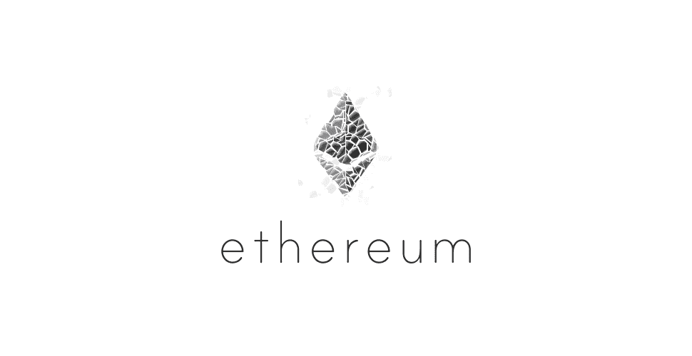
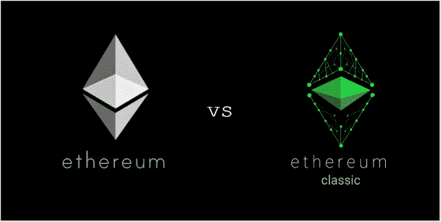

# 以太坊如何损失了 3 亿美元

> 原文：<https://medium.com/hackernoon/how-ethereum-lost-300-million-dollars-bfedf7ba0c19>

## 加密货币 3 分钟攻略

2016 年 5 月，一个名为 DAO 或“去中心化自治组织”的以太坊项目能够筹集到 1.1 亿美元，这不仅是 ICOs 中最大的众筹活动，也是人类历史上最大的众包。

仅在推出两个月后，其软件中的一系列漏洞被发现，黑客能够窃取超过 5000 万美元的以太(以太坊的货币)，导致以太的价格从每枚硬币 20 美元降至 13 美元。

这次黑客攻击意义重大，几乎分裂了以太坊社区。一些人希望黑客保留这些钱，另一些人则不希望。所以决定通过一个叫做硬分叉的事件把以太坊分成两个代币。那些在黑客成为“以太坊经典”或 ETC 之前不想恢复交易的人和那些恢复黑客影响的人是“以太坊”或 ETH 的一部分。

Image from: [https://steemit.com/ethereum/@self-steem/ethereum-eth-vs-ethereum-classic-tc](https://steemit.com/ethereum/@self-steem/ethereum-eth-vs-ethereum-classic-tc)

一年后的 2017 年 7 月，一个名为奇偶校验的以太坊客户端(由[奇偶校验技术](http://parity.io)生产)因一个允许奇偶校验多重签名钱包中的以太被引流到其他账户的错误而损失了大约 3000 万美元。然而，由于这个漏洞是被好心人发现的，钱被退回来了，奇偶校验被鼓励对他们的代码进行安全审计。然而，他们似乎没有这样做，11 月 7 日发现了另一个(非常相似的)漏洞，冻结了平价多签名钱包中价值超过 3 亿美元的 ETH。

# 3 亿美元平价黑客

以太坊的计算能力很昂贵。因此，奇偶校验的创建者决定通过一个称为存根的简化版本的合同来处理钱包交易，该合同将所有合同调用转发给主合同。然而，在实现中有一个错误，它可能会改变主合同的所有权。开发商在合同中也有自毁条款。

一个化名为“devops199”的未知用户发现了这个漏洞，并更改了主合同的所有权，然后触发了自毁。由于他销毁了主合同，所有存根合同代码也被销毁。导致所有资金被锁定。

**需要说明的是，这个漏洞是奇偶校验错误，而不是以太坊协议本身的漏洞。**

## 用专业术语来说:

平价钱包有普通的多签名钱包，每个新用户使用一个新的合同和完整的密码副本。为了降低交易费用，parity 随后将新的钱包部署更改为存根合同，该合同使用 *delegatecall* 函数将任何合同代码调用转发给主合同，而不是拥有完整的代码副本。这让主契约在存根契约的上下文中执行所需的代码。

然而，奇偶校验并没有删除主合同中的*自毁*功能(如果该功能只是为一个不想再使用它的特定用户创建的合同，则该功能有意义，但当该合同代码在所有用户之间共享时，则没有意义)。此外，对等并没有设定主合同的合同所有权。这允许某人将自己设置为所有者，然后调用*自毁*功能。

该操作销毁了自 7 月 20 日以来部署的所有存根契约所使用的代码。因此，这些存根无法访问让他们收回所包含的以太坊的功能，从而无限期地锁定他们。因此，作为奇偶校验之前 multisig hack 的根本原因的主存根设计更改也导致了这个非常昂贵的错误。

# 结论:那么接下来呢？

即使我们再次分叉以太坊，变成某种新形式的新以太坊，也没有保证能收回资金的方法。不幸的是，看起来必须有一种新的叉子，否则钱将永远被锁定。这既是智能合约的好处，也是问题，也是区块链的不灵活。

有趣的是，自从黑客入侵以来，乙醚的价格并没有太大的变化。这可能表明对网络比以往任何时候都更有信心。

想帮忙吗？
在奖金上支持我们！[https://www.bountey.com/bestoficos](https://www.bountey.com/bestoficos)

想在 ICOs 中保持最新？
**访问我们在**[**https://thebestoficos.com**](http://thebestoficos.com/)

有一个有趣的故事？
**写我们在 info@bestoficos.com**