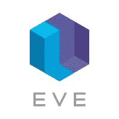
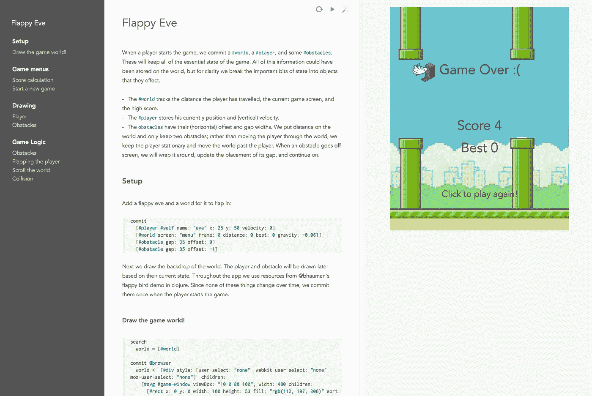
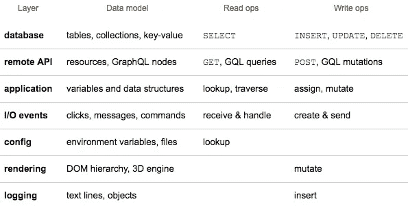
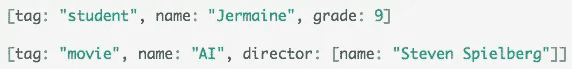
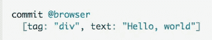
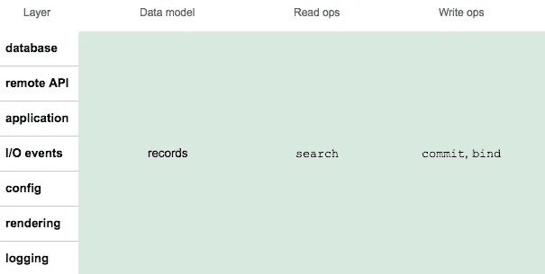
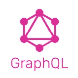
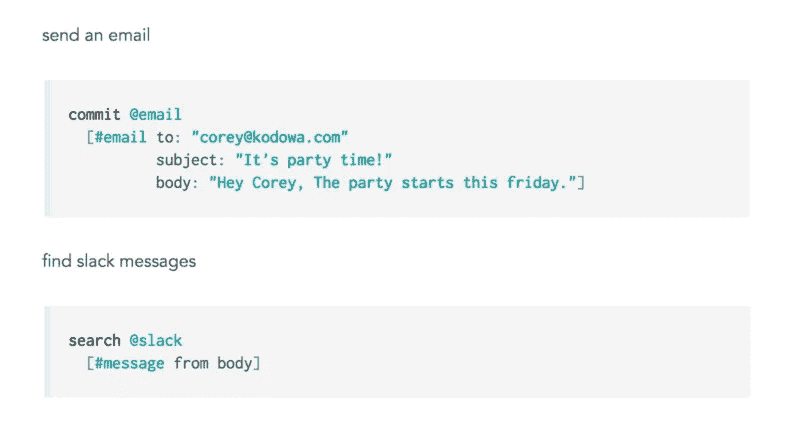

# Eve 如何统一您的整个编程堆栈

> 原文：<https://medium.com/hackernoon/how-eve-unifies-your-entire-programming-stack-900ca80c58a7>

欢迎来到我的关于 Eve 的系列文章的第一部分，这是一种令人兴奋和着迷的新编程语言。

*   ***I .*Eve 如何统一你的整个编程栈**
*   [*二世。*当逻辑编程遇上 CQRS](https://hackernoon.com/when-logic-programming-meets-cqrs-1137ab2a5f86)
*   [*三世。*挣脱我们的镜链](https://hackernoon.com/throwing-off-our-scope-chains-7567beb2d0b6)
*   [*四世。* Smalltalk 和蛋白质编程](https://hackernoon.com/smalltalk-and-protein-programming-4da245ac93e2)
*   [*五、*夏娃远大理想的坚实基础](https://hackernoon.com/the-rock-solid-foundation-for-eves-big-vision-225b80b91e11)
*   [*六。*为什么 Eve 是实时应用的完美选择](https://hackernoon.com/why-eve-will-be-perfect-for-realtime-apps-92b965b80ad)

Eve 是之前创立[光桌](http://lighttable.com)的远见团队多年研发的巅峰之作。Eve 的 0.2 版本在上个月推出，并在[黑客新闻](https://news.ycombinator.com/item?id=12817468)上大放异彩，这也是我第一次听说它的原因。

Eve 的这个最新版本带来了一些非常酷的现场演示，比如“ [Flappy Eve](http://play.witheve.com/#/examples/flappy.eve) ”:

第一次滚动浏览 *flappy.eve* 演示时，一些引人注目的功能跃然而出:

*   IDE 看起来像一个所见即所得的博客编辑器。Eve 代码被设计成嵌入在 Markdown 格式的散文中；这是最大限度的文化编程。
*   语法并不熟悉，但看起来仍然简洁易懂——大部分情况下，它看起来很简单。我不禁会想，“我看到了所有这些带括号的部分，但实际代码在哪里？”
*   代码非常紧凑——大约 100 行。同样，他们的 [todomvc.eve](http://play.witheve.com/#/examples/todomvc.eve) 只有 63 行。相比之下， [React 的 TodoMVC](https://github.com/tastejs/todomvc/tree/gh-pages/examples/react) 有 300 多行 JavaScript。

这是我的第一印象。这是我花了几个小时浏览示例、思考文档和观看技术演讲视频后的印象:哇！

Eve 是一个解决问题的聚宝盆，我甚至没有意识到我们有这些问题。这就像我在一个骑自行车的社会中长大，在第一次看到机动车辆后，我突然明白了基于踏板的建筑的局限性。

在接触过 Eve 之后，我可以追溯性地诊断主流编程栈架构中的各种问题。在这个系列中，我将尝试解释所有这些问题是什么以及 Eve 如何解决它们。

# 问题:层做同样的事情不同

您的软件堆栈有许多层。以下三层通常是承担重任的“核心系统”:

*   数据库层
*   远程 API 层
*   应用层

但是，核心系统还与许多其他层进行对话:

*   渲染层
*   I/O 事件层
*   配置层
*   记录层

在高层次上，这些层都做同样的事情:它们处理数据。它们读取输入值，计算其他值，改变内部状态，输出值传递给其他层。但是，当您放大到每一层时，您会看到无数的差异，这些差异掩盖了一个事实，即它们都是关于数据处理的。

## 不同的数据模型

您有一个或多个在线数据库系统。他们的数据模型看起来像 SQL 表、文档集合、键值映射和/或图形。

您有一个远程 API，它将数据建模为 JSON 或 XML 块，或者可能是 GraphQL 图。

您有一个正在运行的应用程序，它在作用域链中模拟内存中的数据结构和变量。

## 不同的操作

要在数据库层上操作，您可以发送各种 SQL 或 NoSQL 查询。

要在 API 层上操作，可以通过 HTTP GET 查询数据，通过 HTTP POST 和 friends 更新数据。如果是 GraphQL API，你操作的是 GQL 查询和变异。

为了在应用层上操作，可以从作用域链中查找变量，并且可以遍历或改变内存中的数据结构。

对于堆栈的每一层，都有不同的数据模型和操作:

由于每一层都不同，这就产生了摩擦和误差。您必须分别考虑每一个的属性和保证，并为每一个使用单独的编程模式。而且你还要写很多“胶水代码”。

# 解决方案:统一的数据处理语言

Eve 有一个单一的底层数据模型和一组操作，您可以跨堆栈的每一层使用它们。

## 统一数据模型

在 Eve 中，数据(也称为状态)存在于一组**数据库**中。堆栈的不同层可能对应不同的数据库，例如:

*   内存中的应用程序数据保存在`@session`数据库中
*   浏览器的 DOM 树位于`@browser`数据库中
*   用户 I/O 事件存在于`@event`数据库中

每个数据库包含**记录**。记录是一个键值映射，可以存储原始值以及对其他记录的引用。记录具有简单的括号语法:

数据库中没有保存记录的表或集合，只有包含记录的链接结构的数据库。

Eve 的链接记录通用数据模型让人想起“语义网”技术，如 [RDF](https://en.wikipedia.org/wiki/Resource_Description_Framework) 和 [JSON-LD](http://json-ld.org/) 。但是 Eve 不仅仅是一个统一的数据模型…

## 统一操作集

也是一套统一的操作。三个操作`search`、`commit`和`bind`构成了 Eve 的全部功能:

*   `search`查询数据，类似于 SQL 的`SELECT`
*   `commit`改变数据的状态，类似于 SQL 的`INSERT` / `UPDATE` / `DELETE`
*   `bind`写特殊的“推导值”，比如 SQL 的[物化视图](https://en.wikipedia.org/wiki/Materialized_view)或者 MobX 的[计算值](https://mobxjs.github.io/mobx/refguide/computed-decorator.html)。在这个系列的后面，我会说更多关于`bind`的精彩之处。

令人惊讶的是，我们可以通过在 Eve 的统一数据模型上使用这种统一的操作集来控制堆栈的不同层。例如，下面是我们如何将一个`
`渲染到 DOM 中:

因为 DOM 树存在于`@browser`数据库中，所以呈现一个`
`仅仅意味着用`tag: "div"`处理一个记录。

现在，对于堆栈的每一层，只有一个数据模型和一组操作:

因为每一层都是一样的，所以摩擦更少，误差也更小。您可以更容易地对属性和保证进行推理，并对每个属性和保证使用相似的编程模式。你不需要把任何东西“粘”在一起，因为所有东西都已经连接在一起了。

# 更高的抽象

Eve 团队发明了一个统一的数据模型和一组统一的操作，可以跨整个应用程序堆栈运行。为了完成这一壮举，他们必须确定一个更高的抽象，我们其他人都没有意识到这是可能的。

如果你已经努力去理解今年出现的另一个抽象飞跃: [GraphQL](http://graphql.org/) ，这将有助于你理解这一成就。

人们需要一段时间才能理解 GraphQL 不是一个数据库或服务器，而是一种图形查询语言(如果你愿意，也可以称为“GraphQL”)。GraphQL 的目的是将客户对 API 的看法从一个小的严格的 REST 端点集合改变为一个统一的链接数据结构，该结构接受任意的图形查询。

像 GraphQL 一样，Eve 也不是数据库后端或服务器；这是一种比我们习惯的抽象层次更高的语言。考虑 Eve[主页](http://witheve.com/)中题为“一个简单的模型:作为数据的世界”部分的示例代码:

当您运行那个`search @slack`块时，您正在与第三方 Slack 应用程序通信，该应用程序当然有自己的内部数据库。但是你可以*假装*一切都是 Eve 数据宇宙的一部分——就像 GraphQL 让你假装任意的 API 调用是一个大图宇宙的一部分。

因此，如果你喜欢 GraphQL 为 API 层所做的事情，但只是希望有人能一下子为所有其他层做同样的事情…向 Eve 问好。

**下篇:** [*二。*当逻辑编程遇上 CQRS](https://hackernoon.com/when-logic-programming-meets-cqrs-1137ab2a5f86)

> [黑客中午](http://bit.ly/Hackernoon)是黑客如何开始他们的下午。我们是阿妹家庭的一员。我们现在[接受投稿](http://bit.ly/hackernoonsubmission)并乐意[讨论广告&赞助](mailto:partners@amipublications.com)的机会。
> 
> 如果你喜欢这个故事，我们推荐你阅读我们的[最新科技故事](http://bit.ly/hackernoonlatestt)和[趋势科技故事](https://hackernoon.com/trending)。直到下一次，不要把世界的现实想当然！

