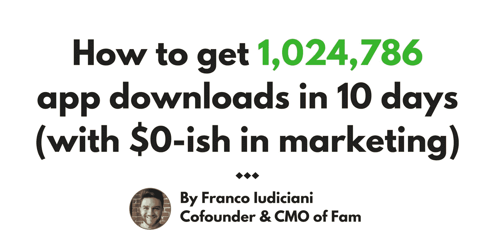
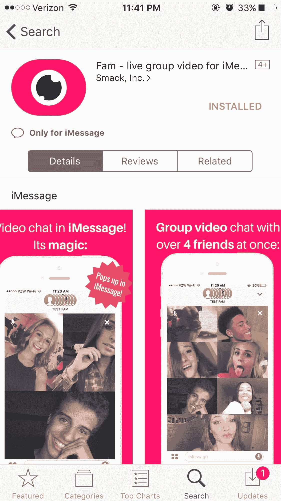
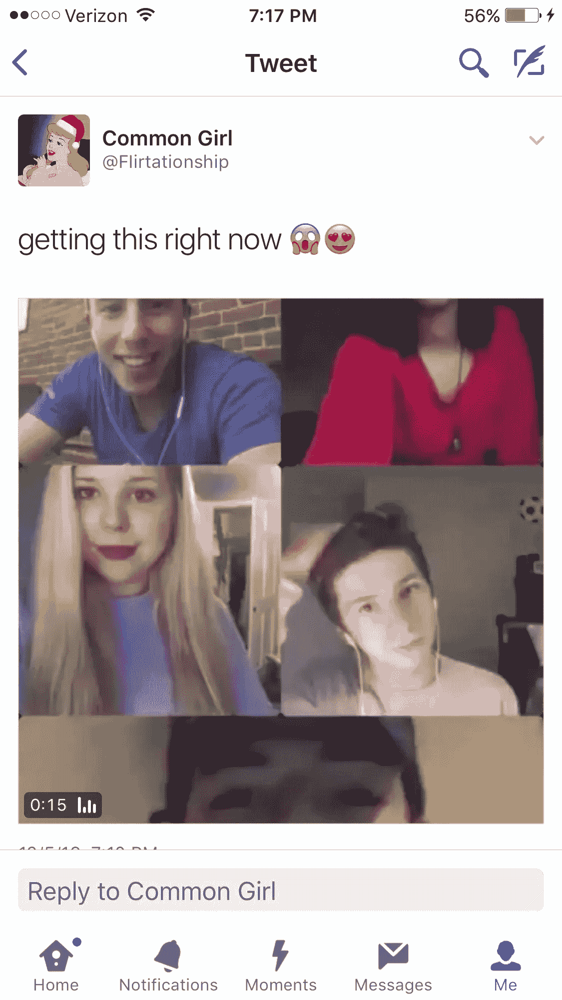
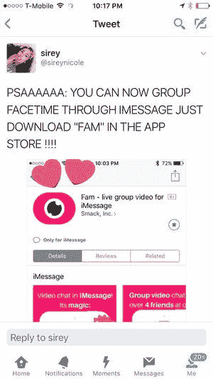
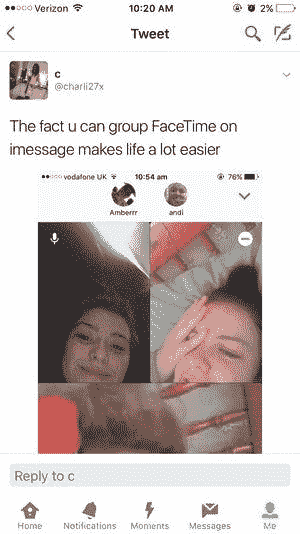
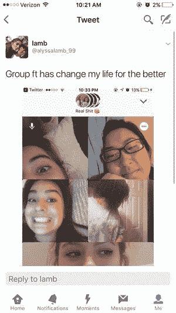
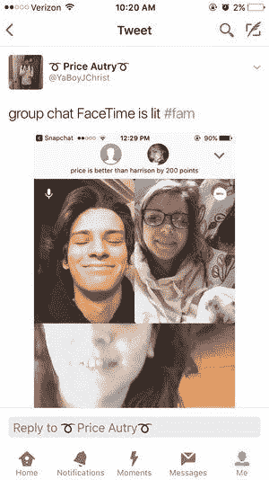
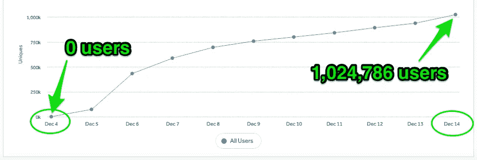

# 这就是 Fam 应用程序如何在 10 天内获得 1，024，786 次下载的(营销费用为 0 美元左右)

> 原文：<https://medium.com/hackernoon/how-fam-got-1-024-786-users-in-10-days-with-0-ish-in-marketing-243aa81c972f>

你可能已经看过标题无数次了。

“‘XYZ’应用程序在发布当天就达到了 25 万次安装”或者“新应用程序在大学校园里疯传，一夜之间就达到了 4 万次安装。”

你可能也看过那些“其他”标题…

你知道，这些书的标题就像你现在正在读的那本:“如何在 3 天内获得 17，556 次应用安装，而不用在营销上花一分钱！”

好吧，大多数应用程序的现实(除非你是我们都非常虔诚地使用的前 4-5 名异常社交应用程序之一)是**你只需要在一开始花费一点点东西**来满足你的产品的增长机制，这完全没问题。

这正是我们推出后 [Fam 应用程序疯狂增长的原因(尽管](http://fortune.com/2016/12/19/group-facetime-fam-app/)[营销](https://hackernoon.com/tagged/marketing)支出微不足道)。在继续之前有一点需要注意:每个。App。成长。不一样。

当我解释我们如何达到第 100 万次安装时，需要注意的是你的产品背后的团队是成功的最可控因素。自 2014 年末以来，由我们的超级明星首席技术官兼联合创始人[凯文·弗林](https://medium.com/u/acf4e50dd2ed?source=post_page-----243aa81c972f--------------------------------)和坚定但善于接受的首席执行官兼联合创始人[朱塞佩·斯图托](https://medium.com/u/8d19674e9e35?source=post_page-----243aa81c972f--------------------------------)、**领导的我们坚持不懈、不切实际的技术团队一直在努力实现这一点。我们的两个炸药工程师，大卫和史蒂文，认为我们完全疯了。**

近 3 年来，我们一直在年复一年地迭代和试验，以达到临界质量和接近产品市场适合度的这一点。(要了解 Fam、 [**产品决策的幕后内幕，你可以点击这里阅读我的联合创始人凯文·弗林关于“啊哈！”以及引导我们走上家庭之路的“哦，嘘”时刻)。**](/@flynniest/why-the-fam-app-the-path-that-lead-us-to-1-million-users-in-10-days-1f4dcebb0e57)

在此期间，我们为我们的目标人群(青少年和大学生)制作了几款不同的产品体验，希望其中一款能在看似不可能取悦的用户群中实现某种程度的产品市场契合。

那段经历就是 [Fam](http://fam.live/) 。

我们打造的所有产品，尽管在体验和功能上无可挑剔，但都没有达到 Fam 的增长水平(尽管在发布时拥有相同的营销和增长资源)。 **Fam 确实是知识积累的结果，这些知识积累成了今天的成功和动力。**

我们的“基于积累的知识和数据的迭代”的办公室节奏到目前为止已经得到了回报。这应该是每个团队的目标，而不仅仅是“大量下载”尽管如此，你的用户越多，你就越能学到东西。

好了，等够了——好东西来了！

以下是从发布之夜到 10 天后第 1，000，000 次安装的准确增长时间表:

**2016 年 12 月 5 日** (MVP 发布夜，宝贝！)
**第一步:准备应用商店页面
美国东部时间下午 6:30** Fam 应用获得苹果批准，可以在 iMessage 应用商店下载(我们推出时只支持 iOS，现在仍然只支持 iOS)。我确保我们的应用商店页面是完美的。页面应该设计成将每一个访问者转化为安装，而不仅仅是那些寻找它或通过邀请链接被导向页面的人。简单而生动的元数据(截图)，简短而直接的描述文本，以及特定的 SEO 标签对于那些从口碑中搜索 Fam 的用户来说是必不可少的。你必须真实、真诚，并在某种程度上诉诸情感。

**第二步:为活动建立预算
美国东部时间
下午 6:45**我有一个非常紧张的营销预算来推广 Fam 的发布:**最初留出不超过 500 美元**来使用。为什么是这个数量？在 Fam 历史的这一点上，我们公司(Smack，Inc.) *在我们的银行账户中只剩下几个月的 runway，字面上是*，所以我们必须保持紧张。

**第三步:评估你的目标人群
晚上 7:00**
我们决定将本次活动的目标人群定为 16-21 岁的年轻人(高中生和大学生)。**背景**:我们非常了解青少年和大学生。在 Fam 之前，我们建立了 [SmackHigh](http://bostinno.streetwise.co/2015/03/26/smackhigh-twitter-accounts-curate-high-school-news-sports-videos/) ，这是一个由高中生管理的 Twitter 平台，学生可以在这里匿名提交学校新闻、观点、体育话题和有趣的故事，这一平台覆盖了美国 33，000 所高中中的 10，000 所高中的 100 多万选择加入订户。在那段时间里，用户调查、原始内容和我们与青少年的坦诚对话让我们有机会了解这个群体的几乎一切，以及他们如何使用社交产品[以及他们实际上在社交产品中寻找什么——关于这些(具体)发现的博客即将推出]。

**第四步:研究社交媒体上受欢迎的影响者
下午 7:15** 找出世卫组织最相关的影响者会推广我们的 MVP 群组视频聊天应用。显然，这些影响者的追随者也必须主要是青少年和/或大学生。为了帮助完成这项看似艰巨的任务，我们找到了一个领先的社交媒体影响者账户“经纪人”，名为 [Flipmass](https://flipmass.com/) ，帮助我们挖掘社交媒体(主要是 Twitter)上符合我们人口统计和 500 美元预算的影响者账户。以下是我们决定发布 Fam 宣传推文的一些 Twitter 账户用户名:

Twitter Influencer account usernames who posted for Fam Promotion

**第五步:最终确定推广的推文内容
晚上 7:30** 这是我们创建的实际推文和内容，它们触发了我前面提到的增长机制。我们在上面列出的所有 Twitter 影响者账户上使用了完全相同的标题+视频组合:

The exact tweet that sparked the 1,000,000 install bonanza

好了，现在暂停一下，再看一遍推文:你注意到了什么？

*   第一， ***的标题就 4 个字*** 。谈到推特，不要在文字上浪费青少年的时间(或任何人的时间)。简短、直接、感性；它总是有效的。
*   二、 ***标题耐人寻味*** 。我的意思是，说真的:谁不想至少按下视频缩略图，给它一个机会？
*   第三， ***视频超短*** (15 秒)。实际上，所有的视频都显示了一群青少年/大学生在 Fam 上的群组视频聊天中玩得开心，只有 3 个两秒钟的图像说“如果你可以在 iMessage 中进行群组视频聊天会怎么样”？、“现在可以了”、“在 app Store 上搜一下 Fam 的 App，以后谢谢我。“就是这样(视频总共只花了 60 分钟的制作时间)。
*   第四， ***该视频有一个自我感觉良好的音乐编号*** 。我们让它一直作为背景音乐播放，因为如果你不热爱音乐，你是谁？

**第六步:分析市场反应**(又名，青少年对 Fam 的看法)
**下午 7:45**
在影响者发布了我们创建的推文后，我立即在 Twitter 上搜索相关关键词，看看人们在说什么(“Fam 应用程序”、“群组视频聊天”、“群组 ft”、“群组 facetime”等)。)这被证明非常有用，因为它 1)给了我对自己的即时反馈，2)告诉了我一般的用户情绪和市场对产品的反应，3)它是公正的；当一个青少年发微博时，几乎总是没有任何过滤；)那天晚上，Twitter 上的青少年和大学生淹没了他们朋友的时间线，成千上万条推文包含这些关键字指的是 Fam 应用程序。

看一看:

**第七步:每分钟安装 624 次
晚上 11 点** 在美国东部时间晚上 11 点，每分钟有 624 个人在安装我们的应用。看似 500 美元的小促销不仅仅是一个巨大的成功，来自促销的新用户邀请他们的朋友在 Fam 上视频聊天。怎么会？他们向他们的 iMessage 群聊发送了一个 Fam(根据我们的观察、调查和我们收集的其他数据，青少年平均在一个群聊中有 6 个朋友)。该活动取得了明显的成功，不仅仅是在转化率或增长方面，而是 ***它给了我们来自市场的反应，我们需要验证我们的假设，并*** [***计划我们路线图中的下一步***](https://venturebeat.com/2017/04/04/fam-may-add-tv-shows-and-games-to-its-iphone-group-video-app/) 。

**第八步:点击 10 万次安装
12:00am** 那天晚上我们最终只是没有真正睡觉；在我的一生中，我从来没有像这样感到肾上腺素激增。事实上，接下来的几周我都没有睡好。真正的工作才刚刚开始。

**2016 年 12 月 14 日**(十天后)*
**第九步:点击 100 万安装
上午 10:00** 我们狂欢了大概 5 分钟。完成了。好了，现在回去工作！

* *注意:在最初的 4 小时活动后，我们在接下来的一周继续对影响者帐户进行更多类似的内容实验。*

今天，Fam 在几乎零营销的情况下实现了 100%的有机增长。我们的大部分新用户来自哪里？口碑和 iMessage 群聊。我们一直在 App Store 的社交网络类别中排名前 20-30 位，是一些长期的品牌社交先锋和慷慨支持的竞争对手。

回顾发布会和[我们今天取得的所有进展](https://itunes.apple.com/us/app/fam-group-video-calling-for-imessage/id1185328193?mt=8)，这是迄今为止最清晰、最坚定的主题:

*适应、调整并接受市场的需求*。

我们花了将近 3 年时间才最终到达这里。我们不仅对青少年和大学人口了如指掌，而且我们 5 个人一起成长为一个更好的企业家团队；当结果既未知又可怕时，我们会冒险去适应。

爱迪生说得好:“*我没有失败。我刚刚发现了一万种行不通的方法。*“我们读到和听到很多关于科技创业[失败](https://hackernoon.com/tagged/startup)的报道，说实话，大多数时候，这是断章取义。我们真的找到了 9999 种在 Fam 之前行不通的方法。Fam 是第一万个。

不要成为止步于 9999 的团队。

> [黑客中午](http://bit.ly/Hackernoon)是黑客如何开始他们的下午。我们是 [@AMI](http://bit.ly/atAMIatAMI) 家庭的一员。我们现在[接受投稿](http://bit.ly/hackernoonsubmission)并乐意[讨论广告&赞助](mailto:partners@amipublications.com)机会。
> 
> 如果你喜欢这个故事，我们推荐你阅读我们的[最新科技故事](http://bit.ly/hackernoonlatestt)和[趋势科技故事](https://hackernoon.com/trending)。直到下一次，不要把世界的现实想当然！

