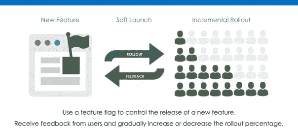
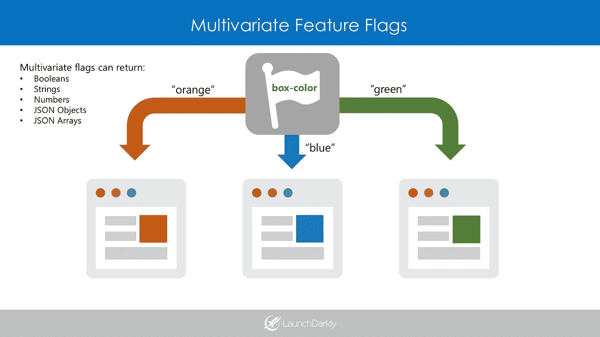

# 特征标志如何驯服复杂性的四个方面

> 原文：<https://medium.com/hackernoon/how-feature-flags-tame-the-four-heads-of-complexity-e33f286cb110>

## 软件测试中的复杂性让人感觉像一头四头怪兽，特性标志可以驯服这头怪兽。

用经济学术语解释特征标志可能很困难。不过最近，我被 Kent Beck 写的一篇文章打动了，他用通俗易懂的语言解释了脸书的极限编程文化。读完之后，我意识到同样的术语也可以用来描述特性标志，看看脸书的部署结构和特性标志是如何相同的。

# 一种新型的测试

如果你不知道，特性标志使测试软件更容易。这是一种暗启动的形式，开发者在不破坏产品或应用程序平衡的情况下悄悄部署新功能。如果你想在一个受控的环境中测试一个新特性，你甚至可以向某一组用户推出这个新特性，而排除其他用户。如果所说的功能打破了平衡，那么你可以很容易地收回一个按钮的功能。没有伤害，就没有犯规。

# 复杂性的四个方面

现在，在贝克的例子中，他将[复杂性](https://hackernoon.com/tagged/complexity)描述为有四个头。在任何系统中，复杂性都是敌人，尤其是在技术环境中，一次部署就可能导致一切崩溃。如果你不学会控制这种复杂性，系统将继续失败。为了控制复杂性，你需要知道如何对抗每个头(这是我对 Beck 例子的解释):

**状态** —一个状态有多个元素，一个系统有多个状态。很难维护每个状态中的每个元素，并记住每个元素在状态中做什么。

**相互依赖**——在一个状态中，元素可以直接或间接地相互影响。如果一个新的状态被引入到一个系统中，它会产生大量的相互依赖。

**不确定性**——这是永远不知道国家什么时候会崩溃。应用程序在早上还会高效运行吗？

**不可逆性** *—* 状态改变后，不可能或难以逆转。如果你害怕改变某件事，因为它可能会打破，那么第四头野兽正在控制你。

# 用特征标志对抗不可逆性

特征标志驯服了复杂性的*不可逆性*。它们使得决策是可逆的，这消除了在一个国家系统中打乱相互依赖关系的不确定性。开发人员可以部署一个特性，看看会发生什么，如果它不能很好地工作，就把它改回来。特征标志的不确定性更小。如果一家公司想测试用户对新功能的敏感度，他们可以向一小群用户试运行，以扩大兴趣。它还可以在更大规模的发布之前通知开发人员系统中可能的相互依赖性。

最好的部分是:开发人员很早就得到验证。他们不必等待八个星期来测试一个特性，直到它失败。他们可以尽早测试，并完全忘记复杂性。

# 驯服四个头:多元特征标志

特性标志通常以两种形式出现:布尔型和多元型(一种除了布尔型变体之外还可以提供字符串、数字和 JSON 变体的特性标志)。这允许用户在将一个功能扩展到系统之前，定制该功能的两个或更多变体。他们也可以决定百分比。例如，他们可以决定 10%的人会得到一个版本的特性，20%的人会得到第二个版本，70%的人会得到第三个版本。通过这些方法，开发人员可以更好地控制他们的产品，更少地担心过程中可能出现的问题。

将四种复杂性应用到[软件开发](https://hackernoon.com/tagged/software-development)的其他领域也很有趣。它甚至可以应用到我们的日常生活中。当然，你永远无法真正控制系统的复杂性，但是你可以驯服它。整个想法可以引出有趣的问题。这让你扪心自问，我是如何在自己的系统中对抗复杂性野兽的？