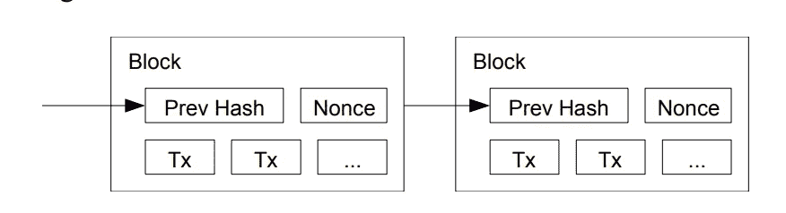
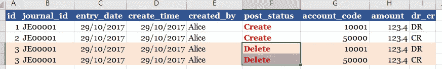
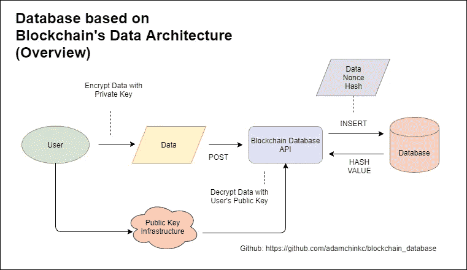

# 用 Python 写的简单安全的区块链数据库 API

> 原文：<https://medium.com/hackernoon/how-finance-data-can-be-secured-by-blockchain-technology-a-fast-and-simple-adoption-with-200-5e762299b67>

GitHub 项目链接:[此处](https://github.com/adamchinkc/blockchain_database)

当我们谈论[区块链](https://hackernoon.com/tagged/blockchain)时，我们总是把它与对等网络联系起来，认为数据必须跨网络分布。这将引起人们的担忧，认为区块链会破坏数据的保密性。

实际上，**区块链本身的数据架构已经提供了一个很好的解决方案来保护数据免受未经授权的操纵**，*只要服务器受到足够的控制保护，如访问控制，网络和系统安全控制，最好是在内部网络中。*

所以我尝试用 Python，Sqlite，RESTful [API](https://hackernoon.com/tagged/api) 框架来搭建一个基于区块链数据架构的数据库。

# **区块链的数据架构及其完整性**



Abstracted from Bitcoin: A Peer-to-Peer Electronic Cash System by Satoshi Nakamoto [https://bitcoin.org/bitcoin.pdf](https://bitcoin.org/bitcoin.pdf)

从上图中可以看出，每个数据块都由以前的哈希、随机数和事务组成。如果不确定什么是 hash，可以先看这篇[文章](/@ConsenSys/blockchain-underpinnings-hashing-7f4746cbd66b)。为了简化，哈希值是前一个块的唯一 ID。如果我们使用这个“唯一 ID”来验证前一个块，我们将知道前一个块是否被修改过。

言外之意是什么？这种机制使我们能够确保任何人都不允许更改以前创建的数据。如果你需要修改数据，你必须创建另一个记录来“修改”或“删除”它。



在上例中，Alice 错误地输入了日志条目 123.4，但它应该是 432.1。Alice 必须创建另一个记录“删除”来撤销先前的条目。

这似乎是大多数会计系统的基本功能，但我们无法知道它是否只是在应用程序级别受到控制，从而产生了在数据库级别更改数据的可能性。

为了确保没有人可以更改从起点到终点的数据，我引入了一个简单安全的区块链数据库 API。

# 基于区块链数据架构的数据库



**问责制、保密性和完整性**

当用户创建交易记录时，他用私钥加密数据，并将数据发布到区块链数据库 API。区块链数据库 API 会用用户的公钥解密数据。在这个过程中，用户的身份得到了确认。实现了**问责**和**保密的目的。**

下一步，区块链数据库 API 将使用 nonce(即随机字符串)和之前的哈希计算交易的哈希值。区块链数据库 API 会将交易、nonce 和 hash 插入数据库。

为了检测任何未经授权的更改，区块链数据库 API 将根据之前的哈希、交易和 nonce 的信息重新计算哈希值。如果进行了任何更改，哈希值将会更改，并且可以通知 API。因此，数据的**完整性**将得到保证。

**限制**

由于是在集中式体系结构中，获得管理权限的攻击者有可能通过重新计算哈希值来更改整个数据库。

这可以通过以下解决方案来保护:

*   将事务克隆到安全的日志服务器
*   增量备份数据(逐行事务)而不是完整备份

# 如何使用 API？

1.启动哈希 API

```
python hash.py
```

2.启动 Nonce API

```
python nonce.py
```

3.启动主 API

```
python main.py
```

4.将日志数据发布到主 API[http://127 . 0 . 0 . 1:8000/construct](http://127.0.0.1:8000/construct)并返回带有 nonce 和 hash 的响应

```
data1 = { 	"journal_id": "JE000001", 
	"entry_date" : "2016-11-06", 
	"create_time" : "2016-11-06 18:00:00", 
	"created_by": "Adam",
	"post_status": "P",
	"account_code" : "100000",
	"amount" : 16453.24,
	"dr_cr" : "C"}
```

5.将响应发布到主 API[http://127 . 0 . 0 . 1:8000/insert](http://127.0.0.1:8000/insert)

```
data1 = { 	"journal_id": "JE000001", 
	"entry_date" : "2016-11-06", 
	"create_time" : "2016-11-06 18:00:00", 
	"created_by": "Adam",
	"post_status": "P",
	"account_code" : "100000",
	"amount" : 16453.24,
	"dr_cr" : "C",
  "nonue" : ".....",
  "hash" : "....."
}
```

6.通过 Get[http://127 . 0 . 0 . 1:8000/verify 验证您的交易？id=1](http://127.0.0.1:8000/verify?id=1)

特别感谢我的同事们富有成效的讨论和西蒙的鼓励。如有任何意见，请随时留在这里或给我发电子邮件至[adam.kc.chin@gmail.com](mailto:adam.kc.chin@gmail.com)。