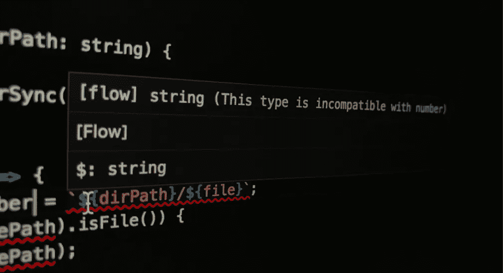
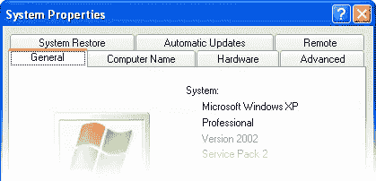
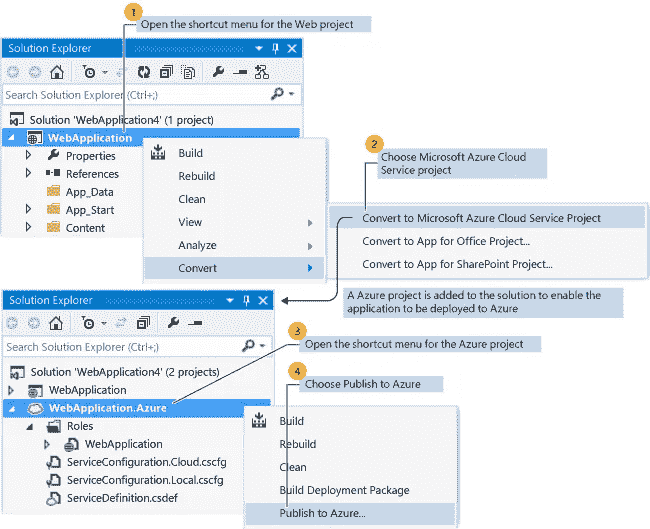
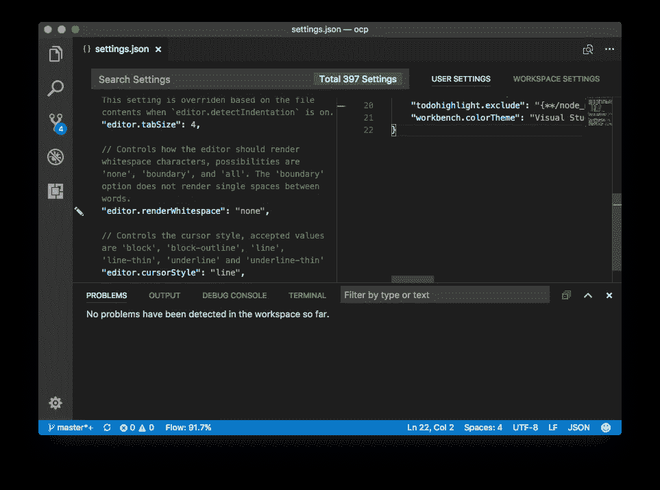
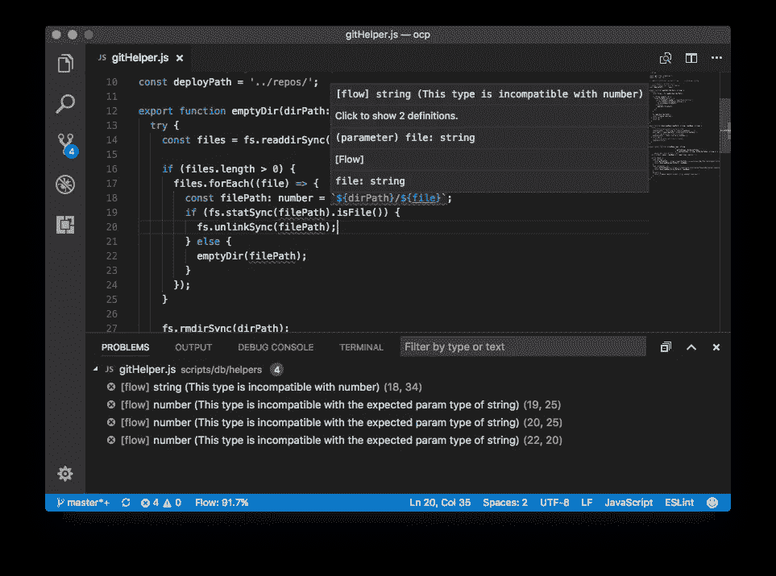

# Flowtype 如何将我从 Webstorm 转移到 VS 代码

> 原文：<https://medium.com/hackernoon/how-flowtype-moved-me-from-webstorm-to-vs-code-369dfea8fa7d>



老实说，编写测试不是我最喜欢做的事情(但这并不意味着我不做)。我记得在某个时候，例如，我必须检查一个函数是否拒绝一个特定的值，我发现自己写了这样的东西:

```
expect(typeof(var)).toEqual('number')
```

就这样。感觉就像我正在编写我自己的小型的、未进化的类型检查器——就像重新发明轮子一样，同时讨厌轮子。很快我意识到，我应该缩短这个过程，并开始使用静态类型检查器，而不是自己动手。我选择了 Flow，因为它正好适合我当前的设置。

我希望的主要优势之一是通过检查更改和分析其正确性来获得对代码的即时反馈——我想要的东西不仅能发现错误，还能提供某种程度的智能感知。Flow 通过与您的代码编辑器集成来实现这一点。这是编辑的角色开始变得重要的时候，Webstorm 开始变得糟糕。

# 挫败感

流槽包:*已安装*。

配置项目和 Webstorm: *完成*。

类型标注:*追加*。

结果:*简直呆滞！*

除了 Eslint check 之外，在添加了 Flowtype 之后，Webstorm 代码分析变得相当慢。有时候，在我的四核 i7 (16GB 内存，SSD) MBP 上，显示所有错误和警告需要长达 6 秒的时间。我一直是 JetBrains 的忠实粉丝，从来没有对他们的产品不满意，但这是一个交易破坏者。在 Webstorm 上使用 Flowtype 是如此难以忍受，以至于我别无选择，只能四处寻找替代方案。

在这一点上，在我们的办公室里围绕 VS 代码已经有了持续的噪音。在过去的两年中，社区也一直在称赞它的快速性，所以我知道当它涉及到性能时，我需要考虑它。让我的同事们非常惊讶的是，我对 VS 代码视而不见，继续和 Webstorm 一起过着我悲惨的生活。

# 犹豫不决

而 VS 代码是免费和开源的，这是非常理想的；对我来说，是回到微软的想法阻止了我立即行动。老实说，与微软合作让我想起了一些黑暗的回忆。编程经验和事物的外观对我来说非常重要，当谈到微软时，我们谈论的是一家公司，它认为在一个面板上有多行标签并让数十亿人看到是可以的。



The horror of tabs

经典的 Visual Studio 将这种混乱带到了另一个层次。我发现自己像一个 MS Office 用户而不是开发人员一样浏览向导，勾选复选框，选择一排排标签(他们的最爱)。



This *is* a real screenshot from one of visualstudio documentations

我记得曾经有一个类似于“将这个 web 解决方案转换成 mvc 解决方案”的菜单。只需点击它——无需键入任何代码或进行任何控制——它就会执行某种魔法，天知道它会在幕后对我的[代码库](https://hackernoon.com/tagged/codebase)做什么。

# 跳跃

所以两个月前，我硬着头皮决定下载 VS 代码。我刚刚非常仔细地访问了[https://*code*. visual studio . com/](https://code.visualstudio.com/)并下载了编辑器(如果你错过了“code”这个词，你将会在[https://www.visualstudio.com/](https://www.visualstudio.com/)找到，在那里你很可能会看到穿着西装的人微笑着向你竖起大拇指)。我不得不说 VS Code 和我在经典 Visual Studio 中的体验完全不同。它是如此简约，以一种令人愉快的方式让你专注于代码而不是别的。例如，看看这些设置，很好地呈现为 JSON:



VS Code settings.json

这一点也不像我以前在视觉工作室遭受的创伤。设置 Flowtype 很简单，即时验证也很快。你的打字错误反映在你的“问题”列表中(⌘数字小键盘 0)，这使得它们非常容易被发现并立即解决。



Spotted type error

# 结果呢

总的来说，一个月后，我对自己的举动感觉很积极(也更富有了 70%)。除了一些偶尔的烦恼(比如[不支持多终端标签，而是提供一个便宜的下拉菜单](https://github.com/Microsoft/vscode/issues/10546) ) VS Code 已经是一个更快更令人愉快的编码伴侣。你可能更喜欢继续使用 Webstorm，如果是这样，请在下面留下评论，让我知道为什么它对你很有效。对我来说，恐怕已经太晚了。有了 VS 代码，我觉得这是一段美好友谊的开始。

# 推荐

*   如果你和我一样，来自 Webstorm，我建议你安装[‘IntelliJ IDEA VS Code 的按键绑定’](https://marketplace.visualstudio.com/items?itemName=k--kato.intellij-idea-keybindings)，你会立刻有宾至如归的感觉。然而，这可能并没有涵盖所有的快捷方式(例如，我过去常常按双 shift 来查找文件，现在在 VS 代码中，我用 cmd+shift+a 或简单的 F1 来做同样的事情)。
*   你可能会意识到，在 VS 代码的“问题”列表中，你的 Eslint 错误(⌘数字小键盘 0)从一个很小的数字开始，然后随着你打开更多的文件，更多的错误堆积在列表上；这基本上是它的 VS 代码增量方式。换句话说，除非你打开所有的文件，否则你永远不会有一个完整的 Eslint 错误的全局列表。您可以通过创建一个任务来检查您的所有文件并更新您的“问题”列表，从而非常容易地解决这个问题。然后你偶尔运行这个任务，更新列表，继续你的生活(编码)。本条的[第**节四**中解释了该过程。](http://shripalsoni.com/blog/configure-eslint-in-visual-studio-code/)
*   在 VS 代码上配置 Flowtype 和 Eslint 可能有点棘手。尽管 Flowtype 检查很流畅，但根据我的经验，Eslint 检查似乎一点反应都没有，我花了一段时间才把它纠正过来。关于设置/配置的详细信息，请查看[这篇文章](https://hackernoon.com/configure-eslint-prettier-and-flow-in-vs-code-for-react-development-c9d95db07213)，作者[肖恩·格罗夫](/@sgroff04)。

*-*[*前端工程师 Vahid Panjganj*](http://www.wearehive.co.uk/)

*感谢阅读。如果您有任何反馈、提示或技巧，请留下评论。如果你觉得这篇文章能对你的朋友有帮助，请分享。*

*可以关注我，* [*这里*](https://twitter.com/vpanjganj) *。你也可以关注*[*@ weave heve*](http://twitter.com/wearehive)*，在这里我们可以发布关于技术、产品和设计相关的东西。*