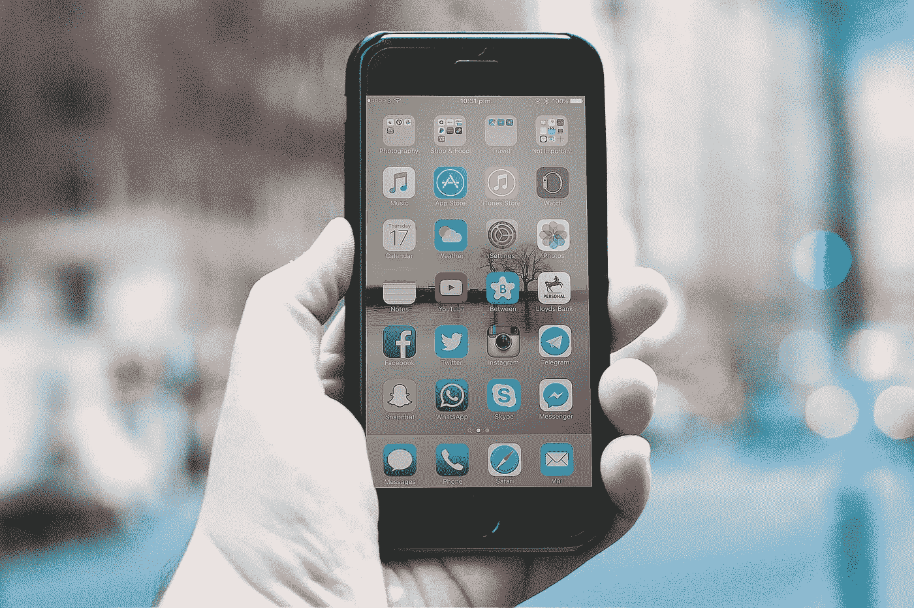
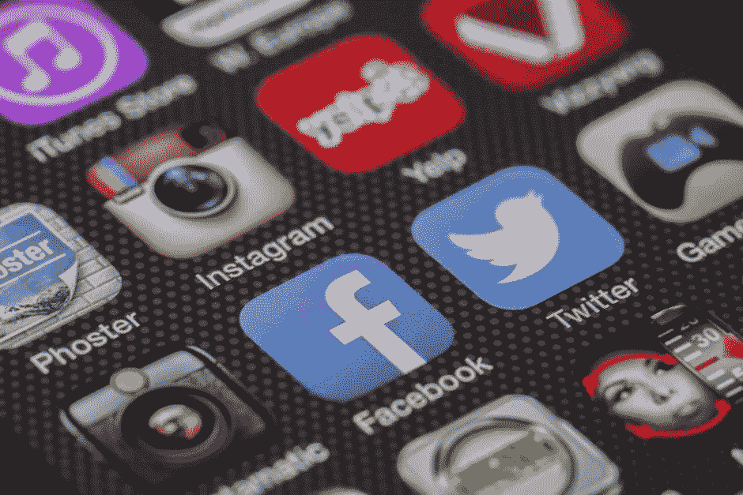
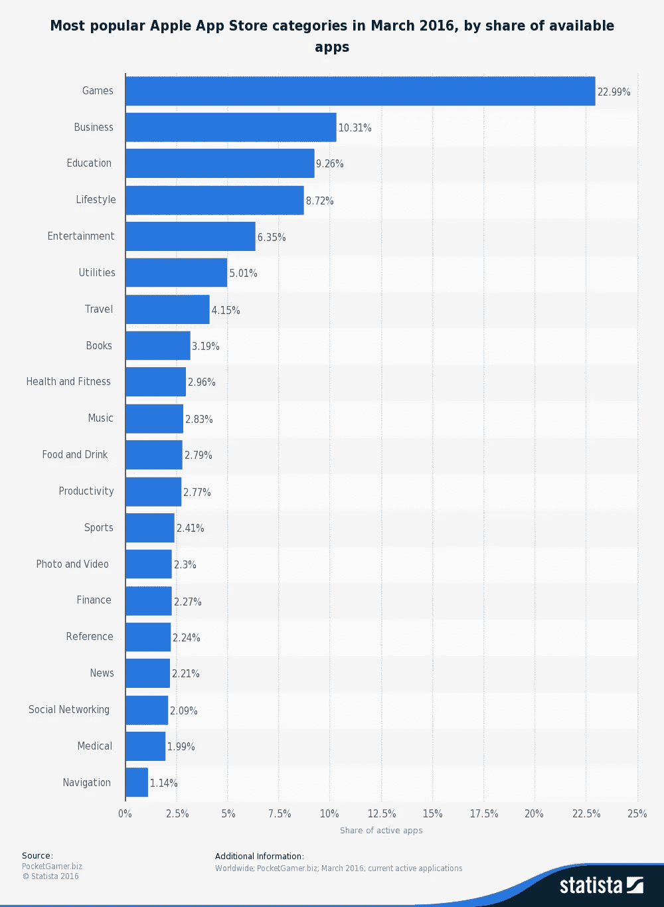
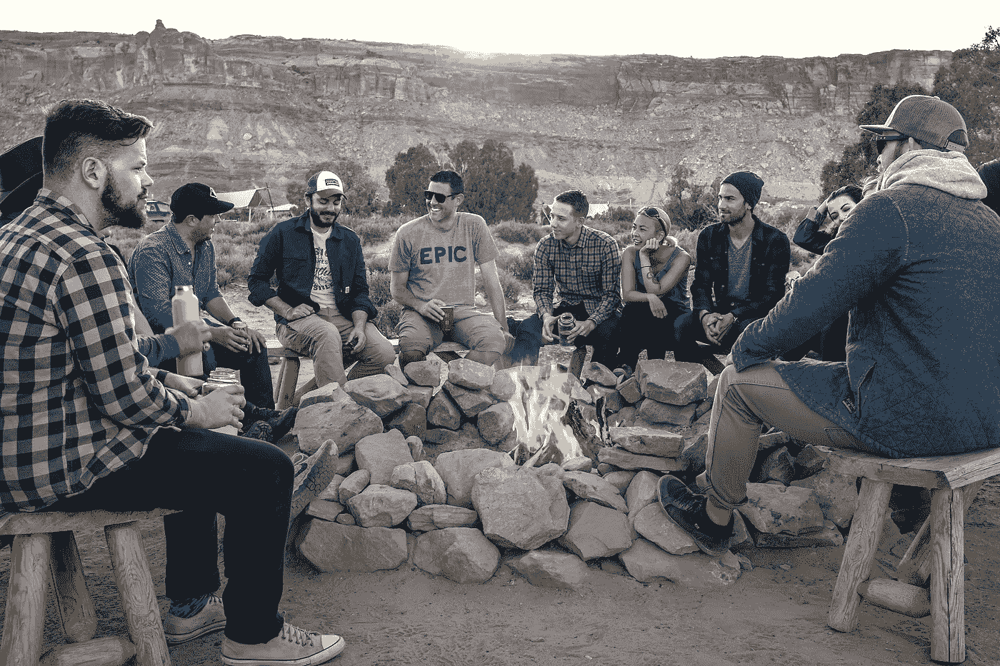
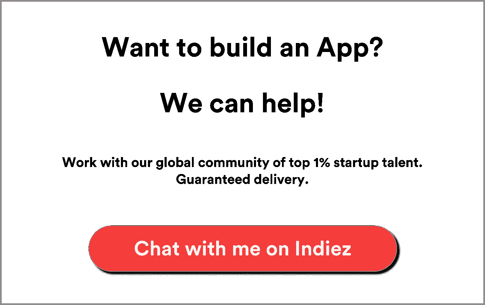

# 如何获得一个 App 创意？

> 原文：<https://medium.com/hackernoon/how-get-an-app-idea-38841a756c1b>

## 应用正在改变世界。参加聚会。

应用改变了我们的生活。很难想象一个没有脸书、推特、WhatsApp 或任何其他应用的世界。

我一醒来就查一个 app。我并不孤单。大约 44%的世界人口使用智能手机，并有类似的行为。那就是 37 亿！

为什么？因为应用程序很棒。应用程序改变了商业，给了我们新的就业机会，帮助我们变得移动，帮助我们感觉更好，等等。

应用触及我们生活中最重要、最核心的领域。

在 [Indiez](http://indiez.io/?utm_source=Blog&utm_medium=Medium_Top_Link&utm_campaign=how_to_get_app_idea) ，我们与来自 30 多个国家的 600 多位创始人进行了交流。我总是问他们一件事-

> 你怎么会有这个想法？

我听到了一些关于这个问题的有趣答案，如果你正在寻找一个应用程序的想法，这些知识会非常有帮助。

# **他们面临一个问题，觉得“我希望有一个应用程序来解决这个问题”**

这是最常见的答案之一。老实说，我们一直都面临着问题。

分享歌曲的简单方法？分享文件不痛苦吗？洗衣服不痛苦吗？有人按门铃开门不痛苦吗？我打赌对我们大多数人来说都是。

一旦你回顾你的一天，你会意识到有许多问题有待解决。看你觉得哪个最痛苦。那是你的应用创意。

# **他们没有考虑业务**

你也不应该。一个成功的应用不一定是一个伟大的企业，至少在最初几天是这样。建一个 app 来笼络人心。如果你的应用程序的用户喜欢你的应用程序提供的体验，你以后总能找到赚钱的途径。

你知道 WhatsApp(可能是这个星球上用的最多的 App)很长一段时间都没赚钱吗？

# **他们改编了现有的应用程序**

你一定讨厌某个特定应用的体验，想知道它是如何变得如此成功的。那是你的应用创意。你能改善现有应用程序的体验吗？

但这难道不是错的吗？不，不是的。你总能做得更好。

Instagram 公然抄袭 Snapchat stories 功能。因此你根本不用担心复制。

有 1000 多个客户服务应用程序，但 Bicycle.ai 的创始人告诉我——“我讨厌客户服务的体验，认为我可以做得更好”，并成功启动了一家初创公司。**他们考上了 Y combinator。**

你每天都在使用哪些应用程序，你是否有一些想法来改善该应用程序提供的体验？😃

# **他们运用他们的创造性思维，玩弄各种想法**

许多有趣的应用程序是两个完全不相关的行业的结合。杂货优步是 Instacart。出行是汽车的 Airbnb。你会有很多想法，这很好。坚持做这项运动，就像去健身房一样，你会每天都有进步。

这件事的美妙之处在于，你可以随时随地这样做……排队、上下班甚至坐在马桶上。

# **探索 App Store 和 Play Store**

如果一个特定的空间很拥挤，这是好的。保罗·格拉厄姆说——“你只能通过回避好的想法来回避竞争。”

这是一个令人难以置信的洞察力，将帮助你减少对拥挤空间的恐惧。你可以查看特定领域的应用，浏览应用评论。如果应用评价不好，你有机会改善体验。举个例子——有很多旅游预订应用，但只有少数能提供良好的体验。

瞄准一个利基市场，你可以给人很好的体验。比如——一个五星级酒店预订的 app。或者一款只针对商旅的 app。

我们的一位客户提到，他是从“[小众赢](https://500hats.com/niche-to-win-baby-934eba97f28c)”中学到这一点的。下面的图表可以让你了解什么有效，什么无效。

# **和朋友头脑风暴**

这是解决问题的一个有趣的方法。下次你不必在你的晚宴上玩[爆炸小猫](https://explodingkittens.com/)了，你可以头脑风暴一些应用程序的想法。我采访过的许多创始人都是在聚会或晚餐聊天中产生创业想法的。我相信你的一些朋友会有不同的想法，他们的想法会给你一个全新的视角。他们可能有自己每天面临的问题，可以通过应用程序解决。这个练习最精彩的部分是什么？你会有一些非常早期的用户！

# **寻找灵感**

我们的一个客户从 Y combinator 对创业公司的要求中得到了灵感。我谷歌了一下，发现有很多这样的地方可以找到灵感。我喜欢 Reddit 和 Ideas Watch，

你会发现有趣的想法，比如“看着我，看着你”，“猫发现者”等等。

你可以仔细考虑一下这些想法，看看是否能找到一些有趣东西。

# **接下来呢？**

当你有很多应用程序想法时，一个令人生畏的挑战可能是选择哪一个？这有助于:

## **哪个最容易造？**

有时，最好的想法非常容易。您总是可以在以后添加大量的额外元素。但是试着让第一个版本保持简单！这将帮助您快速测试这个想法，并且在您的口袋里也很容易。

## 哪一个需要最少的时间来构建？

产品上市时间对产品来说至关重要。你必须把产品拿出来，得到反馈，然后重复。同样的产品可能需要几个月到一年的时间来制造。发布前不要花太多时间。拿出来。

## 对于哪种应用，您最容易获得早期用户？

你是餐馆老板吗？那么食品科技公司[的初创公司](https://hackernoon.com/tagged/startup)将是您的一个很好的选择，因为您最有可能在 50 年前超快上市。大多数初创公司因为无法获得用户而死亡。如果您快速获得首批 50-100 名用户，您将消除许多风险。

如果您有应用创意，我们可以帮助您将其推向市场。

现在出去。大胆尝试，坚定信念。

如果你想解决一个问题，没有理由不能找到解决办法。

你建立自己想法的热情和信念是你所做一切的核心。从数据中学习并继续前进。

**让我们建造令人敬畏的建筑。🙌**

在 [Indiez](http://www.indiez.io?utm_source=Blog&utm_medium=medium_bottom_inline_link&utm_campaign=8%20steps%20to%20become%20a%20successful%20non-tech%C2%A0founder.&utm_content=non_tech) 我们努力策划和管理来自谷歌、[脸书](https://hackernoon.com/tagged/facebook)、优步、Spotify、Booking.com 等公司的 1%顶尖科技人才。

加入 100 多位出色的创始人行列，他们凭借 [Indiez](http://www.indiez.io?utm_source=Blog&utm_medium=medium_bottom_inline_link&utm_campaign=8%20steps%20to%20become%20a%20successful%20non-tech%C2%A0founder.&utm_content=non_tech) 打造了成功的产品。

## [在这里了解更多关于我们的信息——indiez . io](http://www.indiez.io?utm_source=Blog&utm_medium=medium_bottom_inline_link&utm_campaign=8%20steps%20to%20become%20a%20successful%20non-tech%C2%A0founder.&utm_content=non_tech)

